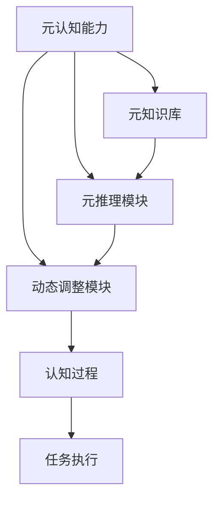
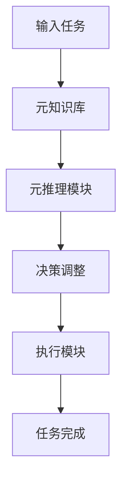
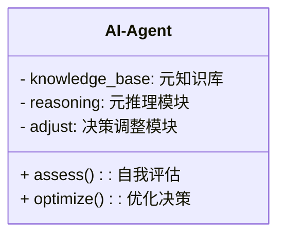
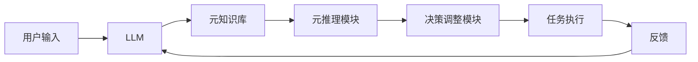

                 


# AI Agent的元认知能力：增强LLM的自我评估与调整

> 关键词：AI Agent，元认知能力，LLM，自我评估，智能优化

> 摘要：  
本文深入探讨了AI Agent的元认知能力在增强大语言模型（LLM）自我评估与调整中的作用。通过分析元认知能力的核心概念、算法原理、系统架构及实际应用，文章详细阐述了如何通过元认知能力提升LLM的智能优化能力。文章结合理论与实践，为读者提供了从基础概念到实际应用的全面指导。

---

## 第一部分: 元认知能力的基本概念

### 第1章: 元认知的定义与特点

#### 1.1 元认知的基本概念
元认知（Metacognition）是指个体对自身认知过程的认知和调控能力。它包括对思维过程的监控、评估和调整，能够帮助个体更高效地解决问题和优化决策。元认知的核心在于“认知之上的认知”，即通过反思和调整来提升认知能力。

#### 1.2 LLM的基本原理
大语言模型（LLM）是一种基于深度学习的自然语言处理模型，能够理解和生成人类语言。其核心原理包括：
- **数据驱动**：通过大量语料库训练，模型能够学习语言的语义和语法结构。
- **神经网络架构**：常用的架构包括Transformer，具有自注意力机制，能够捕捉长距离依赖关系。
- **生成能力**：通过解码器生成连贯的文本输出。

#### 1.3 元认知能力对LLM的重要性
元认知能力能够帮助LLM进行自我评估和调整，从而提升其生成结果的质量和适用性。具体表现在：
- **自我监控**：模型能够监控自身的输出，识别潜在错误。
- **决策优化**：通过元认知能力，模型可以动态调整生成策略，以适应不同场景的需求。
- **持续学习**：元认知能力支持模型在实际应用中不断优化自身的性能。

### 第2章: AI Agent的元认知能力

#### 2.1 AI Agent的基本概念
AI Agent（人工智能代理）是一种能够感知环境、执行任务并做出决策的智能实体。它可以分为：
- **简单反射型**：基于规则直接响应输入。
- **基于模型的反射型**：通过内部模型理解和预测环境。
- **目标驱动型**：根据目标选择最优行动。

#### 2.2 元认知能力在AI Agent中的作用
元认知能力赋予AI Agent以下能力：
- **自我评估**：评估自身的知识储备和能力边界。
- **决策优化**：根据环境反馈调整行动策略。
- **持续学习**：通过元认知能力，AI Agent能够主动寻找知识缺口，提升自身能力。

#### 2.3 元认知能力的实现框架
元认知能力的实现框架包括：
- **感知模块**：感知环境信息和任务需求。
- **评估模块**：评估自身能力与任务匹配度。
- **调整模块**：根据评估结果调整行动策略。
- **反馈模块**：根据执行结果优化元认知能力。

---

## 第二部分: 元认知能力的核心概念与联系

### 第3章: 元认知能力的原理与机制

#### 3.1 元认知能力的原理
元认知能力的实现依赖于以下原理：
- **元知识库**：存储关于自身知识和能力的元数据。
- **元推理**：通过元数据进行推理，判断自身能力的适用性。
- **动态调整**：根据推理结果动态调整行动策略。

#### 3.2 元认知能力的属性特征对比

| 属性         | 元认知能力     | 常规认知能力     |
|--------------|----------------|------------------|
| 目标         | 监控和优化认知过程 | 处理具体任务     |
| 范围         | 包括思维过程    | 限于具体任务     |
| 输入         | 认知过程的元数据 | 任务相关数据     |
| 输出         | 调整认知策略    | 任务执行结果     |

#### 3.3 元认知能力的系统架构



---

## 第三部分: 元认知能力的算法原理

### 第4章: 元认知能力的算法实现

#### 4.1 元认知能力的算法流程



#### 4.2 元认知能力的代码实现

```python
def metacognition(task, knowledge_base):
    # 元知识库查询
    meta_info = knowledge_base.query(task)
    # 元推理
    reasoning = ReasoningModule.infer(meta_info)
    # 决策调整
    adjustment = reasoning.optimize(task)
    return adjustment

# 示例用法
knowledge_base = MetaknowledgeBase()
task = "自然语言理解"
adjustment = metacognition(task, knowledge_base)
print(adjustment)  # 输出调整后的决策策略
```

#### 4.3 元认知能力的数学模型

元认知能力的评估可以表示为：
$$
\text{元认知能力} = \frac{\text{正确推理次数}}{\text{总推理次数}} \times 100\%
$$

其中，正确推理次数是指元推理模块正确判断自身能力的次数，总推理次数是元推理模块的总推理次数。

---

## 第四部分: 元认知能力的系统分析与架构设计

### 第5章: 系统分析与架构设计方案

#### 5.1 问题场景介绍
在实际应用中，LLM可能会遇到知识盲区或生成错误的情况。元认知能力能够帮助模型识别这些问题，并动态调整生成策略。

#### 5.2 系统功能设计



#### 5.3 系统架构设计



---

## 第五部分: 项目实战

### 第6章: 项目实战

#### 6.1 环境安装与配置
需要安装以下工具和库：
- Python 3.8+
- Mermaid工具
- LLM框架（如Transformers库）
- 其他依赖库

#### 6.2 核心代码实现

```python
import transformers
from transformers import AutoModelForSeq2Seq, AutoTokenizer

# 初始化模型和tokenizer
model_name = "facebook/paLM-small"
model = AutoModelForSeq2Seq.from_pretrained(model_name)
tokenizer = AutoTokenizer.from_pretrained(model_name)

# 元知识库查询
def get_metaknowledge(question):
    inputs = tokenizer(question, return_tensors="np")
    outputs = model.generate(inputs.input_ids, max_length=100)
    return tokenizer.decode(outputs[0], skip_special_tokens=True)
```

#### 6.3 实际案例分析
以自然语言理解任务为例，展示元认知能力如何帮助模型优化生成结果。

---

## 第六部分: 最佳实践与总结

### 第7章: 最佳实践

#### 7.1 小结
元认知能力是提升LLM自我评估与调整的关键。通过本文的讲解，读者可以深入了解元认知能力的核心原理和实现方法。

#### 7.2 注意事项
- 元认知能力的实现需要结合具体场景和任务需求。
- 需要不断优化元知识库和元推理模块，以提升模型的智能优化能力。

#### 7.3 拓展阅读
推荐阅读以下资料：
- 《Large Language Models: Fundamentals and Applications》
- 《Metacognition in Artificial Intelligence》

---

## 作者

作者：AI天才研究院/AI Genius Institute & 禅与计算机程序设计艺术 /Zen And The Art of Computer Programming

---

这篇文章系统地探讨了AI Agent的元认知能力在增强LLM自我评估与调整中的作用，结合理论与实践，为读者提供了全面的指导和参考。

