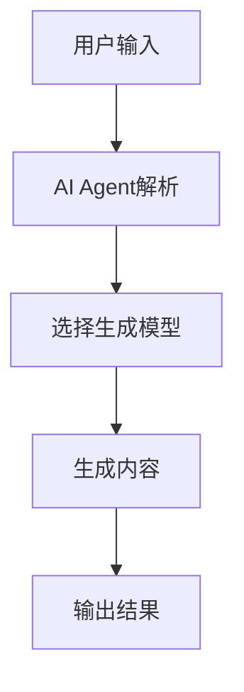
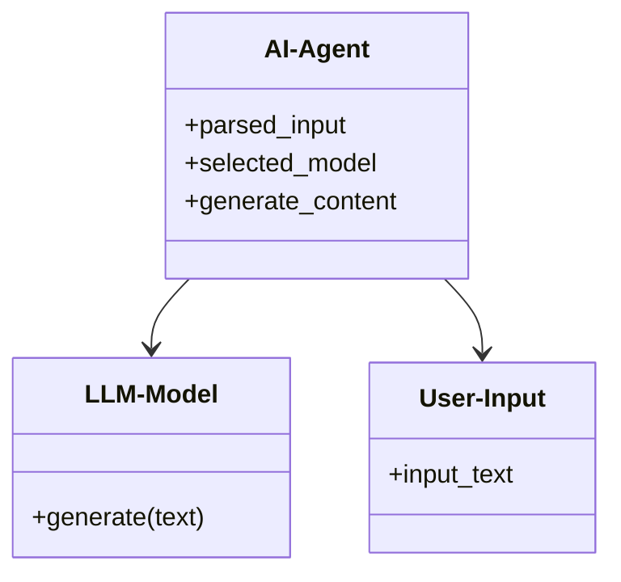
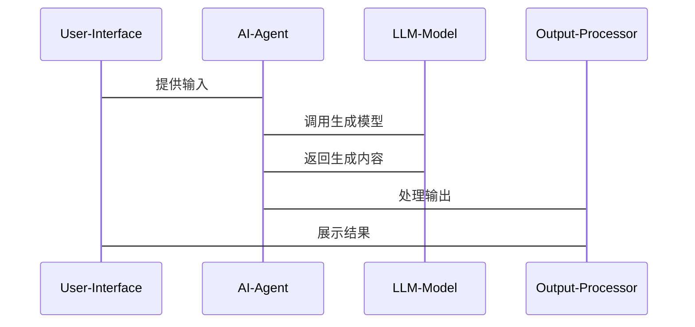

                 


# AI Agent的内容生成系统：多维度LLM创意输出

**关键词**：AI Agent, LLM, 内容生成系统, 多维度创意输出, AI驱动创作, 内容创作工具

**摘要**：本文深入探讨AI Agent在内容生成系统中的应用，特别是如何通过多维度的大语言模型（LLM）实现创意输出。文章从AI Agent的基本概念出发，分析其与LLM的结合方式，详细阐述多维度内容生成的实现原理、系统架构及实际应用案例。通过理论与实践相结合的方式，本文为读者提供了一个全面理解AI Agent驱动内容生成的框架。

---

## 第1章 AI Agent与内容生成系统概述

### 1.1 AI Agent的基本概念

#### 1.1.1 AI Agent的定义与特点
AI Agent（人工智能代理）是一种智能体，能够感知环境、自主决策并执行任务。其特点包括：
- **自主性**：无需外部干预，自主完成任务。
- **反应性**：能实时感知环境变化并调整行为。
- **目标导向**：以明确的目标为导向，优化决策过程。
- **学习能力**：通过数据和经验不断优化自身性能。

#### 1.1.2 AI Agent与传统AI的区别
传统的AI系统通常基于规则或预设的逻辑运行，而AI Agent具备更强的自主性和适应性。例如，AI Agent可以动态调整策略，而传统AI系统则需要人工重新编程。

#### 1.1.3 AI Agent的核心功能与应用场景
AI Agent的核心功能包括：
- **感知环境**：通过传感器或数据输入获取信息。
- **决策制定**：基于感知信息和内部知识库进行决策。
- **执行任务**：通过执行器或API调用完成任务。

应用场景广泛，包括智能助手、推荐系统、自动化控制等。

---

### 1.2 内容生成系统的基本概念

#### 1.2.1 内容生成系统的定义与特点
内容生成系统是一种能够自动生成文本、图像、视频等内容的系统。其特点包括：
- **自动化**：无需人工干预即可生成内容。
- **多样性**：能够输出多种类型的内容。
- **可定制化**：可根据需求调整生成的内容风格和主题。

#### 1.2.2 多维度内容生成的必要性
多维度内容生成是指从多个维度（如文本、图像、音频等）生成内容，以满足多样化的用户需求。其必要性体现在：
- **提升用户体验**：通过多样化的输出满足不同用户偏好。
- **扩展应用场景**：适用于广告、教育、娱乐等多个领域。

#### 1.2.3 LLM在内容生成中的作用
LLM（大语言模型）通过强大的文本生成能力，为内容生成系统提供了核心支持。其优势包括：
- **上下文理解**：能够理解复杂语境并生成连贯文本。
- **创造力**：可以生成创意性内容，如故事、诗歌等。

---

### 1.3 AI Agent与LLM的结合

#### 1.3.1 AI Agent驱动内容生成的模式
AI Agent通过调用LLM API，实现内容生成的自动化和智能化。这种模式的优势在于：
- **高效性**：AI Agent能够快速决策并调用LLM生成内容。
- **灵活性**：可以根据实时反馈调整生成策略。

#### 1.3.2 LLM作为AI Agent的核心组件
LLM在AI Agent中扮演“智能大脑”的角色，负责处理复杂任务。例如：
- **文本生成**：生成高质量文本内容。
- **语义理解**：理解用户需求并进行个性化推荐。

#### 1.3.3 多维度内容生成的实现路径
通过AI Agent整合多模型或多模态技术，实现从单一文本到多模态内容的生成。例如：
- **文本+图像**：生成配图的新闻标题。
- **文本+音频**：生成有声内容。

---

## 第2章 多维度LLM创意输出的核心概念

### 2.1 多维度LLM的定义与特点

#### 2.1.1 多维度LLM的定义
多维度LLM是指能够生成多种类型内容的大型语言模型，包括文本、图像、音频等。

#### 2.1.2 多维度LLM与单维度LLM的对比
| 属性 | 单维度LLM | 多维度LLM |
|------|----------|-----------|
| 输出类型 | 单一（如文本） | 多种（如文本、图像） |
| 应用场景 | 文本生成 | 多领域应用 |
| 技术复杂度 | 较低 | 较高 |

#### 2.1.3 多维度LLM的核心优势
- **灵活性**：适用于多种场景。
- **创造力**：能够生成多样化的内容。

---

### 2.2 AI Agent在多维度LLM中的角色

#### 2.2.1 AI Agent作为内容生成的协调者
AI Agent负责协调不同模型的工作，例如：
- 调用文本生成模型生成标题。
- 调用图像生成模型生成配图。

#### 2.2.2 AI Agent的智能决策机制
AI Agent通过分析用户需求和上下文信息，选择最优的内容生成策略。例如：
- 使用强化学习优化生成结果。
- 根据用户反馈调整生成参数。

#### 2.2.3 AI Agent与多维度LLM的协同工作模式
1. **需求分析**：AI Agent理解用户需求。
2. **模型调用**：AI Agent选择合适的模型生成内容。
3. **结果优化**：AI Agent根据反馈优化生成结果。

---

### 2.3 多维度内容生成的实现原理

#### 2.3.1 多维度内容生成的输入处理
输入包括用户需求、上下文信息等。例如：
- 用户输入关键词“科技”，生成科技相关的文章和配图。

#### 2.3.2 多维度内容生成的输出处理
输出包括文本、图像等多种形式的内容。例如：
- 文章标题和正文。
- 配图和相关链接。

#### 2.3.3 多维度内容生成的质量评估
通过指标如文本连贯性、图像相关性等评估生成内容的质量。例如：
- 使用BLEU评估文本生成质量。
- 使用SSIM评估图像生成质量。

---

## 第3章 AI Agent驱动的多维度LLM创意输出实现

### 3.1 算法原理讲解

#### 3.1.1 算法流程图


#### 3.1.2 算法实现代码
```python
def generate_content(user_input):
    # 解析用户输入
    parsed_input = parse(user_input)
    # 选择生成模型
    selected_model = choose_model(parsed_input)
    # 生成内容
    generated_content = generate(selected_model, parsed_input)
    return generated_content
```

#### 3.1.3 数学模型与公式
LLM的训练目标函数：
$$ \text{Loss} = -\sum_{i=1}^{n} \log P(x_i|y_i) $$

---

### 3.2 系统架构设计方案

#### 3.2.1 领域模型类图


#### 3.2.2 系统架构图


#### 3.2.3 系统交互流程图


---

## 第4章 项目实战：AI Agent驱动的多维度内容生成系统

### 4.1 环境安装与配置

#### 4.1.1 安装Python
```bash
python --version
pip install --upgrade pip
```

#### 4.1.2 安装依赖库
```bash
pip install transformers
pip install matplotlib
```

---

### 4.2 核心代码实现

#### 4.2.1 AI Agent类实现
```python
class AI-Agent:
    def __init__(self):
        self.models = {}  # 存储可用模型

    def parse_input(self, input_text):
        # 解析用户输入
        pass

    def choose_model(self, parsed_input):
        # 根据解析结果选择模型
        pass

    def generate(self, model_name, input_data):
        # 调用模型生成内容
        pass
```

#### 4.2.2 LLM模型集成
```python
class LLM-Model:
    def __init__(self, model_name):
        self.model_name = model_name

    def generate_text(self, prompt):
        # 生成文本
        pass
```

---

### 4.3 代码解读与分析

#### 4.3.1 AI Agent的实现细节
AI Agent通过解析用户输入，选择合适的模型生成内容。例如：
```python
agent = AI-Agent()
agent.parse_input("生成一篇关于AI的文章")
```

#### 4.3.2 LLM模型的调用
生成文本的示例：
```python
llm = LLM-Model("gpt-3.5")
result = llm.generate_text("AI的定义是什么？")
print(result)
```

---

### 4.4 案例分析与详细讲解

#### 4.4.1 案例场景
用户输入：“生成一篇关于AI的文章，配一张AI概念图。”

#### 4.4.2 系统处理流程
1. AI Agent解析输入，选择文本生成和图像生成模型。
2. 调用LLM生成文章。
3. 调用图像生成模型生成配图。
4. 输出结果。

---

## 第5章 最佳实践与总结

### 5.1 最佳实践
- **模型选择**：根据需求选择合适的模型。
- **反馈优化**：通过用户反馈不断优化生成结果。
- **安全考虑**：确保生成内容符合伦理规范。

### 5.2 小结
本文详细介绍了AI Agent与内容生成系统的结合方式，特别是多维度LLM创意输出的实现。通过理论分析和实战案例，展示了如何构建一个高效的AI驱动内容生成系统。

### 5.3 注意事项
- **数据隐私**：确保用户数据的安全性。
- **模型性能**：优化模型以提高生成效率。

### 5.4 拓展阅读
- 探索多模态生成技术。
- 研究AI Agent的强化学习优化方法。

---

**作者**：AI天才研究院/AI Genius Institute & 禅与计算机程序设计艺术/Zen And The Art of Computer Programming

