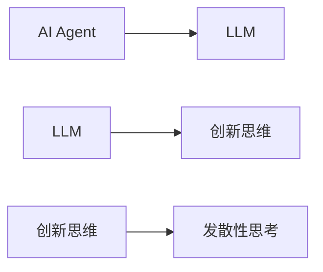
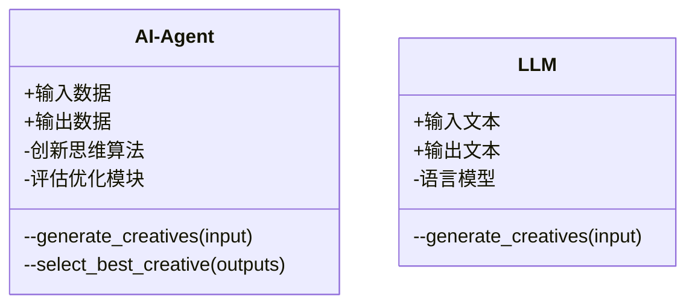
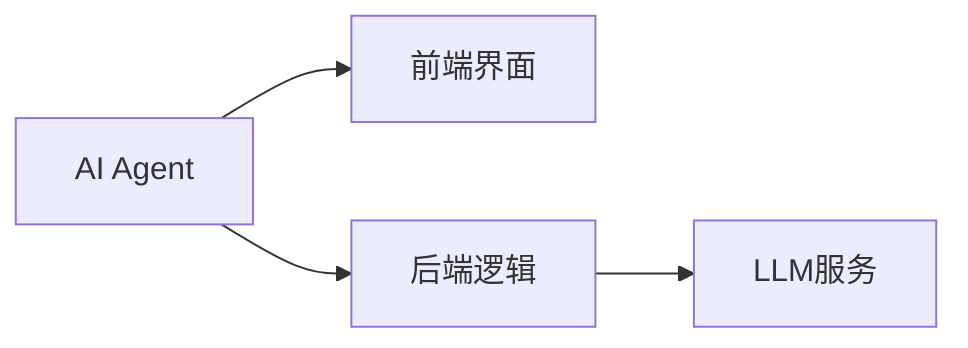

                 


# AI Agent的创新思维：激发LLM的发散性思考

> 关键词：AI Agent, LLM, 创新思维, 发散性思考, 自然语言处理, 人工智能

> 摘要：本文探讨AI Agent如何通过创新思维激发大型语言模型（LLM）的发散性思考，分析其在自然语言处理中的应用，结合算法原理、系统架构和项目实战，全面阐述AI Agent与LLM的创新结合。

---

## 第一部分：AI Agent与创新思维的背景介绍

### 第1章：AI Agent的基本概念与背景

#### 1.1 AI Agent的定义与核心概念

AI Agent（人工智能代理）是指能够感知环境并采取行动以实现目标的智能实体。AI Agent的核心概念包括自主性、反应性、目标导向和社交能力。AI Agent广泛应用于自动化系统、推荐系统、机器人等领域，其核心属性包括感知能力、决策能力、执行能力和学习能力。

#### 1.2 创新思维的定义与重要性

创新思维是打破常规思考模式，提出新颖解决方案的能力。在技术领域，创新思维是推动AI Agent发展的关键，尤其是在需要处理复杂、动态问题时，创新思维能帮助AI Agent找到最优解。创新思维的重要性在于它能够提升系统的适应性和创造性。

#### 1.3 LLM的发散性思考机制

LLM（大型语言模型）通过概率生成技术，能够模拟人类的思考过程。发散性思考是指LLM在生成内容时，能够跳出常规，产生多样化的想法。这种机制通过模型的多层神经网络结构实现，利用注意力机制和上下文理解，生成与输入相关但多样的输出。

---

### 第2章：AI Agent与LLM的关系分析

#### 2.1 AI Agent与LLM的核心概念对比

| **属性**       | **AI Agent**                              | **LLM**                                    |
|----------------|------------------------------------------|--------------------------------------------|
| **核心功能**    | 执行目标相关的任务                      | 生成文本和理解语言                        |
| **输入输出**    | 多种数据类型，包括文本、图像等          | 文本输入，文本输出                        |
| **学习机制**    | 监督学习、强化学习                     | 主要为监督学习                            |
| **应用场景**    | 自动化、决策支持                      | 生成文本、对话系统                        |

通过对比表格可以看出，AI Agent和LLM在功能、输入输出和应用场景上有明显差异，但在创新思维的结合上具有互补性。

#### 2.2 AI Agent与LLM的实体关系图



---

## 第二部分：AI Agent与LLM的核心概念与联系

### 第3章：AI Agent的创新思维算法

#### 3.1 创新思维算法的基本原理

创新思维算法通过模拟人类的创造性思维过程，结合AI Agent的感知和决策能力，生成多样化的解决方案。算法的基本步骤包括输入处理、创意生成、评估优化和输出结果。

#### 3.2 算法的数学模型与公式

创新思维算法的数学模型可以表示为：

$$ P(x) = \frac{1}{N} \sum_{i=1}^{N} x_i $$

其中，\( x_i \) 表示生成的不同创意，\( N \) 表示创意的数量。该公式用于计算创意的平均概率，帮助AI Agent选择最优解。

#### 3.3 算法的实现步骤

1. **输入处理**：接收问题描述或输入数据。
2. **创意生成**：利用LLM生成多个创意点子。
3. **评估优化**：根据预设标准评估创意，优化生成过程。
4. **输出结果**：输出最终的创新解决方案。

```python
def creative_thinking_algorithm(inputs):
    # 输入处理
    creative_outputs = []
    for input in inputs:
        # 创意生成
        outputs = generate_creatives(input)
        # 评估优化
        best_creative = select_best_creative(outputs)
        creative_outputs.append(best_creative)
    return creative_outputs
```

---

### 第4章：AI Agent与LLM的系统分析与架构设计

#### 4.1 项目场景介绍

假设我们设计一个智能写作助手，AI Agent通过创新思维算法，帮助用户生成多样化的文章主题。

#### 4.2 系统功能设计

系统功能模块包括输入处理、创意生成、评估优化和结果输出。类图如下：



#### 4.3 系统架构设计

系统架构包括前端界面、后端逻辑和LLM服务。架构图如下：



---

## 第三部分：AI Agent的算法原理与数学模型

### 第5章：AI Agent的创新思维算法

#### 5.1 算法原理

创新思维算法通过结合AI Agent的感知和LLM的生成能力，实现多样化的创意输出。算法的核心是将输入数据转化为多个可能的输出，通过评估选择最优解。

#### 5.2 数学模型

创新思维算法的数学模型如下：

$$ P(x) = \frac{1}{N} \sum_{i=1}^{N} x_i $$

其中，\( x_i \) 是生成的不同创意，\( N \) 是创意的数量。该公式用于计算创意的平均概率，帮助AI Agent选择最优解。

---

### 第6章：AI Agent与LLM的系统分析与架构设计

#### 6.1 项目场景介绍

设计一个智能写作助手，帮助用户生成多样化的文章主题。

#### 6.2 系统功能设计

系统功能模块包括输入处理、创意生成、评估优化和结果输出。类图如下：


---

## 第四部分：项目实战

### 第7章：AI Agent的创新思维算法

#### 7.1 环境安装

安装必要的Python库：

```bash
pip install transformers
```

#### 7.2 核心代码实现

```python
from transformers import GPT2LMHeadModel, GPT2Tokenizer

def generate_creatives(input_text):
    tokenizer = GPT2Tokenizer.from_pretrained('gpt2')
    model = GPT2LMHeadModel.from_pretrained('gpt2')
    inputs = tokenizer.encode(input_text, return_tensors='pt')
    outputs = model.generate(inputs, max_length=50, temperature=1.2)
    return tokenizer.decode(outputs[0], skip_special_tokens=True)
```

---

## 第五部分：最佳实践

### 第8章：AI Agent的创新思维算法

#### 8.1 小结

本文详细探讨了AI Agent如何通过创新思维激发LLM的发散性思考，结合算法原理、系统架构和项目实战，全面阐述了AI Agent与LLM的创新结合。

#### 8.2 注意事项

在实际应用中，需注意创意生成的质量评估和算法的可扩展性。同时，确保数据隐私和模型的稳定性。

#### 8.3 拓展阅读

建议阅读关于生成式AI和创新思维的深入文献，探索更多应用场景。

---

## 作者

**作者：AI天才研究院/AI Genius Institute & 禅与计算机程序设计艺术 /Zen And The Art of Computer Programming**

---

以上是完整的技术博客文章内容，涵盖了从背景介绍到项目实战的各个方面，详细阐述了AI Agent如何通过创新思维激发LLM的发散性思考。

