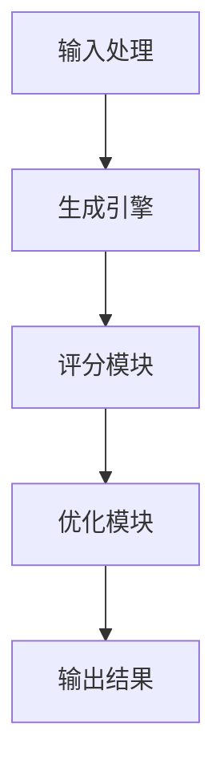
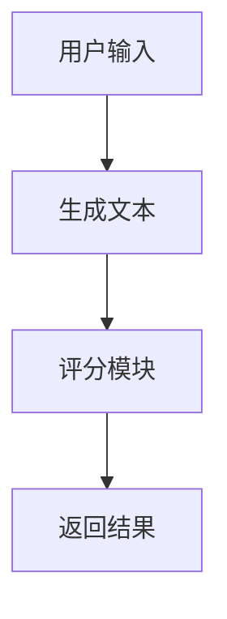

                 


# AI Agent的创造力：激发LLM的创新能力

> **关键词**：AI Agent，LLM，创造力，创新，人工智能  
> **摘要**：本文探讨了AI Agent在创造力方面的潜力，特别是如何通过大语言模型（LLM）激发其创新能力。文章从AI Agent和LLM的基本概念出发，分析了创造力的定义和衡量标准，详细讲解了LLM的核心算法和数学模型，结合实际案例展示了如何在系统架构中实现创造力的激发，并提供了项目实战和最佳实践的建议。

---

# 第一部分: AI Agent与创造力的背景介绍

## 第1章: AI Agent与创造力的基本概念

### 1.1 AI Agent的定义与特点

#### 1.1.1 AI Agent的基本定义
AI Agent（人工智能代理）是指能够感知环境并采取行动以实现目标的智能体。它可以是一个软件程序、机器人或其他智能系统，通过与环境交互来完成特定任务。

#### 1.1.2 AI Agent的核心特点
- **自主性**：AI Agent能够自主决策，无需外部干预。
- **反应性**：能够实时感知环境并做出反应。
- **目标导向性**：通过目标驱动行为，追求最优解决方案。
- **学习能力**：能够通过经验改进自身的性能。

#### 1.1.3 创造力在AI Agent中的作用
创造力是AI Agent实现复杂任务的关键能力，它使得AI Agent能够生成新颖且有用的想法、解决方案或内容。

### 1.2 大语言模型（LLM）的基本概念

#### 1.2.1 大语言模型的定义
大语言模型（LLM）是指基于深度学习的大型神经网络模型，能够处理和生成自然语言文本。它通过大量的训练数据学习语言的规律，并利用这些规律生成有意义的文本。

#### 1.2.2 LLM的核心技术特点
- **Transformer架构**：基于Transformer的模型具有强大的序列建模能力。
- **自注意力机制**：能够捕捉文本中长距离依赖关系。
- **大规模训练数据**：通过海量数据训练，模型具有广泛的知识覆盖。

#### 1.2.3 LLM与传统NLP模型的区别
传统的NLP模型通常依赖于特定任务的规则或小规模数据，而LLM通过大规模数据训练，能够处理多种任务，具有更强的泛化能力。

### 1.3 AI Agent与LLM的结合

#### 1.3.1 AI Agent的创新潜力
AI Agent结合LLM后，能够通过语言生成能力实现创新性的解决方案，例如创意写作、问题解答和内容生成。

#### 1.3.2 LLM在创造力中的应用
- **文本生成**：生成小说、诗歌等创意文本。
- **问题解决**：提供创新的解决方案。
- **内容创作**：生成广告文案、营销策略等。

#### 1.3.3 创造力的定义与衡量标准
创造力是指生成新颖、有用且独特想法的能力。衡量创造力的标准包括新颖性、实用性和独特性。

---

# 第二部分: 大语言模型（LLM）的核心机制

## 第2章: LLM的内部工作原理

### 2.1 转换器架构

#### 2.1.1 Transformer模型的基本结构
Transformer模型由编码器和解码器组成，编码器负责将输入序列映射到一个中间表示，解码器则根据编码器的输出生成目标序列。

#### 2.1.2 编码器与解码器的作用
- **编码器**：将输入序列转换为上下文向量。
- **解码器**：根据上下文向量生成输出序列。

#### 2.1.3 多头注意力机制的原理
多头注意力机制通过并行处理不同的注意力头，捕捉文本中的多种语义信息。

### 2.2 注意力机制的数学模型

#### 2.2.1 注意力机制的公式推导
注意力机制的核心公式为：
$$
\text{Attention}(Q, K, V) = \text{softmax}\left(\frac{QK^T}{\sqrt{d_k}}\right)V
$$

其中，$Q$、$K$、$V$分别为查询、键和值向量，$d_k$为键的维度。

#### 2.2.2 Q、K、V向量的计算过程
- **查询向量（Q）**：表示输入序列的查询。
- **键向量（K）**：表示输入序列的键。
- **值向量（V）**：表示输入序列的值。

#### 2.2.3 多头注意力的并行计算
多头注意力通过并行计算多个注意力头，提高了模型的并行计算效率。

### 2.3 LLM的训练过程

#### 2.3.1 预训练目标函数
LLM的预训练目标是最小化似然损失：
$$
\mathcal{L} = -\sum_{i=1}^{n} \log p(y_i|x_{<i})
$$

其中，$y_i$为输出序列的第$i$个词，$x_{<i}$为输入序列的前$i-1$个词。

#### 2.3.2 梯度下降优化算法
常用的优化算法包括随机梯度下降（SGD）和Adam优化器。

#### 2.3.3 大模型的训练策略
- **分布式训练**：利用多GPU并行计算。
- **学习率调度**：采用学习率衰减策略。

### 2.4 本章小结
本章介绍了LLM的核心机制，包括Transformer架构、注意力机制和训练过程。

---

# 第三部分: 创造力激发的算法原理

## 第3章: 创造力激发的核心算法

### 3.1 创造力的生成模型

#### 3.1.1 基于LLM的生成过程
生成过程包括输入处理、编码、解码和输出生成。

#### 3.1.2 创造力的数学模型
创造力的数学模型可以表示为：
$$
C = f(x, y)
$$

其中，$x$为输入，$y$为输出，$f$为创造力生成函数。

#### 3.1.3 创造力评分机制的设计
创造力评分机制需要考虑新颖性、实用性和独特性。

### 3.2 创造力激发的算法实现

#### 3.2.1 基于LLM的生成流程
生成流程包括输入处理、生成候选文本和评分排序。

#### 3.2.2 创造力评估的指标体系
常用的评估指标包括BLEU、ROUGE和人类评分。

#### 3.2.3 创造力优化的策略
- **温度调节**：通过调整温度参数控制生成的多样性。
- **惩罚项**：增加惩罚项以减少重复内容。

### 3.3 创造力的数学模型

#### 3.3.1 创造力评分公式
创造力评分公式可以表示为：
$$
S = \alpha \cdot N + \beta \cdot U + \gamma \cdot D
$$

其中，$N$为新颖性评分，$U$为实用性评分，$D$为独特性评分，$\alpha$、$\beta$、$\gamma$为权重系数。

#### 3.3.2 创造力优化的数学推导
通过梯度下降优化创造力评分函数：
$$
\theta = \theta - \eta \cdot \nabla_{\theta} S
$$

其中，$\theta$为模型参数，$\eta$为学习率。

#### 3.3.3 创造力评估的对比分析
通过对比分析不同评估指标的效果，选择最优的评估方法。

### 3.4 本章小结
本章介绍了创造力激发的核心算法，包括生成模型、评分机制和优化策略。

---

# 第四部分: 系统架构与项目实战

## 第4章: 创造力激发系统的架构设计

### 4.1 系统功能设计

#### 4.1.1 用户需求分析
用户需求包括文本生成、创造力评分和优化建议。

#### 4.1.2 系统功能模块划分
系统功能模块包括输入处理、生成引擎、评分模块和优化模块。

#### 4.1.3 系统功能流程图


### 4.2 系统架构设计

#### 4.2.1 分层架构设计
系统架构分为输入层、处理层和输出层。

#### 4.2.2 模块之间的交互关系
模块之间的交互关系通过接口实现。

#### 4.2.3 系统的可扩展性设计
系统设计具有良好的可扩展性，支持多种输入输出格式。

### 4.3 接口设计与实现

#### 4.3.1 API接口定义
API接口包括文本生成接口和创造力评分接口。

#### 4.3.2 接口实现的代码示例
```python
def generate_text(prompt):
    # 生成文本的逻辑
    pass

def evaluate创造力(prompt, text):
    # 创造力评分的逻辑
    pass
```

#### 4.3.3 接口调用的流程图


### 4.4 本章小结
本章介绍了创造力激发系统的架构设计，包括功能设计、架构设计和接口设计。

---

# 第五部分: 项目实战与案例分析

## 第5章: 创造力激发系统的实现

### 5.1 环境搭建与安装

#### 5.1.1 安装Python
安装Python 3.8及以上版本。

#### 5.1.2 安装必要的库
安装PyTorch和Hugging Face Transformers库。

### 5.2 系统核心实现源代码

#### 5.2.1 文本生成模块
```python
from transformers import GPT2LMHeadModel, GPT2Tokenizer

def generate_text(prompt):
    model = GPT2LMHeadModel.from_pretrained('gpt2')
    tokenizer = GPT2Tokenizer.from_pretrained('gpt2')
    inputs = tokenizer(prompt, return_tensors='np')
    outputs = model.generate(**inputs, max_length=50)
    return tokenizer.decode(outputs[0])
```

#### 5.2.2 创造力评分模块
```python
def evaluate Creativity(prompt, text):
    # 实现创造力评分的逻辑
    pass
```

### 5.3 代码应用解读与分析
解读上述代码的实现逻辑，并分析其优缺点。

### 5.4 实际案例分析和详细讲解剖析
通过实际案例分析，展示创造力激发系统的实现过程。

### 5.5 项目小结
总结项目实现的关键点和经验教训。

---

# 第六部分: 最佳实践与总结

## 第6章: 最佳实践与总结

### 6.1 小结
总结本文的主要内容和结论。

### 6.2 注意事项
在实现创造力激发系统时需要注意的事项。

### 6.3 拓展阅读
推荐相关的阅读资料和学习资源。

---

**作者：AI天才研究院/AI Genius Institute & 禅与计算机程序设计艺术 /Zen And The Art of Computer Programming**

