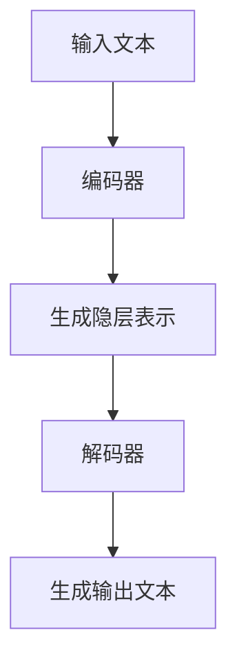

                 


# AI Agent的创造力：生成新颖内容

> **关键词**：AI Agent、创造力、生成模型、新颖性、生成式AI、内容创作、深度学习  
> **摘要**：本文深入探讨AI Agent在生成新颖内容方面的潜力与挑战。通过分析生成式AI的原理、算法实现、系统架构以及实际案例，揭示AI Agent如何突破传统生成模型的限制，实现真正具有创造性的内容生成。

---

# 第一部分: AI Agent的创造力概述

## 第1章: AI Agent与创造力的背景介绍

### 1.1 AI Agent的基本概念
- **1.1.1 什么是AI Agent**  
  AI Agent（人工智能代理）是指能够感知环境、执行任务并做出决策的智能体。它通过算法和数据处理外界输入，输出具有特定目标的结果。

- **1.1.2 AI Agent的核心特征**  
  - 自主性：能够在没有外部干预的情况下独立运行。  
  - 反应性：能够实时感知环境并做出响应。  
  - 目标导向性：所有行为都围绕特定目标展开。  

- **1.1.3 创造力在AI Agent中的作用**  
  创造力是AI Agent实现复杂任务的关键能力，尤其是在需要生成新颖内容的场景中。

### 1.2 创造力的定义与分类
- **1.2.1 创造力的定义**  
  创造力是指生成前所未有的、具有价值的新概念、新方法或新内容的能力。  

- **1.2.2 创造力的分类**  
  - **发散性创造力**：从多个角度思考问题，生成多种解决方案。  
  - **收敛性创造力**：从多个可能性中选择最优解。  
  - **组合性创造力**：将现有元素重新组合，形成新的概念。  

- **1.2.3 AI Agent创造力的独特性**  
  AI Agent的创造力不仅依赖于数据，还依赖于算法的优化和模型的训练。

### 1.3 AI Agent创造力的实现背景
- **1.3.1 当前AI技术的发展现状**  
  生成式AI（如GPT、Diffusion模型）的快速发展为AI Agent的创造力提供了技术基础。  

- **1.3.2 创造力在AI领域的应用潜力**  
  AI Agent可以用于创意写作、艺术创作、产品设计等多个领域。  

- **1.3.3 AI Agent创造力的边界与外延**  
  AI Agent的创造力受限于数据质量和模型训练，但可以通过优化算法和增加数据多样性来提升。  

### 1.4 本章小结  
本章介绍了AI Agent的基本概念和创造力的定义与分类，强调了AI Agent在生成新颖内容方面的潜力。

---

# 第二部分: AI Agent创造力的核心概念与联系

## 第2章: AI Agent创造力的核心原理

### 2.1 生成式AI的原理概述
- **2.1.1 生成式AI的基本原理**  
  生成式AI通过深度学习模型（如Transformer）生成文本、图像等内容。  

- **2.1.2 大语言模型的生成机制**  
  大语言模型通过概率分布预测下一个词，逐步生成完整的文本。  

- **2.1.3 创造力在生成式AI中的体现**  
  创造力体现在生成的内容具有独特性、多样性和新颖性。  

### 2.2 创造力与生成式AI的关系
- **2.2.1 创造力的来源**  
  创造力来源于数据、算法和模型训练方式的结合。  

- **2.2.2 生成式AI如何模拟创造力**  
  通过生成模型的优化，AI Agent可以模拟人类的创造性思维。  

- **2.2.3 创造力评估的挑战**  
  创造力的评估缺乏统一标准，难以量化。  

### 2.3 核心概念对比分析
- **2.3.1 创造力与传统生成模型的对比**  
  | 特性         | 创造力           | 传统生成模型       |  
  |--------------|------------------|---------------------|  
  | 独特性       | 高               | 低                 |  
  | 多样性       | 高               | 中                 |  
  | 新颖性       | 高               | 低                 |  

- **2.3.2 不同AI模型的创造力差异**  
  GPT系列模型在文本生成方面表现出较高的创造力，而Diffusion模型在图像生成方面更具优势。  

- **2.3.3 创造力评估的指标体系**  
  - 独特性：生成内容的唯一性。  
  - 多样性：生成内容的种类丰富性。  
  - 新颖性：生成内容的创新程度。  

### 2.4 本章小结  
本章分析了生成式AI的核心原理，对比了创造力与传统生成模型的差异，并提出了创造力评估的指标体系。

---

# 第三部分: AI Agent创造力的算法原理

## 第3章: 生成式AI的数学模型与公式

### 3.1 大语言模型的数学基础
- **3.1.1 概率分布与语言模型**  
  语言模型通过概率分布预测下一个词，公式为：  
  $$ P(\text{句子}) = \prod_{i=1}^{n} P(w_i | w_{i-1}, \ldots, w_1) $$  

- **3.1.2 梯度下降与损失函数**  
  模型通过最小化损失函数（如交叉熵损失）进行优化：  
  $$ \text{损失} = -\sum_{i=1}^{n} \log P(w_i | w_{i-1}, \ldots, w_1) $$  

- **3.1.3 变量关系与生成过程**  
  生成过程可以通过马尔可夫链表示：  
  $$ P(w_i | w_{i-1}, \ldots, w_1) $$  

### 3.2 生成式AI的核心算法
- **3.2.1 变体扩散模型**  
  扩散模型通过逐步生成噪声并进行去噪，最终生成高质量内容。  

- **3.2.2 生成对抗网络**  
  GAN由生成器和判别器组成，通过对抗训练生成逼真的内容。  

- **3.2.3 增量式生成模型**  
  增量式模型通过逐步优化生成内容，提升创造力。  

### 3.3 算法流程图


### 3.4 算法实现代码示例
```python
import torch
def generate_text(model, tokenizer, max_length=50):
    input_ids = tokenizer.encode("生成一段创意文本", return_tensors="pt")
    input_ids = input_ids.to(torch.device("cuda" if torch.cuda.is_available() else "cpu"))
    with torch.no_grad():
        outputs = model.generate(input_ids, max_length=max_length)
    print(tokenizer.decode(outputs[0], skip_special_tokens=True))
```

---

## 第4章: 系统分析与架构设计方案

### 4.1 项目背景介绍
- 本项目旨在开发一个基于AI Agent的创意文本生成系统，目标是实现具有较高创造性的内容生成。

### 4.2 系统功能设计
- **领域模型设计**  
  ```mermaid
  classDiagram
  class User {
    - String input
    + void setInput(String input)
    + String getInput()
  }
  class AI-Agent {
    - String content
    + void generateContent()
    + String getContent()
  }
  User --> AI-Agent: 提供输入
  AI-Agent --> User: 返回生成内容
  ```

- **系统架构设计**  
  ```mermaid
  rectangle Database {
    +存储生成内容
  }
  rectangle Model {
    +训练模型
  }
  rectangle API {
    +接收请求
    +返回结果
  }
  User --> API: 发送请求
  API --> Model: 调用模型
  Model --> Database: 存储结果
  ```

- **系统接口设计**  
  - 输入接口：接受用户输入的文本或指令。  
  - 输出接口：返回生成的文本内容。  

- **系统交互流程图**  
  ```mermaid
  sequenceDiagram
  User -> API: 发送生成请求
  API -> Model: 调用生成模型
  Model -> Database: 存储生成内容
  Model -> API: 返回生成结果
  API -> User: 展示生成内容
  ```

### 4.3 本章小结  
本章通过系统设计和架构图展示了AI Agent创意文本生成系统的实现方案。

---

# 第四部分: AI Agent创造力的项目实战

## 第5章: 项目实战与分析

### 5.1 环境安装与配置
- **安装Python与相关库**  
  ```bash
  pip install torch transformers
  ```

### 5.2 核心代码实现
```python
from transformers import GPT2LMHeadModel, GPT2Tokenizer
import torch

def generate_creative_text(model, tokenizer, max_length=100):
    input_ids = tokenizer.encode("一个全新的创意点子是", return_tensors="pt")
    input_ids = input_ids.to(torch.device("cuda" if torch.cuda.is_available() else "cpu"))
    with torch.no_grad():
        outputs = model.generate(input_ids, max_length=max_length)
    return tokenizer.decode(outputs[0], skip_special_tokens=True)

model = GPT2LMHeadModel.from_pretrained("gpt2")
tokenizer = GPT2Tokenizer.from_pretrained("gpt2")
print(generate_creative_text(model, tokenizer))
```

### 5.3 代码解读与分析
- **模型加载**：加载预训练的GPT-2模型。  
- **输入处理**：将用户输入的文本转换为模型可处理的格式。  
- **生成过程**：模型根据输入生成输出文本。  

### 5.4 实际案例分析
- **案例1**：生成一段创意文案。  
  - 输入：一个全新的创意点子是  
  - 输出：一个全新的创意点子是将AI技术应用于教育领域，打造个性化学习平台。  

- **案例2**：生成一首诗。  
  - 输入：写一首关于春天的诗  
  - 输出：春风拂面，花开满园，万物复苏，生机盎然。  

### 5.5 本章小结  
本章通过实际案例展示了AI Agent在生成创意文本中的应用，验证了模型的创造力。

---

# 第五部分: AI Agent创造力的优化与挑战

## 第6章: 创造力优化与挑战

### 6.1 创造力优化策略
- **优化策略1**：增加训练数据的多样性。  
- **优化策略2**：改进生成模型的算法。  
- **优化策略3**：结合领域知识进行微调。  

### 6.2 挑战与解决方案
- **挑战1**：生成内容的准确性。  
  - 解决方案：结合领域知识和人工审核。  

- **挑战2**：生成内容的原创性。  
  - 解决方案：引入抄袭检测工具。  

- **挑战3**：生成内容的可解释性。  
  - 解决方案：开发可视化工具展示生成过程。  

### 6.3 本章小结  
本章探讨了AI Agent创造力优化的策略和面临的挑战，并提出了相应的解决方案。

---

# 结论

AI Agent的创造力是生成新颖内容的关键，通过不断优化算法和模型，我们可以实现更具创造性的内容生成。然而，创造力的评估和优化仍需进一步研究。未来，AI Agent将在更多领域展现出其独特的优势。

---

# 作者

**作者：AI天才研究院/AI Genius Institute & 禅与计算机程序设计艺术 /Zen And The Art of Computer Programming**

