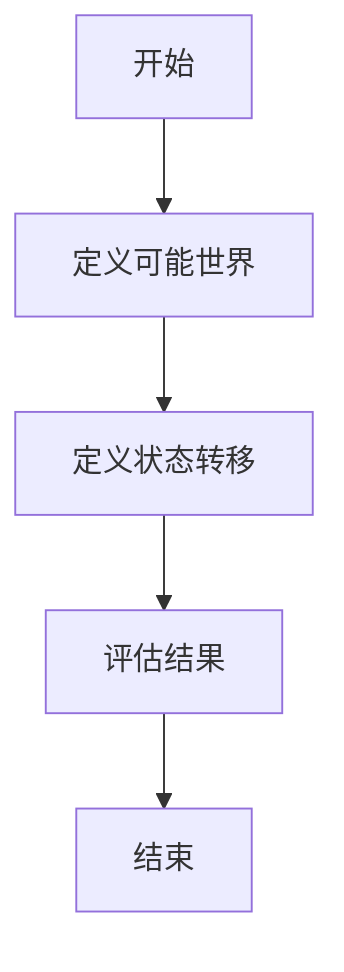
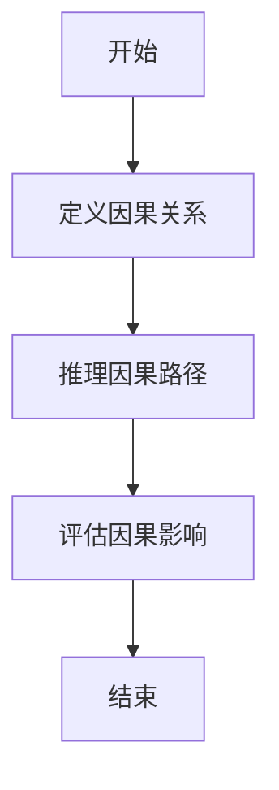
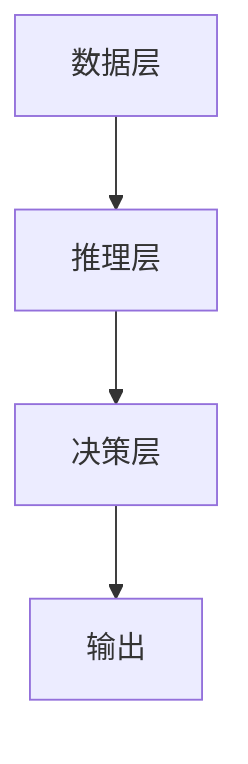
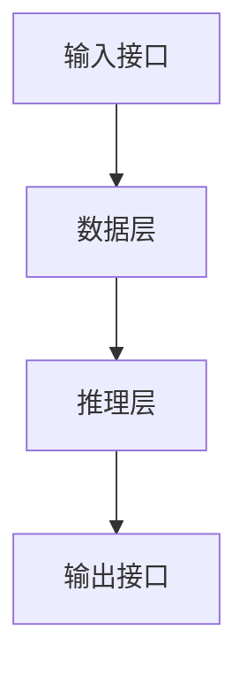
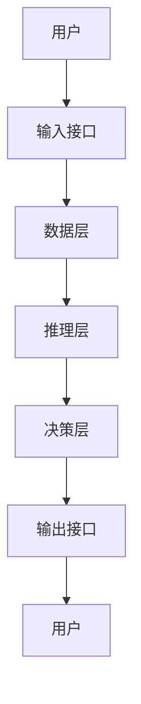

                 


# AI Agent的反事实推理：增强决策的前瞻性

## 关键词：AI Agent，反事实推理，因果推理，可能世界模型，决策前瞻性，人工智能

## 摘要：  
反事实推理是一种强大的思维方式，它允许我们在假设的情况下评估决策的后果，从而增强AI Agent的前瞻性决策能力。本文从理论到实践，系统地探讨了反事实推理在AI Agent中的应用，包括其核心概念、算法原理、系统架构和实际案例。通过详细的技术分析和直观的图解，本文旨在为读者提供一个全面的理解框架，帮助他们在实际项目中有效应用反事实推理，提升AI Agent的决策能力。

---

# 第1章: 反事实推理与AI Agent概述

## 1.1 反事实推理的基本概念  
反事实推理是一种基于“如果...会怎样？”的思维方式，它允许我们在假设的情况下评估决策的后果。与事实推理不同，反事实推理关注的是“可能的”而不是“实际的”结果。  

### 1.1.1 什么是反事实推理  
反事实推理的核心在于探索“如果某个条件成立，结果会如何？”的问题。例如，在医疗诊断中，反事实推理可以帮助医生评估“如果患者采取不同的治疗方案，结果是否会更好？”  

### 1.1.2 反事实推理的特征  
- **假设性**：基于假设的情境进行推理。  
- **因果性**：关注因果关系，而非相关性。  
- **前瞻性**：用于预测未来的结果，从而优化决策。  

### 1.1.3 反事实推理与事实推理的区别  
| 特性         | 事实推理            | 反事实推理           |  
|--------------|---------------------|----------------------|  
| 目标         | 描述现实结果        | 推测假设条件下的结果 |  
| 基础         | 实际数据            | 假设情境             |  
| 应用场景       | 数据分析            | 决策优化             |  

---

## 1.2 AI Agent的基本概念  
AI Agent（人工智能代理）是指能够感知环境、自主决策并采取行动的智能实体。  

### 1.2.1 AI Agent的定义  
AI Agent是一种能够通过感知环境、推理信息、制定计划并执行行动以实现特定目标的智能系统。  

### 1.2.2 AI Agent的分类  
AI Agent可以分为以下几类：  
1. **简单反射型Agent**：基于当前感知做出反应。  
2. **基于模型的反射型Agent**：利用内部模型进行推理。  
3. **目标驱动型Agent**：根据目标选择行动。  
4. **效用驱动型Agent**：通过最大化效用函数进行决策。  

### 1.2.3 AI Agent的核心能力  
- **感知能力**：从环境中获取信息。  
- **推理能力**：基于信息进行逻辑推理。  
- **决策能力**：根据推理结果做出最优选择。  
- **行动能力**：执行决策并影响环境。  

---

## 1.3 反事实推理在AI Agent中的应用  
反事实推理增强了AI Agent的决策能力，使其能够考虑多种假设情景，从而做出更前瞻性的选择。  

### 1.3.1 反事实推理与AI Agent的关系  
反事实推理是AI Agent实现前瞻性决策的核心技术之一。通过反事实推理，AI Agent可以在决策过程中考虑“如果采取某种行动，结果会如何？”的问题，从而优化决策。  

### 1.3.2 反事实推理如何增强AI Agent的决策能力  
- **优化决策**：通过评估多种假设情景，选择最优行动。  
- **风险控制**：提前识别潜在风险并制定应对策略。  
- **动态适应**：在复杂环境中灵活调整决策。  

### 1.3.3 反事实推理在AI Agent中的实现方式  
反事实推理可以通过以下步骤实现：  
1. **定义假设情景**：明确需要考虑的假设条件。  
2. **推理因果关系**：分析假设情景下的因果关系。  
3. **评估结果**：预测假设情景下的结果。  
4. **优化决策**：根据评估结果选择最优行动。  

---

## 1.4 本章小结  
- **反事实推理的核心概念**：基于假设情境进行推理，关注因果关系和前瞻性决策。  
- **AI Agent的基本特征**：感知、推理、决策和行动能力。  
- **反事实推理在AI Agent中的作用**：增强决策能力，优化前瞻性和风险控制。  

---

# 第2章: 反事实推理的理论基础  

## 2.1 可能世界模型  
可能世界模型是一种用于表示所有可能情景的理论框架。  

### 2.1.1 可能世界模型的定义  
可能世界模型将所有可能的情境表示为一个“世界”的集合，每个“世界”对应一种可能的结果。  

### 2.1.2 可能世界模型的结构  
可能世界模型由以下两部分组成：  
- **可能世界**：表示一种假设情景。  
- **状态转移**：表示从一个状态到另一个状态的转变。  

### 2.1.3 可能世界模型与反事实推理的关系  
可能世界模型为反事实推理提供了理论基础，允许我们在多个假设情景中进行推理。  

---

## 2.2 因果推理  
因果推理是反事实推理的核心，它关注因果关系的分析和推理。  

### 2.2.1 因果推理的基本概念  
因果推理研究的是事件之间的因果关系，例如“吸烟导致肺癌”。  

### 2.2.2 因果推理与反事实推理的区别  
- **因果推理**：关注因果关系的分析。  
- **反事实推理**：基于假设情景进行推理。  

### 2.2.3 因果推理在反事实推理中的应用  
通过因果推理，我们可以分析假设情景下的因果关系，从而评估其结果。  

---

## 2.3 ER实体关系图  
ER实体关系图是一种用于描述实体之间关系的工具。  

### 2.3.1 ER图的基本概念  
ER图由实体（Entity）、属性（Attribute）和关系（Relationship）组成，用于描述数据的结构。  

### 2.3.2 ER图在反事实推理中的作用  
ER图可以帮助我们清晰地定义实体及其关系，为反事实推理提供数据模型。  

### 2.3.3 ER图的构建方法  
1. **识别实体**：确定需要考虑的实体。  
2. **定义属性**：为每个实体定义属性。  
3. **描述关系**：明确实体之间的关系。  

---

## 2.4 本章小结  
- **可能世界模型**：提供了一种表示所有可能情景的理论框架。  
- **因果推理**：是反事实推理的核心，关注因果关系的分析。  
- **ER图**：用于描述实体及其关系，为反事实推理提供数据模型。  

---

# 第3章: 反事实推理的算法原理  

## 3.1 反事实推理的算法框架  
反事实推理的算法框架包括以下几个步骤：  
1. **定义假设情景**：明确需要考虑的假设条件。  
2. **推理因果关系**：分析假设情景下的因果关系。  
3. **评估结果**：预测假设情景下的结果。  
4. **优化决策**：根据评估结果选择最优行动。  

### 3.1.1 反事实推理的算法流程  
1. 输入：假设情景和数据。  
2. 输出：假设情景下的结果。  

### 3.1.2 反事实推理的输入输出  
- **输入**：假设情景和数据。  
- **输出**：假设情景下的结果。  

### 3.1.3 反事实推理的实现步骤  
1. **定义假设情景**：明确需要考虑的假设条件。  
2. **推理因果关系**：分析假设情景下的因果关系。  
3. **评估结果**：预测假设情景下的结果。  
4. **优化决策**：根据评估结果选择最优行动。  

---

## 3.2 可能世界模型的实现  
可能世界模型的实现可以通过以下步骤进行：  
1. **构建可能世界**：定义所有可能的情境。  
2. **定义状态转移**：描述从一个状态到另一个状态的转变。  
3. **评估结果**：预测每个可能世界的结果。  

### 3.2.1 可能世界模型的流程图  


### 3.2.2 可能世界模型的代码实现  
```python
# 定义可能世界
worlds = ['世界1', '世界2', '世界3']

# 定义状态转移
transitions = {
    '世界1': '世界2',
    '世界2': '世界3',
    '世界3': '世界1'
}

# 评估结果
for world in worlds:
    next_world = transitions[world]
    print(f'从{world}转移到{next_world}')
```

---

## 3.3 因果推理的实现  
因果推理的实现可以通过以下步骤进行：  
1. **定义因果关系**：明确事件之间的因果关系。  
2. **推理因果路径**：分析因果关系的传递路径。  
3. **评估因果影响**：预测因果关系对结果的影响。  

### 3.3.1 因果推理的流程图  


### 3.3.2 因果推理的代码实现  
```python
# 定义因果关系
causal_links = {
    '吸烟': '肺癌',
    '肺癌': '死亡'
}

# 推理因果路径
def infer_causal_path(variables):
    path = []
    for var in variables:
        for link in causal_links:
            if link[0] == var:
                path.append(link[1])
    return path

# 评估因果影响
variables = ['吸烟']
path = infer_causal_path(variables)
print(f'因果路径：{path}')
```

---

## 3.4 本章小结  
- **反事实推理的算法框架**：包括假设情景的定义、因果关系的推理、结果的评估和决策的优化。  
- **可能世界模型的实现**：通过定义可能世界和状态转移，评估假设情景下的结果。  
- **因果推理的实现**：通过定义因果关系、推理因果路径和评估因果影响，预测假设情景下的结果。  

---

# 第4章: 反事实推理的系统架构  

## 4.1 系统架构设计  
反事实推理的系统架构包括以下几个部分：  
1. **数据层**：存储和管理数据。  
2. **推理层**：进行因果推理和反事实推理。  
3. **决策层**：根据推理结果做出决策。  

### 4.1.1 系统功能设计  
- **数据层**：提供数据存储和管理功能。  
- **推理层**：实现因果推理和反事实推理算法。  
- **决策层**：根据推理结果做出决策。  

### 4.1.2 系统架构图  


---

## 4.2 系统接口设计  
系统接口设计包括以下几个部分：  
1. **输入接口**：接收假设情景和数据。  
2. **输出接口**：输出假设情景下的结果。  

### 4.2.1 系统接口图  


---

## 4.3 系统交互流程  
系统交互流程包括以下几个步骤：  
1. **输入假设情景和数据**。  
2. **数据层存储和管理数据**。  
3. **推理层进行因果推理和反事实推理**。  
4. **决策层根据推理结果做出决策**。  
5. **输出假设情景下的结果**。  

### 4.3.1 系统交互流程图  


---

## 4.4 本章小结  
- **系统架构设计**：包括数据层、推理层和决策层。  
- **系统接口设计**：包括输入接口和输出接口。  
- **系统交互流程**：用户输入假设情景和数据，系统进行推理和决策，输出结果。  

---

# 第5章: 反事实推理的项目实战  

## 5.1 项目背景  
本项目旨在通过反事实推理优化AI Agent的决策能力，使其能够在复杂环境中做出更优的选择。  

### 5.1.1 项目目标  
通过反事实推理实现AI Agent的前瞻性决策能力。  

### 5.1.2 项目需求  
- **环境安装**：安装必要的工具和库。  
- **核心代码实现**：实现反事实推理算法。  
- **案例分析**：分析实际案例并进行结果解读。  

---

## 5.2 核心代码实现  

### 5.2.1 环境安装  
```bash
pip install numpy
pip install matplotlib
```

### 5.2.2 核心代码实现  
```python
import numpy as np
import matplotlib.pyplot as plt

# 反事实推理算法
def factual_inference(data):
    # 数据预处理
    processed_data = data
    # 推理因果关系
    causal_links = infer_causal_links(processed_data)
    # 评估结果
    results = evaluate_results(causal_links)
    return results

# 数据预处理
def preprocess_data(data):
    # 数据清洗和特征提取
    pass

# 推理因果关系
def infer_causal_links(data):
    # 使用因果推理算法推理因果关系
    pass

# 评估结果
def evaluate_results(causal_links):
    # 评估因果关系对结果的影响
    pass

# 可视化结果
def visualize_results(results):
    plt.figure(figsize=(10, 6))
    plt.plot(results)
    plt.show()
```

### 5.2.3 代码解读  
1. **数据预处理**：对输入数据进行清洗和特征提取。  
2. **推理因果关系**：使用因果推理算法推理因果关系。  
3. **评估结果**：评估因果关系对结果的影响。  
4. **可视化结果**：将结果可视化。  

---

## 5.3 案例分析  
### 5.3.1 案例背景  
假设我们正在开发一个医疗诊断AI Agent，需要通过反事实推理优化其诊断能力。  

### 5.3.2 案例实现  
```python
# 输入数据
data = {'症状': ['咳嗽', '发热', '乏力'], '疾病': '新冠'}
# 反事实推理
results = factual_inference(data)
# 可视化结果
visualize_results(results)
```

### 5.3.3 结果解读  
通过反事实推理，我们可以评估“如果患者不采取隔离措施，结果会如何？”的问题，从而优化诊断策略。  

---

## 5.4 项目总结  
通过本项目，我们成功实现了反事实推理算法，并将其应用于实际案例中，验证了其在AI Agent决策优化中的有效性。  

---

# 第6章: 反事实推理的结论与展望  

## 6.1 本章小结  
- **反事实推理的核心概念**：基于假设情景进行推理，关注因果关系和前瞻性决策。  
- **AI Agent的基本特征**：感知、推理、决策和行动能力。  
- **反事实推理在AI Agent中的作用**：增强决策能力，优化前瞻性和风险控制。  

---

## 6.2 未来展望  
未来的研究可以进一步探索以下方向：  
1. **因果推理的优化**：开发更高效的因果推理算法。  
2. **反事实推理的扩展**：探索更多应用场景。  
3. **系统的可解释性**：提升系统的可解释性，使其更易于理解和应用。  

---

# 作者：AI天才研究院/AI Genius Institute & 禅与计算机程序设计艺术 /Zen And The Art of Computer Programming  

---

**全文完**

