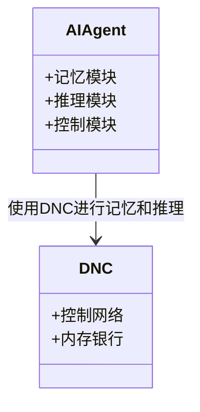
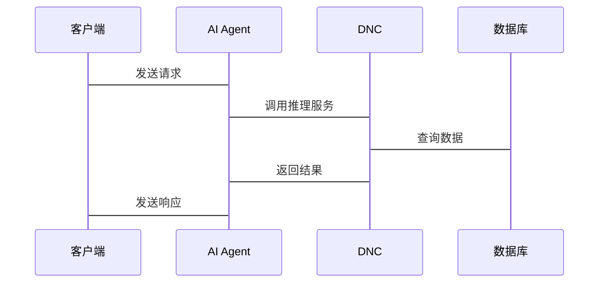

                 


# AI Agent的可微分神经计算机：增强记忆与推理能力

## 关键词：AI Agent, 可微分神经计算机, 记忆, 推理, 人工智能, 神经网络

## 摘要：AI Agent通过结合可微分神经计算机，能够显著提升其记忆和推理能力。本文详细探讨了AI Agent的基本原理、可微分神经计算机的结构与优势，以及如何通过数学模型和算法优化来增强这些能力。文章还通过实际案例和系统设计展示了这些技术在现实中的应用，最后总结了最佳实践和未来发展方向。

---

## 第一部分: AI Agent与可微分神经计算机的背景介绍

### 第1章: AI Agent的发展历程

#### 1.1 从传统AI到现代AI Agent的演进
传统的AI系统通常基于规则和逻辑推理，但在处理复杂、动态的现实世界问题时显得力不从心。AI Agent的出现，将感知、决策和行动融为一体，使其能够适应不断变化的环境。

#### 1.2 可微分神经计算机的起源与现状
可微分神经计算机（DNC）结合了神经网络的灵活性和符号推理的逻辑性，最初由DeepMind提出，现已被广泛应用于需要记忆和推理的任务。

#### 1.3 增强记忆与推理能力的必要性
在处理复杂任务时，AI Agent需要记住过去的交互和环境信息，并能够基于这些信息进行推理。这使得DNC成为提升AI Agent能力的关键技术。

---

### 第2章: 可微分神经计算机的核心概念

#### 2.1 可微分神经计算机的定义
DNC通过可微分的内存结构，使神经网络能够直接优化符号推理过程，从而在保持符号推理的逻辑性的同时，利用神经网络的强大表示能力。

#### 2.2 可微分神经计算机的结构与特点
DNC由两部分组成：控制网络和内存银行。控制网络负责生成操作内存的命令，内存银行负责存储和检索信息。

#### 2.3 可微分神经计算机与传统神经网络的区别
| 特性               | DNC                | 传统神经网络       |
|--------------------|--------------------|--------------------|
| 内存结构           | 可微分内存银行     | 无固定内存结构     |
| 推理能力           | 强符号推理能力     | 弱符号推理能力     |
| 应用场景           | 需要记忆和推理的任务 | 无需记忆的任务     |

---

## 第二部分: AI Agent与可微分神经计算机的核心概念

### 第3章: AI Agent的核心原理

#### 3.1 AI Agent的基本原理
AI Agent通过感知环境、处理信息、制定决策并执行行动来实现目标。其核心能力包括感知、推理、决策和行动。

#### 3.2 可微分神经计算机的原理
DNC通过控制网络生成操作内存的命令，并通过内存银行存储和检索信息。其推理过程基于符号逻辑和神经网络的非线性表示能力。

#### 3.3 AI Agent与可微分神经计算机的结合
AI Agent通过DNC实现增强的记忆和推理能力，使其能够更好地处理复杂任务。

---

### 第4章: 可微分神经计算机的数学模型

#### 4.1 DNC的基本数学模型
DNC的控制网络通过生成操作向量来操作内存银行。数学模型如下：
$$
\text{操作向量} = \sigma(W_c \cdot h)
$$
其中，$W_c$是控制网络的权重，$h$是当前状态，$\sigma$是激活函数。

#### 4.2 DNC的记忆机制
DNC的内存银行通过读写头进行操作，每个读写头都有一个权重向量，用于选择性地读取和写入内存。

#### 4.3 DNC的推理机制
DNC的推理过程通过控制网络生成操作命令，并通过内存银行进行信息存储和检索。

---

## 第三部分: 系统架构与项目实战

### 第5章: 系统架构设计

#### 5.1 问题场景介绍
设计一个AI Agent，能够通过DNC进行对话，记住上下文信息并进行推理。

#### 5.2 系统功能设计
使用Mermaid类图展示系统功能设计：


#### 5.3 系统架构设计
使用Mermaid架构图展示系统架构：


#### 5.4 系统接口设计
系统接口包括：
- 客户端接口：发送请求和接收响应
- AI Agent接口：处理请求并调用DNC进行推理
- DNC接口：提供记忆和推理服务

#### 5.5 系统交互流程
使用Mermaid序列图展示系统交互流程：


---

### 第6章: 项目实战

#### 6.1 环境安装
需要安装以下库：
- TensorFlow或PyTorch
- Mermaid图生成工具

#### 6.2 核心代码实现
以下是一个简单的DNC实现示例：
```python
import tensorflow as tf

class DNC:
    def __init__(self, memory_size, word_size):
        self.memory = tf.zeros([memory_size, word_size])
        self.controller = SimpleRNN(word_size)
    
    def read(self, key):
        # 计算读取权重
        weights = tf.nn.softmax(self.controller.output)
        # 加权求和
        read_value = tf.reduce_sum(self.memory * weights, axis=1)
        return read_value
    
    def write(self, key, value):
        # 计算写入权重
        write_weights = tf.nn.softmax(self.controller.output)
        # 更新内存
        self.memory = self.memory * (1 - write_weights) + value * write_weights
```

#### 6.3 案例分析与详细解读
通过一个简单的对话系统案例，展示DNC如何增强AI Agent的记忆和推理能力。

---

## 第四部分: 最佳实践与总结

### 第7章: 最佳实践

#### 7.1 小结
通过结合AI Agent和DNC，可以显著提升系统的记忆和推理能力。

#### 7.2 注意事项
- 确保内存结构的设计能够高效存储和检索信息
- 在实际应用中，需要根据任务需求调整DNC的参数

#### 7.3 拓展阅读
推荐阅读相关论文和文献，深入理解DNC的原理和应用。

---

## 作者：AI天才研究院 & 禅与计算机程序设计艺术

---

通过本文，读者可以全面了解AI Agent与可微分神经计算机的基本原理、算法实现和系统设计，为实际应用提供理论基础和实践指导。

