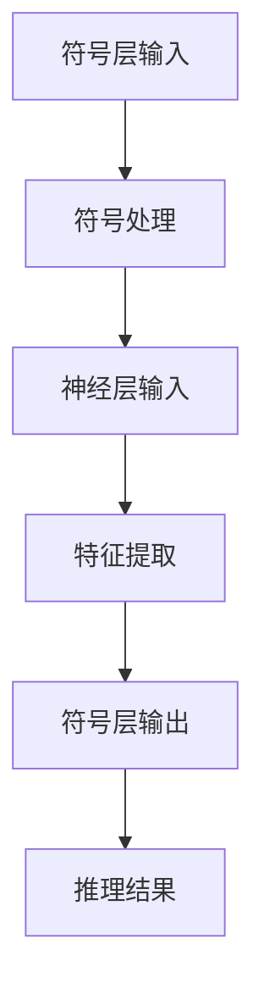
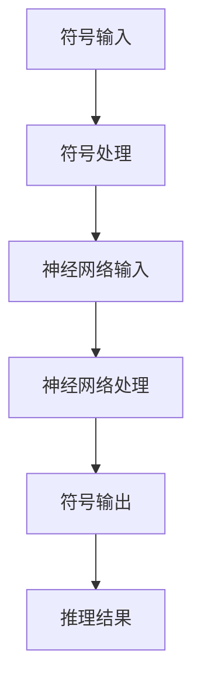
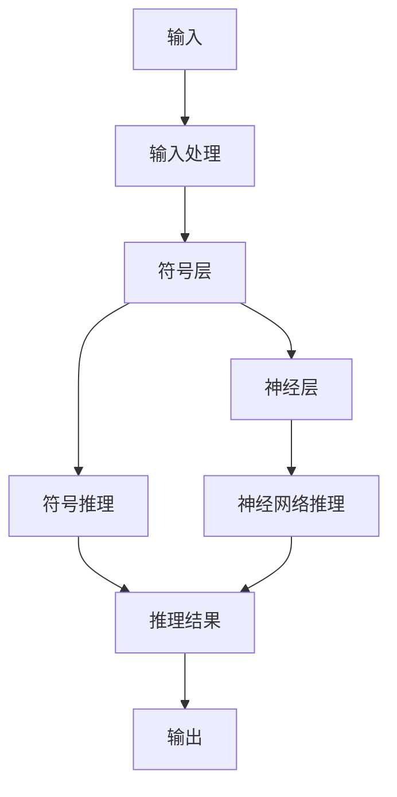

                 


# AI Agent的可微分神经计算机：增强记忆能力

> 关键词：AI Agent，可微分神经计算机，记忆增强，神经网络，符号推理

> 摘要：本文探讨了AI Agent如何通过可微分神经计算机技术增强其记忆能力。我们首先介绍了AI Agent的基本概念和可微分神经计算机的核心原理，随后详细分析了记忆机制的对比与优化策略，最后通过实际案例展示了如何设计和实现一个具备增强记忆能力的AI Agent系统。文章内容涵盖理论基础、算法原理、系统架构和项目实战，旨在为读者提供全面的技术指导。

---

## 第一部分：AI Agent与可微分神经计算机的背景介绍

### 第1章：AI Agent的基本概念

#### 1.1 AI Agent的定义与特点
- **1.1.1 AI Agent的定义**  
  AI Agent（人工智能代理）是指能够感知环境、自主决策并执行任务的智能实体。它能够通过与环境交互来实现特定目标，具备学习、推理和自适应能力。

- **1.1.2 AI Agent的核心特点**  
  - **自主性**：AI Agent能够在没有外部干预的情况下独立运作。  
  - **反应性**：能够实时感知环境变化并做出响应。  
  - **目标导向性**：通过目标驱动来优化决策和行动。  
  - **学习能力**：能够通过经验改进性能。  

- **1.1.3 AI Agent与传统AI的区别**  
  传统AI依赖预定义规则，而AI Agent具备自主性和适应性，能够动态调整策略以应对复杂环境。

#### 1.2 可微分神经计算机的基本概念
- **1.2.1 可微分神经计算机的定义**  
  可微分神经计算机是一种结合了神经网络和符号推理的混合模型，通过可微分编程技术实现端到端的学习与推理。  

- **1.2.2 与传统神经网络的对比**  
  传统神经网络擅长模式识别和预测，但缺乏对符号逻辑和规则的处理能力。可微分神经计算机通过结合符号推理，弥补了这一不足，能够处理复杂的知识表示和推理任务。

- **1.2.3 可微分神经计算机在AI Agent中的作用**  
  通过增强记忆和推理能力，可微分神经计算机使AI Agent能够更好地处理动态环境中的任务，如对话、规划和决策支持。

---

### 第2章：AI Agent的记忆机制与挑战

#### 2.1 AI Agent的记忆机制
- **符号记忆**：基于规则和符号表示，适用于逻辑推理和符号操作。  
- **神经网络记忆**：基于深度学习，擅长模式识别和非结构化数据处理。  
- **混合记忆**：结合符号和神经网络的优势，适用于复杂场景。  

#### 2.2 AI Agent记忆机制的对比
| 特性         | 符号记忆     | 神经网络记忆 | 混合记忆       |
|--------------|--------------|--------------|----------------|
| 表达能力     | 高           | 中           | 高             |
| 训练难度     | 低           | 高           | 中             |
| 适应性       | 低           | 高           | 高             |
| 适用场景     | 逻辑推理     | 模式识别     | 复杂场景       |

#### 2.3 可微分神经计算机的优势
- **可微分性**：支持端到端的梯度计算，能够与深度学习框架无缝结合。  
- **符号与神经网络的结合**：兼顾逻辑推理和模式识别能力。  
- **动态记忆**：能够实时更新和调整记忆内容，适应变化的环境。  

#### 2.4 AI Agent记忆能力的挑战
- **信息碎片化**：如何处理多源异构数据。  
- **推理复杂性**：复杂场景下的推理效率问题。  
- **实时性要求**：动态环境中的快速响应需求。  

---

### 第3章：可微分神经计算机的核心原理

#### 3.1 可微分神经计算机的模型结构
- **符号层**：处理符号逻辑和规则推理。  
- **神经层**：负责模式识别和特征提取。  
- **连接层**：通过可微分接口实现符号层与神经层的协同工作。  

#### 3.2 可微分编程的关键技术
- **符号表示**：通过符号化数据表示，增强模型的可解释性。  
- **可微分接口**：设计可微分的接口，实现符号与神经网络的混合计算。  
- **端到端优化**：通过梯度回传优化整个模型的性能。  

#### 3.3 可微分神经计算机的计算流程


---

## 第二部分：核心概念与联系

### 第4章：可微分神经计算机的记忆机制

#### 4.1 内存模型的设计
- **基于神经网络的内存模型**：如LSTM和Transformer中的记忆机制。  
- **符号化内存模型**：基于规则和符号的存储与检索。  
- **混合内存模型**：结合符号和神经网络的优缺点，实现更强大的记忆能力。  

#### 4.2 可微分神经计算机的记忆优化策略
- **动态记忆分配**：根据任务需求动态调整记忆容量。  
- **记忆内容压缩**：通过压缩技术减少存储空间占用。  
- **记忆内容的关联性学习**：通过学习关联性提高记忆的检索效率。  

#### 4.3 可微分神经计算机的记忆特征对比
| 特性         | 符号记忆       | 神经网络记忆   | 混合记忆         |
|--------------|----------------|----------------|------------------|
| 记忆容量     | 小             | 大             | 可调节           |
| 记忆速度     | 快             | 中             | 高               |
| 记忆准确性   | 高             | 中             | 高               |
| 适应性       | 低             | 高             | 高               |

---

### 第5章：可微分神经计算机的推理机制

#### 5.1 推理过程的符号化表示
- **符号化规则**：通过符号逻辑表示推理规则。  
- **符号化推理**：基于符号逻辑进行推理。  
- **符号化与神经网络的结合**：通过可微分接口实现符号推理与神经网络推理的协同。  

#### 5.2 神经符号推理模型
- **神经符号推理的定义**：将符号推理与神经网络推理相结合，实现端到端的学习与推理。  
- **神经符号推理的优势**：兼顾符号推理的可解释性和神经网络推理的泛化能力。  

#### 5.3 神经符号推理的计算流程


---

## 第三部分：算法原理

### 第6章：可微分神经计算机的算法实现

#### 6.1 Delta Memory机制
- **Delta Memory的定义**：一种基于差异的内存更新机制，用于动态调整记忆内容。  
- **Delta Memory的数学模型**：
  $$
  \Delta m_t = \sigma(W_m h_t + b_m)
  $$
  其中，$h_t$ 是当前状态，$W_m$ 是权重矩阵，$b_m$ 是偏置，$\sigma$ 是激活函数。  
- **Delta Memory的实现步骤**：
  1. 计算当前状态$h_t$。  
  2. 通过权重矩阵和偏置计算$\Delta m_t$。  
  3. 更新记忆内容$m_{t+1} = m_t + \Delta m_t$。  

#### 6.2 神经符号推理模型
- **神经符号推理的实现流程**：
  1. 将符号输入转换为神经网络可处理的形式。  
  2. 神经网络进行特征提取和表示学习。  
  3. 符号层进行逻辑推理和规则应用。  
  4. 神经网络层生成最终输出。  

#### 6.3 算法实现的代码示例
```python
import torch
import torch.nn as nn

class DeltaMemory(nn.Module):
    def __init__(self, input_dim, hidden_dim):
        super(DeltaMemory, self).__init__()
        self.W_m = nn.Parameter(torch.randn(input_dim, hidden_dim))
        self.b_m = nn.Parameter(torch.randn(hidden_dim))
    
    def forward(self, h_t):
        delta_m = torch.sigmoid(torch.mm(h_t, self.W_m) + self.b_m)
        return delta_m

# 示例使用
input_dim = 10
hidden_dim = 5
delta_memory = DeltaMemory(input_dim, hidden_dim)
h_t = torch.randn(1, input_dim)
output = delta_memory(h_t)
print(output.size())  # 输出形状为 (1, 5)
```

---

## 第四部分：系统分析与架构设计

### 第7章：可微分神经计算机的系统架构

#### 7.1 应用场景分析
- **对话系统**：通过增强记忆能力提高对话的连贯性。  
- **智能规划**：基于动态记忆进行任务规划。  
- **决策支持**：结合符号推理和神经网络推理提供决策支持。  

#### 7.2 系统功能设计
| 功能模块     | 描述                     |
|--------------|--------------------------|
| 输入处理     | 接收输入并进行预处理     |
| 符号层       | 处理符号逻辑和规则       |
| 神经层       | 进行特征提取和表示学习     |
| 推理层       | 结合符号和神经网络推理     |
| 输出处理     | 生成最终输出并反馈环境     |

#### 7.3 系统架构设计


---

## 第五部分：项目实战

### 第8章：可微分神经计算机的项目实现

#### 8.1 环境安装
- **安装Python和PyTorch**：
  ```bash
  conda install pytorch torchvision torchaudio -c nvidia
  ```

- **安装其他依赖**：
  ```bash
  pip install numpy matplotlib mermaid.py
  ```

#### 8.2 核心代码实现
```python
import torch
import torch.nn as nn
import torch.optim as optim

class DifferentialNeuralComputer(nn.Module):
    def __init__(self, input_dim, hidden_dim):
        super(DifferentialNeuralComputer, self).__init__()
        self.input_dim = input_dim
        self.hidden_dim = hidden_dim
        self.W = nn.Parameter(torch.randn(input_dim, hidden_dim))
        self.b = nn.Parameter(torch.randn(hidden_dim))
    
    def forward(self, x):
        h = torch.mm(x, self.W) + self.b
        return h

# 初始化模型和优化器
model = DifferentialNeuralComputer(input_dim=10, hidden_dim=5)
optimizer = optim.SGD(model.parameters(), lr=0.1)

# 示例训练
x = torch.randn(1, 10)
output = model(x)
loss = torch.mean(output**2)
loss.backward()
optimizer.step()
```

#### 8.3 代码解读与分析
- **模型定义**：定义了一个简单的可微分神经计算机模型，包含输入层和隐藏层。  
- **前向传播**：通过矩阵乘法和偏置计算隐藏层输出。  
- **反向传播**：通过梯度下降优化模型参数。  

---

## 第六部分：总结与展望

### 第9章：总结与展望

#### 9.1 最佳实践
- **模型优化**：合理设计模型结构，选择合适的优化算法。  
- **数据处理**：确保数据的多样性和代表性。  
- **推理优化**：通过符号化和神经网络的结合提升推理效率。  

#### 9.2 小结
可微分神经计算机通过结合符号推理和神经网络推理，显著增强了AI Agent的记忆和推理能力。这种技术在对话系统、智能规划和决策支持等领域具有广阔的应用前景。

#### 9.3 注意事项
- **模型复杂性**：混合模型的计算复杂性较高，需要优化算法和硬件支持。  
- **数据依赖性**：模型性能依赖于高质量的数据，需要谨慎处理数据预处理。  
- **可解释性**：混合模型的可解释性较低，需要进一步研究解决。  

#### 9.4 未来展望
- **更复杂的推理任务**：探索更复杂的符号推理和神经网络推理的结合方式。  
- **边缘计算应用**：将可微分神经计算机应用于边缘计算，提升实时性。  
- **多模态数据处理**：研究可微分神经计算机在多模态数据处理中的应用。  

---

## 作者：AI天才研究院 & 禅与计算机程序设计艺术

