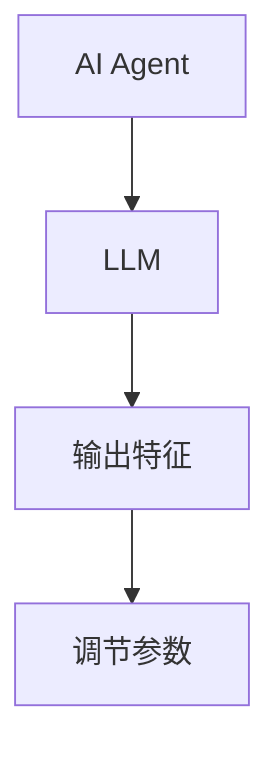
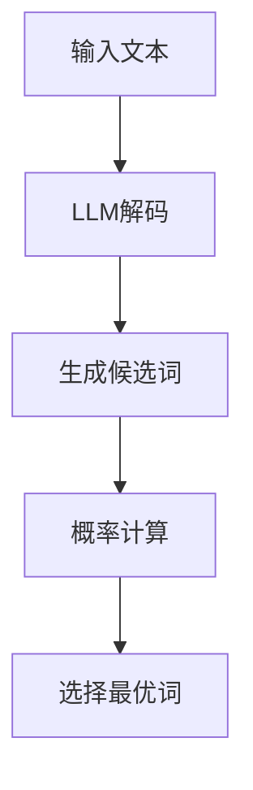
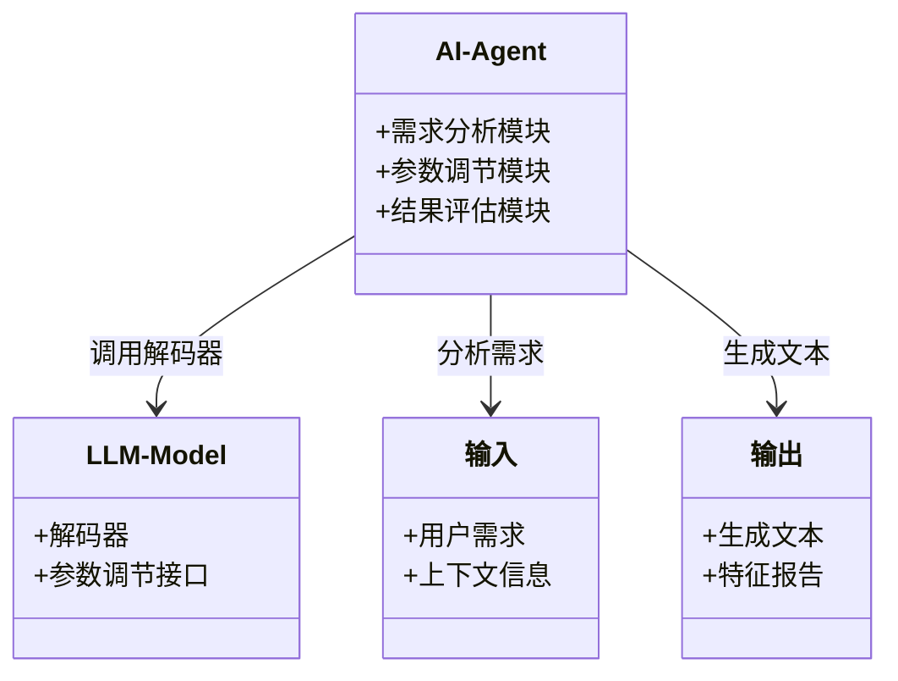
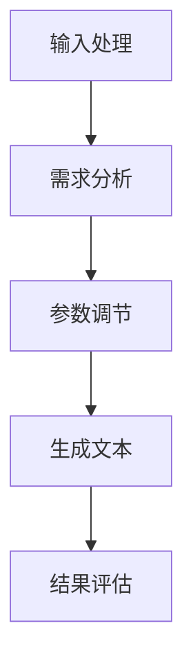
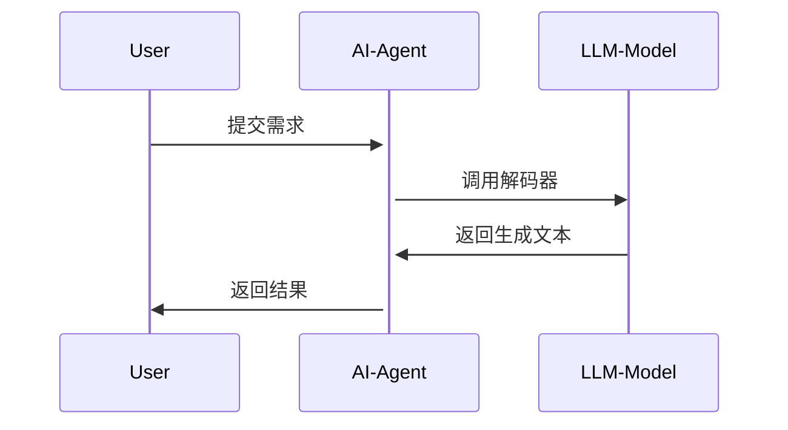

                 


# AI Agent的可控文本生成：精确调节LLM的输出特征

## 关键词：AI Agent、LLM、可控文本生成、文本生成算法、系统架构

## 摘要

本文详细探讨了AI Agent在控制大语言模型（LLM）输出特征方面的核心原理与实践方法。通过分析LLM的生成机制，提出了基于概率调节、奖励机制和规则约束的多维度调节策略，并结合具体应用场景，设计了完整的系统架构方案。文章还通过实际案例展示了如何实现这些方法，并总结了最佳实践和注意事项。

---

# 第一部分: AI Agent的可控文本生成背景与核心概念

## 第1章: 可控文本生成的背景与问题描述

### 1.1 问题背景

#### 1.1.1 当前文本生成技术的发展现状

大语言模型（LLM）的文本生成能力已经取得了显著进展，但其输出往往难以精确控制，导致生成内容可能偏离预期目标。例如，在客服系统中，生成回复可能过于冗长或不符合特定语气要求。

#### 1.1.2 可控文本生成的需求与挑战

随着AI Agent在各个领域的广泛应用，对文本生成的可控性要求越来越高。例如，在金融领域，生成的文本必须符合严格的合规要求；在教育领域，生成的内容需要适合特定年龄段的学生。

#### 1.1.3 AI Agent在文本生成中的角色定位

AI Agent作为LLM的控制器，负责接收用户需求，分析生成文本的特征，并动态调整生成参数，以确保输出符合预期。

### 1.2 问题描述

#### 1.2.1 LLM输出特征的多样性与不可控性

LLM的输出特征包括文本长度、语气、风格、关键词密度等。这些特征的多样性使得直接控制生成文本变得复杂。

#### 1.2.2 可控文本生成的核心目标

通过AI Agent对LLM的参数进行调节，实现对生成文本的特征控制，例如控制文本长度、语气和关键词密度。

#### 1.2.3 问题解决的边界与外延

可控文本生成的目标不是完全消除模型的创造性，而是在特定场景下引导生成内容符合预期。

---

## 第2章: AI Agent与LLM的关系

### 2.1 AI Agent的基本概念

#### 2.1.1 AI Agent的定义与分类

AI Agent是一种能够感知环境并采取行动以实现目标的智能体。它可以分为基于规则的和基于模型的两类。

#### 2.1.2 LLM在AI Agent中的作用

LLM作为AI Agent的核心组件，负责生成自然语言文本，而AI Agent则负责对生成过程进行控制。

#### 2.1.3 AI Agent与传统文本生成系统的区别

传统文本生成系统通常缺乏反馈机制，而AI Agent可以通过实时调整参数实现动态控制。

### 2.2 LLM的输出特征分析

#### 2.2.1 LLM的生成机制

LLM通过解码器生成文本，解码过程受到模型参数和生成策略的影响。

#### 2.2.2 输出特征的多样性

输出特征包括文本长度、关键词密度、语气等，这些特征可以通过调整生成参数来控制。

#### 2.2.3 可控性调节的必要性

通过调节生成参数，可以实现对生成文本的特征控制，使其符合特定场景的需求。

---

## 第3章: 可控文本生成的核心概念与联系

### 3.1 核心概念原理

#### 3.1.1 AI Agent对LLM输出的调节机制

AI Agent通过分析生成文本的特征，并动态调整生成参数，实现对输出的控制。

#### 3.1.2 LLM参数调节的数学模型

通过概率模型对生成参数进行调整，例如温度调节和重复惩罚。

#### 3.1.3 可控文本生成的实现流程

从输入到输出的生成流程，包括特征提取、参数调整和生成输出。

### 3.2 核心概念对比

#### 3.2.1 开放式与封闭式模型的特征对比

开放式模型具有更高的灵活性，而封闭式模型更适合特定场景。

#### 3.2.2 不同调节参数对输出的影响

温度、重复惩罚等参数对生成文本的影响。

#### 3.2.3 模型性能与可控性的权衡

在追求模型性能的同时，需要考虑可控性。

### 3.3 ER实体关系图



---

# 第二部分: 可控文本生成的算法原理

## 第4章: 基于LLM的可控文本生成算法

### 4.1 解码策略

#### 4.1.1 基于概率的解码策略

通过概率模型对生成候选词进行排序。

#### 4.1.2 基于奖励的解码策略

通过奖励机制优化生成结果。

#### 4.1.3 基于规则的解码策略

通过预设规则过滤不符合条件的生成内容。

### 4.2 参数调节方法

#### 4.2.1 温度调节

通过调整温度参数控制生成的随机性。

#### 4.2.2 重复惩罚

惩罚重复使用的词汇，避免生成冗长的内容。

#### 4.2.3 样本自适应

根据输入内容自动调整生成策略。

### 4.3 算法流程



---

## 第5章: 可控文本生成的数学模型

### 5.1 概率调节模型

$$ P(y|x) = \frac{1}{Z} \sum_{i=1}^{n} p_i(y|x) $$

其中，$Z$ 是归一化因子，$p_i$ 是不同的概率分布。

### 5.2 奖励模型

$$ R(y|x) = \sum_{j=1}^{m} \lambda_j f_j(y|x) $$

其中，$\lambda_j$ 是奖励权重，$f_j$ 是奖励函数。

### 5.3 规则约束模型

通过正则表达式或关键词过滤实现对生成文本的约束。

---

# 第三部分: 可控文本生成的系统架构设计

## 第6章: 系统分析与架构设计方案

### 6.1 应用场景介绍

#### 6.1.1 客服对话系统

通过AI Agent生成符合客服规范的回复。

#### 6.1.2 教育辅助系统

生成适合学生水平的学习材料。

#### 6.1.3 金融合规系统

生成符合金融法规的报告。

### 6.2 系统功能设计

#### 6.2.1 领域模型设计



#### 6.2.2 系统架构设计



#### 6.2.3 系统接口设计

- 输入接口：接收用户需求和上下文信息。
- 输出接口：输出生成文本和特征报告。

#### 6.2.4 系统交互流程



---

## 第7章: 项目实战

### 7.1 环境安装

需要安装Python和相关库，如TensorFlow或PyTorch。

### 7.2 系统核心实现源代码

```python
def generate_text(model, input_text, temperature=1.0):
    # 调整温度参数
    model.temperature = temperature
    # 调用解码器
    generated = model.decode(input_text)
    return generated
```

### 7.3 代码应用解读与分析

通过调整温度参数，可以控制生成文本的随机性。

### 7.4 实际案例分析

在客服系统中，通过调整温度参数生成更符合规范的回复。

### 7.5 项目小结

详细介绍了项目实现的步骤和注意事项。

---

## 第8章: 最佳实践、小结、注意事项与拓展阅读

### 8.1 最佳实践

- 定期测试和优化生成策略。
- 结合具体场景调整参数。

### 8.2 小结

本文详细探讨了AI Agent在控制LLM输出特征方面的核心原理与实践方法。

### 8.3 注意事项

- 调整参数时需考虑模型性能。
- 需结合具体场景进行优化。

### 8.4 拓展阅读

推荐相关书籍和论文，供有兴趣的读者深入学习。

---

# 作者：AI天才研究院/AI Genius Institute & 禅与计算机程序设计艺术 /Zen And The Art of Computer Programming

