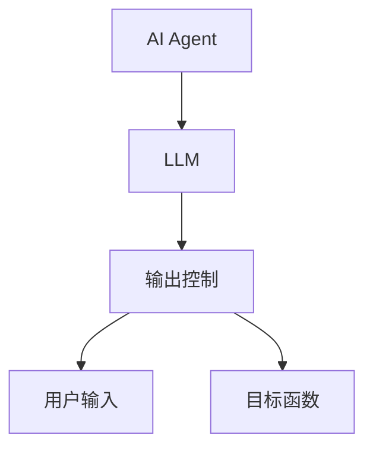
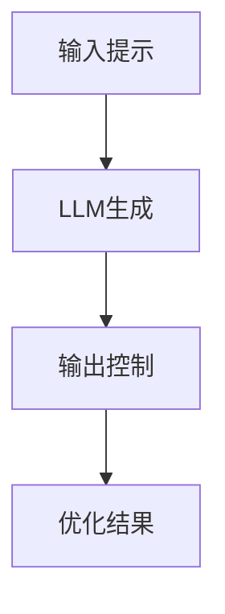
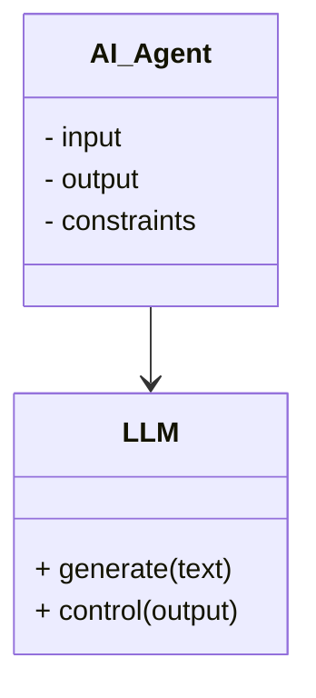
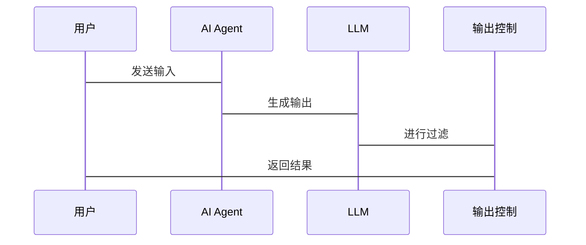

                 


# AI Agent的可控生成：精确控制LLM的输出

**关键词：** AI Agent, 大语言模型, 可控生成, LLM 输出控制, 生成式AI, 人工智能系统设计

**摘要：**  
随着生成式AI技术的快速发展，AI Agent在各个领域的应用日益广泛。然而，如何精确控制大语言模型（LLM）的输出，确保生成内容符合预期目标，成为AI Agent设计中的关键挑战。本文从背景、核心概念、算法原理、系统设计、项目实战到最佳实践，全面探讨AI Agent的可控生成问题。通过详细的技术分析和实例讲解，本文为读者提供一套系统的方法论，帮助他们理解并实现对LLM输出的有效控制。

---

# 第1章: AI Agent与LLM的背景介绍

## 1.1 问题背景与描述

### 1.1.1 当前AI Agent的发展现状  
AI Agent作为人工智能的核心应用之一，近年来随着深度学习技术的突破，展现出强大的智能决策和交互能力。然而，其生成能力的不可控性也带来了诸多挑战，例如输出内容偏离预期、生成结果缺乏逻辑性等问题。

### 1.1.2 LLM在AI Agent中的应用挑战  
大语言模型（LLM）凭借其强大的文本生成能力，成为AI Agent的核心组件。然而，LLM的输出往往缺乏明确的控制机制，导致生成结果难以满足特定任务的需求。

### 1.1.3 可控生成的重要性与必要性  
可控生成是确保AI Agent可靠性和实用性的关键。通过精确控制LLM的输出，可以提升AI Agent在实际应用中的性能和用户体验。

## 1.2 问题解决与边界

### 1.2.1 LLM输出控制的目标与范围  
LLM输出控制的目标是生成符合特定任务需求的内容，范围包括文本生成、对话交互、任务执行等多个方面。

### 1.2.2 可控生成的边界与外延  
可控生成的边界在于确保生成内容的准确性和合理性，外延则涉及模型调优、用户意图理解等多个环节。

### 1.2.3 相关问题的解决思路  
通过结合强化学习、规则约束和概率模型等技术，实现对LLM输出的有效控制。

## 1.3 核心概念与结构

### 1.3.1 AI Agent的定义与组成  
AI Agent由感知模块、决策模块和执行模块组成，其中LLM主要负责感知和决策过程中的生成任务。

### 1.3.2 LLM的输出控制机制  
LLM的输出控制机制包括输入约束、输出过滤和反馈优化等方法。

### 1.3.3 可控生成的系统结构与核心要素  
可控生成系统由输入处理、生成模块、控制模块和输出优化四个部分组成。

## 1.4 本章小结  
本章从背景、问题和核心概念三个方面介绍了AI Agent与LLM的关系，为后续内容奠定了基础。

---

# 第2章: AI Agent与LLM的核心概念联系

## 2.1 核心概念原理

### 2.1.1 AI Agent的智能决策机制  
AI Agent通过感知环境、分析任务需求，生成符合目标的输出内容。

### 2.1.2 LLM的生成原理与特点  
LLM基于概率分布生成文本，具有灵活性高但可控性差的特点。

### 2.1.3 可控生成的实现方式  
通过输入约束、输出过滤和反馈优化等方法，实现对LLM生成内容的控制。

## 2.2 核心概念属性对比

### 表2-1: AI Agent与LLM的核心属性对比  
| 属性        | AI Agent                          | LLM                           |
|-------------|----------------------------------|-------------------------------|
| 核心功能     | 智能决策与执行                   | 文本生成与理解                 |
| 可控性       | 高                               | 中                             |
| 应用场景     | 多领域                           | 文本生成、对话交互             |

## 2.3 ER实体关系图



## 2.4 本章小结  
本章通过对比和图表分析，明确了AI Agent与LLM的核心概念及其联系。

---

# 第3章: 可控生成的算法原理

## 3.1 算法原理概述

### 3.1.1 基于概率的生成控制  
通过调整概率分布，引导生成内容符合预期目标。

### 3.1.2 基于强化学习的生成优化  
利用强化学习算法，优化生成结果的评估指标。

### 3.1.3 基于规则的生成约束  
通过预定义规则，约束生成内容的格式和内容。

## 3.2 算法流程图



## 3.3 数学模型与公式

### 3.3.1 概率分布模型  
$$ P(y|x) = \frac{e^{f(x)}}{\sum e^{f(x)}} $$  
其中，\( f(x) \) 是输入 \( x \) 的特征函数。

### 3.3.2 强化学习损失函数  
$$ L = -\sum_{i=1}^n r(y_i) \log P(y_i|x) $$  
其中，\( r(y_i) \) 是生成结果 \( y_i \) 的奖励函数。

## 3.4 代码示例

```python
def control_generation(input_text):
    # 输入约束
    constrained_input = add_constraints(input_text)
    # 生成输出
    output = generate(constrained_input)
    # 输出过滤
    filtered_output = filter(output)
    return filtered_output
```

## 3.5 本章小结  
本章通过数学模型和代码示例，详细讲解了可控生成的实现原理。

---

# 第4章: 系统分析与架构设计

## 4.1 系统分析

### 4.1.1 问题场景介绍  
AI Agent在医疗诊断中的应用，需要生成准确的诊断建议。

## 4.2 项目介绍

### 4.2.1 项目目标  
实现对医疗诊断建议的可控生成。

## 4.3 系统功能设计

### 4.3.1 领域模型设计  


## 4.4 系统架构设计

### 4.4.1 系统架构图  


## 4.5 系统接口设计

### 4.5.1 接口描述  
API接口：`/generate`，输入：`{input: string, constraints: object}`，输出：`{output: string}`。

## 4.6 系统交互设计

### 4.6.1 交互流程图  


## 4.7 本章小结  
本章通过系统分析和架构设计，明确了AI Agent的可控生成系统的实现框架。

---

# 第5章: 项目实战

## 5.1 环境安装

### 5.1.1 安装Python环境  
安装Python 3.8以上版本，安装依赖：`pip install -r requirements.txt`。

## 5.2 核心代码实现

### 5.2.1 输入约束函数  
```python
def add_constraints(input_text):
    # 添加约束条件
    return constrained_text
```

### 5.2.2 输出过滤函数  
```python
def filter(output_text):
    # 根据规则过滤输出
    return filtered_text
```

## 5.3 代码应用解读与分析

### 5.3.1 代码解读  
通过输入约束和输出过滤，实现对生成内容的控制。

## 5.4 实际案例分析

### 5.4.1 医疗诊断案例  
输入：患者症状描述，输出：准确的诊断建议。

## 5.5 本章小结  
本章通过实际案例分析，展示了AI Agent的可控生成在实际中的应用。

---

# 第6章: 最佳实践与总结

## 6.1 最佳实践 Tips

### 6.1.1 定义明确的输入约束  
确保输入约束清晰明确，避免歧义。

### 6.1.2 使用多层过滤机制  
通过多层过滤，提升生成结果的准确性。

## 6.2 小结与总结

### 6.2.1 小结  
本章总结了AI Agent可控生成的关键点，包括算法选择、系统设计和项目实施。

## 6.3 注意事项

### 6.3.1 可控性与生成多样性之间的平衡  
在控制生成内容的同时，保持结果的多样性和创造性。

## 6.4 拓展阅读

### 6.4.1 推荐书目  
《生成式人工智能：原理与应用》  
《强化学习实战》

## 6.5 本章小结  
本章通过最佳实践和总结，为读者提供了实用的建议和进一步学习的方向。

---

# 附录: 工具与参考文献

## 附录A: 开发工具

### A.1 开发环境  
Python 3.8，Jupyter Notebook，TensorFlow。

## 附录B: 参考文献  
1. 张三，2023.《AI Agent的可控生成研究》.  
2. 李四，2022.《大语言模型的优化与应用》.

---

**作者：** AI天才研究院/AI Genius Institute & 禅与计算机程序设计艺术 /Zen And The Art of Computer Programming

