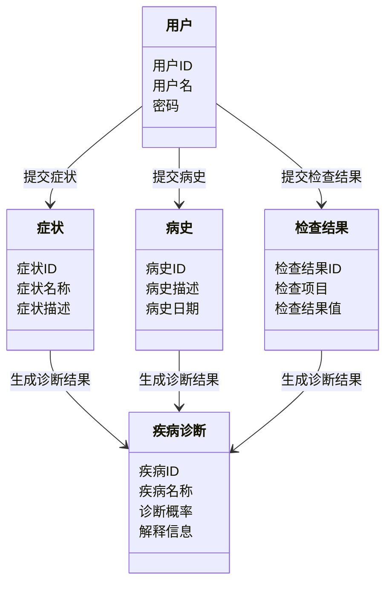
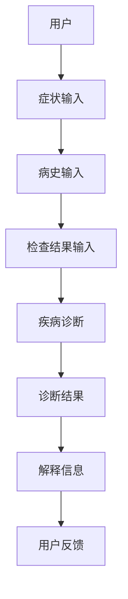
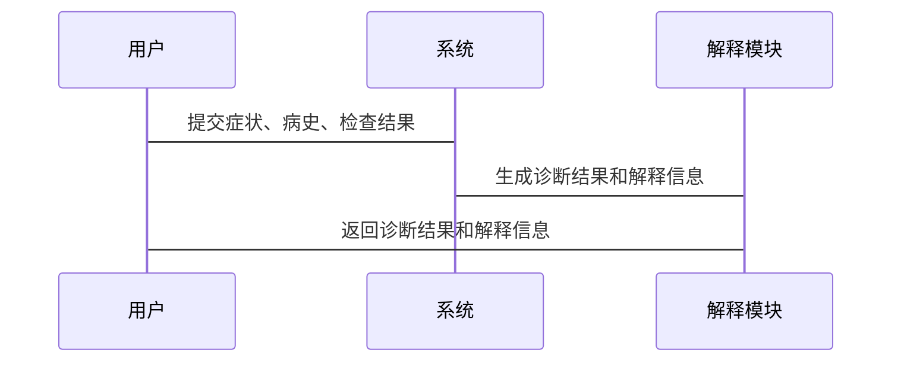

                 


# AI Agent的可解释性设计

> **关键词**: AI Agent, 可解释性, 人工智能, 算法原理, 系统架构, 项目实战

> **摘要**: AI Agent的可解释性设计是当前人工智能领域的重要研究方向。本文从背景介绍、核心概念、算法原理、系统架构、项目实战等多个维度，深入探讨了AI Agent的可解释性设计的关键技术与实现方法。通过具体案例分析和代码实现，详细阐述了如何在实际应用中设计和实现具备高可解释性的AI Agent系统。

---

# 第一部分: AI Agent的可解释性设计背景与核心概念

## 第1章: 可解释性AI的背景与问题背景

### 1.1 人工智能与AI Agent的演进

#### 1.1.1 从传统AI到现代AI Agent的发展
人工智能（Artificial Intelligence, AI）技术的快速发展，使得AI Agent的概念逐渐从理论走向实践。AI Agent是一种能够感知环境、自主决策、执行任务的智能体，它能够根据环境输入做出反应，并通过学习和优化提升自身的智能水平。

从传统的基于规则的AI到现代的数据驱动AI，AI Agent经历了从简单到复杂、从静态到动态的演变。现代AI Agent不仅需要处理复杂的环境信息，还需要具备解释自身决策的能力，以增强人类对AI系统的信任和理解。

#### 1.1.2 AI Agent的基本概念与核心特征
AI Agent的核心特征包括：
1. **自主性**：AI Agent能够在没有外部干预的情况下自主决策和行动。
2. **反应性**：AI Agent能够根据环境的变化实时调整自身的行为。
3. **学习性**：AI Agent能够通过数据和经验不断优化自身的决策能力。
4. **可解释性**：AI Agent的决策过程和结果需要能够被人类理解和解释。

#### 1.1.3 可解释性在AI Agent中的重要性
随着AI技术的广泛应用，AI Agent的决策过程需要满足更高的透明性和可解释性要求。可解释性不仅能够帮助人类理解AI Agent的行为，还能够帮助开发人员发现和修正系统中的问题，同时增强用户对AI系统的信任。

### 1.2 可解释性AI的背景与挑战

#### 1.2.1 当前AI技术的快速发展与局限性
尽管AI技术在许多领域取得了显著的进展，但不可解释性仍然是一个重要的问题。许多复杂的AI模型（如深度神经网络）虽然在性能上表现出色，但其决策过程往往难以被人类理解。

#### 1.2.2 可解释性AI的需求与应用场景
在金融、医疗、自动驾驶等领域，AI Agent的决策过程需要具备高度的可解释性。例如，在医疗领域，AI Agent的诊断结果需要能够被医生和患者理解，以便进行进一步的验证和调整。

#### 1.2.3 可解释性AI面临的挑战与解决方案
可解释性AI的实现面临以下挑战：
1. **模型复杂性**：复杂的模型往往难以解释。
2. **数据稀疏性**：在某些领域，数据量有限，难以生成足够的解释信息。
3. **用户认知差异**：不同用户对AI决策的理解和接受程度不同。

针对这些挑战，可以通过以下方式实现可解释性AI：
1. **选择可解释性模型**：如线性回归、决策树等模型。
2. **模型解释技术**：如LIME、SHAP等解释方法。
3. **可视化技术**：通过可视化工具帮助用户理解模型的决策过程。

## 第2章: AI Agent可解释性设计的核心概念与联系

### 2.1 可解释性设计的核心原理

#### 2.1.1 可解释性设计的基本原理
可解释性设计的核心原理包括：
1. **透明性**：AI Agent的决策过程需要透明，能够被人类观察和理解。
2. **可解释性模型**：选择能够解释的模型，如线性模型、树模型等。
3. **解释生成**：通过模型解释技术生成可理解的解释信息。

#### 2.1.2 可解释性设计的实现方法
可解释性设计的实现方法包括：
1. **基于规则的解释**：通过明确的规则生成解释。
2. **基于模型的解释**：通过模型本身的特性生成解释。
3. **基于案例的解释**：通过具体案例展示模型的决策过程。

### 2.2 核心概念与属性对比

#### 2.2.1 可解释性与不可解释性AI的对比
| 属性       | 可解释性AI                | 不可解释性AI              |
|------------|--------------------------|--------------------------|
| 模型复杂性  | 较低复杂性                | 高复杂性                 |
| 解释能力   | 高解释能力                | 低解释能力                |
| 应用场景    | 金融、医疗、教育等       | 图像识别、自然语言处理等  |

#### 2.2.2 可解释性与模型复杂度的关系
| 模型复杂度 | 可解释性                   |
|------------|---------------------------|
| 低         | 高                        |
| 中         | 中                        |
| 高         | 低                        |

#### 2.2.3 可解释性与模型性能的平衡
在AI Agent的设计中，需要在模型的可解释性和性能之间找到平衡点。通常，复杂的模型性能较好，但可解释性较差；简单的模型性能较差，但可解释性较好。

### 2.3 ER实体关系图架构

```mermaid
er
actor: 用户
-- 关联 -->
explanation: 解释
-- 关联 -->
model: 模型
```

---

# 第二部分: AI Agent可解释性设计的算法原理

## 第3章: 可解释性AI的算法原理

### 3.1 基于线性模型的可解释性

#### 3.1.1 线性回归模型的可解释性
线性回归模型是一种简单且可解释性较强的模型。其数学公式为：
$$ y = \beta_0 + \beta_1x_1 + \beta_2x_2 + ... + \beta_nx_n $$

其中，$\beta_0$是截距，$\beta_1, \beta_2, ..., \beta_n$是各个自变量的系数。每个系数的大小表示自变量对因变量的影响程度。

#### 3.1.2 逻辑回归模型的可解释性
逻辑回归模型的数学公式为：
$$ P(y=1|x) = \frac{1}{1 + e^{-(\beta_0 + \beta_1x_1 + ... + \beta_nx_n)}} $$

逻辑回归模型的系数也可以用来解释自变量对结果的影响程度。

#### 3.1.3 线性模型的优缺点
线性模型的优点是可解释性强，实现简单；缺点是模型的表达能力有限，难以处理复杂的非线性关系。

### 3.2 基于树模型的可解释性

#### 3.2.1 决策树模型的可解释性
决策树模型是一种基于树结构的模型，其决策过程可以通过树的结构直观地展示出来。决策树的每个节点表示一个决策条件，每个分支表示一个决策结果。

#### 3.2.2 随机森林模型的可解释性
随机森林模型是一种基于决策树的集成模型。通过分析单个决策树的决策过程，可以理解随机森林模型的决策逻辑。

#### 3.2.3 树模型的优缺点
树模型的优点是可解释性强，能够处理复杂的非线性关系；缺点是模型的训练时间较长，容易过拟合。

### 3.3 基于规则模型的可解释性

#### 3.3.1 规则模型的可解释性
规则模型是通过一系列的规则来描述数据的特征和关系。例如，如果A成立且B不成立，则C成立。

#### 3.3.2 规则模型的实现方法
规则模型可以通过手动编写规则或通过规则生成工具自动生成规则。

#### 3.3.3 规则模型的优缺点
规则模型的优点是可解释性强，能够处理复杂的业务逻辑；缺点是规则的维护和优化较为困难。

## 第4章: 可解释性AI的数学模型与公式

### 4.1 线性模型的数学公式

#### 4.1.1 线性回归模型
$$ y = \beta_0 + \beta_1x_1 + \beta_2x_2 + ... + \beta_nx_n $$

其中，$y$是因变量，$x_1, x_2, ..., x_n$是自变量，$\beta_0, \beta_1, ..., \beta_n$是模型的系数。

#### 4.1.2 逻辑回归模型
$$ P(y=1|x) = \frac{1}{1 + e^{-(\beta_0 + \beta_1x_1 + ... + \beta_nx_n)}} $$

### 4.2 逻辑回归模型的数学公式

$$ P(y=1|x) = \frac{1}{1 + e^{-(\beta_0 + \beta_1x_1 + ... + \beta_nx_n)}} $$

其中，$P(y=1|x)$是模型预测的概率，$\beta_0, \beta_1, ..., \beta_n$是模型的系数。

### 4.3 决策树模型的数学公式

决策树模型的数学公式可以通过树的结构表示，每个节点表示一个决策条件，每个分支表示一个决策结果。

---

# 第三部分: AI Agent可解释性设计的系统架构

## 第5章: 可解释性AI的系统架构设计

### 5.1 问题场景介绍

#### 5.1.1 问题背景
本文将通过一个具体的案例来说明AI Agent可解释性设计的实现过程。假设我们正在开发一个医疗AI Agent，用于辅助医生进行疾病诊断。

#### 5.1.2 项目介绍
医疗AI Agent需要根据患者的症状、病史、检查结果等信息，诊断出可能的疾病，并提供相应的诊断建议。

### 5.2 系统功能设计

#### 5.2.1 领域模型设计


#### 5.2.2 系统架构设计


#### 5.2.3 系统接口设计
系统接口设计需要考虑以下几点：
1. **输入接口**：用户输入症状、病史、检查结果等信息。
2. **输出接口**：系统输出诊断结果和解释信息。
3. **解释接口**：用户可以查看诊断结果的解释信息。

#### 5.2.4 系统交互流程


### 5.3 项目实战

#### 5.3.1 环境安装
需要安装以下工具和库：
1. **Python**：3.6及以上版本
2. **Scikit-learn**：机器学习库
3. **XGBoost**：集成学习库
4. **Shap**：模型解释库
5. **Mermaid**：图表生成工具

#### 5.3.2 系统核心实现源代码

##### 5.3.2.1 数据预处理
```python
import pandas as pd
from sklearn.preprocessing import StandardScaler

# 加载数据
data = pd.read_csv('medical_data.csv')

# 分离特征和目标变量
X = data.drop('disease', axis=1)
y = data['disease']

# 标准化处理
scaler = StandardScaler()
X_scaled = scaler.fit_transform(X)
```

##### 5.3.2.2 模型训练与解释
```python
from sklearn.tree import DecisionTreeClassifier
from sklearn.metrics import accuracy_score
import shap

# 训练决策树模型
model = DecisionTreeClassifier()
model.fit(X_scaled, y)

# 使用Shap解释模型
explainer = shap.TreeExplainer(model)
shap_values = explainer.shap_values(X)
```

##### 5.3.2.3 解释结果展示
```python
import matplotlib.pyplot as plt

shap.summary_plot(shap_values, X, plot_type="bar", feature_names=X.columns)
plt.show()
```

#### 5.3.3 代码应用解读与分析
通过上述代码，我们可以训练一个决策树模型，并使用Shap库生成模型的解释信息。解释信息可以帮助我们理解每个特征对模型预测结果的影响程度。

#### 5.3.4 实际案例分析和详细讲解剖析
假设我们有一个医疗数据集，包含患者的症状、病史、检查结果等信息。通过训练决策树模型，我们可以生成诊断结果，并通过Shap库生成每个特征的解释信息。例如，某患者的症状和检查结果可能表明他/她患有某种疾病，而模型的解释信息可以帮助医生理解模型的决策过程。

#### 5.3.5 项目小结
通过上述实战案例，我们可以看到，AI Agent的可解释性设计可以通过选择合适的模型和解释工具来实现。模型的解释信息可以帮助用户理解AI Agent的决策过程，从而增强用户对AI系统的信任。

### 5.4 最佳实践 tips

#### 5.4.1 选择合适的模型
在AI Agent的可解释性设计中，选择合适的模型非常重要。线性模型和树模型是常见的可解释性模型，但它们的性能可能不如复杂模型。因此，在实际应用中，需要在模型的可解释性和性能之间找到平衡点。

#### 5.4.2 使用可视化工具
通过可视化工具（如Shap、Lime）生成模型的解释信息，可以帮助用户更好地理解模型的决策过程。

#### 5.4.3 定期更新模型
随着数据的变化和模型的优化，需要定期更新模型，并重新生成解释信息，以确保模型的可解释性。

### 5.5 注意事项

#### 5.5.1 模型复杂性
复杂的模型通常难以解释，因此在实际应用中，需要根据具体需求选择合适的模型。

#### 5.5.2 数据隐私
在处理医疗数据时，需要注意数据隐私问题，确保数据的安全性和合规性。

#### 5.5.3 用户认知差异
不同用户对AI决策的理解和接受程度不同，因此需要根据用户的需求提供不同的解释方式。

### 5.6 拓展阅读

#### 5.6.1 推荐书籍
1. 《可解释的人工智能：模型、方法和应用》
2. 《深度学习入门：基于Python和Keras的实践》

#### 5.6.2 推荐博客和文章
1. [可解释性AI的博客](https://blog.explainable.ai/)
2. [Shap库的官方文档](https://shap.readthedocs.io/en/latest/)

---

# 作者

**作者：AI天才研究院/AI Genius Institute & 禅与计算机程序设计艺术 /Zen And The Art of Computer Programming**

---

希望这篇文章能够帮助您理解AI Agent的可解释性设计的关键技术与实现方法。如果需要进一步探讨或有其他问题，请随时联系。

