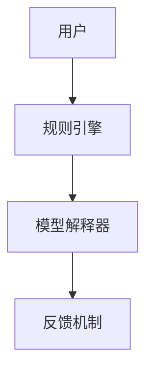
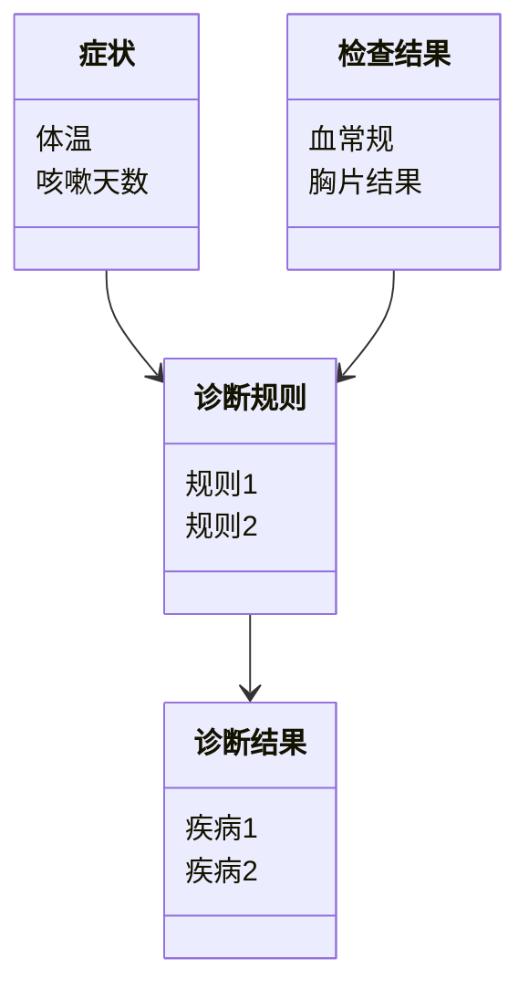
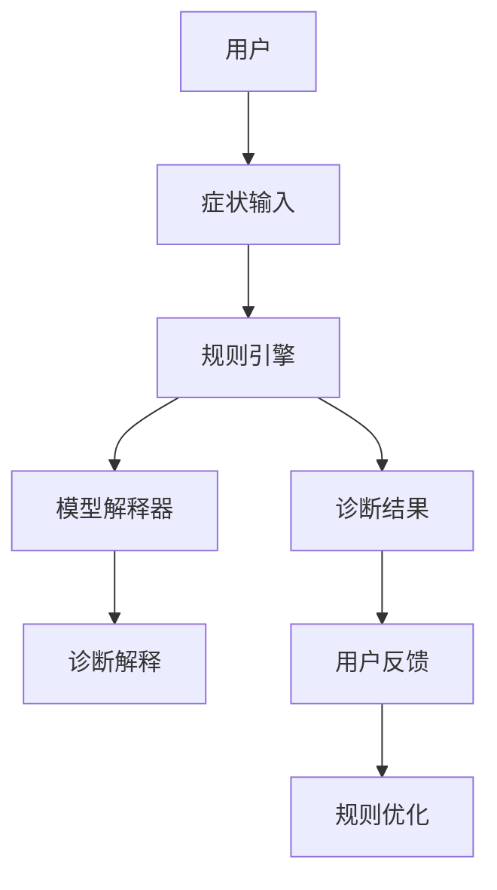
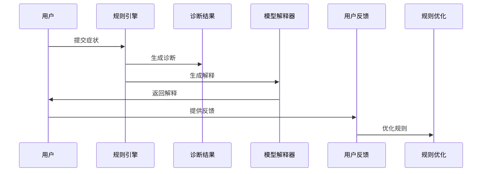

                 


# AI Agent的可解释性设计原则

> 关键词：AI Agent，可解释性，智能代理，透明性，可理解性，可追溯性

> 摘要：本文深入探讨了AI Agent的可解释性设计原则，从背景、核心概念、算法实现到系统架构和项目实战，全面解析了如何设计透明、可理解且可追溯的AI Agent系统，帮助读者理解和实现高可解释性的AI Agent。

---

## 第一部分: AI Agent的可解释性设计背景与核心概念

### 第1章: AI Agent的基本概念与可解释性的重要性

#### 1.1 AI Agent的定义与特点

- **1.1.1 AI Agent的定义**  
  AI Agent（人工智能代理）是一种能够感知环境、自主决策并执行任务的智能系统。它可以是一个软件程序、机器人或其他智能实体，通过传感器获取信息，并通过执行器与环境交互。

- **1.1.2 AI Agent的核心特点**  
  - **自主性**：能够自主决策，无需外部干预。  
  - **反应性**：能够实时感知环境并做出反应。  
  - **目标导向**：具有明确的目标，并采取行动以实现目标。  
  - **社交能力**：能够与其他系统或人类交互并协作。

- **1.1.3 AI Agent与传统软件的区别**  
  AI Agent的核心区别在于其自主性和智能性。传统软件通常遵循固定的逻辑和规则，而AI Agent能够学习、推理和自适应。

#### 1.2 可解释性在AI Agent中的重要性

- **1.2.1 可解释性的定义与目标**  
  可解释性是指AI Agent的决策过程能够被人类理解和解释。目标是使AI Agent的决策过程透明化，增强用户信任，并在出现问题时能够追溯和修正。

- **1.2.2 可解释性在AI Agent中的应用场景**  
  - **医疗领域**：AI Agent用于诊断或治疗决策时，可解释性是信任的关键。  
  - **金融领域**：AI Agent用于信用评估或交易决策时，可解释性是合规的要求。  
  - **自动驾驶**：AI Agent的决策过程需要透明，以确保安全和责任归属。

- **1.2.3 可解释性对用户信任与责任归属的影响**  
  - **用户信任**：可解释性是用户信任AI Agent的基础。如果用户无法理解AI的决策过程，他们可能不会信任或接受AI的建议。  
  - **责任归属**：在出现问题时，可解释性有助于确定责任。如果AI Agent的决策过程无法追溯，可能引发法律和伦理问题。

---

### 第2章: AI Agent的可解释性设计原则

#### 2.1 可解释性设计的核心原则

- **2.1.1 透明性原则**  
  AI Agent的决策过程需要尽可能透明。这意味着用户应该能够了解AI是如何做出决策的，包括使用的算法、数据来源和决策逻辑。

- **2.1.2 可理解性原则**  
  AI Agent的决策过程需要以用户能够理解的方式呈现。这不仅包括技术细节的简化，还包括将复杂的决策逻辑转化为易于理解的语言或可视化形式。

- **2.1.3 可追溯性原则**  
  AI Agent的决策过程需要能够被追溯。这意味着在出现问题时，可以回溯到具体的决策步骤，找到问题的根源。

#### 2.2 可解释性设计的实现路径

- **2.2.1 基于规则的可解释性设计**  
  基于规则的可解释性设计通过预定义的规则来实现AI Agent的决策过程。这些规则通常是清晰的逻辑条件，用户可以轻松理解AI的决策依据。

- **2.2.2 基于模型的可解释性设计**  
  基于模型的可解释性设计通过解释模型的输出来实现AI Agent的可解释性。例如，使用LIME或SHAP等技术来解释模型的决策过程。

- **2.2.3 基于用户反馈的可解释性设计**  
  基于用户反馈的可解释性设计通过用户的实时反馈来优化AI Agent的决策过程。用户可以通过提供反馈帮助AI理解其决策是否合理。

---

### 第3章: AI Agent可解释性设计的核心概念与联系

#### 3.1 可解释性设计的核心概念

- **3.1.1 透明性与可理解性的关系**  
  透明性是可理解性的基础。如果AI Agent的决策过程不够透明，用户就无法真正理解其决策逻辑。但透明性并不等同于可理解性，因为透明性可能涉及复杂的算法或数据，而可理解性则需要将这些信息转化为用户能够理解的形式。

- **3.1.2 可追溯性与可解释性的关联**  
  可追溯性是可解释性的保障。如果AI Agent的决策过程无法追溯，用户就无法理解其决策的来源和依据。因此，可追溯性是实现可解释性的必要条件。

- **3.1.3 可解释性与系统复杂性的平衡**  
  系统复杂性越高，实现可解释性的难度越大。因此，在设计AI Agent时，需要在系统复杂性和可解释性之间找到平衡点，避免过度复杂化的系统导致可解释性降低。

#### 3.2 可解释性设计的属性特征对比

| 特性 | 透明性 | 可理解性 | 可追溯性 |
|------|--------|----------|-----------|
| 定义 | 决策过程的公开性 | 决策逻辑的易理解性 | 决策过程的可追溯性 |
| 优缺点 | 优点：增强信任；缺点：可能暴露算法细节 | 优点：提高用户理解；缺点：需要简化复杂的逻辑 | 优点：便于问题追溯；缺点：可能增加系统复杂性 |
| 应用场景 | 适用于需要公开决策依据的场景 | 适用于需要用户理解的场景 | 适用于需要追责的场景 |

#### 3.3 可解释性设计的ER实体关系图

```mermaid
er
actor: 用户
agent: AI Agent
rule: 规则
model: 模型
feedback: 反馈
```

---

## 第二部分: AI Agent可解释性设计的算法与实现

### 第4章: 可解释性设计的算法原理

#### 4.1 基于规则的可解释性算法

- **4.1.1 规则生成的流程**  
  规则生成通常基于领域知识和专家经验。例如，在医疗领域，可以基于医学指南生成诊断规则。

- **4.1.2 规则匹配的机制**  
  规则匹配是基于预定义的规则对输入数据进行匹配的过程。例如，如果患者体温超过38度且咳嗽持续超过一周，触发肺炎诊断规则。

- **4.1.3 规则解释的实现**  
  规则解释通过将规则转化为自然语言描述或可视化形式，帮助用户理解AI的决策逻辑。

#### 4.2 基于模型的可解释性算法

- **4.2.1 模型解释方法的分类**  
  - **基于实例的解释**：例如，LIME（Local Interpretable Model-agnostic Explanations）通过扰动输入数据，生成局部可解释的模型。  
  - **基于全局的解释**：例如，SHAP（Shapley Additive exPlanations）通过计算每个特征对模型预测的贡献度，提供全局解释。

- **4.2.2 LIME解释方法的实现**  
  LIME通过在数据点附近生成可解释的局部模型来解释全局模型的预测结果。例如，在分类任务中，LIME可以在某个数据点附近生成一个简单的线性模型来解释其预测结果。

- **4.2.3 SHAP值的计算与应用**  
  SHAP值基于博弈论中的Shapley值，计算每个特征对模型预测的贡献度。例如，在贷款审批中，可以使用SHAP值解释每个特征（如收入、信用评分）对最终决策的影响。

#### 4.3 基于用户反馈的可解释性算法

- **4.3.1 用户反馈的收集与处理**  
  用户可以通过评分、评论或选择性反馈的方式提供反馈。例如，用户可以对AI Agent的建议进行“是”或“否”的反馈。

- **4.3.2 反馈驱动的规则优化**  
  用户反馈可以用于优化预定义的规则。例如，如果用户多次否定AI Agent的建议，可以调整规则以减少类似错误的发生。

- **4.3.3 反馈驱动的模型优化**  
  用户反馈也可以用于优化模型。例如，通过强化学习的方式，基于用户反馈调整模型的权重，使其更符合用户的期望。

---

### 第5章: 可解释性设计的数学模型与公式

#### 5.1 基于规则的可解释性模型

- **5.1.1 规则表示的数学形式**  
  规则通常可以表示为逻辑条件。例如，规则可以表示为 $R: (x_1 \geq 38 \text{ 且 } x_2 \geq 7) \rightarrow y=1$，其中 $x_1$ 是体温，$x_2$ 是咳嗽天数，$y$ 是诊断结果。

- **5.1.2 规则权重的计算公式**  
  规则权重可以通过领域专家的经验或数据驱动的方法计算。例如，规则权重可以表示为 $w_R = \sum_{i=1}^{n} w_i$，其中 $w_i$ 是特征 $x_i$ 的权重。

- **5.1.3 规则匹配的概率模型**  
  规则匹配的概率可以通过贝叶斯定理计算。例如，$P(y=1 | R) = \frac{P(R | y=1) P(y=1)}{P(R)}$。

#### 5.2 基于模型的可解释性模型

- **5.2.1 模型解释的线性回归模型**  
  线性回归模型可以通过系数解释特征对预测结果的影响。例如，$y = \beta_0 + \beta_1 x_1 + \beta_2 x_2 + \ldots + \beta_n x_n$，其中 $\beta_i$ 是特征 $x_i$ 的系数。

- **5.2.2 SHAP值的数学公式**  
  SHAP值通过Shapley值计算每个特征的贡献度。例如，对于某个样本，其SHAP值可以表示为 $f(x) = f(0) + \sum_{i=1}^{n} \phi_i$，其中 $\phi_i$ 是特征 $x_i$ 的贡献值。

- **5.2.3 LIME解释的数学推导**  
  LIME通过扰动数据点生成局部线性模型。例如，LIME的损失函数可以表示为 $\text{loss}(f, g) = \sum_{i=1}^{m} w_i |f(x_i) - g(x_i)|$，其中 $w_i$ 是权重。

---

### 第6章: 可解释性设计的系统架构与实现

#### 6.1 系统架构设计

- **6.1.1 系统模块划分**  
  - **规则引擎**：负责根据预定义规则生成解释。  
  - **模型解释器**：负责解释模型的预测结果。  
  - **反馈机制**：负责收集用户反馈并优化规则或模型。  

- **6.1.2 数据流与交互流程**  
  用户与AI Agent交互，AI Agent根据输入生成输出，并通过规则引擎或模型解释器提供解释。用户可以对解释或输出结果提供反馈，反馈用于优化规则或模型。

- **6.1.3 系统架构的mermaid图**


---

## 第三部分: AI Agent可解释性设计的项目实战

### 第7章: 项目实战与案例分析

#### 7.1 项目背景与目标

- **项目背景**  
  本项目旨在设计一个可解释的AI Agent，用于医疗领域的疾病诊断。用户希望AI Agent能够根据患者的症状和检查结果提供诊断建议，并能够解释其决策过程。

- **项目目标**  
  - 实现一个基于规则和模型的AI Agent。  
  - 确保AI Agent的决策过程可解释。  
  - 提供用户友好的解释界面。

#### 7.2 系统功能设计

- **领域模型**  
  领域模型包括患者症状、检查结果、诊断规则和诊断结果。例如，症状包括体温、咳嗽天数，检查结果包括血常规、胸片结果。

- **系统功能**  
  - **症状输入**：用户输入患者的症状。  
  - **规则匹配**：AI Agent根据预定义的规则生成诊断建议。  
  - **模型解释**：AI Agent通过模型解释技术生成诊断建议的解释。  
  - **用户反馈**：用户可以对诊断建议进行反馈，优化规则或模型。

- **领域模型的mermaid图**


---

### 第8章: 系统架构设计与实现

#### 8.1 系统架构设计

- **系统架构的mermaid图**


- **系统接口设计**  
  - **输入接口**：用户提供症状和检查结果。  
  - **输出接口**：AI Agent返回诊断结果和解释。  
  - **反馈接口**：用户对诊断结果进行反馈。

- **系统交互的mermaid序列图**


---

## 第四部分: AI Agent可解释性设计的最佳实践与总结

### 第9章: 最佳实践与总结

#### 9.1 可解释性设计的注意事项

- **模块化设计**  
  将系统划分为模块化的组件，确保每个组件的可解释性。例如，将规则引擎和模型解释器独立设计，便于调试和优化。

- **文档记录**  
  详细记录系统的决策逻辑和规则，确保可追溯性。例如，记录每条规则的来源、适用场景和优化历史。

- **用户教育**  
  提供用户教育材料，帮助用户理解AI Agent的决策过程。例如，提供FAQ、教程和案例分析，帮助用户更好地理解AI的决策逻辑。

#### 9.2 可解释性设计的未来展望

- **更复杂的模型解释技术**  
  随着模型复杂性的增加，需要更强大的解释技术。例如，开发能够解释深度学习模型的工具和方法。

- **跨领域应用**  
  可解释性设计将在更多领域得到应用，例如教育、法律和公共政策等领域。

- **人机协作**  
  未来的AI Agent将是人机协作的伙伴，可解释性设计将帮助人类更好地与AI协作，共同解决问题。

---

## 作者：AI天才研究院/AI Genius Institute & 禅与计算机程序设计艺术 /Zen And The Art of Computer Programming

