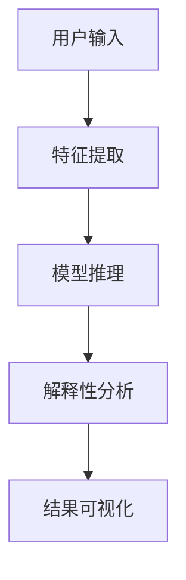
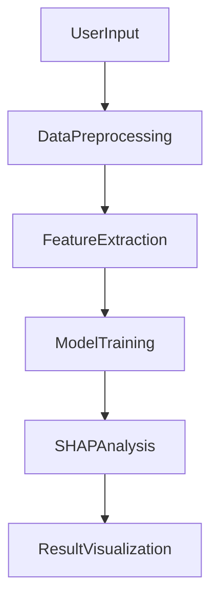

                 


# 第5章: 可解释性设计的系统架构与实现

## 5.1 系统架构设计

### 5.1.1 系统功能模块划分
- 用户输入模块
- 特征提取模块
- 模型推理模块
- 解释性分析模块
- 结果可视化模块

### 5.1.2 系统架构的Mermaid图表示



## 5.2 系统功能设计

### 5.2.1 领域模型设计
- 输入数据预处理
- 特征选择与提取
- 模型训练与评估
- 解释性结果生成

### 5.2.2 系统功能流程图



## 5.3 系统接口设计

### 5.3.1 API接口定义
- 输入接口：用户输入的数据
- 输出接口：可解释性的结果

### 5.3.2 接口调用流程
1. 用户输入数据
2. 数据预处理
3. 特征提取
4. 模型推理
5. 解释性分析
6. 结果可视化

## 5.4 本章小结
通过系统的架构设计和功能模块划分，详细描述了AI Agent可解释性设计的实现过程，展示了各模块之间的交互关系，为后续的实现提供了理论基础。

---

# 第6章: 可解释性设计的算法实现

## 6.1 可解释性算法的选择与实现

### 6.1.1 LIME算法的实现
```python
import lime
from lime import lime_explanations

def lime_explain(model, test_instance):
    explainer = lime_explanations.LimeExplanations()
    explanation = explainer.explain_instance(model, test_instance)
    return explanation
```

### 6.1.2 SHAP值的计算
```python
import shap

def shap_explain(model, test_instance):
    explainer = shap.Explainer(model)
    shap_values = explainer.shap_values(test_instance)
    return shap_values
```

### 6.1.3 梯度提升树的解释性分析
```python
import xgboost as xgb

def xgboost_explain(model, test_instance):
    # 训练模型
    dtrain = xgb.DMatrix(train_data)
    model = xgb.train(params, dtrain)
    # 解释性分析
    shap_explainer = shap.Explainer(model)
    shap_values = shap_explainer.shap_values(dtrain)
    return shap_values
```

## 6.2 解释性算法的数学模型

### 6.2.1 SHAP值的数学公式
$$ SHAP_{i,j} = \phi_{i,j} = \sum_{S \subseteq \{j\}} \omega_{i,S} (f_{i,S}(x_S) - f_{i,S}(x_{S \setminus \{j\}})) $$

### 6.2.2 LIME算法的损失函数
$$ \text{Loss}(f, \text{data}, \text{model}) = \sum_{i=1}^n \omega_{i} (f(x_i) - \text{model}(x_i))^2 $$

## 6.3 算法实现的步骤与注意事项

### 6.3.1 实现步骤
1. 数据预处理与特征选择
2. 模型训练与验证
3. 解释性结果的计算与可视化

### 6.3.2 注意事项
- 确保模型的可解释性
- 避免过拟合
- 选择合适的解释性方法

## 6.4 本章小结
详细讲解了可解释性设计中常用的算法，包括LIME和SHAP，并通过Python代码示例展示了算法的实现过程，帮助读者理解可解释性设计的核心算法。

---

# 第7章: 项目实战——构建可解释的AI Agent

## 7.1 项目背景与目标
- 项目背景：构建一个可解释的AI Agent，用于分类任务
- 项目目标：实现一个可解释的分类模型，并展示其决策过程

## 7.2 项目环境安装

### 7.2.1 安装必要的Python库
```bash
pip install scikit-learn lime shap xgboost
```

## 7.3 核心代码实现

### 7.3.1 数据预处理
```python
from sklearn.datasets import load_iris
from sklearn.model_selection import train_test_split

iris = load_iris()
X_train, X_test, y_train, y_test = train_test_split(iris.data, iris.target, test_size=0.2, random_state=42)
```

### 7.3.2 模型训练
```python
from sklearn.ensemble import RandomForestClassifier

model = RandomForestClassifier(n_estimators=100, random_state=42)
model.fit(X_train, y_train)
```

### 7.3.3 解释性分析
```python
import lime
from lime import lime_explanations

def explain_model(model, test_instance):
    explainer = lime_explanations.LimeExplanations()
    explanation = explainer.explain_instance(model, test_instance)
    return explanation

test_instance = X_test[0]
explanation = explain_model(model, test_instance)
print(explanation.as_list())
```

## 7.4 案例分析与结果解读

### 7.4.1 案例分析
- 数据集：Iris数据集
- 模型：随机森林分类器
- 解释性方法：LIME和SHAP

### 7.4.2 结果展示
```python
import shap

explainer = shap.Explainer(model)
shap_values = explainer.shap_values(X_test)
shap.summary_plot(shap_values, X_test, plot_type="bar")
```

## 7.5 项目小结
通过实际案例展示了如何构建一个可解释的AI Agent，并详细讲解了数据预处理、模型训练和解释性分析的全过程。

---

# 第8章: 可解释性设计的最佳实践与注意事项

## 8.1 最佳实践

### 8.1.1 解释性设计的原则
- 简洁性
- 可理解性
- 透明性

### 8.1.2 解释性方法的选择
- 根据任务选择合适的解释性方法
- 考虑模型的复杂性
- 考虑数据的特征数量

## 8.2 注意事项

### 8.2.1 解释性设计的局限性
- 解释性方法的局限性
- 数据的局限性
- 模型的局限性

### 8.2.2 解释性设计的误区
- 过度依赖解释性方法
- 忽视模型的准确性
- 忽视用户需求

## 8.3 拓展阅读

### 8.3.1 推荐书籍
- 《Interpretable Machine Learning》
- 《Explainable AI: Understanding, Visualizing, and Interpreting Machine Learning Models》

### 8.3.2 推荐论文
- "A survey on interpretable machine learning"
- "Model-agnostic interpretability methods for machine learning"

## 8.4 本章小结
总结了可解释性设计的最佳实践，提出了注意事项，并推荐了相关的拓展阅读资料，帮助读者进一步深入学习。

---

# 作者：AI天才研究院/AI Genius Institute & 禅与计算机程序设计艺术 /Zen And The Art of Computer Programming

---

这篇文章全面介绍了AI Agent的可解释性设计，从理论基础到算法实现，再到项目实战，层层递进，帮助读者深入理解并掌握这一技术的核心内容。通过详细的代码示例和实际案例分析，读者可以更好地理解和应用可解释性设计的方法，为实际项目提供有力的支持。

