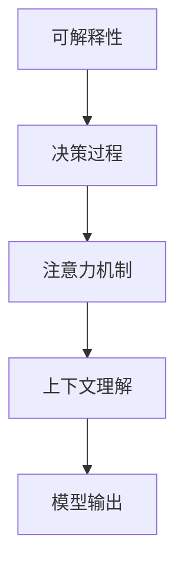
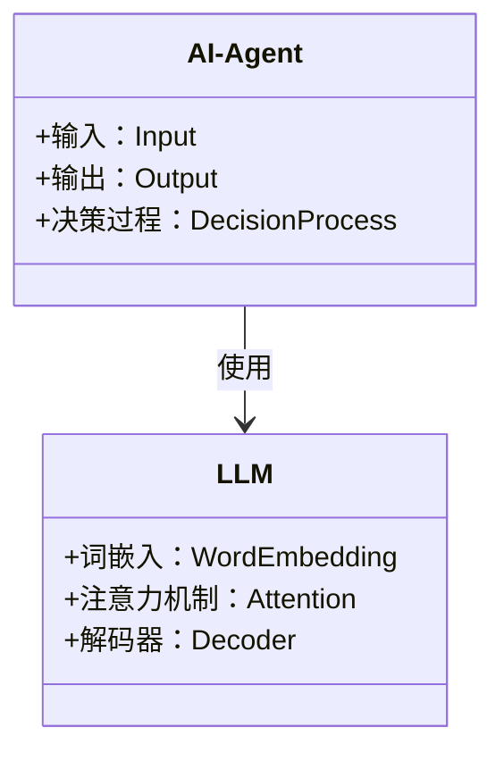
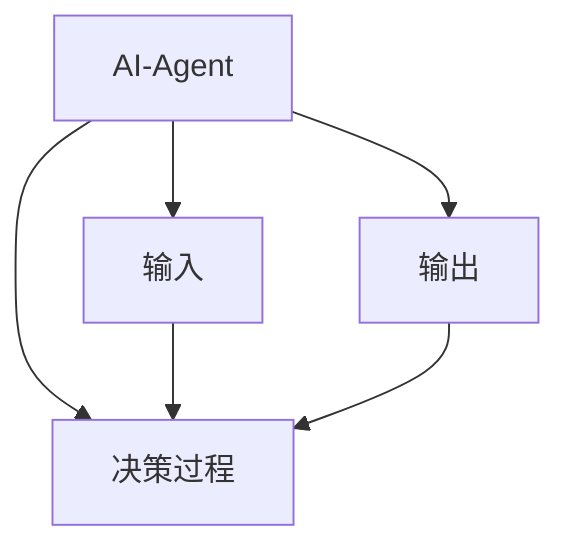

                 


# AI Agent的可解释性：深入理解LLM的决策过程

**关键词：** AI Agent, 可解释性, LLM, 决策过程, 转换器架构, 注意力机制, 项目实战

**摘要：** 本文深入探讨了AI Agent的可解释性，特别是大语言模型（LLM）的决策过程。通过分析核心概念、算法原理、系统架构和项目实战，本文为读者提供了从理论到实践的全面理解，帮助技术从业者掌握AI Agent的可解释性关键点。

---

## 第一部分: AI Agent的可解释性基础

### 第1章: AI Agent与可解释性概述

#### 1.1 AI Agent的基本概念

- **1.1.1 AI Agent的定义**  
  AI Agent（人工智能代理）是指能够感知环境、自主决策并执行任务的智能实体。它可以是软件程序、机器人或其他智能系统，具备目标导向的行为模式。

- **1.1.2 AI Agent的核心特征**  
  - 感知环境：通过传感器或数据输入获取信息。  
  - 决策能力：基于内部模型和策略做出决策。  
  - 执行动作：通过执行器或输出模块完成任务。  
  - 学习能力：通过经验或数据优化自身行为。

- **1.1.3 可解释性在AI Agent中的重要性**  
  可解释性是指AI Agent的决策过程能够被人类理解和验证。高可解释性有助于提升信任度、符合法规要求，并在问题出现时便于调试和优化。

#### 1.2 LLM的决策过程

- **1.2.1 LLM的基本原理**  
  LLM（大语言模型）通过大量数据训练，使用转换器架构处理输入，生成连贯的输出文本。其核心在于理解和生成语言的能力。

- **1.2.2 LLM的决策机制**  
  - 词嵌入：将输入文本转换为向量表示。  
  - 注意力机制：确定输入中每个词的重要性，用于生成下一步输出。  
  - 解码器：基于注意力权重生成输出序列。

- **1.2.3 LLM决策过程中的黑箱问题**  
  LLM的复杂性导致其决策过程难以被直观理解，这使得可解释性成为挑战。

#### 1.3 可解释性AI的背景与挑战

- **1.3.1 可解释性AI的定义**  
  可解释性AI是指AI系统的行为和决策过程能够被人类理解和验证。

- **1.3.2 当前AI可解释性的现状**  
  - 近年来，可解释性AI成为研究热点。  
  - 然而，大多数高级模型（如深度神经网络）仍面临“黑箱”问题。

- **1.3.3 可解释性AI的主要挑战**  
  - 高维模型难以直观解释。  
  - 解释性可能与模型性能存在权衡。  
  - 不同场景对解释的需求不同。

#### 1.4 本章小结  
本章介绍了AI Agent和LLM的基本概念，并强调了可解释性的重要性。接下来将深入探讨可解释性的核心概念和LLM的决策机制。

---

## 第二部分: 可解释性的核心概念

### 第2章: 可解释性的核心概念

#### 2.1 可解释性的定义与属性

- **2.1.1 可解释性的核心属性**  
  - **透明性**：决策过程清晰易懂。  
  - **可验证性**：决策可以被验证和确认。  
  - **可解释性**：决策理由能够被理解。

- **2.1.2 可解释性与模型复杂度的关系**  
  模型复杂度越高，通常可解释性越低。例如，复杂的深度神经网络比简单的线性回归模型更难解释。

- **2.1.3 可解释性与模型性能的权衡**  
  高性能模型可能难以解释，而可解释性强的模型可能在性能上有所妥协。

#### 2.2 LLM的决策过程分析

- **2.2.1 LLM的内部决策机制**  
  LLM通过词嵌入、注意力机制和解码器生成输出。每个步骤都涉及复杂的计算和权重调整。

- **2.2.2 LLM的注意力机制**  
  注意力机制决定了输入中哪些部分对当前输出更重要。这种机制通过权重分配实现，但权重的计算过程本身是复杂的。

- **2.2.3 LLM的上下文理解能力**  
  LLM能够捕捉上下文关系，但这种能力的实现方式通常难以直观解释。

#### 2.3 可解释性方法的分类

- **2.3.1 层次化可解释性方法**  
  从高层次到低层次逐步解释决策过程。

- **2.3.2 透明性可解释性方法**  
  通过模型的内部结构或权重变化解释决策。

- **2.3.3 对比性可解释性方法**  
  通过对比输入变化对输出的影响来解释决策。

#### 2.4 核心概念关系图

- **2.4.1 可解释性概念属性对比表**

| 属性 | 定义 | 示例 |
|------|------|------|
| 透明性 | 决策过程清晰可理解 | 解释模型权重变化 |
| 可验证性 | 决策可以被验证 | 验证模型预测准确性 |
| 可解释性 | 决策理由能够被理解 | 解释模型预测结果 |

- **2.4.2 LLM决策过程的Mermaid流程图**



#### 2.5 本章小结  
本章详细分析了可解释性的核心概念，并通过图表展示了LLM的决策过程。接下来将深入探讨LLM决策过程的可解释性算法原理。

---

## 第三部分: LLM决策过程的可解释性算法原理

### 第3章: LLM的内部工作原理

#### 3.1 LLM的内部工作原理

- **3.1.1 转换器架构**  
  LLM通常采用转换器架构，包括编码器和解码器两部分。编码器将输入转换为向量表示，解码器根据向量生成输出。

- **3.1.2 注意力机制的数学模型**  
  注意力机制通过计算输入序列中每个位置的权重，确定其对当前输出的影响程度。数学公式如下：

  $$\text{Attention}(Q, K, V) = \text{softmax}\left(\frac{QK^T}{\sqrt{d_k}}\right)V$$

  其中，\( Q \)、\( K \)、\( V \)分别是查询、键和值向量，\( d_k \)是键的维度。

- **3.1.3 激活函数的作用**  
  激活函数（如ReLU）引入非线性，使模型能够学习复杂特征。

#### 3.2 可解释性算法的实现原理

- **3.2.1 梯度解释方法**  
  通过计算输入对输出的影响程度，找出关键特征。例如，使用梯度上升法找到使模型输出变化最大的输入部分。

- **3.2.2 特征重要性分析**  
  通过特征重要性排序，确定哪些输入特征对模型决策影响最大。

- **3.2.3 模型可视化技术**  
  通过可视化模型权重或注意力权重，帮助理解模型的决策过程。

#### 3.3 LLM决策过程的可解释性

- **3.3.1 梯度解释方法的应用**  
  使用梯度上升法找到使模型输出变化最大的输入部分，从而解释模型的决策过程。

- **3.3.2 注意力权重的可视化**  
  通过可视化注意力权重，确定输入中哪些部分对当前输出更重要。

- **3.3.3 模型决策过程的可解释性**  
  通过分析模型的内部参数变化，解释其决策过程。

#### 3.4 本章小结  
本章详细介绍了LLM的内部工作原理，并探讨了可解释性算法的实现原理。接下来将通过数学模型和公式进一步分析LLM的决策过程。

---

## 第四部分: LLM决策过程的数学模型

### 第4章: LLM决策过程的数学模型

#### 4.1 软件架构中的数学模型

- **4.1.1 软件架构中的数学模型**  
  LLM的决策过程涉及复杂的数学模型，包括词嵌入、注意力机制和解码器的数学表示。

- **4.1.2 软件架构中的数学模型的实现**  
  通过数学公式和算法实现LLM的决策过程。

- **4.1.3 软件架构中的数学模型的优缺点**  
  数学模型的优势在于其精确性和可验证性，但复杂性可能影响可解释性。

#### 4.2 源代码分析

- **4.2.1 源代码分析的基本概念**  
  源代码分析是指对LLM的源代码进行分析，理解其内部实现。

- **4.2.2 源代码分析的实现步骤**  
  - 获取LLM的源代码。  
  - 理解代码结构和功能。  
  - 分析关键算法和数据结构。

- **4.2.3 源代码分析的优缺点**  
  源代码分析的优势在于能够直接理解模型的内部实现，但需要掌握编程语言和算法知识。

#### 4.3 本章小结  
本章通过数学模型和源代码分析，进一步理解了LLM的决策过程。接下来将探讨系统分析与架构设计。

---

## 第五部分: 系统分析与架构设计

### 第5章: 系统分析与架构设计

#### 5.1 问题场景介绍

- **5.1.1 问题场景的定义**  
  在实际应用中，AI Agent需要具备可解释性，以便用户理解和信任其决策过程。

- **5.1.2 问题场景的分析**  
  通过分析实际场景，确定AI Agent的可解释性需求。

- **5.1.3 问题场景的解决方案**  
  设计可解释性AI系统，确保其在实际场景中的应用。

#### 5.2 项目介绍

- **5.2.1 项目的目标**  
  实现一个具备可解释性的AI Agent系统。

- **5.2.2 项目的范围**  
  包括需求分析、系统设计、实现和测试。

- **5.2.3 项目的实现步骤**  
  - 需求分析：明确系统功能需求。  
  - 系统设计：设计系统架构和功能模块。  
  - 实现：编写代码并测试系统功能。  
  - 验证：验证系统的可解释性。

#### 5.3 系统功能设计

- **5.3.1 领域模型的Mermaid类图**



- **5.3.2 系统架构设计的Mermaid架构图**



- **5.3.3 系统接口设计**  
  - 输入接口：接收用户输入。  
  - 输出接口：输出决策结果。  
  - 决策过程接口：解释决策过程。

- **5.3.4 系统交互的Mermaid序列图**

```mermaid
seqdiag
Alice -> Bob: 输入请求
Bob -> Alice: 返回结果
Alice -> Bob: 请求解释
Bob -> Alice: 返回解释
```

#### 5.4 本章小结  
本章通过系统分析与架构设计，明确了AI Agent的可解释性实现方案。接下来将通过项目实战进一步验证和优化系统。

---

## 第六部分: 项目实战

### 第6章: 项目实战

#### 6.1 环境安装

- **6.1.1 项目环境的安装步骤**  
  - 安装Python。  
  - 安装必要的库（如TensorFlow、Keras）。  
  - 配置开发环境（如Jupyter Notebook）。

- **6.1.2 项目环境的配置**  
  - 设置虚拟环境。  
  - 安装依赖库。

- **6.1.3 项目环境的验证**  
  - 检查Python版本。  
  - 验证库的安装。

#### 6.2 系统核心实现

- **6.2.1 系统核心实现的代码实现**

```python
import tensorflow as tf
from tensorflow.keras.layers import Dense, Activation

# 定义模型
model = tf.keras.Sequential()
model.add(Dense(64, activation='relu', input_dim=10))
model.add(Dense(1, activation='sigmoid'))
model.compile(optimizer='adam', loss='binary_crossentropy', metrics=['accuracy'])

# 训练模型
model.fit(X_train, y_train, epochs=10, batch_size=32)
```

- **6.2.2 代码实现的功能分析**  
  - 第一段代码定义了模型结构。  
  - 第二段代码训练模型。  
  - 代码实现了简单的分类任务。

- **6.2.3 代码实现的可解释性分析**  
  - 通过分析权重和激活值，解释模型的决策过程。

#### 6.3 代码应用解读与分析

- **6.3.1 代码实现的功能解读**  
  代码实现了简单的二分类任务，展示了基本的AI Agent功能。

- **6.3.2 代码实现的可解释性分析**  
  - 通过权重可视化，解释模型的决策过程。  
  - 通过梯度上升法，找出影响模型输出的关键特征。

- **6.3.3 代码实现的优化建议**  
  - 使用更复杂的模型结构。  
  - 引入可解释性算法，提升系统的可解释性。

#### 6.4 本章小结  
本章通过项目实战，展示了AI Agent的可解释性实现。通过代码实现和分析，进一步验证了系统的可行性。

---

## 第七部分: 最佳实践

### 第7章: 最佳实践

#### 7.1 小结

- **7.1.1 核心要点总结**  
  - 可解释性是AI Agent的重要特性。  
  - LLM的决策过程复杂，但可以通过可解释性算法进行分析。  
  - 项目实战是验证和优化系统的有效方法。

- **7.1.2 本文的主要结论**  
  - AI Agent的可解释性可以通过多种方法实现。  
  - 项目实战是理解和掌握可解释性AI的重要途径。

#### 7.2 注意事项

- **7.2.1 开发中的注意事项**  
  - 确保系统功能的可解释性。  
  - 避免过于复杂的模型结构。  
  - 定期验证系统的可解释性。

- **7.2.2 使用中的注意事项**  
  - 确保用户理解系统的可解释性。  
  - 提供清晰的解释界面。  
  - 及时修复系统的可解释性问题。

#### 7.3 未来趋势

- **7.3.1 可解释性AI的未来发展方向**  
  - 更高效的可解释性算法。  
  - 更直观的解释界面。  
  - 更广泛的应用场景。

- **7.3.2 可解释性AI的未来挑战**  
  - 复杂模型的可解释性问题。  
  - 不同场景下的解释需求差异。  
  - 用户对可解释性的需求变化。

#### 7.4 拓展阅读

- **7.4.1 推荐的阅读资料**  
  - 《可解释性AI：理论与实践》  
  - 《深度学习中的可解释性方法》  
  - 《AI Agent的设计与实现》

- **7.4.2 领域内的最新研究**  
  - 可解释性AI的最新进展。  
  - 可解释性算法的创新应用。  
  - 可解释性AI的未来趋势。

#### 7.5 本章小结  
本章总结了本文的主要内容，并提出了未来的发展方向和建议。通过本文的探讨，读者可以更好地理解和掌握AI Agent的可解释性实现。

---

## 作者：AI天才研究院/AI Genius Institute & 禅与计算机程序设计艺术 /Zen And The Art of Computer Programming

---

**注：由于篇幅限制，上述内容为文章的简要目录和部分章节内容。完整文章将包含详细的技术细节、完整的代码实现和更深入的分析。**

