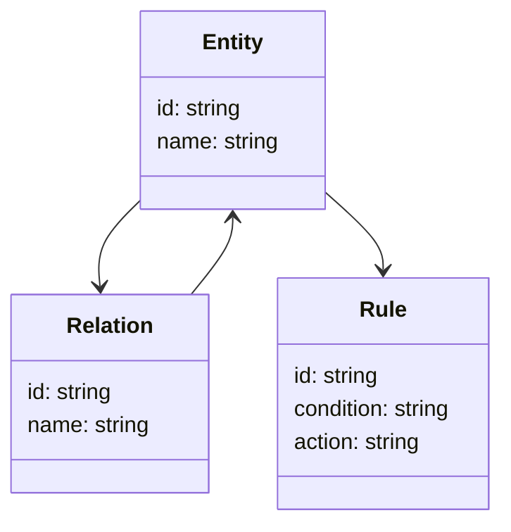
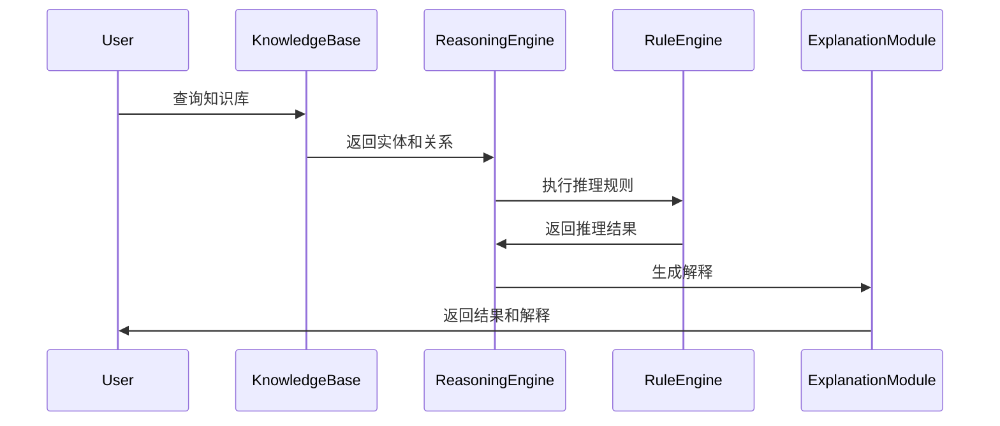

                 


# AI Agent的可解释推理：提高LLM决策的透明度

## 关键词：AI Agent, 可解释推理, LLM, 决策透明度, 可解释性, 人工智能, 机器学习

## 摘要：AI Agent的可解释推理是提高大语言模型（LLM）决策透明度的关键。本文从背景介绍、核心概念、算法原理、系统架构、项目实战到最佳实践，全面解析如何实现AI Agent的可解释推理，提升LLM决策的透明度和可信度，最终实现更高效、更可靠的AI决策系统。

---

# 第1章: 问题背景与核心概念

## 1.1 问题背景

### 1.1.1 当前AI决策系统的挑战
- **黑箱问题**：大语言模型（LLM）在决策过程中缺乏透明性，用户无法理解模型的推理过程。
- **信任缺失**：用户对AI决策的不透明性感到不满，导致信任度下降。
- **可解释性需求**：在医疗、金融等高风险领域，用户对决策的可解释性有明确需求。

### 1.1.2 问题描述
- **AI Agent决策的不透明性**：AI Agent的决策过程难以被人类理解和验证。
- **用户对决策透明度的需求**：用户希望了解AI Agent的决策逻辑和依据。
- **可解释推理的必要性**：通过可解释推理，提升AI Agent决策的透明度和可信度。

### 1.1.3 问题解决
- **提高LLM决策透明度的方法**：通过可解释推理技术，揭示AI Agent的决策过程。
- **AI Agent可解释推理的核心目标**：使AI Agent的决策过程可理解、可验证、可信任。
- **可解释推理的实现路径**：通过规则提取、知识图谱、符号推理等技术，提升可解释性。

### 1.1.4 边界与外延
- **可解释推理的边界**：可解释推理仅关注决策过程的透明性，不涉及模型的具体实现。
- **相关概念的对比**：可解释推理与模型解释性、透明性等概念的对比分析。
- **可解释推理的外延**：可解释推理在不同场景中的应用，如医疗、金融、法律等。

### 1.1.5 核心要素组成
- **可解释推理的关键要素**：可解释性、透明性、可信性。
- **AI Agent的决策过程**：输入处理、推理过程、结果输出。
- **透明度与可解释性的关系**：透明度是可解释性的基础，可解释性是透明度的体现。

---

## 1.2 核心概念与联系

### 1.2.1 可解释推理的定义与特点
- **可解释推理的定义**：可解释推理是指通过明确的逻辑规则和知识表示，使AI Agent的决策过程能够被人类理解和验证。
- **可解释推理的特点**：
  - 明确性：推理过程基于明确的逻辑规则。
  - 可验证性：推理结果可以通过逻辑规则进行验证。
  - 可理解性：推理过程能够被人类理解。

### 1.2.2 AI Agent的基本概念
- **AI Agent的定义**：AI Agent是一种能够感知环境、自主决策并采取行动的智能体。
- **AI Agent的分类**：基于智能水平，AI Agent可以分为反应式Agent和认知式Agent。
- **AI Agent的核心功能**：感知环境、推理决策、执行行动。

### 1.2.3 可解释推理与AI Agent的关系
- **可解释推理在AI Agent中的作用**：通过可解释推理，AI Agent的决策过程变得更加透明和可信。
- **AI Agent如何实现可解释推理**：通过符号逻辑、知识图谱等技术，实现决策过程的可解释性。
- **可解释推理对AI Agent决策的影响**：可解释推理能够提升用户对AI Agent决策的信任度。

### 1.2.4 核心概念属性特征对比

| 概念       | 定义                                                                 | 特点                                                                 |
|------------|----------------------------------------------------------------------|----------------------------------------------------------------------|
| 可解释性    | 推理过程可以被人类理解和验证                                     | 明确性、可验证性、可理解性                                             |
| 不可解释性  | 推理过程难以被人类理解和验证                                     | 黑箱性、不可预测性                                                     |
| AI Agent    | 能够感知环境、自主决策并采取行动的智能体                         | 反应式Agent和认知式Agent                                              |
| LLM         | 大型语言模型，用于自然语言处理                                   | 参数量大、基于统计学习                                                 |

### 1.2.5 E

---

# 第2章: 可解释推理的核心概念

## 2.1 可解释推理的定义与特点

### 2.1.1 可解释推理的定义
可解释推理是指通过明确的逻辑规则和知识表示，使AI Agent的决策过程能够被人类理解和验证。其核心在于通过符号逻辑、知识图谱等技术，实现推理过程的透明性和可解释性。

### 2.1.2 可解释推理的特点
- **明确性**：可解释推理基于明确的逻辑规则，推理过程清晰可循。
- **可验证性**：推理结果可以通过逻辑规则进行验证，确保结果的正确性。
- **可理解性**：推理过程能够被人类理解，用户可以轻松理解AI Agent的决策逻辑。

## 2.2 AI Agent的基本概念

### 2.2.1 AI Agent的定义
AI Agent是一种能够感知环境、自主决策并采取行动的智能体。它可以基于环境信息做出决策，并通过行动影响环境。

### 2.2.2 AI Agent的分类
- **反应式Agent**：基于当前环境信息做出反应，没有内部状态。
- **认知式Agent**：具有复杂推理能力，能够处理抽象概念和长期规划。

### 2.2.3 AI Agent的核心功能
- **感知环境**：通过传感器或其他方式获取环境信息。
- **推理决策**：基于获取的信息，通过推理过程做出决策。
- **执行行动**：根据决策结果采取相应的行动。

## 2.3 可解释推理与AI Agent的关系

### 2.3.1 可解释推理在AI Agent中的作用
通过可解释推理，AI Agent的决策过程变得更加透明和可信。用户可以理解AI Agent的决策逻辑，从而增强信任感。

### 2.3.2 AI Agent如何实现可解释推理
- **符号逻辑**：通过符号逻辑规则，明确推理过程。
- **知识图谱**：构建知识图谱，展示推理过程中的知识依赖。
- **规则引擎**：通过规则引擎，实现推理过程的可视化和可解释性。

### 2.3.3 可解释推理对AI Agent决策的影响
可解释推理能够提升用户对AI Agent决策的信任度，特别是在高风险领域，如医疗、金融等，可解释性是用户信任的基础。

## 2.4 核心概念属性特征对比

| 概念       | 定义                                                                 | 特点                                                                 |
|------------|----------------------------------------------------------------------|----------------------------------------------------------------------|
| 可解释性    | 推理过程可以被人类理解和验证                                     | 明确性、可验证性、可理解性                                             |
| 不可解释性  | 推理过程难以被人类理解和验证                                     | 黑箱性、不可预测性                                                     |
| AI Agent    | 能够感知环境、自主决策并采取行动的智能体                         | 反应式Agent和认知式Agent                                              |
| LLM         | 大型语言模型，用于自然语言处理                                   | 参数量大、基于统计学习                                                 |

## 2.5 E

---

# 第3章: 可解释推理的算法原理

## 3.1 可解释推理的基础算法

### 3.1.1 基于符号逻辑的推理算法
- **定义**：通过符号逻辑规则，构建知识库，进行逻辑推理。
- **特点**：推理过程清晰，易于解释，但计算复杂度较高。
- **实现步骤**：
  1. 构建知识库：定义符号、规则和逻辑关系。
  2. 推理过程：基于规则进行逻辑推理，得出结论。
  3. 结果解释：将推理过程和结果转化为人类可理解的形式。

### 3.1.2 基于知识图谱的推理算法
- **定义**：通过构建知识图谱，利用图结构进行推理。
- **特点**：推理过程直观，基于图的遍历，易于可视化。
- **实现步骤**：
  1. 构建知识图谱：定义实体和关系，构建图结构。
  2. 推理过程：基于图遍历算法，进行推理。
  3. 结果解释：将推理路径和结果可视化，便于理解。

### 3.1.3 基于规则引擎的推理算法
- **定义**：通过规则引擎，定义规则和优先级，进行推理。
- **特点**：规则清晰，易于管理和维护，但规则设计需要专业知识。
- **实现步骤**：
  1. 定义规则：构建规则库，定义规则的条件和动作。
  2. 推理过程：根据输入数据，匹配规则，执行动作。
  3. 结果解释：将匹配的规则和执行结果解释给用户。

## 3.2 可解释推理的高级算法

### 3.2.1 基于符号逻辑的高级推理
- **定义**：在符号逻辑的基础上，引入更复杂的逻辑运算和规则。
- **特点**：推理能力更强，但计算复杂度更高。
- **实现步骤**：
  1. 定义复杂规则：引入逻辑运算符（如与、或、非）和量词（如所有、存在）。
  2. 推理过程：基于复杂规则进行推理，得出结论。
  3. 结果解释：将复杂推理过程分解，逐一解释给用户。

### 3.2.2 基于知识图谱的高级推理
- **定义**：在知识图谱的基础上，引入语义理解，进行更复杂的推理。
- **特点**：推理过程更加智能化，但需要深度语义理解能力。
- **实现步骤**：
  1. 构建语义网络：在知识图谱中引入语义信息，丰富知识表示。
  2. 推理过程：基于语义网络，进行语义推理，得出结论。
  3. 结果解释：将语义推理过程和结果可视化，便于理解。

### 3.2.3 基于规则引擎的高级推理
- **定义**：在规则引擎的基础上，引入动态规则和上下文感知，进行更灵活的推理。
- **特点**：规则动态调整，推理过程更加灵活，但规则设计和管理更加复杂。
- **实现步骤**：
  1. 动态规则定义：根据上下文，动态调整规则。
  2. 推理过程：根据动态规则，进行推理，得出结论。
  3. 结果解释：将动态规则和推理结果解释给用户。

## 3.3 可解释推理的数学模型与公式

### 3.3.1 符号逻辑模型
- **定义**：符号逻辑是一种基于符号和规则的逻辑推理方法。
- **公式**：
  - 命题逻辑：$P \rightarrow Q$ 表示如果P为真，则Q为真。
  - 一阶逻辑：$\forall x (P(x) \rightarrow Q(x))$ 表示对于所有x，如果P(x)为真，则Q(x)为真。

### 3.3.2 知识图谱模型
- **定义**：知识图谱是一种基于图结构的知识表示方法，节点表示实体，边表示关系。
- **公式**：
  - 实体表示：$e1$ 表示一个实体。
  - 关系表示：$r1(e1, e2)$ 表示e1与e2之间存在关系r1。

### 3.3.3 规则引擎模型
- **定义**：规则引擎是一种基于规则的推理方法，规则由条件和动作组成。
- **公式**：
  - 条件：如果$A$且$B$，则$C$。
  - 动作：执行$D$。

---

# 第4章: 可解释推理的系统架构设计

## 4.1 系统分析

### 4.1.1 问题场景介绍
- **场景描述**：用户希望实现一个基于可解释推理的AI Agent，提高LLM决策的透明度。
- **系统目标**：通过可解释推理技术，使AI Agent的决策过程能够被用户理解和验证。
- **用户需求**：用户需要一个透明、可解释的AI Agent，能够在医疗、金融等领域提供可靠的决策支持。

## 4.2 系统功能设计

### 4.2.1 领域模型设计
- **领域模型**：构建知识库，定义符号、规则和逻辑关系。
- **类图设计**：
  - 实体类：表示知识库中的实体。
  - 关系类：表示实体之间的关系。
  - 规则类：表示推理规则。



### 4.2.2 系统架构设计

```mermaid
containerDiagram
    container System {
        component KnowledgeBase {
            Entity
            Relation
            Rule
        }
        component ReasoningEngine {
            Inference
            RuleEngine
        }
        component ExplanationModule {
            Explain
        }
    }
```

### 4.2.3 系统接口设计
- **输入接口**：接收用户输入，解析并传递给推理引擎。
- **输出接口**：将推理结果和解释输出给用户。

### 4.2.4 系统交互设计



## 4.3 系统实现

### 4.3.1 知识库构建
- **实现步骤**：
  1. 定义符号：如实体、关系、规则。
  2. 构建知识库：存储实体和关系。
  3. 定义规则：构建推理规则库。

### 4.3.2 推理引擎实现
- **实现步骤**：
  1. 接收输入：解析输入数据。
  2. 执行推理：基于知识库和规则，进行推理。
  3. 返回结果：输出推理结果。

### 4.3.3 解释模块实现
- **实现步骤**：
  1. 生成解释：将推理过程和结果转化为人类可理解的形式。
  2. 输出解释：通过可视化或文本形式，将解释返回给用户。

## 4.4 系统优化

### 4.4.1 知识库优化
- **优化方法**：
  1. 增加索引：提高知识库查询效率。
  2. 优化规则：减少冗余规则，提高推理效率。

### 4.4.2 推理引擎优化
- **优化方法**：
  1. 并行推理：利用多线程或分布式计算，提高推理速度。
  2. 优化算法：采用更高效的推理算法，减少计算复杂度。

### 4.4.3 解释模块优化
- **优化方法**：
  1. 简化解释：将复杂推理过程简化，便于用户理解。
  2. 可视化优化：通过图表等形式，直观展示推理过程和结果。

---

# 第5章: 可解释推理的项目实战

## 5.1 环境安装

### 5.1.1 系统需求
- **操作系统**：Windows 10 或更高版本，macOS 10.15 或更高版本，Linux（推荐Ubuntu 20.04）。
- **Python版本**：Python 3.8 或更高版本。
- **依赖项**：
  - **Mermaid**：用于绘制图表，支持Markdown和LaTeX。
  - **Python库**：如`networkx`用于知识图谱构建，`pyrules`用于规则引擎。

### 5.1.2 安装步骤
1. 安装Python：
   ```bash
   python --version
   ```
2. 安装依赖项：
   ```bash
   pip install mermaid.py networkx pyrules
   ```

## 5.2 系统核心实现

### 5.2.1 知识库构建

#### 5.2.1.1 实体和关系定义
```python
# 实体定义
class Entity:
    def __init__(self, id, name):
        self.id = id
        self.name = name

# 关系定义
class Relation:
    def __init__(self, id, name):
        self.id = id
        self.name = name
```

#### 5.2.1.2 知识库构建
```python
# 知识库构建
entities = [
    Entity('e1', '疾病A'),
    Entity('e2', '症状B'),
    Entity('e3', '治疗方案C')
]

relations = [
    Relation('r1', '导致'),
    Relation('r2', '对应')
]

knowledge_base = {
    'entities': entities,
    'relations': relations
}
```

### 5.2.2 推理引擎实现

#### 5.2.2.1 推理规则定义
```python
# 推理规则定义
class Rule:
    def __init__(self, condition, action):
        self.condition = condition
        self.action = action

rule = Rule(
    condition=lambda e: e.name == '疾病A',
    action=lambda: '建议采取治疗方案C'
)
```

#### 5.2.2.2 推理过程实现
```python
# 推理过程实现
def infer(knowledge_base, rule, input_entity):
    if rule.condition(input_entity):
        return rule.action()
    else:
        return None

# 示例推理
input_entity = Entity('e1', '疾病A')
result = infer(knowledge_base, rule, input_entity)
print(result)  # 输出：建议采取治疗方案C
```

### 5.2.3 解释模块实现

#### 5.2.3.1 解释生成
```python
# 解释生成
def explain(rule, input_entity):
    if rule.condition(input_entity):
        return f"因为{input_entity.name}满足{rule.condition.__name__}，所以采取{rule.action.__name__}。"
    else:
        return f"{input_entity.name}不满足{rule.condition.__name__}，不采取任何行动。"

# 示例解释
input_entity = Entity('e1', '疾病A')
explanation = explain(rule, input_entity)
print(explanation)  # 输出：因为疾病A满足condition，所以采取action。
```

#### 5.2.3.2 可视化解释
```python
# 可视化解释
from mermaid import Mermaid
import matplotlib.pyplot as plt

# 绘制推理过程图
m = Mermaid()
m.text("疾病A -> 症状B -> 治疗方案C")
m.view()
```

## 5.3 项目实战案例分析

### 5.3.1 案例背景
- **场景描述**：用户希望实现一个基于可解释推理的医疗诊断系统。
- **系统目标**：通过可解释推理技术，帮助医生诊断疾病，提高诊断的透明度和可信度。

### 5.3.2 案例分析
1. **知识库构建**：
   - 实体：疾病、症状、治疗方案。
   - 关系：疾病导致症状，症状对应治疗方案。
2. **推理规则定义**：
   - 如果患者有症状B，则可能患有疾病A。
   - 如果疾病A导致症状B，则建议采取治疗方案C。
3. **推理过程**：
   - 输入：症状B。
   - 推理：疾病A导致症状B。
   - 结论：建议采取治疗方案C。
4. **解释生成**：
   - 因为症状B是疾病A的典型症状，所以建议采取治疗方案C。

### 5.3.3 实践总结
- **成功经验**：通过可解释推理，医生能够理解AI Agent的诊断逻辑，提高诊断的透明度和可信度。
- **问题与改进**：
  - **问题**：知识库构建需要大量领域知识，人工成本较高。
  - **改进**：引入自动学习技术，降低知识库构建成本。
  - **优化**：优化推理算法，提高推理速度和准确性。

---

# 第6章: 可解释推理的最佳实践

## 6.1 最佳实践 tips

### 6.1.1 可解释推理的关键点
- **清晰的逻辑规则**：确保推理过程基于明确的逻辑规则，避免模糊性。
- **简洁的知识表示**：知识表示应简洁明了，便于理解和维护。
- **动态规则管理**：根据实际需求，动态调整规则，提高系统的灵活性和适应性。

### 6.1.2 可解释推理的注意事项
- **规则的设计**：规则应简单明了，避免过于复杂的逻辑，确保规则的可解释性。
- **知识库的维护**：定期更新和维护知识库，确保知识的准确性和完整性。
- **系统的可扩展性**：设计时考虑系统的可扩展性，便于后续功能的添加和优化。

### 6.1.3 可解释推理的优化建议
- **引入自动化工具**：利用自动化工具，提高知识库构建和规则管理的效率。
- **优化推理算法**：采用更高效的推理算法，降低计算复杂度，提高推理速度。
- **可视化技术的应用**：通过可视化技术，直观展示推理过程和结果，增强用户体验。

## 6.2 小结

### 6.2.1 可解释推理的核心价值
- 提高AI Agent决策的透明度和可信度。
- 增强用户对AI Agent决策的信任感。
- 为高风险领域提供可靠的决策支持。

### 6.2.2 可解释推理的未来发展
- **智能化的可解释推理**：结合机器学习和深度学习技术，实现更智能的可解释推理。
- **动态规则管理**：根据环境变化，动态调整推理规则，提高系统的适应性。
- **跨领域的应用**：将可解释推理技术应用于更多领域，如教育、交通等，提供更广泛的决策支持。

## 6.3 注意事项

### 6.3.1 可解释推理的局限性
- **计算复杂度高**：复杂的推理过程可能导致计算复杂度高，影响推理速度。
- **知识表示的局限性**：符号逻辑和知识图谱等知识表示方法存在一定的局限性，难以处理复杂的语义信息。
- **动态环境的适应性**：可解释推理在动态环境中的适应性较差，需要动态调整规则和知识库。

### 6.3.2 可解释推理的挑战
- **规则的设计与管理**：复杂场景下，规则的设计和管理需要专业知识和经验。
- **知识库的构建与维护**：知识库的构建和维护需要大量的人力和时间，成本较高。
- **推理过程的可扩展性**：可扩展性较差，难以应对复杂和多样化的需求。

## 6.4 拓展阅读

### 6.4.1 相关领域推荐
- **符号逻辑与知识图谱**：深入学习符号逻辑和知识图谱的相关知识，掌握更复杂的推理技术。
- **规则引擎与动态规则管理**：研究规则引擎的实现和动态规则管理的方法，提高系统的灵活性和适应性。
- **可解释AI的最新研究**：关注可解释AI的最新研究，了解行业动态和技术发展趋势。

### 6.4.2 推荐书籍与论文
- **《逻辑与人工智能》**：深入理解符号逻辑与人工智能的关系。
- **《可解释的人工智能：理论、方法与应用》**：系统学习可解释AI的理论、方法和应用。
- **《知识图谱与推理》**：掌握知识图谱的构建与推理技术。

---

# 作者：AI天才研究院/AI Genius Institute & 禅与计算机程序设计艺术 /Zen And The Art of Computer Programming

---

本文通过详细阐述AI Agent的可解释推理，从背景介绍、核心概念、算法原理、系统架构到项目实战和最佳实践，全面解析了如何提高大语言模型（LLM）决策的透明度。通过本文的学习，读者可以掌握可解释推理的核心思想和实现方法，为实际应用提供理论支持和实践指导。

