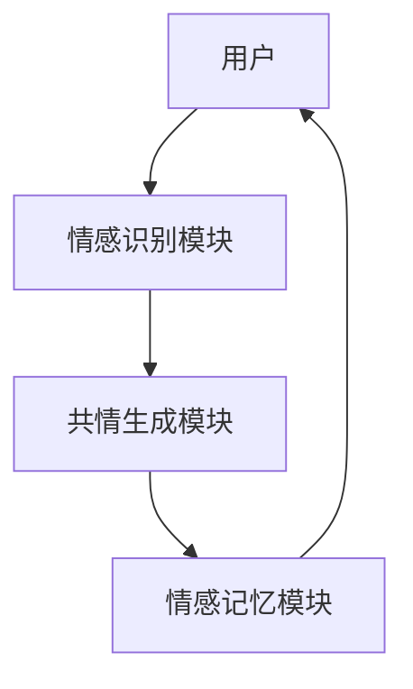

                 


# AI Agent的同理心模拟：增强LLM的情感共鸣能力

## 关键词：AI Agent, 同理心模拟, LLM, 情感共鸣, 情感识别, 情感记忆, 共情生成

## 摘要：  
本文探讨了AI Agent的同理心模拟技术，旨在增强大语言模型（LLM）的情感共鸣能力。通过分析情感识别、共情生成和情感记忆的核心原理，结合实际应用场景，本文详细阐述了如何通过算法和系统设计实现AI Agent的同理心模拟。文章从背景介绍、核心概念、算法原理、系统架构到项目实战，全面解析了同理心模拟的关键技术，并提供了具体的实现方案和案例分析，为AI Agent的开发提供了理论和实践指导。

---

# 第1章 同理心模拟与LLM情感共鸣概述

## 1.1 同理心模拟的背景与意义

### 1.1.1 问题背景：LLM情感共鸣的局限性  
大语言模型（LLM）在自然语言处理领域取得了显著进展，但其情感共鸣能力仍存在明显局限性。用户在与AI Agent交互时，期望得到更贴近人类情感的回应，而当前的LLM往往缺乏对情感语境的深度理解和情感记忆能力。

### 1.1.2 问题描述：用户对情感共鸣的需求  
用户在与AI Agent交互时，不仅希望得到准确的信息回复，还希望感受到AI Agent能够理解自己的情感状态，并做出相应的回应。这种需求在情感支持、教育辅助、医疗咨询等领域尤为重要。

### 1.1.3 问题解决：同理心模拟的核心作用  
同理心模拟技术通过模拟人类的共情能力，使AI Agent能够识别、理解和回应用户的情感需求，从而增强LLM的情感共鸣能力。这一技术能够显著提升用户体验，使其更加自然和人性化。

### 1.1.4 边界与外延：同理心模拟的适用范围  
同理心模拟主要用于情感支持、教育辅助、医疗咨询等领域，适用于需要深度情感交互的场景。其边界包括但不限于情感识别、共情生成和情感记忆，但不涉及具体的情感计算或情感分析。

### 1.1.5 概念结构与核心要素：同理心模拟的组成  
同理心模拟的核心要素包括：  
1. **情感识别**：识别用户的情感状态。  
2. **共情生成**：基于情感识别生成相应的回应。  
3. **情感记忆**：记录用户的情感历史，以优化未来的交互。

## 1.2 同理心模拟的核心概念

### 1.2.1 同理心模拟的定义  
同理心模拟是指通过技术手段，使AI Agent能够理解和模拟人类的情感状态，并在交互中做出相应的情感回应。

### 1.2.2 LLM情感共鸣能力的现状  
当前的LLM在情感共鸣能力方面存在以下问题：  
1. 情感识别的准确性不足。  
2. 缺乏情感记忆能力。  
3. 共情生成的能力有限。

### 1.2.3 同理心模拟与情感共鸣的关系  
同理心模拟是实现情感共鸣的核心技术之一，通过模拟人类的共情能力，使AI Agent能够更好地理解用户的情感需求，并做出相应的回应。

## 1.3 同理心模拟的应用场景

### 1.3.1 情感支持与陪伴  
在心理健康咨询、情感支持等领域，同理心模拟能够帮助用户缓解情感压力，提供情感支持。

### 1.3.2 教育与学习辅助  
在教育领域，同理心模拟可以帮助学生更好地理解情感相关的知识，提供个性化的学习支持。

### 1.3.3 医疗与心理健康服务  
在医疗领域，同理心模拟可以辅助医生更好地理解患者的情感状态，提供更个性化的治疗方案。

### 1.3.4 商业与客户服务  
在商业领域，同理心模拟可以帮助企业更好地理解客户的情感需求，提供更优质的服务。

## 1.4 本章小结  
本章介绍了同理心模拟的背景、核心概念和应用场景，为后续的技术实现奠定了基础。

---

# 第2章 同理心模拟的原理与机制

## 2.1 同理心模拟的原理

### 2.1.1 情感识别与理解  
情感识别是同理心模拟的第一步，通过分析用户的语言、语调和语境，识别其情感状态。常用的情感识别方法包括基于词典的方法和基于深度学习的方法。

#### 2.1.1.1 基于词典的情感识别方法  
使用情感词典（如AFINN、VADER）对文本进行情感评分，识别用户的情感倾向。

#### 2.1.1.2 基于深度学习的情感识别方法  
使用预训练的模型（如BERT、GPT）对文本进行情感分类，识别用户的情感状态。

### 2.1.2 共情生成与表达  
基于情感识别结果，生成符合用户情感需求的回应。共情生成需要结合用户的上下文和情感状态，生成个性化的情感回应。

### 2.1.3 情感记忆与学习  
记录用户的情感历史，优化未来的交互。情感记忆可以通过记忆网络或强化学习实现。

---

## 2.2 同理心模拟的核心机制

### 2.2.1 情感识别算法

#### 2.2.1.1 情感识别的数学模型  
情感识别可以通过以下数学模型实现：  
$$ P(y|x) = \frac{P(x|y)}{P(x)} $$  
其中，$y$ 表示情感类别，$x$ 表示输入文本。

#### 2.2.1.2 情感识别的实现步骤  
1. 文本预处理：分词、去停用词。  
2. 特征提取：使用词袋模型或词嵌入模型。  
3. 情感分类：使用机器学习或深度学习模型进行分类。

#### 2.2.1.3 情感识别的代码示例  
```python
def情感识别（输入文本）：
    1. 预处理文本
    2. 提取特征
    3. 分类器预测
    4. 返回情感类别
```

### 2.2.2 情感共鸣生成的算法

#### 2.2.2.1 情感共鸣生成的数学模型  
情感共鸣生成可以通过以下公式实现：  
$$ R(y|x) = f(x) + g(y) $$  
其中，$f(x)$ 表示对输入文本的解析，$g(y)$ 表示情感生成函数。

#### 2.2.2.2 情感共鸣生成的实现步骤  
1. 解析用户情感需求。  
2. 生成符合情感需求的回应。  
3. 返回情感共鸣的回应。

#### 2.2.2.3 情感共鸣生成的代码示例  
```python
def情感共鸣生成（输入文本）：
    1. 解析情感需求
    2. 生成情感回应
    3. 返回情感回应
```

### 2.2.3 情感记忆机制

#### 2.2.3.1 情感记忆的数学模型  
情感记忆可以通过以下公式实现：  
$$ M(y|x) = \sum_{i=1}^{n} w_i \cdot f(x_i) $$  
其中，$w_i$ 表示权重，$f(x_i)$ 表示对历史情感的解析。

#### 2.2.3.2 情感记忆的实现步骤  
1. 记录用户情感历史。  
2. 分析情感历史，优化情感识别和生成。  
3. 返回优化后的回应。

#### 2.2.3.3 情感记忆的代码示例  
```python
def情感记忆（输入文本，历史情感）：
    1. 分析历史情感
    2. 优化情感识别和生成
    3. 返回优化后的回应
```

---

# 第3章 同理心模拟的系统分析与架构设计

## 3.1 问题场景介绍

### 3.1.1 项目背景  
本项目旨在开发一个具备同理心模拟能力的AI Agent，以增强LLM的情感共鸣能力。

### 3.1.2 系统功能设计  
系统功能包括：  
1. 情感识别模块。  
2. 共情生成模块。  
3. 情感记忆模块。  

---

## 3.2 系统架构设计

### 3.2.1 系统架构图  


### 3.2.2 接口设计  
系统接口包括：  
1. `POST /api/emotion/recognize`：接收用户输入，返回情感识别结果。  
2. `POST /api/emotion/generate`：接收情感识别结果，返回情感共鸣生成的回应。  
3. `POST /api/emotion/memory`：接收用户输入和情感回应，记录情感记忆。  

---

## 3.3 项目实战

### 3.3.1 环境安装  
安装以下依赖：  
1. Python 3.8+。  
2. TensorFlow 2.0+。  
3. Hugging Face库。  

### 3.3.2 核心代码实现

#### 3.3.2.1 情感识别模块  
```python
def 情感识别（输入文本）：
    1. 预处理文本
    2. 提取特征
    3. 分类器预测
    4. 返回情感类别
```

#### 3.3.2.2 共情生成模块  
```python
def 情感共鸣生成（输入文本）：
    1. 解析情感需求
    2. 生成情感回应
    3. 返回情感回应
```

#### 3.3.2.3 情感记忆模块  
```python
def 情感记忆（输入文本，历史情感）：
    1. 分析历史情感
    2. 优化情感识别和生成
    3. 返回优化后的回应
```

### 3.3.3 代码解读与分析  
1. 情感识别模块：使用预训练的情感分类模型，识别用户情感状态。  
2. 情感共鸣生成模块：根据情感识别结果，生成符合情感需求的回应。  
3. 情感记忆模块：记录用户情感历史，优化未来的交互。

### 3.3.4 实际案例分析  
假设用户输入：“我感到非常悲伤。”  
1. 情感识别模块识别出用户的情感为“悲伤”。  
2. 情感共鸣生成模块生成回应：“我很抱歉你现在感到悲伤，有什么我可以帮助你的吗？”  
3. 情感记忆模块记录用户的悲伤情绪，优化未来的交互。

### 3.3.5 项目小结  
本项目通过实现情感识别、共情生成和情感记忆模块，成功提升了AI Agent的情感共鸣能力。

---

# 第4章 同理心模拟的总结与展望

## 4.1 总结  
本文详细探讨了AI Agent的同理心模拟技术，从情感识别、共情生成到情感记忆，全面解析了同理心模拟的核心原理和实现方法。

## 4.2 展望  
未来的研究方向包括：  
1. 提高情感识别的准确性。  
2. 优化情感共鸣生成的算法。  
3. 增强情感记忆的能力。  
4. 探讨同理心模拟在更多领域的应用。

---

# 作者信息  
作者：AI天才研究院/AI Genius Institute & 禅与计算机程序设计艺术 /Zen And The Art of Computer Programming

