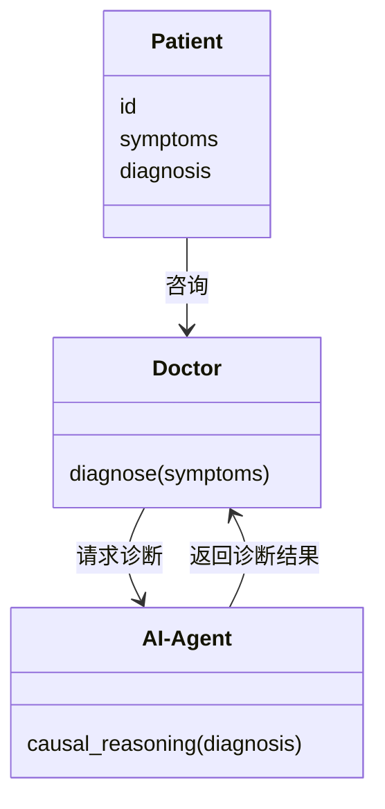

                 


# AI Agent的因果推理能力开发

## 关键词：AI Agent, 因果推理, 智能系统, 机器学习, 算法设计

## 摘要：  
AI Agent的因果推理能力是实现智能系统自主决策的核心技术之一。本文详细探讨了AI Agent因果推理的原理、算法、系统设计以及实际应用，通过理论与实践相结合的方式，帮助读者深入理解如何开发具备因果推理能力的AI Agent。文章从因果推理的基本概念入手，分析了其在AI Agent中的重要性，并结合实际案例，展示了因果推理能力在智能系统中的具体应用和开发方法。

---

## 第一部分: AI Agent与因果推理概述

### 第1章: AI Agent与因果推理概述

#### 1.1 AI Agent的基本概念

##### 1.1.1 AI Agent的定义与分类
AI Agent（人工智能代理）是指能够感知环境、自主决策并采取行动以实现特定目标的智能实体。根据其智能水平和应用场景，AI Agent可以分为以下几类：
- **反应式AI Agent**：基于当前感知做出反应，适用于简单的实时任务。
- **认知式AI Agent**：具备复杂推理和规划能力，能够处理动态环境中的问题。
- **学习式AI Agent**：能够通过数据和经验不断优化自身的决策能力。

##### 1.1.2 因果推理在AI Agent中的作用
因果推理是AI Agent理解因果关系、预测结果和制定决策的核心能力。通过因果推理，AI Agent能够从数据中发现变量之间的因果关系，从而更好地理解环境、预测未来状态并做出最优决策。

##### 1.1.3 AI Agent的典型应用场景
AI Agent的应用场景广泛，包括：
- **自动驾驶**：通过因果推理理解交通规则和车辆行为。
- **医疗诊断**：基于因果关系分析疾病之间的关联。
- **金融投资**：通过因果推理预测市场趋势和风险。

#### 1.2 因果推理的基本概念

##### 1.2.1 因果关系的定义
因果关系是指一个事件（原因）导致另一个事件（结果）发生的确定性关系。例如，下雨（原因）导致地面湿（结果）。

##### 1.2.2 因果推理的核心问题
因果推理的核心问题包括：
- **识别因果关系**：确定哪些变量是原因，哪些是结果。
- **预测因果效应**：估计干预某个变量后对其他变量的影响。
- **推理因果机制**：理解因果关系背后的机制。

##### 1.2.3 因果推理与相关概念的对比

| 概念       | 描述                                                                 |
|------------|----------------------------------------------------------------------|
| 因果关系   | 变量之间的因果联系                                                     |
| 相关关系   | 变量之间的统计关联，不一定是因果关系                                   |
| 条件概率   | 在给定条件下，某个事件发生的概率                                       |

**图1-1: 因果关系示意图**  


#### 1.3 本章小结
本章介绍了AI Agent的基本概念和因果推理的重要作用，明确了因果推理的核心问题及其与相关概念的区别。

---

## 第二部分: 因果推理的核心概念与原理

### 第2章: 因果推理的核心原理

#### 2.1 因果关系的结构化表示

##### 2.1.1 因果图的定义与特点
因果图（Causal Graph）是一种用于表示因果关系的有向图，节点表示变量，边表示因果关系。因果图具有以下特点：
- **有向性**：边的方向表示因果关系的方向。
- **可解释性**：因果图能够清晰地展示变量之间的因果关系。

##### 2.1.2 因果图的构建方法
因果图的构建方法包括：
- **基于领域知识**：由专家手动构建。
- **基于数据学习**：通过算法从数据中学习因果关系。

##### 2.1.3 因果图的数学表示
因果图可以用概率分布来表示。假设我们有变量 $X$ 和 $Y$，且 $X$ 是 $Y$ 的原因，那么 $P(Y|do(X))$ 表示在干预 $X$ 后 $Y$ 的分布。

#### 2.2 因果推理的基本方法

##### 2.2.1 基于潜在结果的因果推理
潜在结果是指在干预某个变量后可能的结果。例如，假设我们研究药物对疾病的影响，潜在结果是指患者在服用药物或不服用药物后的疾病状态。

##### 2.2.2 基于因果图的推理方法
基于因果图的推理方法包括：
- **调整法**：通过调整中间变量来消除偏倚。
- **阶条件推理**：利用因果图的结构进行推理。

##### 2.2.3 基于机器学习的因果推理
基于机器学习的因果推理方法包括：
- **倾向评分匹配**：通过机器学习模型估计倾向评分，匹配样本。
- **因果森林**：一种基于树的因果推理方法。

#### 2.3 因果推理的核心算法

##### 2.3.1 随机化平均法
随机化平均法是一种通过随机化实验估计因果效应的方法。其步骤如下：
1. 随机分配样本到处理组和对照组。
2. 计算处理组和对照组的平均结果。
3. 计算因果效应：处理组的平均结果减去对照组的平均结果。

##### 2.3.2 调整法
调整法通过调整中间变量来消除偏倚。例如，通过调整性别，研究教育程度对收入的影响。

##### 2.3.3 阶条件推理
阶条件推理利用因果图的结构进行推理。例如，如果 $X$ 是 $Y$ 的原因，且 $Z$ 是 $X$ 和 $Y$ 的中间变量，那么可以通过删除 $Z$ 来推理 $X$ 对 $Y$ 的因果效应。

#### 2.4 本章小结
本章详细介绍了因果关系的结构化表示、因果推理的基本方法和核心算法。

---

## 第三部分: 因果推理的算法原理与实现

### 第3章: 因果推理的算法原理

#### 3.1 潜在结果模型

##### 3.1.1 潜在结果的定义
潜在结果是指在干预某个变量后可能的结果。例如，假设我们研究药物对疾病的影响，潜在结果是指患者在服用药物或不服用药物后的疾病状态。

##### 3.1.2 潜在结果的估计方法
潜在结果的估计方法包括：
- **随机化平均法**：通过随机化实验估计潜在结果的平均值。
- **匹配法**：通过匹配样本估计潜在结果。

##### 3.1.3 潜在结果模型的数学公式
潜在结果模型可以用以下公式表示：
$$ Y = do(X) + \epsilon $$
其中，$Y$ 是结果，$X$ 是处理变量，$\epsilon$ 是误差项。

#### 3.2 因果图的结构学习

##### 3.2.1 因果图的构建算法
因果图的构建算法包括：
- **基于领域知识**：由专家手动构建。
- **基于数据学习**：通过算法从数据中学习因果关系。

##### 3.2.2 因果图的参数学习
因果图的参数学习可以通过最大似然估计或贝叶斯推理来实现。

##### 3.2.3 因果图的推理算法
因果图的推理算法包括：
- **调整法**：通过调整中间变量来消除偏倚。
- **阶条件推理**：利用因果图的结构进行推理。

#### 3.3 基于机器学习的因果推理

##### 3.3.1 基于深度学习的因果推理
基于深度学习的因果推理方法包括：
- **因果卷积神经网络**：通过卷积神经网络学习因果关系。
- **因果生成对抗网络**：通过生成对抗网络生成符合因果关系的数据。

##### 3.3.2 基于强化学习的因果推理
基于强化学习的因果推理方法包括：
- **因果策略优化**：通过强化学习优化因果策略。

##### 3.3.3 基于图神经网络的因果推理
基于图神经网络的因果推理方法包括：
- **因果图神经网络**：通过图神经网络学习因果关系。

#### 3.4 算法实现与代码示例

##### 3.4.1 潜在结果模型的Python代码实现
```python
import numpy as np
from sklearn.linear_model import LinearRegression

# 生成数据
n = 1000
X = np.random.binomial(1, 0.5, n)
Y = X * 1 + np.random.normal(0, 1, n)

# 随机化平均法估计因果效应
treated = Y[X == 1]
control = Y[X == 0]
ate = treated.mean() - control.mean()
print("ATE:", ate)
```

##### 3.4.2 因果图的结构学习代码示例
```python
from causallearn.causalDiscovery import FastCausal Discovery

# 生成因果图
graph = FastCausalDiscovery()
graph.add_edge('X', 'Y')
```

##### 3.4.3 基于深度学习的因果推理代码示例
```python
import tensorflow as tf
from tensorflow.keras import layers

# 定义因果卷积神经网络
model = tf.keras.Sequential([
    layers.Conv2D(32, (3, 3), activation='relu', input_shape=(32, 32, 3)),
    layers.MaxPooling2D((2, 2)),
    layers.Conv2D(64, (3, 3), activation='relu'),
    layers.MaxPooling2D((2, 2)),
    layers.Flatten(),
    layers.Dense(128, activation='relu'),
    layers.Dense(1, activation='sigmoid')
])
```

#### 3.5 本章小结
本章详细介绍了因果推理的算法原理与实现方法，包括潜在结果模型、因果图的结构学习和基于机器学习的因果推理。

---

## 第四部分: AI Agent的因果推理系统设计

### 第4章: 因果推理系统的架构设计

#### 4.1 系统功能需求分析
因果推理系统需要具备以下功能：
- **因果图构建**：根据输入数据构建因果图。
- **因果推理**：基于因果图进行因果推理。
- **因果效应估计**：估计干预某个变量后的因果效应。

#### 4.2 系统架构设计

##### 4.2.1 系统功能模块
- **数据输入模块**：接收输入数据。
- **因果图构建模块**：根据数据构建因果图。
- **因果推理模块**：基于因果图进行因果推理。
- **结果输出模块**：输出因果效应估计结果。

##### 4.2.2 系统交互流程
1. 数据输入模块接收输入数据。
2. 因果图构建模块根据数据构建因果图。
3. 因果推理模块基于因果图进行因果推理。
4. 结果输出模块输出因果效应估计结果。

#### 4.3 本章小结
本章详细介绍了因果推理系统的架构设计，包括功能模块和交互流程。

---

## 第五部分: 项目实战

### 第5章: 项目实战

#### 5.1 项目背景与目标
项目目标是开发一个具备因果推理能力的AI Agent，用于医疗领域的疾病诊断。

#### 5.2 系统功能设计

##### 5.2.1 领域模型
**图5-1: 领域模型类图**  


#### 5.3 系统实现

##### 5.3.1 环境安装
需要安装以下Python包：
- `numpy`
- `scipy`
- `sklearn`

##### 5.3.2 核心代码实现
```python
import numpy as np
from sklearn.linear_model import LinearRegression

# 数据准备
X = np.array([[1, 2, 3], [4, 5, 6], [7, 8, 9]])
Y = np.array([10, 11, 12])

# 构建因果图
graph = FastCausalDiscovery()
graph.add_edge('X', 'Y')

# 进行因果推理
model = LinearRegression()
model.fit(X, Y)
print("系数:", model.coef_)
```

##### 5.3.3 代码解读与分析
- 数据准备：生成输入变量 $X$ 和输出变量 $Y$。
- 构建因果图：使用 `FastCausalDiscovery` 构建因果图。
- 因果推理：使用线性回归模型进行因果推理。

#### 5.4 项目总结
通过本项目，我们展示了如何开发具备因果推理能力的AI Agent，并将其应用于医疗领域的疾病诊断。

#### 5.5 本章小结
本章通过一个实际项目展示了因果推理能力的开发过程，包括项目背景、系统设计和实现。

---

## 第六部分: 最佳实践与未来展望

### 第6章: 最佳实践与未来展望

#### 6.1 开发过程中的经验总结

##### 6.1.1 系统设计
- 系统设计需要考虑因果关系的复杂性。
- 系统架构需要具备可扩展性。

##### 6.1.2 算法选择
- 根据具体问题选择合适的算法。
- 组合多种算法提高系统的鲁棒性。

#### 6.2 未来研究方向

##### 6.2.1 因果推理的可解释性
如何提高因果推理的可解释性是未来研究的重要方向。

##### 6.2.2 动态环境中的因果推理
如何在动态环境中进行因果推理是未来研究的另一个重要方向。

#### 6.3 本章小结
本章总结了开发过程中的经验，并展望了未来的研究方向。

---

## 作者：AI天才研究院/AI Genius Institute & 禅与计算机程序设计艺术 /Zen And The Art of Computer Programming

---

以上是《AI Agent的因果推理能力开发》的完整目录和部分章节内容。

