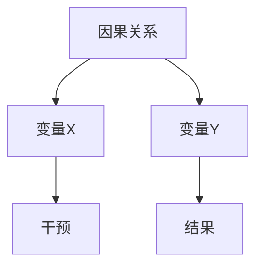
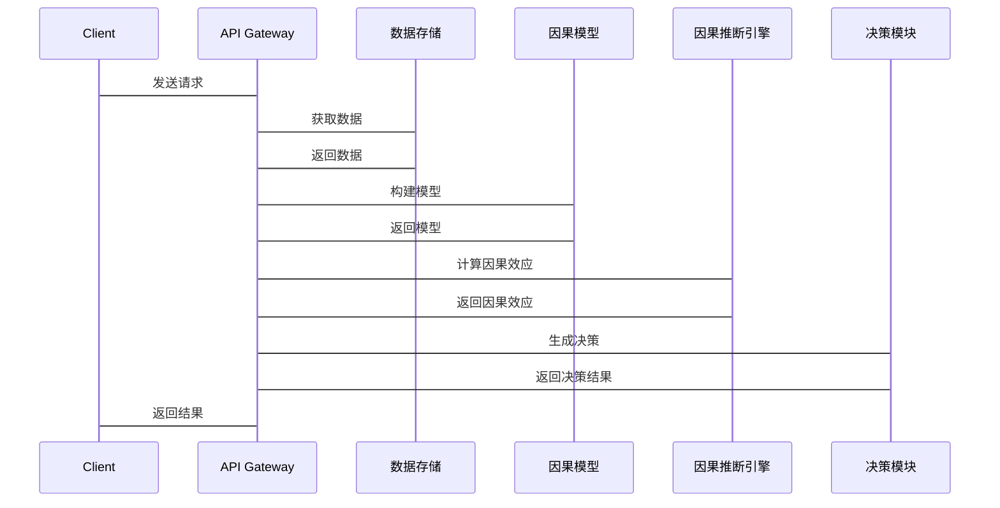

                 


# AI Agent的因果推理：增强决策的逻辑性

## 关键词：AI Agent, 因果推理, 决策逻辑性, 算法原理, 系统架构

## 摘要：  
本文深入探讨AI Agent如何通过因果推理来增强决策的逻辑性。从背景介绍到核心概念，从算法原理到系统架构，再到项目实战，全面解析因果推理在AI决策中的应用。通过详细讲解因果关系的类型、因果图模型、潜在结果框架等，结合Python代码示例和数学模型，展示如何通过因果推理提升AI Agent的决策能力。本文还提供了系统设计和实际案例分析，帮助读者理解并应用这些方法。

---

## 第1章: 背景介绍

### 1.1 问题背景
#### 1.1.1 决策逻辑性的重要性
在复杂的现实环境中，AI Agent需要做出高效且可靠的决策。决策的逻辑性直接影响系统的准确性和效率。传统的基于统计的相关性分析难以捕捉变量间的因果关系，导致决策容易受到干扰因素的影响。

#### 1.1.2 当前决策系统的局限性
当前的决策系统主要依赖相关性分析，无法准确区分因果关系，容易受到外部干扰和偏差的影响。例如，在医疗领域，基于相关性的分析可能会错误地将某些症状与疾病直接关联，而忽略了潜在的因果链。

#### 1.1.3 因果推理在决策中的作用
因果推理能够帮助AI Agent识别变量间的因果关系，从而更准确地预测结果和制定策略。通过因果推理，AI Agent可以更好地理解因果链，做出更具逻辑性和可靠性的决策。

### 1.2 问题描述
#### 1.2.1 AI Agent的核心任务
AI Agent的核心任务是通过感知环境、分析信息、推理因果关系，做出最优决策。要实现这一点，因果推理是关键。

#### 1.2.2 因果推理的定义与特征
因果推理是指通过分析变量间的因果关系，推断出变量变化对结果的影响。其特征包括可解释性、可干预性和逻辑性。

#### 1.2.3 决策逻辑性增强的目标
增强决策逻辑性的目标是使AI Agent在复杂环境中做出更准确、更可靠的决策，减少误判和偏差。

### 1.3 问题解决
#### 1.3.1 因果推理的关键作用
因果推理能够帮助AI Agent识别因果关系，避免相关性分析的误导。例如，在金融领域，因果推理可以帮助识别真正影响股价的因素。

#### 1.3.2 增强决策逻辑性的方法
通过因果图模型、潜在结果框架等方法，AI Agent可以更准确地分析因果关系，增强决策的逻辑性。

#### 1.3.3 AI Agent的因果推理框架
AI Agent的因果推理框架包括数据收集、因果建模、干预分析和结果预测四个阶段。

### 1.4 边界与外延
#### 1.4.1 因果推理的适用范围
因果推理适用于需要明确因果关系的领域，如医疗、金融、教育等。

#### 1.4.2 决策逻辑性的边界条件
决策逻辑性的边界条件包括数据质量、模型复杂度和环境动态性等因素。

#### 1.4.3 相关概念的区分
相关概念包括相关性、因果性、可解释性等。需要明确区分相关性和因果性，避免混淆。

### 1.5 概念结构与核心要素
#### 1.5.1 因果推理的核心要素
因果推理的核心要素包括因果关系、因果链、因果网络等。

#### 1.5.2 AI Agent的决策模型
AI Agent的决策模型包括感知、推理、决策和执行四个阶段。

#### 1.5.3 逻辑性增强的实现路径
通过因果图模型、潜在结果框架等方法，增强决策的逻辑性。

---

## 第2章: 因果推理的核心概念与联系

### 2.1 因果推理的原理
#### 2.1.1 因果关系的类型
因果关系的类型包括直接因果关系、间接因果关系和共同原因等。

#### 2.1.2 因果图模型
因果图模型通过有向图表示变量间的因果关系，是因果推理的重要工具。

#### 2.1.3 马尔可夫边界与因果推断
马尔可夫边界通过限制条件独立性，帮助简化因果推断的复杂性。

### 2.2 因果推理与相关概念对比
#### 2.2.1 相关性与因果性的区别
相关性衡量变量间的统计关联，而因果性衡量变量间的因果关系。

#### 2.2.2 独立性与条件独立性的联系
独立性是条件独立性的一种特例，条件独立性更广泛。

#### 2.2.3 因果链与因果网络的差异
因果链是线性因果关系，而因果网络是复杂因果关系的网络表示。

### 2.3 实体关系图（ER图）架构


---

## 第3章: 因果推理的算法原理

### 3.1 潜在结果框架
#### 3.1.1 潜在结果的定义
潜在结果是指在不同干预下变量可能的结果。

#### 3.1.2 潜在结果框架的实现
潜在结果框架通过构建因果图模型，识别变量间的因果关系。

#### 3.1.3 潜在结果框架的优缺点
优点是能够准确识别因果关系，缺点是计算复杂度较高。

### 3.2 结构学习算法
#### 3.2.1 结构学习算法的分类
结构学习算法包括基于评分的算法和基于搜索的算法。

#### 3.2.2 结构学习算法的实现步骤
1. 收集数据
2. 构建候选图结构
3. 计算每个结构的评分
4. 选择最优结构

#### 3.2.3 结构学习算法的数学模型
$$ P(y|x, pa_x) = \prod_{x} P(y|x, pa_x) $$

### 3.3 因果推断的实现
#### 3.3.1 因果推断的步骤
1. 构建因果图模型
2. 确定干预变量
3. 计算因果效应

#### 3.3.2 因果推断的Python实现
```python
import causallearn as cl
from causallearn.model import CausalModel
from causallearn.estimator import DoWhy

# 创建因果模型
model = CausalModel(...)
# 估计因果效应
estimator = DoWhy()
effect = estimator.estimate_effect(model)
print(effect)
```

#### 3.3.3 因果推断的数学公式
$$ P(y|do(x)) = \sum_{pa_x} P(y|x, pa_x) P(pa_x) $$

---

## 第4章: 系统分析与架构设计

### 4.1 系统应用场景
#### 4.1.1 医疗领域
因果推理可以用于疾病诊断和治疗方案选择。

#### 4.1.2 金融领域
因果推理可以用于风险评估和投资决策。

#### 4.1.3 教育领域
因果推理可以用于教学策略优化和学生绩效预测。

### 4.2 系统功能设计
#### 4.2.1 数据采集与处理
AI Agent需要采集多源数据，并进行清洗和预处理。

#### 4.2.2 因果模型构建
通过结构学习算法，构建因果图模型。

#### 4.2.3 因果效应计算
通过因果推断算法，计算干预变量的因果效应。

### 4.3 系统架构设计


### 4.4 系统接口设计
#### 4.4.1 数据接口
- 输入接口：接收多源数据
- 输出接口：返回处理后的数据

#### 4.4.2 因果模型接口
- 输入接口：接收数据和参数
- 输出接口：返回因果模型

#### 4.4.3 决策接口
- 输入接口：接收干预变量
- 输出接口：返回决策结果

### 4.5 系统交互流程


---

## 第5章: 项目实战

### 5.1 环境安装
安装必要的Python库，如`causallearn`和`pymc`.

### 5.2 核心代码实现
```python
import causallearn as cl
from causallearn.model import CausalModel
from causallearn.estimator import DoWhy

# 创建因果模型
model = CausalModel(...)
# 估计因果效应
estimator = DoWhy()
effect = estimator.estimate_effect(model)
print(effect)
```

### 5.3 案例分析
以医疗领域的疾病诊断为例，展示因果推理的应用。

### 5.4 项目总结
总结项目实现的过程和成果，分析可能的优化方向。

---

## 第6章: 最佳实践与总结

### 6.1 最佳实践
- 确保数据质量
- 合理选择算法
- 定期更新模型

### 6.2 小结
因果推理是增强AI Agent决策逻辑性的重要工具，通过因果图模型和潜在结果框架，可以更准确地分析因果关系。

### 6.3 注意事项
- 避免过度简化因果关系
- 注意数据偏差和模型假设

### 6.4 拓展阅读
推荐相关书籍和论文，鼓励读者深入学习。

---

## 作者：AI天才研究院/AI Genius Institute & 禅与计算机程序设计艺术 /Zen And The Art of Computer Programming

---

通过以上内容，我们系统地介绍了AI Agent的因果推理在增强决策逻辑性中的应用。从理论到实践，从算法到系统设计，全面解析了因果推理的核心概念和实现方法，帮助读者更好地理解和应用这些技术。

