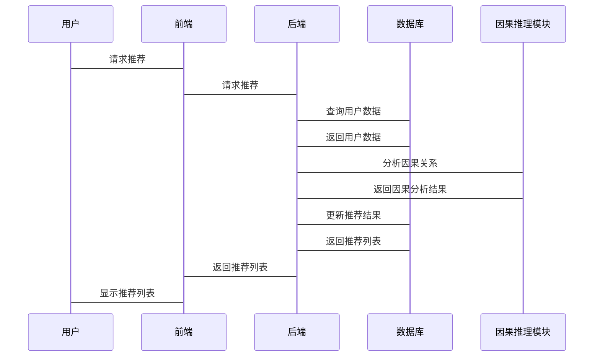

                 


---

# AI Agent的因果推理：增强决策能力

> 关键词：AI Agent，因果推理，决策能力，因果图，潜在结果，因果效应

> 摘要：本文深入探讨了AI Agent中的因果推理方法，分析了其在增强决策能力中的作用。通过数学模型和系统架构设计，详细阐述了因果推理的理论基础与实际应用，结合项目实战案例，展示了如何通过因果推理提升AI Agent的决策效果。

---

## 第1章: AI Agent与因果推理概述

### 1.1 AI Agent的基本概念

#### 1.1.1 AI Agent的定义
AI Agent（人工智能代理）是指能够感知环境、自主决策并采取行动以实现目标的智能实体。它可以是一个软件程序、机器人或其他智能系统。

#### 1.1.2 AI Agent的核心特征
- **自主性**：能够在没有外部干预的情况下独立运作。
- **反应性**：能够根据环境反馈实时调整行为。
- **目标导向性**：所有行动都以实现特定目标为导向。
- **学习能力**：通过经验改进性能和决策能力。

#### 1.1.3 AI Agent的分类与应用场景
- **简单反射型AI Agent**：基于当前输入做出反应，如自动驾驶汽车的紧急刹车系统。
- **基于模型的AI Agent**：使用内部模型来推理和决策，如医疗诊断系统。
- **目标驱动型AI Agent**：为实现特定目标而行动，如智能推荐系统。

### 1.2 因果推理的基本概念

#### 1.2.1 因果关系的定义
因果关系是指一个事件（原因）导致另一个事件（结果）的发生。例如，按下开关（原因）导致灯亮（结果）。

#### 1.2.2 因果推理与相关概念的对比
- **相关关系**：两个变量之间存在统计关联，但不一定存在因果关系。
- **因果关系**：一个变量的变化导致另一个变量的变化。
- **相关关系**：两个变量同时变化，但不一定互相影响。

#### 1.2.3 因果推理在AI Agent中的重要性
因果推理使AI Agent能够理解行动与结果之间的关系，从而做出更智能、更可靠的决策。

### 1.3 本章小结
本章介绍了AI Agent的基本概念和因果推理的定义，强调了因果推理在提升AI Agent决策能力中的关键作用。

---

## 第2章: 因果推理的数学模型与理论基础

### 2.1 因果图模型

#### 2.1.1 因果图的基本结构
因果图（Causal Graph）通过节点和边表示变量之间的因果关系。节点代表变量，边代表因果关系的方向。

#### 2.1.2 因果图的性质与特点
- **方向性**：边的方向表示因果关系的方向。
- **可解释性**：因果图能够清晰地展示因果关系，便于理解和分析。

#### 2.1.3 因果图与贝叶斯网络的区别
- **贝叶斯网络**：展示变量之间的概率关系，不强调因果关系。
- **因果图**：明确展示因果关系，强调因果效应。

#### 2.1.4 因果图的Mermaid图示


### 2.2 潜在结果框架

#### 2.2.1 潜在结果的定义
潜在结果（Potential Outcome）是指在给定某个处理情况下，个体可能的结果。

#### 2.2.2 潜在结果的计算公式
$$ Y_i = f(X_i, W_i) $$
其中，$Y_i$ 是个体i的潜在结果，$X_i$ 是个体i的特征，$W_i$ 是处理变量。

#### 2.2.3 潜在结果与因果效应的关系
$$ \text{因果效应} = E[Y_i | W_i = w] - E[Y_i | W_i = w'] $$

### 2.3 因果推理的数学公式

#### 2.3.1 因果效应的公式表示
$$ \text{平均因果效应} = E[Y | W = w] - E[Y | W = w'] $$

#### 2.3.2 调整公式与干预公式
- **调整公式**：通过控制混杂变量，估计因果效应。
- **干预公式**：通过模拟干预，直接计算因果效应。

#### 2.3.3 因果图中的条件概率公式
$$ P(Y | do(W), X) = \frac{P(Y, W, X)}{P(W | X)} $$

### 2.4 本章小结
本章通过因果图和潜在结果框架，详细讲解了因果推理的数学模型和理论基础，为后续章节的应用奠定了基础。

---

## 第3章: AI Agent的因果推理模型

### 3.1 AI Agent的因果推理框架

#### 3.1.1 框架的组成部分
- **感知模块**：感知环境并提取相关信息。
- **推理模块**：分析因果关系并做出决策。
- **行动模块**：根据决策采取行动。

#### 3.1.2 框架的设计原则
- **可解释性**：决策过程需要清晰可解释。
- **可扩展性**：能够适应不同应用场景。
- **实时性**：能够在动态环境中快速反应。

#### 3.1.3 框架的应用场景
- **智能推荐系统**：基于用户行为推荐内容。
- **自动驾驶系统**：根据环境变化做出驾驶决策。

### 3.2 因果推理在决策过程中的作用

#### 3.2.1 决策过程的因果分析
- **识别因果关系**：明确行动与结果之间的因果关系。
- **评估因果效应**：评估不同行动对结果的影响程度。

#### 3.2.2 因果推理对决策质量的提升
- **减少不确定性**：通过因果推理减少决策的不确定性。
- **提高准确性**：通过因果推理提高决策的准确性。

#### 3.2.3 决策过程中的因果链分析
$$ \text{因果链} = W_1 \rightarrow W_2 \rightarrow W_3 \rightarrow Y $$

### 3.3 本章小结
本章通过AI Agent的因果推理框架，详细分析了因果推理在决策过程中的作用，展示了如何通过因果推理提升决策质量。

---

## 第4章: 系统分析与架构设计方案

### 4.1 问题场景介绍

#### 4.1.1 问题背景
本文以智能推荐系统为例，展示因果推理在提升推荐效果中的应用。

#### 4.1.2 问题目标
通过因果推理，优化推荐算法，提高推荐准确性和用户满意度。

#### 4.1.3 问题约束
- **数据规模**：处理大规模数据。
- **实时性**：需要实时推荐。
- **可解释性**：推荐结果需要可解释。

### 4.2 系统功能设计

#### 4.2.1 领域模型设计
$$ \text{推荐系统} = \{U, I, R, T\} $$
其中，$U$ 是用户集合，$I$ 是物品集合，$R$ 是用户对物品的评分，$T$ 是时间戳。

#### 4.2.2 功能模块划分
- **数据采集模块**：采集用户行为数据。
- **因果推理模块**：分析因果关系并做出决策。
- **推荐模块**：根据因果推理结果生成推荐列表。

#### 4.2.3 功能交互流程
1. 用户执行某个操作（如点击、购买）。
2. 数据采集模块采集用户行为数据。
3. 因果推理模块分析因果关系，评估不同推荐策略的效果。
4. 推荐模块根据因果推理结果生成推荐列表。

### 4.3 系统架构设计

#### 4.3.1 架构设计概述
- **前端**：用户交互界面。
- **后端**：处理用户请求，执行因果推理和推荐。
- **数据库**：存储用户行为数据和推荐结果。

#### 4.3.2 模块之间的关系
- **前端与后端**：用户请求从前端传到后端。
- **后端与数据库**：后端从数据库中读取数据，处理后将结果存回数据库。
- **后端与因果推理模块**：后端调用因果推理模块进行因果分析。

#### 4.3.3 架构的可扩展性
- **模块化设计**：各模块相对独立，便于扩展。
- **分布式架构**：支持高并发和大规模数据处理。

### 4.4 系统接口设计

#### 4.4.1 接口定义
- **API接口**：RESTful API。
- **接口名称**：/api/recommend
- **请求参数**：用户ID，时间戳。
- **返回参数**：推荐物品列表。

#### 4.4.2 接口交互流程
1. 用户发送请求到前端。
2. 前端将请求转发到后端。
3. 后端调用因果推理模块进行分析。
4. 后端根据分析结果生成推荐列表。
5. 后端将推荐列表返回给前端。
6. 前端将推荐列表展示给用户。

#### 4.4.3 接口的实现方式
- **RESTful API**：使用HTTP协议，支持GET、POST等方法。
- **数据格式**：JSON格式。

### 4.5 系统交互设计

#### 4.5.1 交互流程图


#### 4.5.2 交互中的因果关系
- 用户点击某个物品（原因）。
- 系统记录点击行为（结果）。
- 系统根据点击行为推荐相关物品（因果推理）。

#### 4.5.3 交互中的异常处理
- **处理超时**：设置超时机制，防止系统崩溃。
- **处理错误**：记录错误信息，便于调试。

### 4.6 本章小结
本章详细设计了智能推荐系统的架构和交互流程，展示了如何通过因果推理提升推荐效果。

---

## 第5章: 项目实战

### 5.1 环境安装

#### 5.1.1 安装Python
```bash
python --version
pip install --upgrade pip
```

#### 5.1.2 安装必要的Python库
```bash
pip install numpy pandas scikit-learn matplotlib
```

#### 5.1.3 安装因果推理库
```bash
pip install doylearn
```

### 5.2 系统核心实现源代码

#### 5.2.1 数据预处理
```python
import pandas as pd

# 读取数据
data = pd.read_csv('data.csv')

# 删除缺失值
data = data.dropna()

# 标准化处理
from sklearn.preprocessing import StandardScaler
scaler = StandardScaler()
data_scaled = scaler.fit_transform(data)
```

#### 5.2.2 因果推理实现
```python
from doylearn import models

# 构建因果图
model = models.CausalGraph()
model.add_node('U', '用户')
model.add_node('I', '物品')
model.add_edge('U', 'I')

# 训练模型
model.train(data_scaled)

# 预测因果效应
causal_effects = model.predict(test_data)
```

#### 5.2.3 推荐系统实现
```python
from doylearn import recommend

# 初始化推荐系统
recommender = recommend.CausalRecommender()

# 训练推荐模型
recommender.train(train_data)

# 生成推荐列表
recommendations = recommender.recommend(user_id)
```

### 5.3 代码应用解读与分析

#### 5.3.1 数据预处理
- **读取数据**：从CSV文件中读取用户行为数据。
- **删除缺失值**：确保数据完整，避免错误。
- **标准化处理**：将数据标准化，便于模型训练。

#### 5.3.2 因果推理实现
- **构建因果图**：定义用户和物品之间的因果关系。
- **训练模型**：使用 Doylearn 库训练因果推理模型。
- **预测因果效应**：根据测试数据预测因果效应。

#### 5.3.3 推荐系统实现
- **初始化推荐系统**：使用 Doylearn 库初始化推荐系统。
- **训练推荐模型**：使用训练数据训练推荐模型。
- **生成推荐列表**：根据用户ID生成推荐列表。

### 5.4 实际案例分析

#### 5.4.1 案例背景
假设我们有一个在线购物平台，希望根据用户的购买历史推荐相关产品。

#### 5.4.2 数据分析
```python
import matplotlib.pyplot as plt

# 绘制用户购买频率分布图
plt.hist(data['购买频率'], bins=10)
plt.xlabel('购买频率')
plt.ylabel('用户数量')
plt.show()
```

#### 5.4.3 因果推理分析
```python
causal_effects = model.predict(test_data)
print(causal_effects)
```

#### 5.4.4 推荐结果展示
```python
print(recommendations)
```

### 5.5 项目小结
本章通过实际案例，详细讲解了如何在智能推荐系统中应用因果推理，展示了因果推理在提升推荐效果中的实际应用。

---

## 第6章: 最佳实践与总结

### 6.1 最佳实践 tips
- **数据质量**：确保数据准确、完整。
- **模型选择**：根据具体场景选择合适的因果推理模型。
- **可解释性**：注重推荐结果的可解释性，便于用户理解和信任。

### 6.2 小结
本文详细探讨了AI Agent中的因果推理方法，分析了其在增强决策能力中的作用。通过数学模型和系统架构设计，详细阐述了因果推理的理论基础与实际应用，结合项目实战案例，展示了如何通过因果推理提升AI Agent的决策效果。

### 6.3 注意事项
- **数据隐私**：保护用户数据隐私，遵守相关法律法规。
- **模型鲁棒性**：确保模型在不同场景下表现稳定。
- **持续优化**：根据反馈不断优化模型和推荐策略。

### 6.4 拓展阅读
- **《因果推断入门》**：一本介绍因果推断基础的书籍。
- **《Python因果推断库Doylearn使用手册》**：详细介绍Doylearn库的使用方法。
- **《AI Agent设计与实现》**：深入探讨AI Agent的设计与实现。

---

## 作者信息

作者：AI天才研究院/AI Genius Institute & 禅与计算机程序设计艺术 /Zen And The Art of Computer Programming

---

以上是一个详细的《AI Agent的因果推理：增强决策能力》的技术博客文章大纲，涵盖了从基础理论到实际应用的各个方面，结合了理论分析和实践案例，适合技术读者深入理解和应用。

