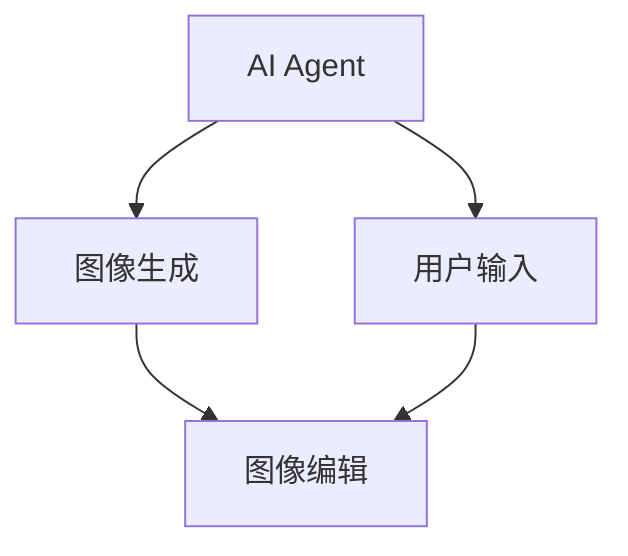
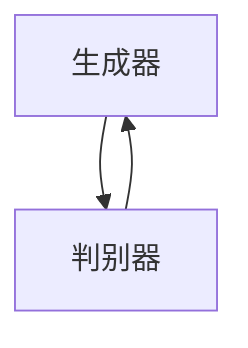
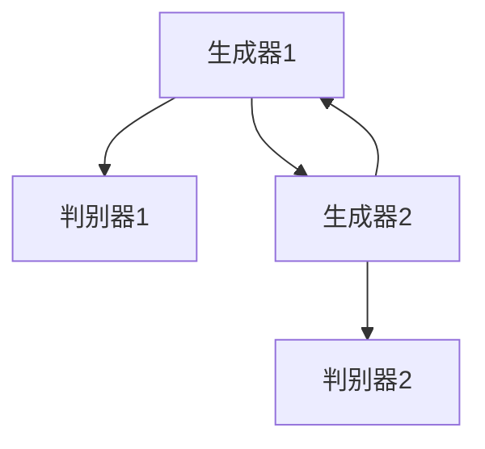
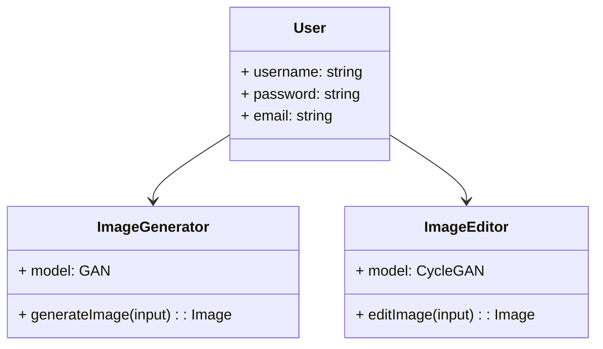
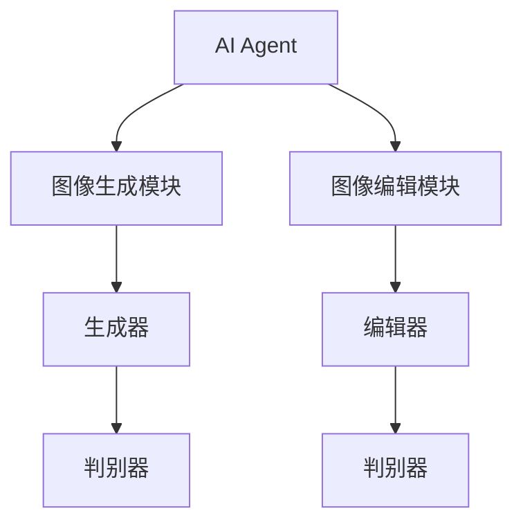
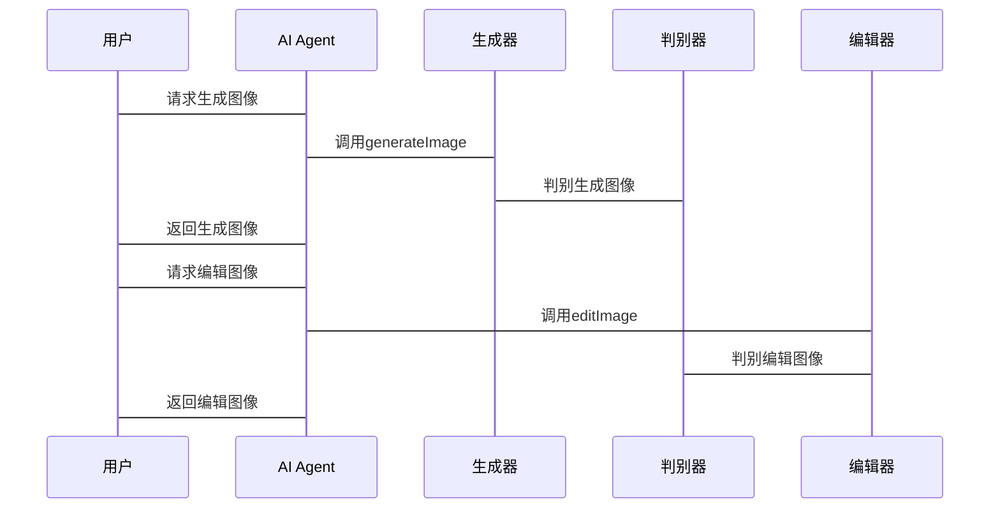

                 


# AI Agent的图像生成与编辑能力实现

> 关键词：AI Agent, 图像生成, 图像编辑, GAN, CycleGAN, 深度学习

> 摘要：本文详细探讨了AI Agent在图像生成与编辑领域的实现方法，从生成模型和编辑模型的原理，到系统架构设计，再到项目实战，系统地分析了AI Agent如何赋能图像生成与编辑能力。通过本文，读者将深入了解AI Agent在图像生成与编辑中的核心算法、系统架构及实际应用。

---

# 第一部分: AI Agent的图像生成与编辑能力概述

## 第1章: AI Agent与图像生成编辑的背景介绍

### 1.1 AI Agent的基本概念

#### 1.1.1 AI Agent的定义
AI Agent（人工智能代理）是指能够感知环境、自主决策并执行任务的智能实体。AI Agent可以是软件程序，也可以是物理设备，其核心目标是通过智能算法解决复杂问题并实现特定任务。

#### 1.1.2 AI Agent的核心特征
- **自主性**：能够自主决策和行动，无需人工干预。
- **反应性**：能够感知环境并实时调整行为。
- **学习能力**：通过数据和经验不断优化自身的算法和模型。
- **交互能力**：能够与用户或其他系统进行有效交互。

#### 1.1.3 AI Agent的应用场景
AI Agent广泛应用于自动驾驶、智能助手、机器人控制、推荐系统等领域。在图像生成与编辑领域，AI Agent可以作为用户代理，接收用户的输入并生成或编辑图像。

---

### 1.2 图像生成与编辑的背景

#### 1.2.1 图像生成与编辑的定义
- **图像生成**：通过算法生成新的图像内容，例如生成风景图片或人脸图像。
- **图像编辑**：对现有图像进行修改或增强，例如图像修复、风格转换。

#### 1.2.2 图像生成与编辑的技术发展现状
- **生成模型**：基于GAN（生成对抗网络）和VAE（变分自编码器）的图像生成技术逐渐成熟。
- **编辑模型**：基于深度学习的图像编辑技术，如风格迁移、图像修复等，已取得显著进展。

#### 1.2.3 图像生成与编辑的挑战与机遇
- **挑战**：生成图像的质量和多样性，编辑的精确性和自然性。
- **机遇**：AI Agent可以通过结合生成和编辑模型，提供更智能、更个性化的图像生成与编辑服务。

---

## 第2章: AI Agent图像生成与编辑的核心概念

### 2.1 生成模型与编辑模型的原理

#### 2.1.1 生成模型的原理
生成模型的核心是通过学习数据分布，生成新的数据样本。GAN是一种常用的生成模型，由生成器和判别器两个网络组成，通过对抗训练不断优化生成图像的质量。

#### 2.1.2 编辑模型的原理
编辑模型的目标是对现有图像进行特定的修改。CycleGAN是一种常用的编辑模型，可以通过无监督学习实现图像到图像的转换，如风格迁移或图像修复。

#### 2.1.3 生成与编辑模型的对比
| 特性             | 生成模型         | 编辑模型         |
|------------------|------------------|------------------|
| 输入             | 无特定输入       | 特定输入图像     |
| 输出             | 新图像           | 修改后的图像     |
| 应用场景         | 生成新内容       | 修改现有内容     |

#### 2.1.4 实体关系图


---

## 第3章: AI Agent图像生成与编辑的算法原理

### 3.1 生成模型的算法原理

#### 3.1.1 GAN（生成对抗网络）的工作原理
GAN由生成器和判别器组成，通过对抗训练优化生成图像的质量。生成器的目标是生成能够欺骗判别器的图像，而判别器的目标是区分生成图像和真实图像。



**数学公式：**
生成器的损失函数为：
$$ \mathcal{L}_G = \log(1 - D(G(x))) $$
判别器的损失函数为：
$$ \mathcal{L}_D = \log(D(x)) + \log(1 - D(G(x))) $$

#### 3.1.2 GAN的实现代码示例
```python
import torch
import torch.nn as nn

class Generator(nn.Module):
    def __init__(self):
        super(Generator, self).__init__()
        self.main = nn.Sequential(
            nn.ConvTranspose2d(100, 64, 4, 2, 1),
            nn.BatchNorm2d(64),
            nn.ReLU(True),
            nn.ConvTranspose2d(64, 32, 4, 2, 1),
            nn.BatchNorm2d(32),
            nn.ReLU(True),
            nn.ConvTranspose2d(32, 3, 4, 2, 1),
            nn.Tanh()
        )

    def forward(self, x):
        return self.main(x)

class Discriminator(nn.Module):
    def __init__(self):
        super(Discriminator, self).__init__()
        self.main = nn.Sequential(
            nn.Conv2d(3, 32, 4, 2, 1),
            nn.LeakyReLU(0.2),
            nn.Conv2d(32, 64, 4, 2, 1),
            nn.LeakyReLU(0.2),
            nn.Conv2d(64, 1, 4, 2, 1),
            nn.Sigmoid()
        )

    def forward(self, x):
        return self.main(x)
```

---

### 3.2 编辑模型的算法原理

#### 3.2.1 CycleGAN的工作原理
CycleGAN是一种无监督学习模型，用于图像到图像的转换。它通过两个生成器和一个判别器，实现图像的风格迁移。



**数学公式：**
生成器1的损失函数为：
$$ \mathcal{L}_G1 = \mathcal{L}_{cycle}(x, G1(G2(x))) + \mathcal{L}_{adv}(D1(G1(x))) $$

---

## 第4章: AI Agent图像生成与编辑的系统架构设计

### 4.1 系统功能设计

#### 4.1.1 领域模型


#### 4.1.2 系统架构设计


#### 4.1.3 接口设计
- **生成接口**：`generateImage(input: any) -> Image`
- **编辑接口**：`editImage(input: any) -> Image`

#### 4.1.4 交互序列图


---

## 第5章: AI Agent图像生成与编辑的项目实战

### 5.1 环境安装

#### 5.1.1 安装Python和依赖库
```bash
pip install torch
pip install numpy
pip install matplotlib
```

### 5.2 系统核心实现

#### 5.2.1 生成器实现
```python
import torch
import torch.nn as nn

class Generator(nn.Module):
    def __init__(self):
        super(Generator, self).__init__()
        self.main = nn.Sequential(
            nn.ConvTranspose2d(100, 64, 4, 2, 1),
            nn.BatchNorm2d(64),
            nn.ReLU(True),
            nn.ConvTranspose2d(64, 32, 4, 2, 1),
            nn.BatchNorm2d(32),
            nn.ReLU(True),
            nn.ConvTranspose2d(32, 3, 4, 2, 1),
            nn.Tanh()
        )

    def forward(self, x):
        return self.main(x)
```

#### 5.2.2 判别器实现
```python
import torch
import torch.nn as nn

class Discriminator(nn.Module):
    def __init__(self):
        super(Discriminator, self).__init__()
        self.main = nn.Sequential(
            nn.Conv2d(3, 32, 4, 2, 1),
            nn.LeakyReLU(0.2),
            nn.Conv2d(32, 64, 4, 2, 1),
            nn.LeakyReLU(0.2),
            nn.Conv2d(64, 1, 4, 2, 1),
            nn.Sigmoid()
        )

    def forward(self, x):
        return self.main(x)
```

---

## 第6章: 最佳实践与小结

### 6.1 最佳实践 tips
- 在图像生成与编辑中，建议结合生成模型和编辑模型，以实现更强大的功能。
- 在实际应用中，注意模型的训练数据质量和模型的调参优化。

### 6.2 小结
通过本文的详细讲解，读者可以全面了解AI Agent在图像生成与编辑中的实现方法。从算法原理到系统架构，再到项目实战，本文为读者提供了完整的实现方案。

---

## 第7章: 注意事项与拓展阅读

### 7.1 注意事项
- 在实际应用中，注意模型的收敛速度和生成图像的质量。
- 在图像编辑中，确保模型的稳定性，避免图像失真。

### 7.2 拓展阅读
- 《生成对抗网络：GAN的原理与实现》
- 《CycleGAN：无监督图像转换的算法原理》
- 《深度学习在图像生成与编辑中的应用》

---

作者：AI天才研究院/AI Genius Institute & 禅与计算机程序设计艺术 /Zen And The Art of Computer Programming

