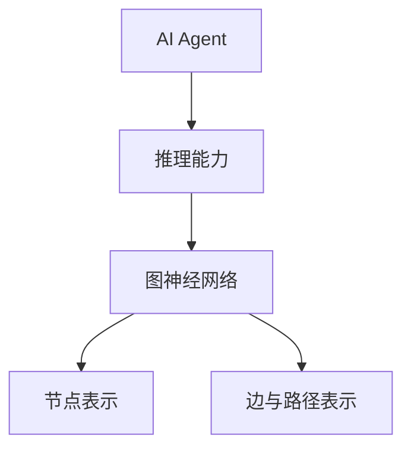

                 

# AI Agent的图神经网络推理能力实现

## 关键词：AI Agent、图神经网络、推理能力、系统架构、算法实现

## 摘要：  
本文详细探讨了AI Agent如何通过图神经网络实现推理能力，分析了图神经网络在推理中的作用，探讨了其算法原理、系统架构设计、项目实战以及最佳实践。文章从背景介绍到系统架构设计，从算法实现到项目实战，层层深入，帮助读者全面理解AI Agent的图神经网络推理能力的实现过程。

---

# 第1章: AI Agent与图神经网络概述

## 1.1 问题背景与描述

### 1.1.1 AI Agent的基本概念与定义  
AI Agent（人工智能代理）是指在特定环境中能够感知并自主行动以实现目标的智能体。它可以是一个软件程序、机器人或其他智能系统，具备以下特点：  
- **自主性**：能够在没有外部干预的情况下自主决策。  
- **反应性**：能够感知环境并实时调整行为。  
- **目标导向**：所有行动都围绕实现特定目标展开。  
- **社会能力**：能够与其他Agent或人类进行交互与协作。  

### 1.1.2 图神经网络的定义与特点  
图神经网络（Graph Neural Network, GNN）是一种专门用于处理图结构数据的深度学习模型。其核心思想是通过节点之间的关系建模，将图的结构信息融入到学习过程中。图神经网络具有以下特点：  
- **节点表示**：能够将图中的节点映射到低维向量空间，捕捉节点的语义信息。  
- **关系建模**：通过边信息建模节点之间的关系，能够处理复杂的图结构数据。  
- **全局视角**：能够综合考虑图中所有节点的信息，捕捉全局结构特征。  

### 1.1.3 AI Agent推理能力的核心问题  
AI Agent的推理能力是其智能性的核心，主要解决以下问题：  
- **信息处理**：如何高效地处理和理解复杂环境中的信息？  
- **决策制定**：如何基于图结构信息做出最优决策？  
- **动态适应**：如何在动态变化的环境中持续优化推理能力？  

---

## 1.2 问题解决思路与边界

### 1.2.1 图神经网络在推理中的作用  
图神经网络为AI Agent提供了强大的图结构信息处理能力，具体表现在以下几个方面：  
- **关系建模**：通过图结构捕捉实体之间的关系，帮助AI Agent理解复杂场景。  
- **信息整合**：将分散的信息整合到图结构中，提供全局视角。  
- **动态推理**：通过图神经网络的动态更新能力，支持实时推理和决策。  

### 1.2.2 AI Agent推理能力的边界与外延  
AI Agent的推理能力并非万能的，其边界主要体现在以下几个方面：  
- **数据依赖性**：推理能力依赖于输入数据的质量和完整性。  
- **计算能力限制**：推理能力受限于计算资源和算法复杂度。  
- **知识局限性**：AI Agent的知识来源于训练数据，无法处理超出训练范围的问题。  

### 1.2.3 核心要素与概念结构  
AI Agent的图神经网络推理能力由以下核心要素构成：  
- **图数据**：推理的基础，包括节点和边的结构信息。  
- **图神经网络模型**：处理图数据的核心算法。  
- **推理逻辑**：基于图数据和模型输出进行决策的规则。  

---

## 1.3 核心概念与联系

### 1.3.1 图神经网络与AI Agent的关系  
图神经网络为AI Agent提供了强大的图结构信息处理能力，而AI Agent则为图神经网络提供了一个动态、复杂的应用场景。两者的关系可以总结为：  
- **相互依赖**：AI Agent需要图神经网络来处理复杂关系，而图神经网络则需要AI Agent的应用场景来驱动其发展。  
- **协同进化**：随着AI Agent的智能化，图神经网络的算法也在不断优化，反之亦然。  

### 1.3.2 核心概念原理与属性特征对比表  

| **概念**       | **AI Agent**                     | **图神经网络**                  |
|----------------|----------------------------------|-------------------------------|
| 核心功能       | 感知环境、自主决策              | 处理图结构数据、学习节点关系    |
| 数据输入       | 多模态数据（文本、图像等）       | 图结构数据（节点、边）          |
| 输出形式       | 行动决策                        | 节点表示、关系预测              |
| 应用场景       | 智能助手、自动驾驶、智能机器人    | 社交网络分析、知识图谱构建      |
| 挑战           | 动态环境、信息不完整、决策复杂性  | 图结构异构性、计算效率问题      |

### 1.3.3 ER实体关系图架构（Mermaid）

---

## 1.4 本章小结  
本章介绍了AI Agent和图神经网络的基本概念、核心特点以及它们在推理能力中的作用。通过对比和分析，明确了AI Agent的图神经网络推理能力的核心要素和实现边界。下一章将深入探讨图神经网络的算法原理，为后续的系统设计和实现打下基础。

---

接下来是第2章的内容，将详细讲解图神经网络的算法原理。

