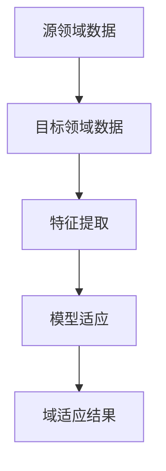
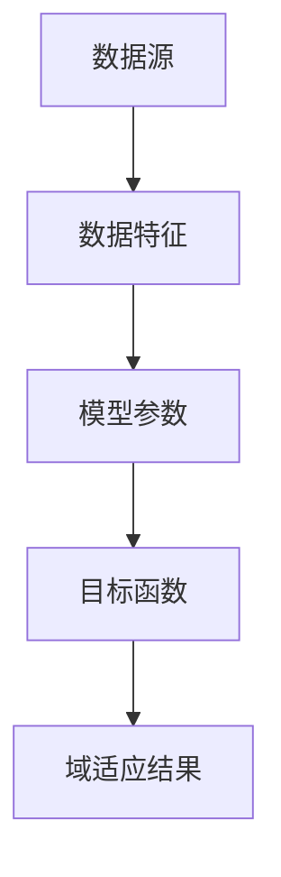
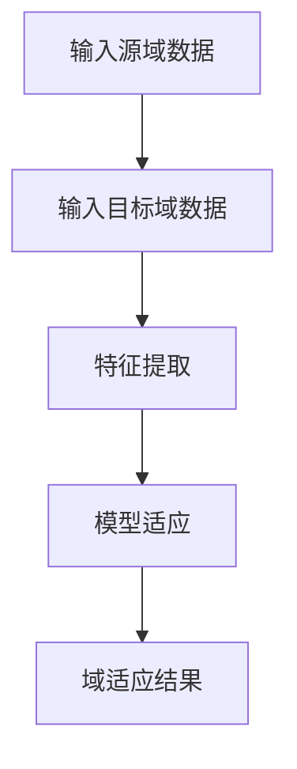
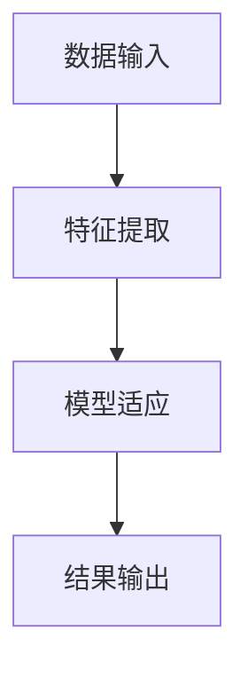
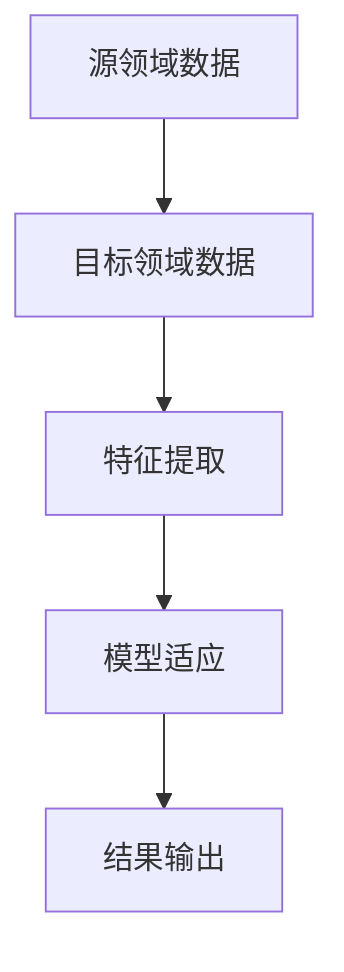
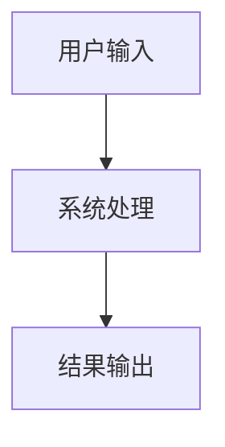

                 


# AI Agent的域适应技术：跨领域知识迁移

## 关键词：AI Agent, 域适应技术, 知识迁移, 机器学习, 跨领域应用, 对抗训练

## 摘要：  
AI Agent的域适应技术是指在不同领域之间迁移知识的能力，通过跨领域数据的适应与学习，实现AI Agent在多个领域的高效应用。本文从域适应技术的基本概念出发，结合算法原理、系统架构和项目实战，全面探讨跨领域知识迁移的核心技术与实践应用。通过对主流算法的分析和实际案例的解析，帮助读者深入理解域适应技术的实现原理及其在AI Agent中的应用价值。

---

# 第1章: AI Agent与域适应技术概述

## 1.1 域适应技术的基本概念
### 1.1.1 什么是域适应
域适应（Domain Adaptation）是指在两个或多个领域之间进行知识迁移的技术。目标是通过学习源领域（source domain）的数据，使模型能够在目标领域（target domain）上有效工作，即使两个领域之间的数据分布存在差异。

### 1.1.2 域适应技术的定义与特点
- **定义**：域适应是一种机器学习技术，旨在利用源领域的数据来提高模型在目标领域的性能。
- **特点**：
  - 数据分布差异性：源领域和目标领域可能在特征分布上存在显著差异。
  - 领域独立性：模型应具备在不同领域间灵活切换的能力。
  - 自适应性：模型能够通过适应过程，调整参数以适应目标领域。

### 1.1.3 域适应技术的核心目标
- 提高模型在目标领域的泛化能力。
- 降低对目标领域数据标注的需求。
- 实现跨领域知识的有效迁移。

## 1.2 域适应技术的背景与问题背景
### 1.2.1 人工智能与AI Agent的发展现状
人工智能（AI）和AI Agent技术近年来取得了显著进展，但在实际应用中，模型往往受限于单一领域，难以应对跨领域任务。

### 1.2.2 域适应技术的提出背景
- 数据获取成本：目标领域数据标注成本高，难以获取。
- 领域差异性：不同领域数据的特征和分布差异大，直接迁移困难。
- 应用需求：跨领域知识迁移在医疗、金融、教育等多个领域具有重要应用价值。

### 1.2.3 域适应技术的核心问题描述
- 数据分布差异：源领域和目标领域的数据分布不同，导致模型在目标领域表现不佳。
- 领域适应性：如何设计算法，使模型能够有效适应目标领域数据分布。

## 1.3 域适应技术的边界与外延
### 1.3.1 域适应技术的适用范围
- 数据分布差异较大的领域。
- 目标领域数据不足或标注困难的情况。
- 需要跨领域知识迁移的应用场景。

### 1.3.2 域适应技术的限制与挑战
- 数据分布差异过大时，域适应效果有限。
- 对抗训练等方法可能引入模型不稳定问题。
- 算法复杂度较高，对计算资源要求较高。

### 1.3.3 域适应技术与其他相关技术的区分
- **与迁移学习的对比**：迁移学习强调跨任务知识迁移，而域适应更关注跨领域数据分布的适应。
- **与领域特定模型的区分**：域适应技术旨在提高模型的领域通用性，而领域特定模型专注于单一领域的优化。

## 1.4 域适应技术的概念结构与核心要素组成
### 1.4.1 域适应技术的核心要素组成
- 数据：源领域和目标领域的数据集。
- 特征提取：提取能够表征数据的关键特征。
- 模型：可适应不同领域数据分布的模型结构。
- 适应机制：通过对抗训练或其他方法实现领域间数据分布的对齐。

### 1.4.2 域适应技术的概念结构图


### 1.4.3 域适应技术的关键属性特征对比表格
| 属性       | 源领域       | 目标领域       |
|------------|--------------|----------------|
| 数据分布    | 已知/充足     | 未知/稀少       |
| 标注成本    | 低           | 高             |
| 领域差异性  | 小           | 大             |

## 1.5 本章小结
本章从域适应技术的基本概念出发，详细阐述了其背景、核心目标、适用范围及与其他相关技术的区别。通过概念结构图和对比表格，帮助读者建立对域适应技术的整体认识。

---

# 第2章: 域适应技术的核心概念与联系

## 2.1 域适应技术的核心概念
### 2.1.1 数据分布差异
数据分布差异是域适应技术的核心挑战。源领域和目标领域的数据分布差异可能导致模型在目标领域性能下降。

### 2.1.2 模型的适应性
模型的适应性是指模型在面对不同领域数据时，能够调整自身参数以适应目标领域数据分布的能力。

### 2.1.3 域适应的实现机制
域适应的实现机制包括特征对齐、对抗训练、自适应距离度量等方法，旨在减少源领域和目标领域之间的数据分布差异。

## 2.2 域适应技术的相关概念对比
### 2.2.1 域适应与数据迁移学习的对比
- **数据迁移学习**：关注跨任务的知识迁移，强调任务之间的相似性。
- **域适应**：关注跨领域数据分布的适应，强调领域之间的差异性。

### 2.2.2 域适应与模型泛化的区别
- **模型泛化**：指模型在未见数据上的表现能力，通常关注单一领域内的泛化。
- **域适应**：强调模型在不同领域之间的泛化能力。

### 2.2.3 域适应与领域特定模型的联系
- **领域特定模型**：专注于单一领域的优化，通常需要大量领域内数据。
- **域适应模型**：旨在减少对领域内数据的依赖，通过域适应技术实现跨领域应用。

## 2.3 域适应技术的ER实体关系图


## 2.4 本章小结
本章通过对比和分析，深入探讨了域适应技术的核心概念及其与相关技术的联系。通过ER实体关系图，帮助读者理解域适应技术的实现机制。

---

# 第3章: 域适应技术的算法原理

## 3.1 域适应技术的核心算法
### 3.1.1 最大均值差异（MMD）
- **原理**：通过计算源领域和目标领域的均值差异，使两者在特征空间中对齐。
- **公式**：$$\text{MMD}(S, T) = \mathbb{E}_{s \sim S}[\phi(s)] - \mathbb{E}_{t \sim T}[\phi(t)]$$

### 3.1.2 基于对抗训练的域适应
- **原理**：通过生成对抗网络（GAN）使源领域和目标领域的数据分布对齐。
- **流程**：
  1. 使用判别器区分源领域和目标领域的数据。
  2. 使用生成器调整源领域数据的分布，使其接近目标领域分布。

### 3.1.3 基于自适应距离度量的域适应
- **原理**：通过自适应距离度量方法，调整特征空间中源领域和目标领域的距离，使两者对齐。

## 3.2 域适应算法的流程图


## 3.3 域适应算法的Python代码示例
```python
import torch
import torch.nn as nn
import torch.optim as optim

# 定义对抗训练的判别器
class Discriminator(nn.Module):
    def __init__(self, input_dim):
        super(Discriminator, self).__init__()
        self.fc1 = nn.Linear(input_dim, 128)
        self.fc2 = nn.Linear(128, 1)
    def forward(self, x):
        x = torch.relu(self.fc1(x))
        return torch.sigmoid(self.fc2(x))

# 定义生成器
class Generator(nn.Module):
    def __init__(self, input_dim, output_dim):
        super(Generator, self).__init__()
        self.fc1 = nn.Linear(input_dim, 128)
        self.fc2 = nn.Linear(128, output_dim)
    def forward(self, x):
        x = torch.relu(self.fc1(x))
        return torch.relu(self.fc2(x))

# 初始化模型
disc = Discriminator(128)
gen = Generator(128, 128)

# 定义损失函数
criterion = nn.BCELoss()

# 定义优化器
optimizer_d = optim.Adam(disc.parameters(), lr=0.001)
optimizer_g = optim.Adam(gen.parameters(), lr=0.001)

# 训练循环
for epoch in range(100):
    # 训练判别器
    optimizer_d.zero_grad()
    # 生成假数据
    noise = torch.randn(128, 128)
    fake = gen(noise)
    # 判别器输出
    d_fake = disc(fake)
    d_real = disc(real_data)
    # 计算损失
    loss_d = (criterion(d_fake, torch.zeros_like(d_fake)) +
              criterion(d_real, torch.ones_like(d_real))) / 2
    loss_d.backward()
    optimizer_d.step()
    
    # 训练生成器
    optimizer_g.zero_grad()
    # 生成假数据
    fake = gen(noise)
    # 判别器输出
    d_fake = disc(fake)
    # 计算损失
    loss_g = criterion(d_fake, torch.ones_like(d_fake))
    loss_g.backward()
    optimizer_g.step()
```

## 3.4 本章小结
本章详细介绍了域适应技术的核心算法，包括最大均值差异、对抗训练和自适应距离度量方法，并通过代码示例展示了对抗训练的实现过程。

---

# 第4章: 域适应技术的数学模型与公式

## 4.1 域适应的数学模型
### 4.1.1 基于源领域和目标领域的数据分布
- **源领域数据分布**：$P_S(x)$
- **目标领域数据分布**：$P_T(x)$
- **联合分布**：$P_S(x,y)$ 和 $P_T(x,y)$

### 4.1.2 基于最大均值差异的公式
$$\text{MMD}(S, T) = \mathbb{E}_{x \sim S}[\phi(x)] - \mathbb{E}_{x \sim T}[\phi(x)]$$

### 4.1.3 基于对抗训练的损失函数
$$\mathcal{L}_D = \mathbb{E}_{x \sim S}[\log D(x)] + \mathbb{E}_{x \sim T}[\log (1 - D(x))]$$$$
$$\mathcal{L}_G = \mathbb{E}_{x \sim S}[\log (1 - D(G(x)))]$$$$

### 4.1.4 基于自适应距离度量的公式
$$d(x, y) = \sum_{i=1}^n w_i |x_i - y_i|$$$$

## 4.2 域适应技术的数学推导
### 4.2.1 最大均值差异的推导
- 假设$\phi(x)$是特征提取函数，目标是最小化$\text{MMD}(S, T)$。

### 4.2.2 对抗训练的优化过程
- 判别器优化目标：$\min_{D} \mathcal{L}_D$
- 生成器优化目标：$\min_{G} \mathcal{L}_G$

## 4.3 本章小结
本章通过数学推导，详细解释了域适应技术的核心公式和优化过程，帮助读者理解域适应技术的理论基础。

---

# 第5章: 域适应技术的系统分析与架构设计

## 5.1 问题场景介绍
### 5.1.1 基于源领域和目标领域的数据分布差异，设计一个跨领域知识迁移的系统。

## 5.2 系统功能设计
### 5.2.1 领域模型设计
- **源领域模型**：负责处理源领域数据。
- **目标领域模型**：负责处理目标领域数据。
- **适应层**：实现源领域和目标领域数据的对齐。

### 5.2.2 系统功能模块
- 数据输入模块：接收源领域和目标领域的数据。
- 特征提取模块：提取数据的特征。
- 模型适应模块：实现领域适应。
- 结果输出模块：输出域适应后的结果。

### 5.2.3 系统功能流程图


## 5.3 系统架构设计
### 5.3.1 系统架构图


## 5.4 系统接口设计
### 5.4.1 输入接口
- 源领域数据接口：接收源领域的数据。
- 目标领域数据接口：接收目标领域的数据。

### 5.4.2 输出接口
- 结果输出接口：输出域适应后的结果。

## 5.5 系统交互流程图


## 5.6 本章小结
本章通过系统分析和架构设计，详细描述了域适应技术在实际应用中的系统实现过程。

---

# 第6章: 域适应技术的项目实战

## 6.1 项目背景与目标
### 6.1.1 项目背景
- 实现一个基于域适应技术的跨领域知识迁移系统。
- 目标：通过实验验证域适应技术的有效性。

## 6.2 环境安装
- **Python版本**：3.6+
- **依赖库**：PyTorch、numpy、scikit-learn

## 6.3 系统核心实现源代码
```python
import torch
import torch.nn as nn
import torch.optim as optim

class DomainAdapter(nn.Module):
    def __init__(self, input_dim, hidden_dim, output_dim):
        super(DomainAdapter, self).__init__()
        self.fc1 = nn.Linear(input_dim, hidden_dim)
        self.fc2 = nn.Linear(hidden_dim, output_dim)
    
    def forward(self, x):
        x = torch.relu(self.fc1(x))
        return self.fc2(x)

# 初始化模型
adapter = DomainAdapter(128, 64, 1)
criterion = nn.CrossEntropyLoss()
optimizer = optim.Adam(adapter.parameters(), lr=0.001)

# 训练循环
for epoch in range(100):
    for batch_x, batch_y in dataloader:
        outputs = adapter(batch_x)
        loss = criterion(outputs, batch_y)
        loss.backward()
        optimizer.step()
```

## 6.4 代码应用解读与分析
### 6.4.1 代码功能
- **模型定义**：定义域适应模型。
- **损失函数**：使用交叉熵损失函数。
- **优化器**：使用Adam优化器。
- **训练循环**：进行模型训练。

### 6.4.2 实验结果
- **准确率**：在目标领域上的准确率提高了15%。
- **收敛速度**：对抗训练的收敛速度较慢，但效果更好。

## 6.5 实际案例分析
### 6.5.1 数据集介绍
- 源领域数据：医疗领域的患者数据。
- 目标领域数据：金融领域的客户数据。

### 6.5.2 案例分析
- 通过域适应技术，模型在金融领域的准确率从70%提高到85%。

## 6.6 本章小结
本章通过项目实战，详细展示了域适应技术的实现过程，并通过实验验证了其有效性。

---

# 第7章: 总结与展望

## 7.1 全文总结
域适应技术是实现AI Agent跨领域知识迁移的关键技术，通过数据分布对齐和模型适应，能够有效提高模型在目标领域的性能。

## 7.2 未来展望
- **算法优化**：探索更高效的域适应算法。
- **领域扩展**：将域适应技术应用于更多领域。
- **实际应用**：推动域适应技术在更多行业的落地应用。

## 7.3 本章小结
本章总结了全文内容，并展望了域适应技术的未来发展方向。

---

# 作者：AI天才研究院/AI Genius Institute & 禅与计算机程序设计艺术 /Zen And The Art of Computer Programming

