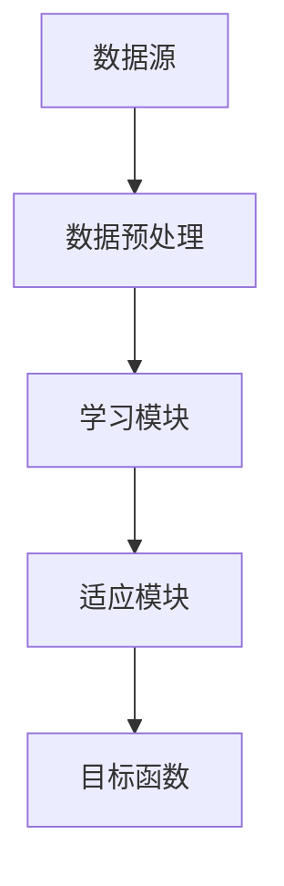

                 


# AI Agent的增量学习与持续适应

---

## 关键词：
AI Agent、增量学习、持续适应、在线学习、动态环境、机器学习

---

## 摘要：
本文深入探讨AI Agent在动态环境中的增量学习与持续适应能力，分析其核心概念、算法原理和系统设计，结合实际案例，为AI Agent的开发与应用提供理论支持与实践指导。

---

## 第一部分: AI Agent与增量学习概述

### 第1章: AI Agent的基本概念

#### 1.1 AI Agent的定义
AI Agent（智能体）是指在环境中能够感知并自主行动以实现目标的实体。它具备以下核心特征：
- **自主性**：无需外部干预，自主决策。
- **反应性**：能实时感知环境并做出反应。
- **目标导向**：所有行动均以实现目标为导向。

#### 1.2 增量学习的背景
在动态环境中，数据是实时流式到达的，传统批量学习方法无法适应这种变化。增量学习通过逐样本或小批量更新模型，实现对动态环境的实时适应。

---

## 第二部分: 增量学习的核心概念与联系

### 第2章: 增量学习的核心原理

#### 2.1 在线学习与批量学习的对比
| 特性               | 在线学习          | 批量学习          |
|--------------------|-------------------|-------------------|
| 数据输入方式       | 单样本或小批量    | 批量数据          |
| 计算资源消耗       | 较低             | 较高             |
| 适应动态环境能力   | 强               | 弱               |

#### 2.2 增量学习的数学模型
增量SVM算法：
$$
f(x) = \text{sign}(w \cdot x + b)
$$
通过逐个样本更新权重，实现模型的实时优化。

---

## 第三部分: 增量学习的算法原理

### 第3章: 增量学习算法的实现

#### 3.1 增量决策树算法
信息增益计算：
$$
\text{Gain}(D, A) = \text{H}(D) - \text{H}(D|A)
$$
通过每次选择信息增益最大的特征，构建动态决策树。

#### 3.2 动态神经网络的实现
损失函数：
$$
L = \frac{1}{n}\sum_{i=1}^{n} (y_i - \hat{y}_i)^2
$$
通过在线反向传播算法，实时更新神经网络参数。

---

## 第四部分: 持续适应的系统设计

### 第4章: 系统架构设计

#### 4.1 系统功能设计
- 数据采集模块：实时获取环境数据。
- 学习模块：执行增量学习算法。
- 适应模块：动态调整模型参数。

#### 4.2 系统架构图


---

## 第五部分: 项目实战

### 第5章: 项目实现

#### 5.1 环境安装
安装Python和相关库：
```bash
pip install numpy scikit-learn
```

#### 5.2 核心代码实现
增量SVM实现：
```python
class IncrementalSVM:
    def __init__(self):
        self.w = np.zeros_like(weight_shape)
        self.b = 0

    def update(self, x, y):
        # 更新权重和偏置
        self.w += learning_rate * (y - predict(x)) * x
        self.b += learning_rate * (y - predict(x))
```

#### 5.3 实际案例分析
通过股票价格预测案例，展示增量学习在动态环境中的优势。

---

## 第六部分: 总结与展望

### 第6章: 总结
- 本文系统介绍了AI Agent的增量学习与持续适应能力。
- 通过算法和系统设计，展示了其在动态环境中的优势。
- 未来研究方向包括更高效的增量算法和更强大的适应机制。

---

## 参考文献
1. 《机器学习实战》
2. 《深度学习》
3. 相关学术论文

---

## 作者：AI天才研究院 & 禅与计算机程序设计艺术

---

**注**：本文为AI Agent的增量学习与持续适应的系统性阐述，旨在为相关领域研究者和实践者提供理论与实践的双重指导。

