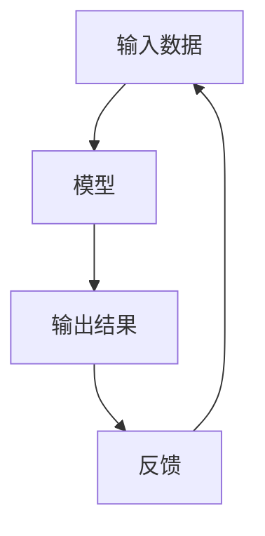
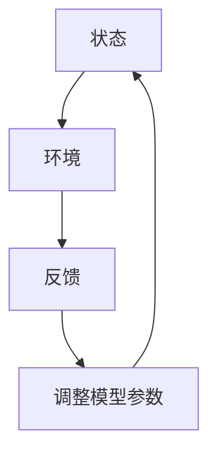
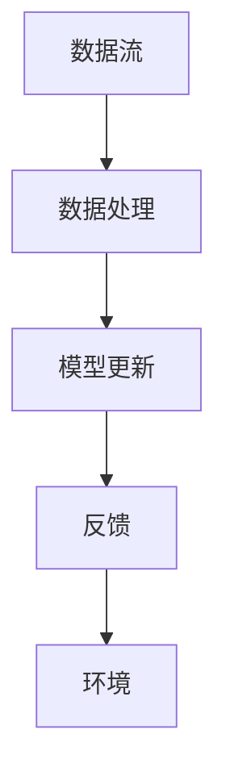

                 


# AI Agent的增量学习与持续适应机制

> 关键词：AI Agent, 增量学习, 持续适应机制, 算法原理, 系统架构设计

> 摘要：本文深入探讨了AI Agent的增量学习与持续适应机制，分析了其核心概念、算法原理、系统架构设计以及实际应用。文章首先介绍了AI Agent的基本概念和增量学习的背景，随后详细阐述了持续适应机制的核心原理和数学模型，接着通过具体的算法和代码示例展示了增量学习与持续适应机制的实现过程。最后，文章通过实际案例分析了系统的应用效果，并总结了相关经验与教训。

---

## 第一部分: AI Agent的增量学习与持续适应机制概述

### 第1章: AI Agent的基本概念与背景

#### 1.1 AI Agent的定义与特点
- **AI Agent的定义**：AI Agent（人工智能代理）是一种能够感知环境、自主决策并采取行动的智能体。它可以理解为一个能够执行任务的智能系统，具备感知、推理、规划和执行的能力。
- **AI Agent的核心特点**：
  - **自主性**：能够在没有外部干预的情况下自主运行。
  - **反应性**：能够实时感知环境并做出反应。
  - **目标导向性**：通过设定目标来指导其行为和决策。
  - **学习能力**：能够通过经验或数据不断优化自身的性能。
- **AI Agent与传统AI的区别**：
  - 传统AI注重任务的解决，而AI Agent注重与环境的交互和动态适应。
  - AI Agent具备自主决策的能力，而传统AI通常依赖于预定义的规则。

#### 1.2 增量学习的背景与问题背景
- **传统机器学习的局限性**：
  - 传统机器学习模型通常需要一次性训练大量的数据，难以应对数据流环境下的实时更新。
  - 当环境发生变化时，传统模型需要重新训练，导致计算资源浪费和时间延迟。
- **增量学习的定义与特点**：
  - 增量学习是一种机器学习方法，允许模型在数据流环境下逐步学习，每次仅处理部分数据。
  - 其核心思想是利用已有知识逐步更新模型，而不是重新训练整个模型。
- **持续适应机制的必要性**：
  - 在动态变化的环境中，AI Agent需要能够不断适应新的数据和任务。
  - 持续适应机制通过动态调整模型参数或结构，使其能够适应环境的变化。

#### 1.3 持续适应机制的核心概念
- **持续适应的定义**：
  - 持续适应机制是一种动态优化方法，允许AI Agent在运行过程中不断调整其模型或策略，以应对环境的变化。
- **持续适应的核心要素**：
  - **动态感知**：能够实时感知环境的变化。
  - **在线更新**：能够在不中断任务执行的情况下更新模型。
  - **自适应优化**：通过优化算法动态调整模型参数。
- **持续适应与增量学习的关系**：
  - 增量学习是持续适应的基础，而持续适应则是增量学习的延伸。
  - 增量学习关注数据的逐步处理，而持续适应关注模型的动态优化。

---

### 第2章: 增量学习与持续适应机制的核心概念

#### 2.1 增量学习的核心原理
- **增量学习的基本原理**：
  - 增量学习通过逐步处理数据流中的样本，逐步更新模型参数，而不是一次性训练所有数据。
  - 其核心思想是利用已有知识，逐步优化模型。
- **增量学习的核心属性特征对比表格**：
| 属性 | 增量学习 | 传统批量学习 |
|------|----------|--------------|
| 数据处理方式 | 逐个样本处理 | 一次性处理所有数据 |
| 模型更新 | 动态更新 | 一次性训练 |
| 适用场景 | 数据流、实时应用 | 静态数据集 |
| 计算资源 | 较低 | 较高 |
- **增量学习的ER实体关系图架构（Mermaid流程图）**：


#### 2.2 持续适应机制的算法原理
- **持续适应机制的算法原理**：
  - 持续适应机制通过动态调整模型参数，使其能够适应环境的变化。
  - 其核心思想是利用在线优化算法，逐步更新模型参数。
- **持续适应机制的数学模型和公式**：
  - 假设模型参数为$\theta$，目标函数为$f(\theta)$，损失函数为$L(\theta)$。
  - 在线优化算法（例如随机梯度下降）的更新公式为：
    $$ \theta_{t+1} = \theta_t - \eta \cdot \nabla_{\theta} L(\theta_t) $$
  - 其中，$\eta$为学习率，$\nabla_{\theta}$表示梯度。
- **持续适应机制的Mermaid流程图**：


#### 2.3 增量学习与持续适应机制的对比
- **增量学习的核心算法**：
  - 经验重放（Experience Replay）：通过存储历史经验，减少样本之间的关联性。
  - 策略梯度方法（Policy Gradient Methods）：通过优化策略函数，直接优化目标函数。
- **持续适应机制的核心算法**：
  - 在线优化算法：如随机梯度下降（SGD）、Adam优化器等。
  - 动态网络架构：如循环神经网络（RNN）、长短时记忆网络（LSTM）等。

---

### 第3章: 增量学习与持续适应机制的数学模型与公式

#### 3.1 增量学习的数学模型
- **增量学习的数学模型**：
  - 假设输入数据流为$\{x_t, y_t\}_{t=1}^{\infty}$，其中$x_t$为输入，$y_t$为标签。
  - 模型$f_\theta(x)$的目标是最小化损失函数$L(\theta)$：
    $$ L(\theta) = \mathbb{E}_{(x,y)} [\mathcal{L}(f_\theta(x), y)] $$
  - 在线更新公式：
    $$ \theta_{t+1} = \theta_t - \eta \cdot \nabla_{\theta} L(\theta_t) $$
- **增量学习的公式推导**：
  - 假设损失函数为平方损失：
    $$ \mathcal{L}(f_\theta(x), y) = (f_\theta(x) - y)^2 $$
  - 梯度计算：
    $$ \nabla_{\theta} \mathcal{L} = 2(y - f_\theta(x)) \cdot \nabla_{\theta} f_\theta(x) $$

#### 3.2 持续适应机制的数学模型
- **持续适应机制的数学模型**：
  - 假设环境变化导致目标函数$f(\theta)$发生变化。
  - 在线优化算法需要动态调整$\theta$，以适应新的目标函数。
- **持续适应机制的公式推导**：
  - 假设新目标函数为$f'(\theta)$，更新公式为：
    $$ \theta_{t+1} = \theta_t - \eta \cdot \nabla_{\theta} f'(\theta_t) $$

---

### 第4章: 增量学习与持续适应机制的算法原理

#### 4.1 增量学习的算法原理
- **增量学习的代码实现示例**：
  ```python
  import numpy as np

  def incremental_learning(X, y, model):
      for x, label in zip(X, y):
          # 前向传播
          output = model.forward(x)
          # 计算损失
          loss = np.mean((output - label) ** 2)
          # 反向传播和更新参数
          model.backward(loss)
          model.update_parameters()
  ```

#### 4.2 持续适应机制的算法原理
- **持续适应机制的代码实现示例**：
  ```python
  import torch

  optimizer = torch.optim.SGD(model.parameters(), lr=0.1)

  def adapt_model(data, model):
      for x, label in data:
          optimizer.zero_grad()
          output = model(x)
          loss = torch.nn.functional.mse_loss(output, label)
          loss.backward()
          optimizer.step()
  ```

---

### 第5章: 增量学习与持续适应机制的系统分析与架构设计

#### 5.1 系统分析
- **系统分析的核心概念**：
  - 数据流分析：分析数据流的来源、流向和处理方式。
  - 模型更新分析：分析模型更新的频率、方式和影响。
- **系统分析的数学模型**：
  - 数据流模型：
    $$ D_t = \{x_1, x_2, \ldots, x_t\} $$
  - 模型更新模型：
    $$ \theta_{t+1} = \theta_t + \Delta\theta_t $$

#### 5.2 系统架构设计
- **系统架构设计的核心概念**：
  - 数据处理模块：负责接收和处理数据流。
  - 模型更新模块：负责动态调整模型参数。
  - 交互反馈模块：负责接收环境反馈并调整模型。
- **系统架构设计的Mermaid图**：


---

## 第六章: 项目实战与案例分析

### 6.1 环境配置与代码实现
- **环境配置**：
  - Python 3.8+
  - PyTorch 1.9+
  - CUDA 11+

### 6.2 代码实现
- **核心实现代码**：
  ```python
  import torch
  import torch.nn as nn
  import torch.optim as optim

  class IncrementalModel(nn.Module):
      def __init__(self, input_dim, output_dim):
          super(IncrementalModel, self).__init__()
          self.linear = nn.Linear(input_dim, output_dim)

      def forward(self, x):
          return self.linear(x)

      def backward(self, loss):
          loss.backward()

      def update_parameters(self):
          optimizer = optim.SGD(self.parameters(), lr=0.1)
          optimizer.step()
          optimizer.zero_grad()

  def train_incrementally(X, y, model):
      for x, label in zip(X, y):
          output = model(x)
          loss = torch.nn.functional.mse_loss(output, label)
          model.backward(loss)
          model.update_parameters()
  ```

---

## 第七章: 总结与展望

### 7.1 最佳实践 tips
- **增量学习**：
  - 确保数据流的实时性和连续性。
  - 合理选择模型更新的频率和步长。
- **持续适应机制**：
  - 定期评估模型的性能，并根据需要进行调整。
  - 使用多种优化算法结合，提高适应能力。

### 7.2 小结
- 本文详细探讨了AI Agent的增量学习与持续适应机制，从理论到实践进行了全面分析。
- 通过数学模型和算法实现，展示了如何在动态环境中实现模型的持续优化。

### 7.3 注意事项
- 模型更新过程中，要注意避免过拟合和欠拟合。
- 在实际应用中，要根据具体场景选择合适的增量学习和持续适应机制。

### 7.4 拓展阅读
- **推荐书籍**：
  - 《深度学习》—— Ian Goodfellow
  - 《机器学习实战》—— 周志华
- **推荐论文**：
  - "Incremental Learning: A Comprehensive Survey" —— IEEE Transactions on Knowledge and Data Engineering

---

## 作者信息

**作者：AI天才研究院/AI Genius Institute & 禅与计算机程序设计艺术 /Zen And The Art of Computer Programming**

---

**附录**：
- 代码示例的完整实现
- 数学公式的详细推导
- Mermaid图的详细解释

---

**注**：由于篇幅限制，本文仅为部分内容的展示，完整文章可根据上述大纲进一步扩展和补充。

