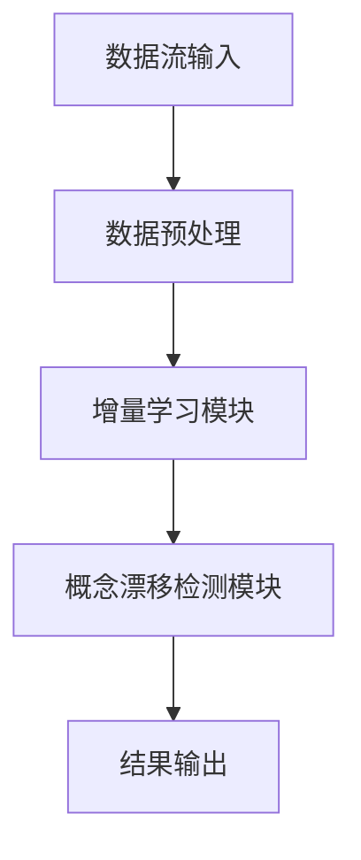

                 


# AI Agent的增量学习与概念漂移检测

> **关键词**：AI Agent, 增量学习, 概念漂移检测, 在线学习, 数据流分析

> **摘要**：  
本文探讨了AI Agent在增量学习环境中的应用，重点分析了概念漂移检测的重要性及其对增量学习的支撑作用。通过详细阐述增量学习与概念漂移检测的核心算法、数学模型以及系统架构，本文为AI Agent的动态适应性提供了理论基础和实践指导。

---

## 第一部分: AI Agent的背景与概念

### 第1章: AI Agent的基本概念

#### 1.1 什么是AI Agent
AI Agent（人工智能代理）是一种能够感知环境、自主决策并执行任务的智能实体。它通过与环境交互，利用传感器获取信息，并通过 actuators 执行动作，以实现特定目标。

**关键特征：**
- **自主性**：无需外部干预，自主决策。
- **反应性**：实时感知环境变化并做出反应。
- **目标导向性**：所有行为均以实现特定目标为导向。

#### 1.2 AI Agent的核心特征
- **知识表示**：AI Agent通过知识库存储和处理信息。
- **推理能力**：通过逻辑推理或机器学习算法处理数据。
- **学习能力**：能够通过经验改进性能。

#### 1.3 AI Agent的应用场景
- **智能助手**：如 Siri、Alexa 等。
- **自动驾驶**：如特斯拉的自动驾驶系统。
- **推荐系统**：如 Netflix 的个性化推荐。

---

### 第2章: 增量学习的背景与意义

#### 2.1 数据流环境下的学习挑战
在实时数据流环境中，数据是动态变化的，模型需要不断更新以适应新的数据分布。增量学习在这种环境下具有重要意义。

#### 2.2 增量学习的核心价值
- **实时性**：能够快速响应数据变化。
- **资源效率**：仅更新必要部分，节省计算资源。
- **适应性**：能够适应数据分布的变化。

#### 2.3 增量学习的典型应用
- **金融交易**：实时检测异常交易。
- **网络流量分析**：实时检测异常流量。
- **医疗诊断**：实时更新患者诊断模型。

---

## 第二部分: 增量学习与概念漂移检测的核心概念

### 第3章: 增量学习的基本原理

#### 3.1 增量学习的数学模型
增量学习的核心是在线更新模型，常用的方法包括：

- **增量支持向量机（ISVM）**：
  $$ w_{t+1} = w_t + \alpha x_t y_t $$
  其中，$\alpha$ 是学习率，$x_t$ 是新样本，$y_t$ 是标签。

- **增量随机森林（ISR Forest）**：
  每个新样本会被动态地添加到随机森林中，模型逐步更新。

#### 3.2 增量学习的核心算法
- **增量流数据处理算法**：
  使用滑动窗口技术，仅保留最近的数据进行模型更新。

---

### 第4章: 概念漂移检测的原理与方法

#### 4.1 概念漂移的定义与类型
概念漂移指的是数据分布的变化，通常分为：
- **突然漂移（ Abrupt Drift）**：数据分布突然变化。
- **渐进漂移（Incremental Drift）**：数据分布逐渐变化。
- **周期性漂移（Periodic Drift）**：数据分布周期性变化。

#### 4.2 概念漂移检测的核心指标
- **分类性能变化**：通过分类准确率的变化判断漂移。
- **分布变化检测**：使用统计方法（如Kullback-Leibler散度）检测分布变化。

#### 4.3 概念漂移检测的典型算法
- **基于统计的方法**：
  使用 Kolmogorov-Smirnov 检验判断数据分布是否发生变化。
  
- **基于机器学习的方法**：
  使用 One-Class SVM 检测异常点，判断是否发生概念漂移。

---

## 第三部分: 系统架构与项目实战

### 第5章: 系统架构设计

#### 5.1 系统功能设计
- **数据流处理**：实时接收和处理数据流。
- **模型更新**：根据数据流更新增量学习模型。
- **漂移检测**：实时检测概念漂移。

#### 5.2 系统架构图


---

### 第6章: 项目实战

#### 6.1 环境安装
- **Python 3.8+**
- **库依赖**：`numpy`, `scikit-learn`, `mermaid`

#### 6.2 核心代码实现
```python
def incremental_learning(X_new, y_new, model):
    # 增量更新模型
    model.partial_fit(X_new, y_new)
    return model

def concept_drift_detection(X_before, X_after, model):
    # 使用 One-Class SVM 检测概念漂移
    from sklearn.svm import OneClassSVM
    svm = OneClassSVM()
    svm.fit(X_before)
    scores_before = svm.decision_function(X_before)
    scores_after = svm.decision_function(X_after)
    drift = (scores_after.mean() < scores_before.mean())
    return drift
```

#### 6.3 应用案例分析
- **金融欺诈检测**：实时检测交易数据中的异常行为。
- **网络流量监控**：实时检测网络流量中的异常流量。

---

## 第四部分: 总结与展望

### 7.1 最佳实践 tips
- 定期监控模型性能，及时检测和处理概念漂移。
- 根据实际场景选择合适的增量学习算法。

### 7.2 小结
本文系统地探讨了AI Agent在增量学习环境中的应用，详细分析了概念漂移检测的重要性，并通过实际案例展示了如何将理论应用于实践。

### 7.3 注意事项
- 模型更新频率需根据数据流速度和任务需求调整。
- 概念漂移检测的阈值需根据具体场景设定。

### 7.4 拓展阅读
- 《Data Streams: Models and Algorithms》
- 《Incremental Learning: Theory and Practice》

---

## 参考文献
1. 增量学习与概念漂移检测的经典论文。
2. 相关书籍推荐。

---

**作者：AI天才研究院 & 禅与计算机程序设计艺术**

