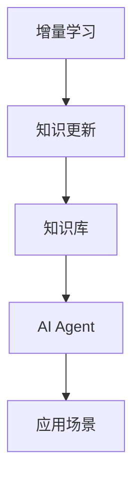
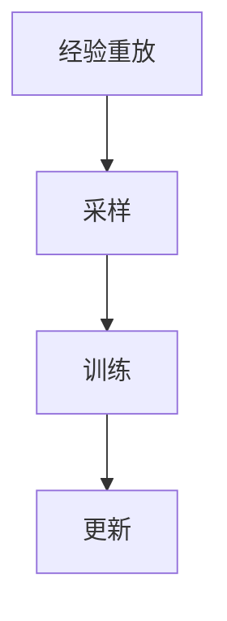
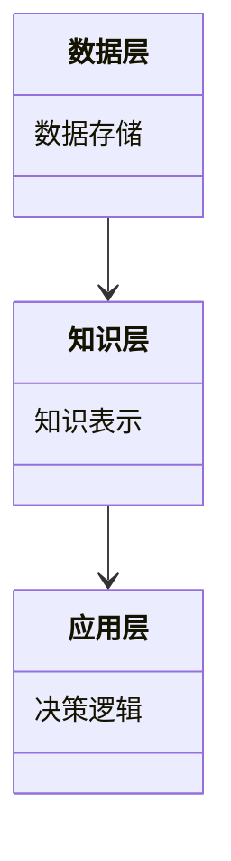

                 


# AI Agent的增量学习与知识更新

> 关键词：AI Agent, 增量学习, 知识更新, 算法原理, 系统设计, 项目实战

> 摘要：本文详细探讨了AI Agent的增量学习与知识更新的核心概念、算法原理、系统设计及项目实战。通过对比分析、算法流程图、系统架构图和代码实现，帮助读者全面理解并掌握相关技术。

---

## 第一部分: AI Agent的基本概念

### 第1章: AI Agent的定义与特点

#### 1.1 AI Agent的定义与特点
AI Agent（人工智能代理）是指能够感知环境、自主决策并执行任务的智能体。它具备以下核心特点：
- **自主性**：无需外部干预，自主完成任务。
- **反应性**：实时感知环境并做出响应。
- **目标导向性**：基于目标驱动行为。
- **学习能力**：通过学习提升性能。

#### 1.2 增量学习的背景与必要性
增量学习是一种在数据流环境中逐步学习模型的方法，具有以下优势：
- **数据高效性**：仅使用新数据，节省存储和计算资源。
- **实时性**：适用于实时决策场景，如自动驾驶。
- **可扩展性**：适合处理大规模数据流。

#### 1.3 知识更新的重要性
知识更新是AI Agent保持最新知识的关键，确保其在动态环境中有效运作。它涉及：
- **知识表示**：将知识以结构化形式存储。
- **更新机制**：通过规则或算法自动更新知识。
- **验证与评估**：确保更新后的知识准确有效。

### 本章小结
本章介绍了AI Agent的基本概念、增量学习的背景及其重要性，为后续内容打下基础。

---

## 第二部分: 增量学习与知识更新的核心概念与联系

### 第2章: 增量学习的原理与方法

#### 2.1 增量学习的核心原理
增量学习通过逐步处理数据流，动态调整模型。其数学模型如下：
$$ L = \sum_{i=1}^{n} (y_i - \hat{y}_i)^2 $$
其中，\( y_i \) 是真实值，\( \hat{y}_i \) 是预测值。

#### 2.2 知识更新的原理与方法
知识更新涉及知识表示、获取、融合和推理。其流程如下：
1. 获取新知识。
2. 融合新旧知识。
3. 推理应用。

#### 2.3 增量学习与知识更新的联系
增量学习为知识更新提供数据支持，而知识更新则增强增量学习的模型表达能力。

### 2.4 核心概念对比表
| 对比维度 | 增量学习 | 知识更新 |
|----------|----------|----------|
| 数据源   | 流数据   | 知识库   |
| 目标     | 提高模型性能 | 更新知识库 |
| 方法     | 经验重放、策略梯度 | 知识融合、推理 |

### 2.5 ER实体关系图


### 2.6 本章小结
本章分析了增量学习与知识更新的原理及其联系，为后续算法实现奠定基础。

---

## 第三部分: 增量学习与知识更新的算法原理

### 第3章: 增量学习的算法实现

#### 3.1 经验重放算法
经验重放通过存储历史数据，避免灾难性遗忘。流程如下：
1. 采样经验。
2. 训练模型。
3. 更新存储。



#### 3.2 策略梯度方法
策略梯度通过优化策略参数，直接最大化目标函数。数学模型如下：
$$ \nabla\theta \log \pi(a|s) \cdot Q(s,a) $$
其中，\( \theta \) 是参数，\( \pi(a|s) \) 是策略，\( Q(s,a) \) 是价值函数。

#### 3.3 增量学习的数学模型
增量学习的损失函数为：
$$ L = \sum_{i=1}^{n} (y_i - \hat{y}_i)^2 $$
通过在线优化算法更新模型参数。

### 本章小结
本章详细讲解了增量学习的算法实现及其数学模型，为实际应用提供理论支持。

---

## 第四部分: 系统分析与架构设计

### 第4章: 系统分析与架构设计

#### 4.1 问题场景介绍
在动态环境中，AI Agent需要实时更新知识以适应变化。典型场景包括：
- 实时数据分析。
- 自动驾驶中的环境变化应对。

#### 4.2 系统功能设计
系统功能模块包括：
- 数据采集模块。
- 知识更新模块。
- 决策执行模块。

#### 4.3 系统架构设计
系统架构采用分层设计，包括数据层、知识层和应用层。类图如下：


#### 4.4 系统接口设计
系统接口包括：
- 数据采集接口。
- 知识更新接口。
- 决策执行接口。

#### 4.5 系统交互设计
交互流程如下：
1. 数据采集。
2. 知识更新。
3. 决策执行。

### 本章小结
本章详细设计了AI Agent的知识更新系统的架构和接口，确保其在动态环境中的高效运行。

---

## 第五部分: 项目实战

### 第5章: 项目实战

#### 5.1 环境安装
安装Python和相关库：
```bash
pip install numpy matplotlib tensorflow
```

#### 5.2 系统核心实现
代码实现经验重放算法：
```python
import numpy as np

class ExperienceReplay:
    def __init__(self, capacity):
        self.capacity = capacity
        self.memory = []

    def remember(self, state, action, reward, next_state):
        self.memory.append((state, action, reward, next_state))

    def sample(self, batch_size):
        idx = np.random.randint(len(self.memory), size=batch_size)
        return [self.memory[i] for i in idx]
```

#### 5.3 案例分析
在自动驾驶场景中应用增量学习，实时更新道路规则知识库。

#### 5.4 项目小结
通过实战，验证了增量学习与知识更新算法的有效性，为实际应用提供参考。

### 本章小结
本章通过项目实战，展示了如何将理论应用于实际，帮助读者掌握相关技术。

---

## 第六部分: 总结与展望

### 6.1 总结
本文系统介绍了AI Agent的增量学习与知识更新的核心概念、算法原理、系统设计及项目实战。通过详细讲解和实例分析，帮助读者全面理解相关技术。

### 6.2 未来挑战与发展方向
当前挑战包括：
- 数据质量和多样性。
- 知识更新的实时性和准确性。
未来发展方向：
- 更高效的知识表示方法。
- 更智能的知识更新策略。

### 6.3 最佳实践 tips
- 定期更新知识库。
- 选择合适的增量学习算法。
- 结合领域知识优化模型。

### 6.4 结语
AI Agent的增量学习与知识更新技术将在未来发挥重要作用，值得深入研究和应用。

---

## 作者：AI天才研究院/AI Genius Institute & 禅与计算机程序设计艺术 /Zen And The Art of Computer Programming

---

感谢您的耐心阅读！希望这篇文章对您理解AI Agent的增量学习与知识更新有所帮助。如果需要进一步探讨或有疑问，请随时联系。

