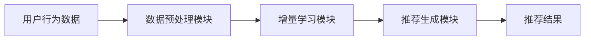
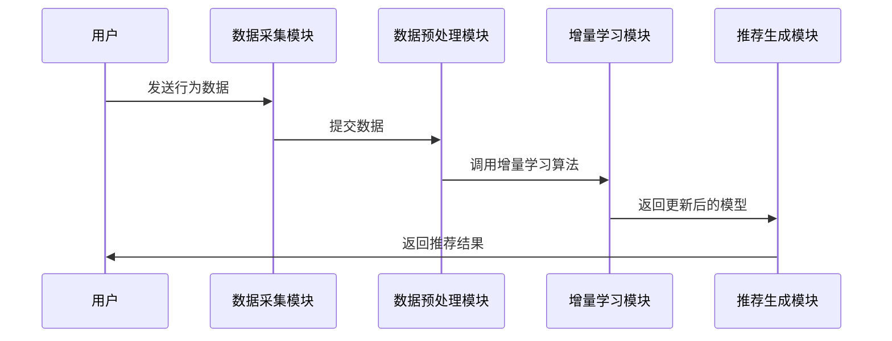

                 


# AI Agent的增量学习：适应动态变化的环境

**关键词**：AI Agent, 增量学习, 动态环境, 机器学习, 在线学习

**摘要**：  
本文探讨了AI Agent在动态环境中的增量学习方法，分析了增量学习的核心概念、算法原理、系统架构以及实际应用。通过详细的技术分析和案例研究，本文揭示了增量学习在动态环境中的适应性优势，并提供了实现增量学习的具体步骤和最佳实践。

---

## 第一部分: AI Agent与增量学习背景概述

### 第1章: AI Agent的基本概念与增量学习的必要性

#### 1.1 AI Agent的基本概念与特点  
AI Agent（智能体）是指在环境中能够感知并自主行动以实现目标的实体。AI Agent可以是软件程序、机器人或其他智能系统。其核心特点包括：  
1. **自主性**：能够在没有外部干预的情况下自主决策。  
2. **反应性**：能够实时感知环境并做出反应。  
3. **目标导向**：通过目标驱动行为，优化决策以实现目标。  

#### 1.2 增量学习的背景与必要性  
增量学习是一种机器学习方法，旨在通过逐步接收数据并更新模型来适应动态变化的环境。与传统批量学习不同，增量学习具有以下优势：  
1. **实时性**：能够实时处理数据并快速响应环境变化。  
2. **高效性**：不需要一次性加载所有数据，节省计算资源。  
3. **适应性**：在动态环境中能够持续优化模型，适应新的数据和任务需求。  

#### 1.3 动态环境下的AI Agent挑战  
动态环境是指环境状态、任务目标或数据分布随时间发生变化的场景。AI Agent在动态环境中面临以下挑战：  
1. **数据稀疏性**：新数据可能不完整或分布不均。  
2. **模型过时风险**：静态模型难以适应环境变化。  
3. **计算效率**：频繁更新模型可能带来计算开销。  

#### 1.4 增量学习在动态环境中的应用价值  
增量学习能够帮助AI Agent在动态环境中保持性能，具体表现为：  
1. **快速响应**：通过在线更新模型，AI Agent能够快速适应环境变化。  
2. **资源优化**：增量学习减少了对大量数据一次性处理的需求，节省了存储和计算资源。  
3. **持续优化**：通过持续学习，AI Agent能够不断优化其决策和行为策略。  

---

## 第二部分: 增量学习的核心概念与原理

### 第2章: 增量学习的核心概念与原理

#### 2.1 增量学习的定义与核心要素  
增量学习是一种机器学习方法，其核心要素包括：  
1. **数据流**：数据是以流的形式逐步输入的。  
2. **在线更新**：模型在接收到新数据后逐步更新。  
3. **增量模型**：模型能够适应新数据的变化，避免过时。  

#### 2.2 增量学习的原理与机制  
增量学习通过以下机制实现模型更新：  
1. **模型初始化**：基于初始数据训练初始模型。  
2. **数据流处理**：逐个或批量处理新数据，更新模型参数。  
3. **模型评估**：定期评估模型性能，调整学习策略。  

#### 2.3 增量学习与传统学习的对比  
以下是增量学习与传统批量学习的主要区别：

| 对比维度 | 增量学习 | 批量学习 |
|----------|----------|----------|
| 数据处理方式 | 流式处理 | 批次处理 |
| 模型更新频率 | 实时更新 | 一次性更新 |
| 适应性 | 高 | 低 |
| 资源消耗 | 低 | 高 |

---

## 第三部分: 增量学习的算法原理与实现

### 第3章: 增量学习的算法原理

#### 3.1 增量学习的数学模型  
增量学习的核心数学模型可以表示为：  
$$ \theta_{t+1} = \theta_t + \eta (y_t - \hat{y}_t) $$  
其中，$\theta_t$ 表示第 $t$ 次迭代的模型参数，$\eta$ 是学习率，$y_t$ 是真实标签，$\hat{y}_t$ 是模型预测值。

#### 3.2 增量学习的算法流程  
以下是增量学习的典型算法流程图：

```mermaid
graph TD
    A[初始化模型参数θ] --> B[接收新数据样本(x,y)]
    B --> C[计算预测值ŷ]
    C --> D[计算损失L]
    D --> E[更新模型参数θ]
    E --> F[循环直到收敛或终止条件]
```

#### 3.3 增量学习的Python实现  
以下是增量学习算法的Python代码示例：

```python
import numpy as np

def incremental_learning(X, y, learning_rate=0.1):
    # 初始化模型参数
    theta = np.zeros(X.shape[1])
    for i in range(len(X)):
        x = X[i]
        y_pred = np.dot(x, theta)
        loss = y[i] - y_pred
        # 更新参数
        theta += learning_rate * x * loss
    return theta

# 示例数据
X = np.array([[1, 2], [3, 4], [5, 6]])
y = np.array([7, 8, 9])

# 调用增量学习算法
theta = incremental_learning(X, y)
print(theta)
```

---

## 第四部分: 增量学习的系统架构与设计

### 第4章: 增量学习的系统架构设计

#### 4.1 问题场景介绍  
假设我们正在开发一个实时推荐系统，用户的行为数据会不断变化，需要通过增量学习更新推荐模型。

#### 4.2 系统功能设计  
系统功能包括：  
1. 数据采集：实时接收用户行为数据。  
2. 模型训练：使用增量学习算法更新推荐模型。  
3. 推荐生成：基于更新后的模型生成推荐列表。  

#### 4.3 系统架构设计  
以下是系统架构的mermaid图：



#### 4.4 系统接口设计  
系统接口包括：  
1. 数据输入接口：接收实时数据流。  
2. 模型更新接口：调用增量学习算法。  
3. 推荐输出接口：返回推荐结果。  

#### 4.5 系统交互流程图  
以下是系统交互的mermaid序列图：



---

## 第五部分: 增量学习的项目实战

### 第5章: 增量学习的项目实现

#### 5.1 环境安装与配置  
需要安装以下依赖：  
- Python 3.8+  
- NumPy  
- Scikit-learn  

#### 5.2 核心代码实现  
以下是增量学习算法的实现代码：

```python
from sklearn.linear_model import SGDRegressor
import numpy as np

def incremental_learning_sgd(X, y):
    model = SGDRegressor()
    for x, y_true in zip(X, y):
        model.partial_fit([[x]], [y_true])
    return model.coef_

# 示例数据
X = np.array([[1, 2], [3, 4], [5, 6]])
y = np.array([7, 8, 9])

# 调用增量学习算法
coefficients = incremental_learning_sgd(X, y)
print(coefficients)
```

#### 5.3 代码解读与分析  
1. 使用`SGDRegressor`实现增量学习。  
2. `partial_fit`方法用于在线更新模型。  
3. 每次仅处理一个样本，适合增量学习场景。  

#### 5.4 实际案例分析  
假设我们正在开发一个实时价格预测系统，使用增量学习更新预测模型。代码实现如下：

```python
import numpy as np
from sklearn.linear_model import SGDRegressor

# 示例数据
X = np.array([[1, 2], [3, 4], [5, 6]])
y = np.array([7, 8, 9])

# 初始化模型
model = SGDRegressor()

# 增量更新模型
for x, y_true in zip(X, y):
    model.partial_fit([[x]], [y_true])

# 预测新样本
new_X = np.array([[7, 8]])
print(model.predict(new_X))
```

#### 5.5 项目小结  
通过本项目，我们实现了增量学习算法，并验证了其在实时预测中的应用价值。增量学习能够快速适应数据变化，适用于动态环境中的任务。

---

## 第六部分: 增量学习的最佳实践与总结

### 第6章: 增量学习的最佳实践

#### 6.1 增量学习的注意事项  
1. **数据质量**：确保数据流的质量，避免噪声干扰模型。  
2. **模型选择**：根据任务需求选择合适的增量学习算法。  
3. **学习率调整**：动态调整学习率以平衡收敛速度和稳定性。  

#### 6.2 增量学习的未来展望  
随着动态环境中的数据量不断增长，增量学习将在以下领域发挥更大作用：  
1. **实时决策系统**：如自动驾驶、实时推荐。  
2. **边缘计算**：在资源受限的环境中优化计算效率。  
3. **终身学习**：实现AI Agent的持续进化与自我改进。  

---

## 作者信息

作者：AI天才研究院（AI Genius Institute） & 禅与计算机程序设计艺术（Zen And The Art of Computer Programming）

