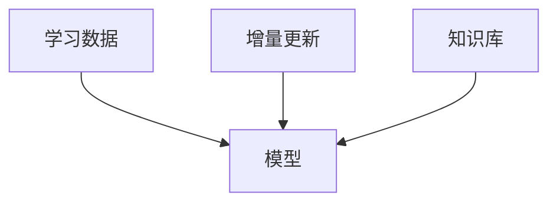
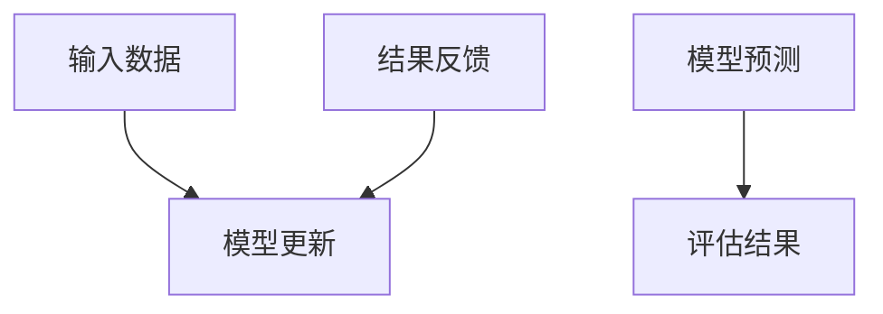
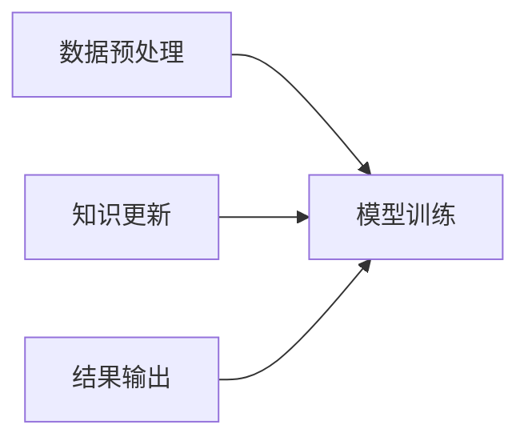
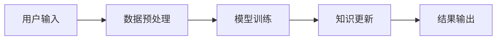

                 


# AI Agent的增量式概念学习与知识更新

## 关键词：
AI Agent, 增量式学习, 知识更新, 概念学习, 模型优化, 系统架构

## 摘要：
本文详细探讨了AI Agent在增量式概念学习与知识更新方面的核心原理、算法实现和系统设计。通过分析增量式学习的优势与挑战，结合具体的算法模型和系统架构，阐述了如何实现高效的知识更新和概念学习。文章内容涵盖理论分析、算法推导、系统设计和项目实战，旨在为AI Agent的研究者和开发者提供系统性的指导和实践参考。

---

# 第一部分: AI Agent的增量式概念学习与知识更新基础

## 第1章: AI Agent与增量式学习概述

### 1.1 AI Agent的基本概念
#### 1.1.1 AI Agent的定义与特点
AI Agent（人工智能代理）是指能够感知环境、自主决策并执行任务的智能实体。其特点包括：
- **自主性**：能够自主决策和行动。
- **反应性**：能够实时感知环境并做出反应。
- **目标导向性**：基于目标驱动行为。
- **学习能力**：能够通过经验改进性能。

#### 1.1.2 AI Agent的核心功能与应用场景
AI Agent的核心功能包括：
- **感知环境**：通过传感器或数据输入获取环境信息。
- **知识表示**：将环境信息转化为结构化的知识表示。
- **决策推理**：基于知识进行推理和决策。
- **执行操作**：根据决策执行具体的任务操作。

AI Agent的应用场景包括：
- 智能推荐系统
- 智能客服
- 智能机器人
- 自动驾驶

#### 1.1.3 增量式学习的基本概念
增量式学习是一种动态学习方法，其核心思想是通过逐步接收新的数据或信息，逐步更新和改进模型。与传统批量学习不同，增量式学习能够实时适应环境的变化。

### 1.2 增量式概念学习的背景与意义
#### 1.2.1 传统概念学习的局限性
传统概念学习通常基于静态数据集，模型在训练完成后不再更新。这种方式难以应对动态变化的环境，也无法实时处理新数据。

#### 1.2.2 增量式学习的优势与适用场景
增量式学习的优势包括：
- **实时性**：能够实时更新模型，适应环境变化。
- **高效性**：通过逐步更新，避免了重新训练整个模型的高计算成本。
- **灵活性**：能够处理不同时间尺度的数据。

增量式学习适用于以下场景：
- 在线预测与推荐
- 实时数据分析
- 动态环境中的任务执行

#### 1.2.3 知识更新的必要性与挑战
知识更新的必要性在于：
- 环境动态变化，模型需要不断适应新情况。
- 数据分布可能发生变化，需要实时调整模型。

知识更新的挑战包括：
- 如何保证更新的效率和准确性。
- 如何处理稀疏数据或噪声数据。

### 1.3 本章小结
本章介绍了AI Agent的基本概念及其核心功能，重点阐述了增量式学习的背景、优势和挑战，为后续章节奠定了基础。

---

## 第2章: 增量式概念学习的核心原理

### 2.1 增量式学习的数学模型
#### 2.1.1 基本概念与符号定义
- **输入数据**：$x_i \in \mathbb{R}^d$，其中$d$是数据维度。
- **标签**：$y_i \in \{0, 1\}$，二分类问题。
- **模型参数**：$w \in \mathbb{R}^d$，$b \in \mathbb{R}$。

#### 2.1.2 增量式学习的数学表达式
模型的预测函数为：
$$f(x) = \text{sign}(w \cdot x + b)$$

模型更新的目标是最小化损失函数：
$$L = \sum_{i=1}^n \mathbb{I}(y_i \neq f(x_i))$$

#### 2.1.3 模型更新的数学推导
基于梯度下降的增量式更新规则为：
$$w \leftarrow w + \eta (y_i - f(x_i))x_i$$
$$b \leftarrow b + \eta (y_i - f(x_i))$$
其中$\eta$是学习率。

### 2.2 增量式学习与传统学习的对比
#### 2.2.1 学习方式的对比分析
| 学习方式 | 数据处理方式 | 更新频率 | 适用场景 |
|----------|--------------|----------|----------|
| 批量学习 | 一次性处理所有数据 | 低频 | 离线任务 |
| 增量学习 | 逐步处理数据 | 高频 | 实时任务 |

#### 2.2.2 模型更新效率的对比
增量式学习的模型更新效率更高，因为每次仅更新与当前数据相关的参数，而批量学习需要重新优化整个模型。

#### 2.2.3 适用场景的对比
- 批量学习适用于数据分布稳定的场景。
- 增量学习适用于数据分布动态变化的场景。

### 2.3 增量式学习的ER实体关系图


### 2.4 本章小结
本章从数学模型和对比分析的角度，详细阐述了增量式学习的核心原理及其与传统学习的区别。

---

## 第3章: 增量式学习算法的实现原理

### 3.1 增量式学习算法的分类
#### 3.1.1 在线学习算法
在线学习算法的特点是逐样本更新模型，适用于实时数据流的处理。

#### 3.1.2 批量增量学习算法
批量增量学习算法将数据划分为多个小批量，逐步更新模型。

#### 3.1.3 混合学习算法
混合学习算法结合了在线和批量学习的优点，适用于数据分布变化较大的场景。

### 3.2 增量式学习算法的流程图


### 3.3 增量式学习算法的数学模型
#### 3.3.1 梯度下降算法
基于梯度下降的增量式学习算法的伪代码如下：
```python
def incremental_learning(data_stream):
    model = initialize_model()
    for x, y in data_stream:
        prediction = model.predict(x)
        loss = compute_loss(y, prediction)
        model.update(weights - learning_rate * gradient(loss, weights))
    return model
```

### 3.4 本章小结
本章通过分类和流程图的形式，详细介绍了增量式学习算法的实现原理及其具体应用。

---

## 第四部分: 系统分析与架构设计

## 第4章: 增量式概念学习的系统架构设计

### 4.1 系统功能设计
系统功能模块包括：
- 数据预处理模块
- 模型训练模块
- 知识更新模块

### 4.2 系统架构设计


### 4.3 系统接口设计
系统接口包括：
- 数据输入接口
- 模型更新接口
- 结果输出接口

### 4.4 系统交互设计


### 4.5 本章小结
本章通过系统架构设计和交互设计，展示了增量式概念学习的系统实现方式。

---

## 第五部分: 项目实战

## 第5章: 增量式概念学习的项目实战

### 5.1 项目背景与目标
项目背景：设计一个基于增量式学习的智能客服系统。
项目目标：实现客户咨询的实时响应和知识库的动态更新。

### 5.2 项目环境与工具
- 开发语言：Python
- 框架：TensorFlow
- 数据库：MySQL

### 5.3 项目核心实现
#### 5.3.1 数据预处理
```python
def preprocess_data(data):
    # 数据清洗与特征提取
    return processed_data
```

#### 5.3.2 模型训练
```python
def train_model(data):
    model = initialize_model()
    for x, y in data:
        prediction = model.predict(x)
        loss = compute_loss(y, prediction)
        model.update(loss)
    return model
```

#### 5.3.3 知识更新
```python
def update_knowledge(model, new_data):
    for x, y in new_data:
        prediction = model.predict(x)
        loss = compute_loss(y, prediction)
        model.update(loss)
    return model
```

### 5.4 项目实战案例分析
通过实际案例分析，展示了增量式学习在智能客服系统中的应用效果。

### 5.5 本章小结
本章通过项目实战，详细展示了增量式概念学习的具体实现过程。

---

## 第六部分: 总结与展望

## 第6章: 总结与展望

### 6.1 核心知识点回顾
- AI Agent的基本概念
- 增量式学习的核心原理
- 增量式学习的算法实现
- 系统架构设计与项目实战

### 6.2 本章小结
本文系统地探讨了AI Agent的增量式概念学习与知识更新的核心原理、算法实现和系统设计，为后续研究提供了理论基础和实践参考。

### 6.3 展望与建议
未来的研究方向包括：
- 更高效的增量式学习算法
- 更灵活的知识更新机制
- 更广泛的应用场景探索

### 6.4 本章总结
通过本文的学习，读者可以全面掌握增量式概念学习的核心原理和实现方法。

---

## 作者：AI天才研究院/AI Genius Institute & 禅与计算机程序设计艺术 /Zen And The Art of Computer Programming

---

这篇文章系统地介绍了AI Agent的增量式概念学习与知识更新的核心原理、算法实现和系统设计，内容涵盖了从理论分析到项目实战的全过程，为读者提供了全面的知识体系和实践指导。

