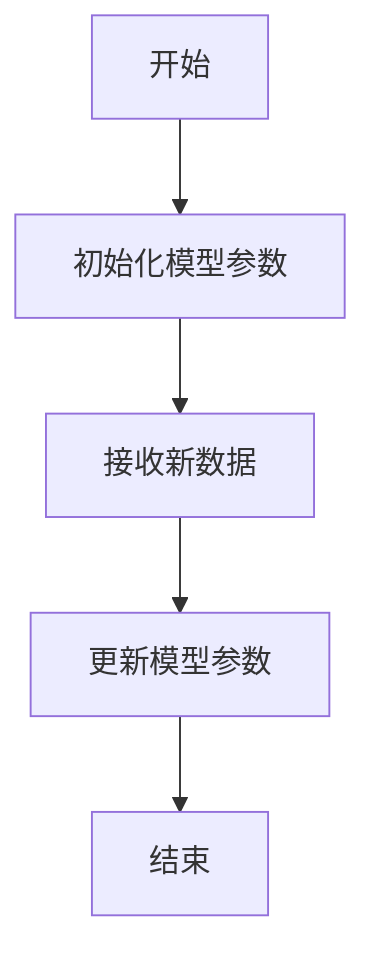
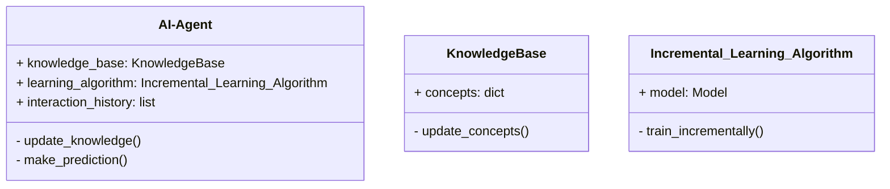
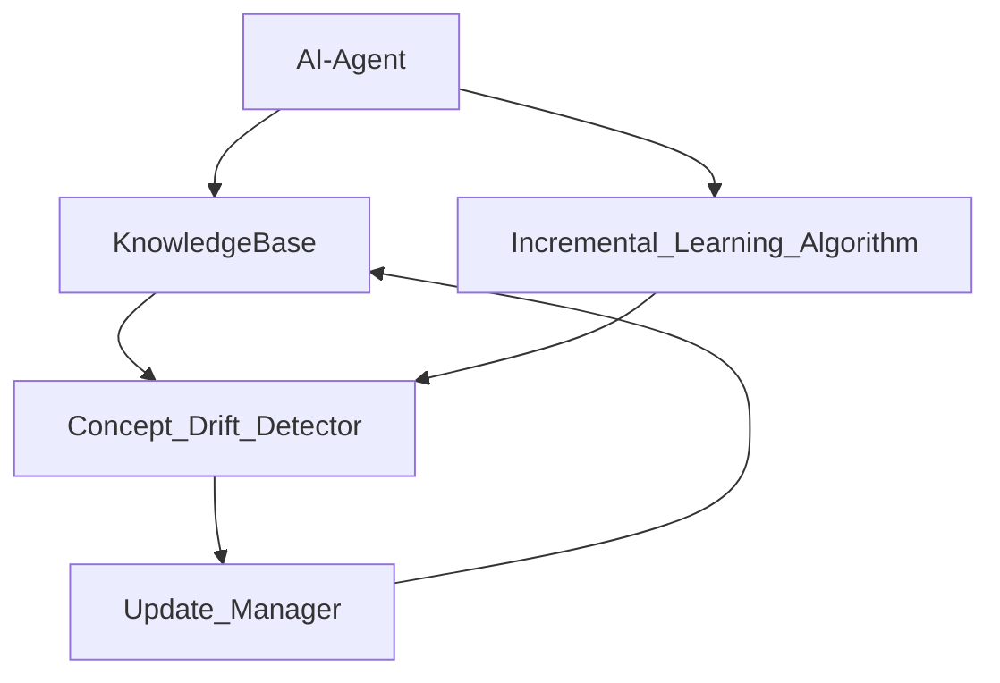

                 


# AI Agent的增量式概念形成与知识重构

> 关键词：AI Agent, 增量式概念形成, 知识重构, 算法原理, 系统架构

> 摘要：本文深入探讨了AI Agent在增量式概念形成与知识重构领域的核心原理、算法实现及系统架构设计。通过理论分析与实践案例结合，系统性地阐述了增量式概念形成与知识重构的关键技术，包括概念漂移检测、动态知识更新、多模态数据融合等前沿方法，旨在为AI Agent的开发与应用提供理论支持与实践指导。

---

## 第一部分: AI Agent的增量式概念形成与知识重构背景介绍

### 第1章: AI Agent的基本概念与背景

#### 1.1 AI Agent的定义与特点
AI Agent（人工智能代理）是指能够感知环境、自主决策并执行任务的智能实体。其特点包括：
- **自主性**：能够在没有外部干预的情况下独立运作。
- **反应性**：能够实时感知环境并做出响应。
- **目标导向**：基于预设目标或学习目标进行决策。
- **可扩展性**：能够适应不同规模和复杂度的任务。

AI Agent广泛应用于自动驾驶、智能助手、推荐系统等领域。例如，智能助手通过与用户的交互不断优化自身的行为模式，体现了增量式学习的特点。

#### 1.2 增量式概念形成的背景与必要性
在AI Agent的实际应用中，知识的动态更新与概念的逐步形成是不可避免的挑战。传统的批量学习方法无法应对实时变化的环境，因此增量式概念形成成为必要选择。

- **背景**：增量式概念形成是指AI Agent在接收新数据时，逐步构建或更新其知识体系的过程。这种学习方式能够有效应对数据流环境中的概念漂移问题。
- **必要性**：增量式学习能够实时更新模型，适应环境的变化，避免过时模型带来的性能下降。

#### 1.3 知识重构的重要性与应用场景
知识重构是指对已有知识进行重新组织和优化的过程。在AI Agent中，知识重构是实现动态适应的关键技术。

- **重要性**：通过知识重构，AI Agent能够消除冗余信息，优化知识表示，提升推理效率。
- **应用场景**：知识重构在推荐系统、对话系统等领域具有重要应用。例如，在推荐系统中，知识重构能够帮助模型更好地理解用户需求，提供更精准的推荐结果。

---

### 第2章: 增量式概念形成的核心概念与联系

#### 2.1 增量式概念形成的原理
增量式概念形成的核心在于逐步更新知识表示，以适应新数据的变化。

- **动态更新机制**：AI Agent在接收到新数据后，通过增量式算法更新知识库。
- **概念漂移检测**：通过统计方法或机器学习模型检测数据分布的变化。

#### 2.2 知识重构的原理与方法
知识重构的主要方法包括：
- **基于规则的方法**：通过预定义的规则优化知识表示。
- **基于学习的方法**：利用机器学习模型重构知识。

#### 2.3 核心概念的对比分析
以下是增量式概念形成与知识重构的核心概念对比：

| **概念**         | **增量式概念形成**       | **知识重构**             |
|------------------|--------------------------|--------------------------|
| **核心目标**     | 实时更新知识表示          | 优化现有知识表示          |
| **主要技术**     | 概念漂移检测、增量学习    | 数据清洗、知识图谱构建    |
| **应用场景**     | 实时数据分析、动态推荐    | 知识库优化、语义理解      |

---

## 第二部分: 增量式概念形成与知识重构的算法原理

### 第3章: 增量式概念形成的算法模型

#### 3.1 基于统计的增量式学习算法
增量式学习算法通过逐步更新模型参数，适应新数据的变化。以下是一个简单的线性回归增量式学习算法：



Python代码实现：

```python
import numpy as np

def incremental_learning(X, y, w, learning_rate=0.1):
    for i in range(len(X)):
        prediction = np.dot(X[i], w)
        error = y[i] - prediction
        w += learning_rate * error * X[i]
    return w
```

#### 3.2 增量式概念形成的数学模型
增量式概念形成的数学模型如下：

$$
w_{t+1} = w_t + \eta (y_i - \hat{y_i})x_i
$$

其中：
- \( w \) 表示模型参数
- \( \eta \) 表示学习率
- \( y_i \) 表示真实标签
- \( \hat{y_i} \) 表示预测标签
- \( x_i \) 表示输入样本

---

## 第三部分: 系统分析与架构设计方案

### 第4章: 系统功能设计与架构实现

#### 4.1 问题场景介绍
以电商推荐系统为例，AI Agent需要实时更新用户偏好模型，以应对用户行为的变化。

#### 4.2 系统功能设计
以下是系统功能设计的类图：



#### 4.3 系统架构设计
以下是系统架构设计的架构图：



---

## 第四部分: 项目实战

### 第5章: 项目实现与案例分析

#### 5.1 环境安装
以下是项目所需的环境安装命令：

```bash
pip install numpy scikit-learn mermaid
```

#### 5.2 核心代码实现
以下是增量式概念形成的核心代码实现：

```python
import numpy as np
from sklearn.linear_model import SGDRegressor

def incremental_concept_formation(X, y, model, learning_rate=0.1):
    for i in range(len(X)):
        model.partial_fit(X[i], y[i])
    return model
```

#### 5.3 案例分析与代码解读
以电商推荐系统为例，以下是如何使用增量式概念形成更新用户偏好模型的代码：

```python
# 初始化模型
model = SGDRegressor()
# 训练数据
X_train = np.array([[1, 2], [3, 4], [5, 6]])
y_train = np.array([7, 8, 9])
# 增量式训练
model = incremental_concept_formation(X_train, y_train, model)
# 预测新数据
X_new = np.array([[2, 3]])
y_new = model.predict(X_new)
print(y_new)
```

---

## 第五部分: 最佳实践与总结

### 第6章: 小结与注意事项

#### 6.1 小结
- 增量式概念形成与知识重构是AI Agent实现动态适应的关键技术。
- 增量式学习能够实时更新模型，应对概念漂移问题。
- 知识重构能够优化知识表示，提升推理效率。

#### 6.2 注意事项
- 在增量式学习中，需要合理设置学习率，避免过拟合。
- 知识重构需要结合具体应用场景，选择合适的方法。

---

## 作者：AI天才研究院 & 禅与计算机程序设计艺术

通过本文的系统阐述，读者可以深入了解AI Agent的增量式概念形成与知识重构的核心原理、算法实现及系统架构设计。希望本文能够为相关领域的研究与实践提供有价值的参考与启示。

