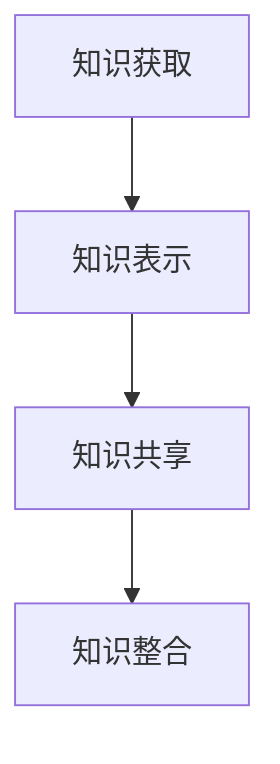
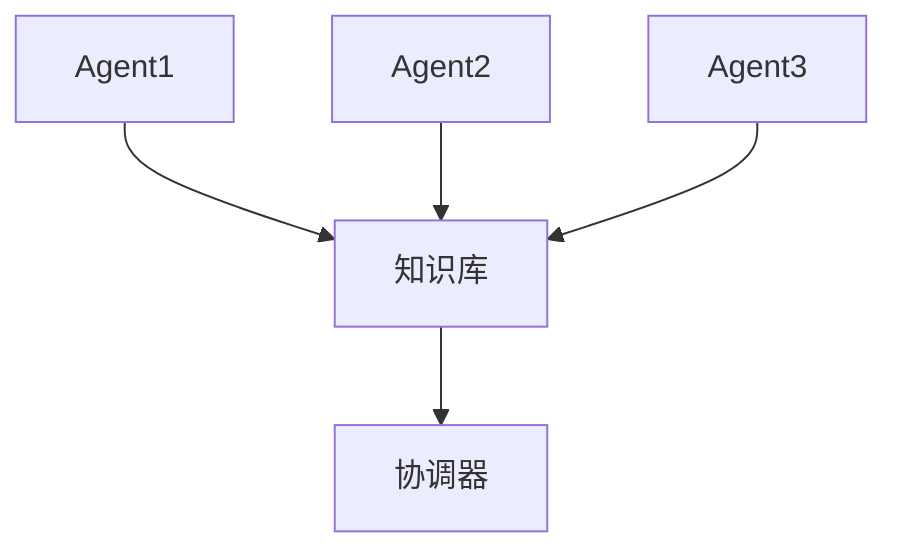
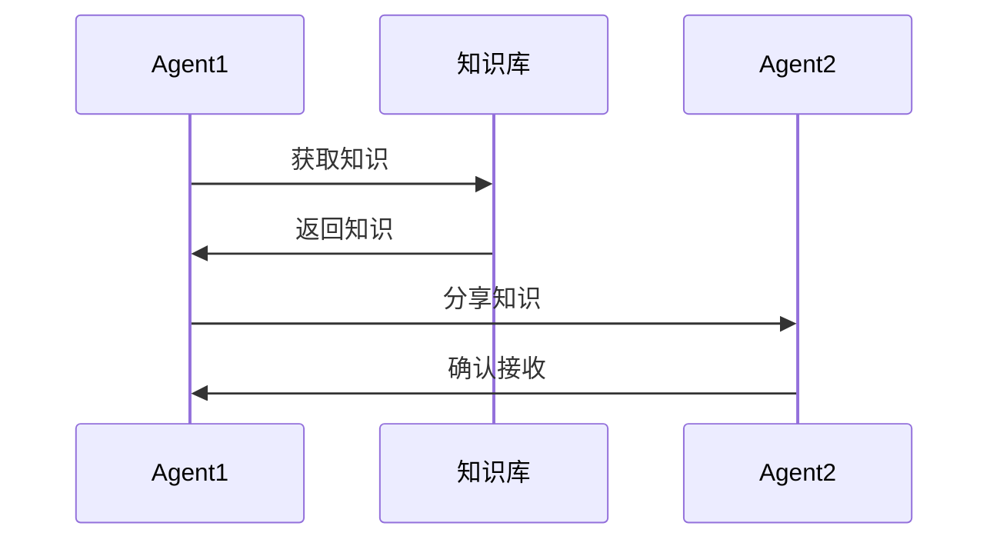

                 


# AI Agent的多Agent协作学习与知识共享

---

## 关键词
AI Agent, 多Agent系统, 协作学习, 知识共享, 多智能体协作

---

## 摘要
AI Agent的多Agent协作学习与知识共享是当前人工智能领域的重要研究方向。通过多Agent系统中的协作学习，不同AI Agent可以共享知识和经验，从而提高整体系统的智能性和决策能力。本文将从AI Agent的基本概念出发，深入探讨多Agent协作学习的核心原理、知识共享的实现机制，以及两者之间的相互作用。同时，结合实际应用场景，分析多Agent协作学习与知识共享的算法实现、系统架构设计，并通过具体案例展示其在实际应用中的价值。

---

# 第1章 AI Agent与多Agent系统概述

## 1.1 AI Agent的基本概念

### 1.1.1 什么是AI Agent
AI Agent（人工智能代理）是指能够感知环境、自主决策并执行任务的智能体。它能够通过传感器获取信息，利用推理能力做出决策，并通过执行器与环境交互。AI Agent的核心目标是通过感知和行动来实现特定任务。

### 1.1.2 AI Agent的核心特征
1. **自主性**：AI Agent能够自主决策，无需外部干预。
2. **反应性**：能够实时感知环境变化并做出反应。
3. **目标导向性**：所有行为都围绕实现特定目标展开。
4. **社交能力**：能够与其他Agent或人类进行交互和协作。

### 1.1.3 AI Agent的分类与应用场景
AI Agent可以根据功能、智能水平和环境类型进行分类：
1. **简单反射型Agent**：基于当前输入做出反应，常用于实时控制任务。
2. **基于模型的反射型Agent**：利用内部模型进行决策，适用于复杂任务。
3. **目标驱动型Agent**：以特定目标为导向，广泛应用于自动驾驶、智能助手等领域。
4. **实用驱动型Agent**：以效用函数为驱动，优化决策过程，常用于资源分配和博弈论场景。

---

## 1.2 多Agent系统的基本概念

### 1.2.1 多Agent系统的定义
多Agent系统是由多个相互作用的AI Agent组成的分布式系统，每个Agent都有自己的目标和行为规则。多Agent系统通过Agent之间的协作与竞争，实现复杂任务的完成。

### 1.2.2 多Agent系统的特点与优势
1. **分布式计算**：任务由多个Agent协作完成，避免单点故障。
2. **自主性**：每个Agent都是独立的，能够自主决策。
3. **动态性**：系统能够适应环境的变化，实时调整策略。
4. **可扩展性**：通过增加Agent数量，可以提高系统的处理能力。

### 1.2.3 多Agent系统的组成与结构
多Agent系统通常由以下部分组成：
1. **环境**：Agent运行的物理或虚拟空间。
2. **Agent**：具有感知和行动能力的智能体。
3. **通信机制**：Agent之间进行信息交换的通道。
4. **协作机制**：Agent之间协同工作的规则和策略。

---

## 1.3 多Agent协作学习与知识共享的背景

### 1.3.1 协作学习的定义与意义
协作学习是指多个Agent通过共享知识和经验，共同完成学习任务的过程。协作学习的核心在于通过知识共享提高整体系统的智能水平。

### 1.3.2 知识共享的定义与挑战
知识共享是指Agent之间交换知识和信息的过程。知识共享的关键在于如何确保信息的有效性和安全性，同时解决不同Agent之间的语义差异问题。

### 1.3.3 多Agent协作学习与知识共享的结合
多Agent协作学习与知识共享的结合能够实现知识的有效传播和利用，从而提高系统的整体性能。通过知识共享，每个Agent都可以从其他Agent那里获取新的知识，从而增强自身的智能水平。

---

# 第2章 多Agent协作学习的核心概念

## 2.1 多Agent协作学习的基本原理

### 2.1.1 协作学习的机制
协作学习的机制包括以下步骤：
1. **知识获取**：通过感知环境或与其他Agent交互获取知识。
2. **知识表示**：将获取的知识进行结构化表示，便于后续处理。
3. **知识共享**：通过通信机制将知识传递给其他Agent。
4. **知识整合**：接收方Agent将共享的知识与自身知识结合，形成新的知识体系。

### 2.1.2 多Agent协作学习的模型
多Agent协作学习的模型可以分为以下几种：
1. **分布式协作学习模型**：每个Agent独立学习，通过通信共享知识。
2. **集中式协作学习模型**：所有Agent共享一个集中式知识库，共同完成学习任务。
3. **混合式协作学习模型**：结合分布式和集中式的特点，部分知识共享，部分知识集中管理。

### 2.1.3 协作学习中的角色分配与任务分配
在多Agent协作学习中，角色分配和任务分配是关键问题。角色分配需要根据每个Agent的能力和目标进行动态调整，任务分配则需要根据任务的复杂性和Agent的资源进行合理分配。

---

## 2.2 知识共享的基本原理

### 2.2.1 知识表示与知识库的构建
知识表示是将知识转化为计算机可以理解的形式，常见的知识表示方法包括语义网络、知识图谱等。知识库的构建需要通过知识抽取、知识融合和知识存储等步骤完成。

### 2.2.2 知识共享的模式与方法
知识共享的模式包括：
1. **基于内容的共享**：根据知识内容的相似性进行共享。
2. **基于角色的共享**：根据Agent的角色和权限进行知识共享。
3. **基于上下文的共享**：根据当前任务的需求进行知识共享。

### 2.2.3 知识共享中的冲突与协调
知识共享过程中可能会出现知识冲突，例如知识表示不一致、知识来源冲突等。需要通过协调机制来解决这些问题，确保知识共享的准确性和一致性。

---

## 2.3 多Agent协作学习与知识共享的关系

### 2.3.1 协作学习与知识共享的相互作用
协作学习通过知识共享实现知识的传播和利用，而知识共享则为协作学习提供了必要的知识基础。两者相互依存，共同促进多Agent系统的智能水平提升。

### 2.3.2 知识共享对协作学习的促进作用
知识共享能够提高协作学习的效率，增强Agent之间的协作能力。通过知识共享，Agent可以快速获取所需的知识，减少重复劳动，提高学习效果。

### 2.3.3 多Agent系统中知识共享的实现方式
多Agent系统中知识共享的实现方式包括：
1. **直接共享**：Agent之间直接传递知识。
2. **间接共享**：通过中间媒介间接传递知识。
3. **混合共享**：结合直接和间接共享的方式，灵活实现知识共享。

---

# 第3章 多Agent协作学习与知识共享的核心概念与联系

## 3.1 多Agent协作学习的核心概念

### 3.1.1 协作学习的目标与任务
协作学习的目标是通过多个Agent的协作，共同完成复杂的学习任务。协作学习的任务包括知识获取、知识表示、知识共享和知识整合。

### 3.1.2 协作学习中的信息交换与知识整合
信息交换是协作学习的基础，通过信息交换，Agent可以共享知识和经验。知识整合是协作学习的关键，通过将不同Agent的知识进行融合，形成统一的知识体系。

### 3.1.3 协作学习中的个体与群体关系
协作学习中的个体关系包括竞争关系和合作关系。竞争关系能够激发Agent的潜力，合作关系则能够促进知识的共享和利用。

---

## 3.2 知识共享的核心概念

### 3.2.1 知识表示与知识库的构建
知识表示是知识共享的基础，知识库的构建需要通过知识抽取、知识融合和知识存储等步骤完成。

### 3.2.2 知识共享中的语义理解与匹配
语义理解是知识共享的关键，通过语义理解，Agent可以准确理解共享的知识内容。知识匹配是知识共享的核心，通过知识匹配，Agent可以找到与自身需求匹配的知识。

### 3.2.3 知识共享中的隐私与安全问题
知识共享中的隐私与安全问题是不可忽视的，需要通过加密技术、访问控制等手段确保知识共享的安全性。

---

## 3.3 多Agent协作学习与知识共享的联系

### 3.3.1 协作学习与知识共享的协同关系
协作学习与知识共享是相互依存的关系，协作学习需要知识共享的支持，知识共享也需要协作学习的推动。

### 3.3.2 知识共享对协作学习的优化作用
知识共享能够优化协作学习的过程，提高协作学习的效率和效果。通过知识共享，Agent可以快速获取所需的知识，减少学习成本。

### 3.3.3 多Agent系统中协作学习与知识共享的统一框架
多Agent系统中协作学习与知识共享的统一框架需要综合考虑Agent的协作机制、知识表示方法和知识共享规则，确保协作学习与知识共享的无缝衔接。

---

# 第4章 多Agent协作学习与知识共享的算法原理

## 4.1 多Agent协作学习的算法原理

### 4.1.1 分布式协作学习算法
分布式协作学习算法是一种基于分布式计算的协作学习方法，每个Agent独立学习，通过通信共享知识。例如，基于异步分布式梯度下降算法的协作学习。

### 4.1.2 集中式协作学习算法
集中式协作学习算法是一种基于集中式知识库的协作学习方法，所有Agent共同学习，共享一个集中式知识库。例如，基于参数服务器的协作学习算法。

### 4.1.3 混合式协作学习算法
混合式协作学习算法结合了分布式和集中式协作学习算法的优点，部分知识共享，部分知识集中管理。例如，基于联邦学习的协作学习算法。

---

## 4.2 知识共享的算法原理

### 4.2.1 基于内容的推荐算法
基于内容的推荐算法通过分析知识内容的相似性，推荐相关知识给需要的Agent。例如，基于余弦相似度的知识推荐算法。

### 4.2.2 基于图的传播算法
基于图的传播算法通过构建知识图谱，利用图的传播特性，实现知识的高效传播。例如，基于随机游走的知识传播算法。

### 4.2.3 基于强化学习的知识共享算法
基于强化学习的知识共享算法通过强化学习机制，动态调整知识共享的策略，提高知识共享的效率。例如，基于Q-learning的知识共享算法。

---

## 4.3 算法实现的代码示例

### 4.3.1 分布式协作学习算法的Python实现
```python
import numpy as np
import requests
import json

class Agent:
    def __init__(self, id):
        self.id = id
        self.model = None

    def train(self, data):
        # 训练模型
        pass

    def share_model(self):
        # 分享模型
        return self.model

# 分布式协作学习
class DistributedCollaborativeLearning:
    def __init__(self, agents):
        self.agents = agents

    def run(self):
        for agent in self.agents:
            # 训练模型
            agent.train(data)
            # 分享模型
            model = agent.share_model()
            # 上传到集中式知识库
            requests.post("http://knowledge_base_server", json=json.dumps(model))

# 使用示例
agents = [Agent(1), Agent(2)]
dcl = DistributedCollaborativeLearning(agents)
dcl.run()
```

### 4.3.2 基于内容的推荐算法的Python实现
```python
from sklearn.metrics.pairwise import cosine_similarity

class Knowledge Recommender:
    def __init__(self):
        self.knowledge_base = {}

    def add_knowledge(self, id, knowledge):
        self.knowledge_base[id] = knowledge

    def recommend_knowledge(self, id):
        # 获取知识内容
        knowledge = self.knowledge_base[id]
        # 计算相似性
        similarity = cosine_similarity(knowledge)
        # 返回推荐结果
        return similarity.argsort()

# 使用示例
recommender = KnowledgeRecommender()
recommender.add_knowledge(1, "AI Agent")
recommender.add_knowledge(2, "Multi-Agent System")
recommender.add_knowledge(3, "Collaborative Learning")
recommender.recommend_knowledge(1)
```

---

## 4.4 算法的数学模型与公式

### 4.4.1 分布式协作学习的数学模型
$$ \text{损失函数} = \frac{1}{n}\sum_{i=1}^{n} (y_i - \hat{y_i})^2 $$
其中，$n$是数据点的数量，$y_i$是真实值，$\hat{y_i}$是预测值。

### 4.4.2 基于强化学习的知识共享算法
$$ Q(s, a) = r + \gamma \max_{a'} Q(s', a') $$
其中，$Q(s, a)$是状态-动作值函数，$r$是奖励，$\gamma$是折扣因子，$s$是当前状态，$a$是当前动作，$s'$是下一个状态。

---

# 第5章 系统分析与架构设计方案

## 5.1 系统功能设计

### 5.1.1 系统功能模块
1. **知识获取模块**：负责从环境或外部数据源获取知识。
2. **知识表示模块**：将获取的知识进行结构化表示。
3. **知识共享模块**：通过通信机制实现知识的共享与传播。
4. **知识整合模块**：将共享的知识与自身知识进行整合。

### 5.1.2 功能流程图


---

## 5.2 系统架构设计

### 5.2.1 系统架构图


### 5.2.2 系统接口设计
1. **知识获取接口**：提供获取知识的API。
2. **知识共享接口**：提供共享知识的API。
3. **知识整合接口**：提供整合知识的API。

---

## 5.3 系统交互设计

### 5.3.1 交互流程图


### 5.3.2 交互协议
1. **获取知识协议**：定义知识获取的格式和接口。
2. **共享知识协议**：定义知识共享的格式和接口。
3. **整合知识协议**：定义知识整合的格式和接口。

---

# 第6章 项目实战

## 6.1 项目背景与目标

### 6.1.1 项目背景
本项目旨在实现一个多Agent协作学习与知识共享的系统，通过多个Agent的协作，共同完成知识的学习与共享任务。

### 6.1.2 项目目标
1. 实现多Agent协作学习的核心功能。
2. 实现知识共享的核心功能。
3. 实现多Agent协作学习与知识共享的统一框架。

---

## 6.2 项目实现

### 6.2.1 环境安装
1. 安装Python
2. 安装相关库（如requests、numpy、scikit-learn）
3. 安装Mermaid图生成工具

### 6.2.2 核心代码实现

#### 6.2.2.1 Agent类的实现
```python
class Agent:
    def __init__(self, id):
        self.id = id
        self.knowledge = {}

    def get_knowledge(self, key):
        return self.knowledge.get(key, None)

    def set_knowledge(self, key, value):
        self.knowledge[key] = value

    def share_knowledge(self, key):
        return self.knowledge.get(key, None)
```

#### 6.2.2.2 知识共享模块的实现
```python
class KnowledgeShare:
    def __init__(self, agents):
        self.agents = agents

    def share(self, source_id, target_id, key):
        source_agent = next(a for a in self.agents if a.id == source_id)
        target_agent = next(a for a in self.agents if a.id == target_id)
        knowledge = source_agent.share_knowledge(key)
        if knowledge is not None:
            target_agent.set_knowledge(key, knowledge)
            return True
        return False
```

### 6.2.3 代码应用解读与分析
通过上述代码，可以实现多Agent之间的知识共享。每个Agent都有自己的知识库，通过知识共享模块，Agent可以将自己的知识分享给其他Agent。

---

## 6.3 实际案例分析

### 6.3.1 案例背景
假设我们有多Agent系统，每个Agent负责不同的任务，需要通过协作学习与知识共享实现任务的协同完成。

### 6.3.2 案例实现
1. 创建多个Agent实例。
2. 通过知识共享模块实现知识的共享。
3. 通过协作学习算法实现任务的协同完成。

### 6.3.3 案例分析
通过案例分析，可以验证多Agent协作学习与知识共享算法的有效性，同时发现系统中存在的问题，并提出改进方案。

---

## 6.4 项目小结

### 6.4.1 项目总结
通过本项目的实现，我们可以看到多Agent协作学习与知识共享的核心思想和实现方法。

### 6.4.2 项目经验
在项目实施过程中，需要注意以下几点：
1. 知识表示的准确性。
2. 知识共享的安全性。
3. 多Agent协作的效率。

---

# 第7章 最佳实践、小结、注意事项、拓展阅读

## 7.1 最佳实践

### 7.1.1 知识共享的最佳实践
1. 确保知识表示的准确性和一致性。
2. 采用合适的知识共享机制，确保知识共享的安全性和效率。
3. 定期更新知识库，保持知识的最新性。

### 7.1.2 多Agent协作学习的最佳实践
1. 合理分配Agent的角色和任务，确保协作学习的高效性。
2. 采用适合的协作学习算法，根据任务需求选择合适的算法。
3. 定期监控和优化协作学习的过程，确保协作学习的效果。

---

## 7.2 小结

通过本文的详细讲解，我们了解了AI Agent的多Agent协作学习与知识共享的核心思想和实现方法。多Agent协作学习与知识共享是实现智能系统的重要手段，通过协作学习与知识共享，可以实现知识的高效传播和利用，提高系统的整体智能水平。

---

## 7.3 注意事项

### 7.3.1 知识共享的注意事项
1. 注意知识共享的安全性，防止知识泄露。
2. 注意知识表示的准确性，避免因语义差异导致的知识冲突。
3. 注意知识共享的效率，确保知识共享的实时性。

### 7.3.2 多Agent协作学习的注意事项
1. 注意Agent的角色分配，确保协作学习的高效性。
2. 注意协作学习算法的选择，根据任务需求选择合适的算法。
3. 注意协作学习的过程监控，确保协作学习的效果。

---

## 7.4 拓展阅读

### 7.4.1 推荐书籍
1. 《Multi-Agent Systems: Algorithmic, Complexity, and Synthesis》
2. 《Distributed Artificial Intelligence》

### 7.4.2 推荐论文
1. “Distributed Collaborative Learning in Multi-Agent Systems”
2. “Knowledge Sharing in Multi-Agent Systems: A Survey”

---

## 作者信息

作者：AI天才研究院（AI Genius Institute）  
联系邮箱：info@aigeniusinstitute.com  
官方网站：https://www.aigeniusinstitute.com

