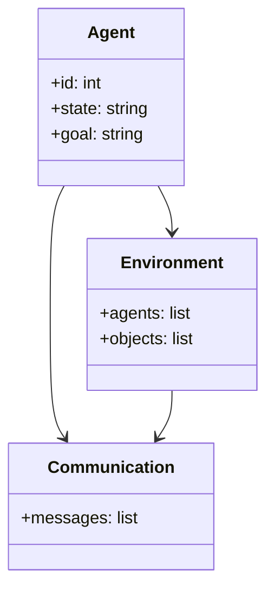
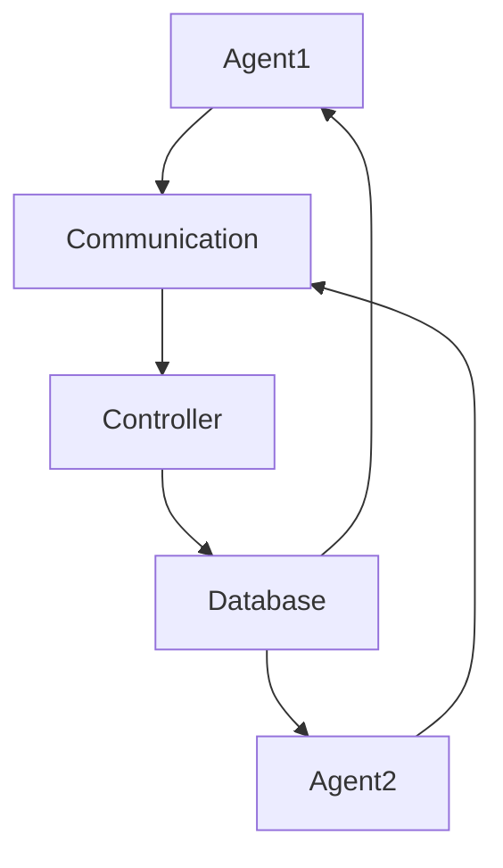
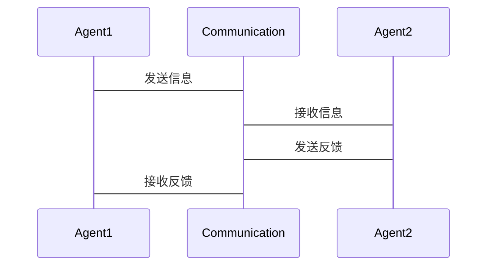

                 


# AI Agent的多Agent协同推理与决策

> 关键词：AI Agent，多Agent系统，协同推理，决策算法，系统架构，分布式计算

> 摘要：本文深入探讨了AI Agent的多Agent协同推理与决策的核心概念、算法原理、系统架构及实际应用。通过对多Agent系统的结构分析、协同推理与决策算法的详细讲解，结合实际案例和系统设计，全面阐述了如何在复杂场景中实现高效的多Agent协同推理与决策。

---

# 第1章: AI Agent的基本概念与背景

## 1.1 AI Agent的定义与特点

### 1.1.1 什么是AI Agent
AI Agent（人工智能代理）是指能够感知环境、自主决策并执行任务的智能实体。AI Agent可以是软件程序、机器人或其他智能系统，其核心目标是通过感知和行动来优化目标函数。

### 1.1.2 AI Agent的核心特点
- **自主性**：能够在没有外部干预的情况下独立运行。
- **反应性**：能够根据环境的变化动态调整行为。
- **目标导向性**：所有行为都围绕实现特定目标展开。
- **学习能力**：能够通过经验改进性能。

### 1.1.3 AI Agent与传统程序的区别
| 属性         | AI Agent                          | 传统程序                       |
|--------------|----------------------------------|--------------------------------|
| 行为方式      | 主动感知环境并采取行动            | 被动执行指令                    |
| 决策能力      | 具备自主决策能力                  | 依赖预定义规则                  |
| 环境适应性     | 能够适应动态变化的环境            | 适用于固定场景                  |

---

## 1.2 多Agent系统的基本概念

### 1.2.1 多Agent系统的定义
多Agent系统是由多个相互作用的AI Agent组成的系统，这些Agent通过协同推理和决策共同完成复杂的任务。

### 1.2.2 多Agent系统的优势
- **分布式计算**：通过分布式计算提高系统的容错性和可扩展性。
- **任务分解**：将复杂任务分解为多个子任务，由不同的Agent分别执行。
- **协同优化**：通过协同推理实现全局最优。

### 1.2.3 多Agent系统的应用场景
- **自动驾驶**：多个自动驾驶车辆协同决策以避免碰撞。
- **智能城市**：城市中的交通灯、摄像头等设备协同工作。
- **机器人协作**：工业机器人在生产线上的协同工作。

---

## 1.3 协同推理与决策的背景

### 1.3.1 协同推理的定义
协同推理是指多个Agent通过共享信息、交换知识，共同完成推理任务的过程。

### 1.3.2 决策的基本概念
决策是指在多个选项中选择最优行动的过程。

### 1.3.3 协同推理与决策的重要性
在复杂场景中，单个Agent难以完成所有任务，需要通过协同推理和决策来实现全局最优。

---

## 1.4 本章小结
本章介绍了AI Agent的基本概念、多Agent系统的特点以及协同推理与决策的背景，为后续内容奠定了基础。

---

# 第2章: 多Agent系统的结构与模型

## 2.1 多Agent系统的组成

### 2.1.1 Agent的基本结构
- **感知器**：用于感知环境信息。
- **推理器**：用于处理感知信息并生成行动。
- **执行器**：用于执行推理结果。

### 2.1.2 多Agent系统的组成要素
- **环境**：Agent所处的物理或虚拟环境。
- **通信机制**：Agent之间的信息交互方式。
- **协调机制**：用于协调Agent行为的规则或算法。

### 2.1.3 Agent之间的关系
- **竞争关系**：Agent之间存在竞争关系，如机器人比赛。
- **合作关系**：Agent之间需要协同完成任务。
- **混合关系**：既有竞争也有合作。

---

## 2.2 多Agent系统的模型

### 2.2.1 反应式模型
反应式模型是一种基于当前感知信息进行实时反应的模型。

### 2.2.2 规划式模型
规划式模型是一种基于预定义目标和计划的模型。

### 2.2.3 综合式模型
综合式模型结合了反应式和规划式模型的优点。

---

## 2.3 多Agent系统的分类

### 2.3.1 按照智能水平分类
- **反应式系统**：基于当前感知信息进行反应。
- **认知式系统**：具备推理和规划能力。
- **混合式系统**：结合反应式和认知式的特点。

### 2.3.2 按照协作方式分类
- **分布式协作**：Agent之间通过分布式计算协同完成任务。
- **集中式协作**：有一个中央协调器负责协调所有Agent的行为。

### 2.3.3 按照应用场景分类
- **工业自动化**：应用于生产线上的机器人协作。
- **智能交通**：应用于自动驾驶车辆的协同决策。
- **智能安防**：应用于监控系统中的多摄像头协作。

---

## 2.4 本章小结
本章介绍了多Agent系统的组成、模型和分类，为后续的协同推理与决策奠定了基础。

---

# 第3章: 协同推理与决策的核心概念

## 3.1 协同推理的基本原理

### 3.1.1 协同推理的定义
协同推理是指多个Agent通过共享信息、交换知识，共同完成推理任务的过程。

### 3.1.2 协同推理的过程
1. **信息共享**：Agent之间共享感知到的信息。
2. **知识融合**：将多个Agent的知识进行融合。
3. **协同推理**：基于融合后的知识进行推理。

### 3.1.3 协同推理的关键技术
- **信息共享机制**：确保Agent之间的信息能够有效共享。
- **知识融合算法**：将多个Agent的知识进行融合。
- **协同推理算法**：基于融合后的知识进行推理。

---

## 3.2 多Agent决策的基本原理

### 3.2.1 决策的定义
决策是指在多个选项中选择最优行动的过程。

### 3.2.2 多Agent决策的过程
1. **目标识别**：识别需要实现的目标。
2. **信息收集**：收集与目标相关的环境信息。
3. **决策推理**：基于收集的信息进行推理并选择最优行动。

### 3.2.3 决策的关键技术
- **多目标优化**：在多个目标之间寻找最优平衡点。
- **分布式决策**：通过分布式计算实现决策的协同优化。

---

## 3.3 协同推理与决策的关系

### 3.3.1 协同推理与决策的相互作用
- 协同推理为决策提供信息支持。
- 决策指导协同推理的方向。

### 3.3.2 协同推理对决策的影响
- 协同推理能够提高决策的准确性和全面性。
- 协同推理能够降低决策的不确定性。

### 3.3.3 决策对协同推理的影响
- 决策的结果指导协同推理的方向。
- 决策的优化能够提升协同推理的效率。

---

## 3.4 本章小结
本章介绍了协同推理与决策的核心概念及其关系，为后续的算法和系统设计奠定了基础。

---

# 第4章: 多Agent协同推理与决策的核心算法

## 4.1 基于Dijkstra算法的路径规划

### 4.1.1 Dijkstra算法的基本原理
Dijkstra算法是一种用于求解图中单源最短路径的算法。

### 4.1.2 Dijkstra算法在多Agent路径规划中的应用
通过Dijkstra算法，多个Agent可以在复杂环境中找到最优路径。

### 4.1.3 Dijkstra算法的优缺点
- **优点**：能够找到最优路径。
- **缺点**：在大规模图中计算效率较低。

---

## 4.2 基于A*算法的路径规划

### 4.2.1 A*算法的基本原理
A*算法是一种基于启发式搜索的最短路径算法。

### 4.2.2 A*算法在多Agent路径规划中的应用
通过A*算法，多个Agent可以在复杂环境中找到最优路径。

### 4.2.3 A*算法的优缺点
- **优点**：计算效率较高，适合大规模图。
- **缺点**：需要预定义启发函数。

---

## 4.3 基于分布式计算的协同决策算法

### 4.3.1 分布式计算的基本原理
分布式计算是指通过多个计算节点协同完成任务的过程。

### 4.3.2 分布式计算在多Agent协同决策中的应用
通过分布式计算，多个Agent可以在复杂环境中协同完成决策任务。

### 4.3.3 分布式计算的优缺点
- **优点**：系统容错性和可扩展性高。
- **缺点**：需要复杂的通信和协调机制。

---

## 4.4 本章小结
本章介绍了多Agent协同推理与决策的核心算法，包括Dijkstra算法、A*算法和分布式计算算法。

---

# 第5章: 多Agent协同推理与决策的系统架构设计

## 5.1 系统功能设计

### 5.1.1 系统的功能模块划分
- **感知模块**：负责感知环境信息。
- **推理模块**：负责协同推理。
- **决策模块**：负责决策优化。
- **通信模块**：负责Agent之间的信息交互。

### 5.1.2 各功能模块的交互流程
1. **感知模块**：感知环境信息并传递给推理模块。
2. **推理模块**：基于感知信息进行协同推理并传递给决策模块。
3. **决策模块**：基于推理结果进行决策优化并传递给执行模块。
4. **执行模块**：执行决策结果并反馈给感知模块。

### 5.1.3 系统的性能指标
- **响应时间**：系统对环境变化的响应时间。
- **决策准确率**：系统决策的准确率。
- **系统吞吐量**：系统在单位时间内处理的任务数量。

---

## 5.2 系统架构设计

### 5.2.1 领域模型设计


### 5.2.2 系统架构图


### 5.2.3 系统接口设计
- **通信接口**：Agent之间的信息交互接口。
- **控制接口**：系统控制器的接口。
- **数据接口**：系统数据库的接口。

### 5.2.4 系统交互设计


---

## 5.3 本章小结
本章介绍了多Agent协同推理与决策系统的功能设计、架构设计和交互设计。

---

# 第6章: 多Agent协同推理与决策的项目实战

## 6.1 环境安装与配置

### 6.1.1 安装Python
```bash
python --version
pip install --upgrade pip
```

### 6.1.2 安装必要的库
```bash
pip install numpy
pip install matplotlib
pip install networkx
```

---

## 6.2 系统核心实现源代码

### 6.2.1 多Agent路径规划代码
```python
import heapq

def dijkstra(graph, start, goal):
    visited = {}
    heap = []
    heapq.heappush(heap, (0, start))
    visited[start] = 0

    while heap:
        current_cost, current_node = heapq.heappop(heap)
        if current_node == goal:
            break
        for neighbor, weight in graph[current_node].items():
            new_cost = current_cost + weight
            if neighbor not in visited or new_cost < visited[neighbor]:
                visited[neighbor] = new_cost
                heapq.heappush(heap, (new_cost, neighbor))
    return visited[goal]

graph = {
    'A': {'B': 1, 'C': 3},
    'B': {'A': 1, 'D': 2},
    'C': {'A': 3, 'D': 5},
    'D': {'B': 2, 'C': 5}
}

print(dijkstra(graph, 'A', 'D'))  # 输出：3
```

---

## 6.3 代码应用解读与分析

### 6.3.1 代码解读
上述代码实现了Dijkstra算法，用于求解图中单源最短路径。

### 6.3.2 代码分析
- **输入**：图的邻接表表示和起点、目标点。
- **输出**：起点到目标点的最短路径权重。
- **实现步骤**：
  1. 初始化优先队列。
  2. 使用优先队列进行最短路径搜索。
  3. 返回目标点的最短路径权重。

---

## 6.4 实际案例分析

### 6.4.1 案例背景
在一个城市交通网络中，多个自动驾驶车辆需要协同规划路径以避免碰撞。

### 6.4.2 案例实现
```python
import heapq

def multi_agent_dijkstra(graph, agents, start, goal):
    visited = {}
    heap = []
    for agent in agents:
        heapq.heappush(heap, (0, start, agent))
        visited[start] = {agent: 0}

    while heap:
        current_cost, current_node, agent = heapq.heappop(heap)
        if current_node == goal:
            print(f"Agent {agent} 到达目标点 {goal}，最短路径权重为 {current_cost}")
            return
        for neighbor, weight in graph[current_node].items():
            new_cost = current_cost + weight
            if neighbor not in visited or new_cost < visited[neighbor].get(agent, float('inf')):
                visited[neighbor][agent] = new_cost
                heapq.heappush(heap, (new_cost, neighbor, agent))
    print("无法到达目标点")

agents = ['A1', 'A2', 'A3']
graph = {
    'A': {'B': 1, 'C': 3},
    'B': {'A': 1, 'D': 2},
    'C': {'A': 3, 'D': 5},
    'D': {'B': 2, 'C': 5}
}

multi_agent_dijkstra(graph, agents, 'A', 'D')
```

---

## 6.5 项目总结

### 6.5.1 项目总结
通过本项目，我们实现了多Agent协同路径规划的算法，并通过实际案例验证了算法的有效性。

### 6.5.2 关键点总结
- **算法选择**：选择合适的算法是项目成功的关键。
- **系统设计**：合理的系统设计能够提高系统的性能和可扩展性。

### 6.5.3 未来优化方向
- **算法优化**：进一步优化路径规划算法，提高计算效率。
- **系统扩展**：增加更多的功能模块，如路径优化、任务分配等。

---

# 第7章: 多Agent协同推理与决策的最佳实践

## 7.1 小结

### 7.1.1 核心内容回顾
本文深入探讨了AI Agent的多Agent协同推理与决策的核心概念、算法原理、系统架构及实际应用。

### 7.1.2 关键点回顾
- **算法选择**：选择合适的算法是项目成功的关键。
- **系统设计**：合理的系统设计能够提高系统的性能和可扩展性。

---

## 7.2 注意事项

### 7.2.1 算法选择的注意事项
- **算法的适用性**：选择适合具体场景的算法。
- **算法的计算效率**：考虑算法的计算效率和复杂度。

### 7.2.2 系统设计的注意事项
- **系统的可扩展性**：设计能够适应未来需求的系统。
- **系统的容错性**：设计能够容忍部分故障的系统。

---

## 7.3 拓展阅读

### 7.3.1 推荐书籍
- 《Multi-Agent Systems: Algorithmic, Complexity Theoretic, and Synthesis Aspects》
- 《Distributed Computing and Networking》

### 7.3.2 推荐论文
- "Distributed Algorithms for Multi-Agent Systems"
- "Cooperative Path-Finding for Multi-Agent Systems"

---

# 作者：AI天才研究院/AI Genius Institute & 禅与计算机程序设计艺术 /Zen And The Art of Computer Programming

