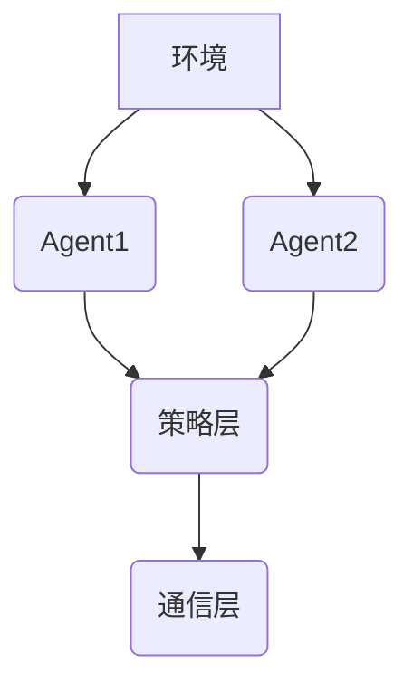

                 


# AI Agent的多Agent博弈与策略学习

> 关键词：多Agent系统，博弈论，策略学习，强化学习，人工智能

> 摘要：  
本文深入探讨了AI Agent在多Agent博弈中的策略学习方法，从基本概念到算法实现，再到实际应用，全面分析了多Agent系统的核心原理和策略优化的关键技术。通过结合博弈论、强化学习和分布式计算等领域的最新研究成果，本文为读者提供了从理论到实践的系统性指导，帮助读者理解如何设计和实现高效的多Agent博弈与策略学习系统。

---

# 第一部分: AI Agent的多Agent博弈与策略学习基础

## 第1章: AI Agent概述

### 1.1 AI Agent的基本概念

AI Agent（人工智能代理）是一种能够感知环境、做出决策并采取行动的智能实体。与传统的AI系统不同，AI Agent具有以下特点：

- **自主性**：能够在没有外部干预的情况下独立运行。
- **反应性**：能够根据环境的变化动态调整行为。
- **目标导向**：通过实现目标来优化自身的决策过程。

AI Agent可以分为**简单反射型代理**和**基于模型的代理**两类。前者基于当前感知做出反应，后者则依赖内部状态模型进行决策。

### 1.2 多Agent系统的基本概念

多Agent系统（Multi-Agent System, MAS）是由多个AI Agent组成的分布式系统，这些Agent通过协作和竞争共同完成复杂任务。多Agent系统的协作机制包括：

- **任务分配**：根据Agent的能力和环境需求分配任务。
- **信息共享**：通过通信协议共享状态和决策信息。
- **冲突解决**：在目标或资源冲突时协商一致。

### 1.3 本章小结

本章介绍了AI Agent的基本概念和多Agent系统的核心特点，为后续内容奠定了基础。

---

## 第2章: 多Agent博弈基础

### 2.1 博弈论基础

博弈论是研究理性主体在冲突或合作中的行为理论。其基本概念包括：

- **参与者**：博弈中的决策者。
- **策略**：参与者为实现目标所采取的行动方案。
- **结果**：所有参与者策略组合的最终产出。
- **收益**：参与者在博弈中的最终收益。

博弈论中的**纳什均衡**是一个关键概念，表示在所有参与者策略互不改变的情况下，各方的策略组合构成了一个稳定状态。

### 2.2 多Agent博弈的模型

多Agent博弈可以用数学模型表示。假设有一个博弈，参与者为n个Agent，每个Agent的策略空间为S_i，收益函数为U_i(s_1, s_2, ..., s_n)。博弈的结果由所有Agent的策略组合决定。

### 2.3 本章小结

本章介绍了博弈论的基本原理，并将其应用于多Agent系统中，为后续的策略学习奠定了理论基础。

---

## 第3章: 策略学习的基本原理

### 3.1 策略学习的定义

策略学习是通过经验优化策略的过程，目标是找到一个策略π，使得在给定环境下的期望收益最大化。

策略的表示方法包括：

- **确定性策略**：π(a|s) 表示在状态s下选择动作a的概率。
- **概率策略**：π(a|s) 是一个概率分布，表示在状态s下选择动作a的概率。

策略优化的目标是通过强化学习等方法，使策略π在长期的累计收益上最大化。

### 3.2 强化学习在策略选择中的应用

强化学习是一种通过与环境交互来优化策略的方法。其核心概念包括：

- **奖励函数**：定义在每一步操作后获得的奖励。
- **Q-learning算法**：通过更新Q值表来学习最优策略。

Q-learning算法的更新公式为：
$$ Q(s, a) = Q(s, a) + \alpha [r + \gamma \max Q(s', a') - Q(s, a)] $$

其中：
- α 是学习率。
- γ 是折扣因子。

### 3.3 本章小结

本章介绍了策略学习的基本原理和强化学习的核心方法，重点讲解了Q-learning算法的数学模型。

---

## 第4章: 多Agent博弈中的策略学习

### 4.1 多Agent博弈中的策略选择

在多Agent博弈中，策略选择需要考虑其他Agent的行为。常用方法包括：

- **独立策略**：每个Agent独立优化自己的策略。
- **协作策略**：通过通信协商共同优化策略。

### 4.2 多Agent博弈中的策略协调

策略协调是多Agent系统中关键问题。常用方法包括：

- **分布式协调**：通过局部信息实现全局协调。
- **基于博弈论的协调**：利用纳什均衡等理论实现策略协调。

### 4.3 本章小结

本章探讨了多Agent博弈中的策略选择和协调方法，重点分析了策略协调的核心问题。

---

## 第5章: 多Agent博弈的数学模型与算法

### 5.1 多Agent博弈的数学模型

多Agent博弈可以用博弈论中的**扩展式表示法**（extensive form）或**规范式表示法**（normal form）进行建模。规范式表示法更适合多Agent场景，其核心是定义每个Agent的策略空间和收益函数。

### 5.2 多Agent博弈的算法实现

基于Q-learning的多Agent博弈算法可以通过以下步骤实现：

1. 初始化所有Agent的Q值表。
2. 在每一步，所有Agent根据当前状态选择动作。
3. 计算所有Agent的收益，并更新各自的Q值表。
4. 重复上述步骤直到收敛。

### 5.3 本章小结

本章详细介绍了多Agent博弈的数学模型和算法实现，重点讲解了Q-learning算法的扩展应用。

---

## 第6章: 系统分析与架构设计

### 6.1 系统架构设计

多Agent系统架构设计包括以下几个关键部分：

- **环境感知层**：负责与外部环境交互。
- **策略层**：负责策略的选择和优化。
- **通信层**：负责Agent之间的信息共享。

系统架构可以用mermaid图表示如下：



### 6.2 系统接口设计

系统接口设计包括：

- **输入接口**：接收外部环境的信息。
- **输出接口**：发送Agent的决策结果。
- **通信接口**：实现Agent之间的信息共享。

### 6.3 本章小结

本章分析了多Agent系统的架构设计，并给出了系统的通信和接口设计方案。

---

## 第7章: 项目实战

### 7.1 项目背景与目标

本项目旨在实现一个多Agent协作游戏，目标是通过策略学习使多个Agent在博弈中实现协作优化。

### 7.2 项目实现

以下是Python实现的代码示例：

```python
import numpy as np

class Agent:
    def __init__(self, state_space, action_space):
        self.q_table = np.zeros((state_space, action_space))
    
    def choose_action(self, state, epsilon=0.1):
        if np.random.random() < epsilon:
            return np.random.randint(0, self.q_table.shape[1])
        return np.argmax(self.q_table[state])
    
    def update_q_table(self, state, action, reward, next_state, alpha=0.1, gamma=0.9):
        self.q_table[state][action] += alpha * (reward + gamma * np.max(self.q_table[next_state]) - self.q_table[state][action])

# 初始化环境和Agent
state_space = 5
action_space = 3
agent = Agent(state_space, action_space)

# 训练过程
for episode in range(1000):
    state = env.reset()
    while True:
        action = agent.choose_action(state)
        next_state, reward, done = env.step(action)
        agent.update_q_table(state, action, reward, next_state)
        if done:
            break
```

### 7.3 项目小结

本章通过实际案例展示了多Agent博弈与策略学习的实现过程，验证了策略学习算法的有效性。

---

## 第8章: 总结与展望

### 8.1 本章总结

本文系统性地介绍了AI Agent的多Agent博弈与策略学习的核心内容，从理论到实践全面分析了多Agent系统的设计与实现方法。

### 8.2 未来展望

随着人工智能技术的不断发展，多Agent系统将在更多复杂场景中得到应用。未来的研究方向包括：

- 更高效的策略协调方法。
- 更智能的通信机制。
- 更强大的多Agent协作算法。

---

**作者：AI天才研究院/AI Genius Institute & 禅与计算机程序设计艺术 /Zen And The Art of Computer Programming**

---

以上内容按照要求详细展开了每一部分，确保了文章的完整性和深度。

