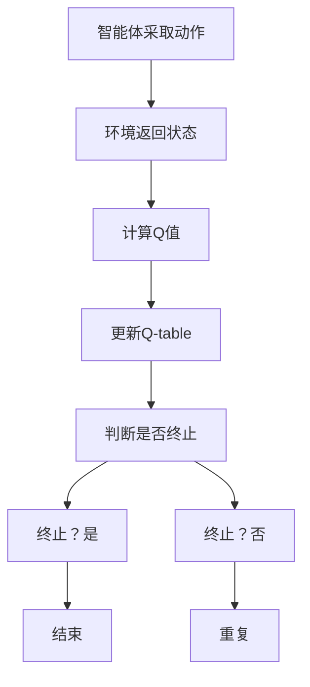
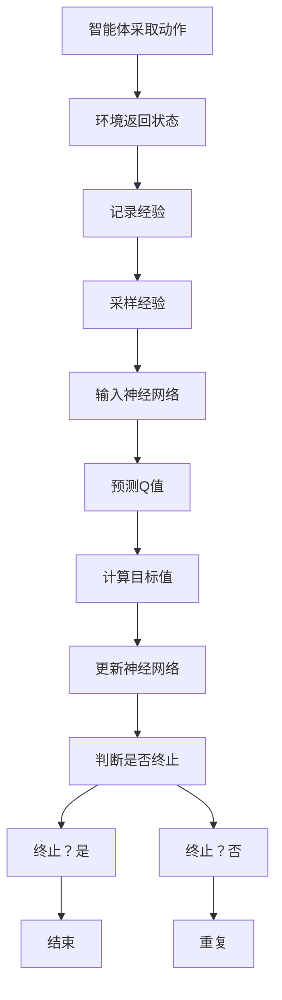
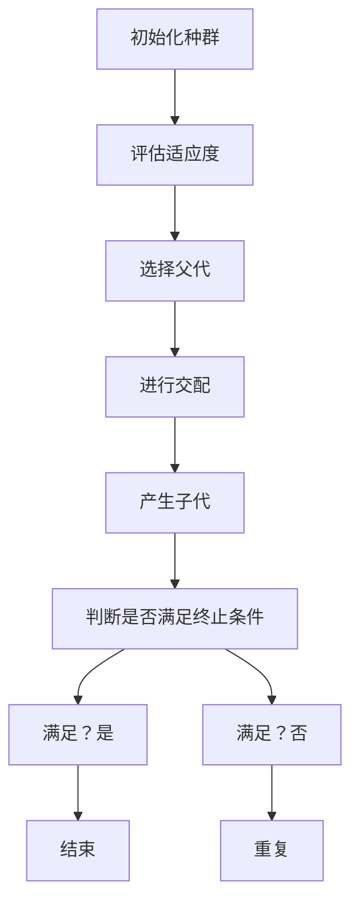
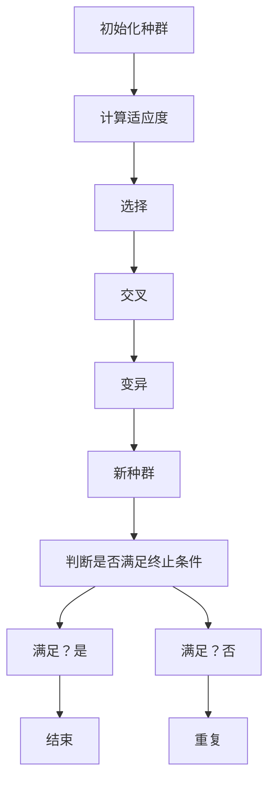
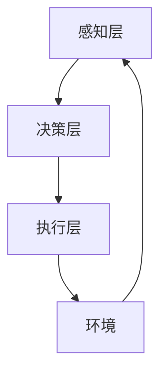

                 


---

# 第三章: 多Agent博弈中的策略学习

## 3.1 强化学习基础

### 3.1.1 强化学习的定义

强化学习是一种机器学习方法，通过智能体与环境的交互，逐步优化其行为策略，以最大化累积奖励。智能体通过试错方式学习，调整动作以获得最大的累积奖励。

### 3.1.2 强化学习的核心要素

1. **智能体（Agent）**：负责感知环境并采取行动。
2. **环境（Environment）**：智能体所处的外部世界，定义了智能体的感知和行动的结果。
3. **状态（State）**：描述智能体所处环境的当前情况。
4. **动作（Action）**：智能体在某一状态下采取的行为。
5. **奖励（Reward）**：智能体采取行动后获得的反馈，用于评估行动的好坏。
6. **策略（Policy）**：智能体在不同状态下选择动作的概率分布。

### 3.1.3 强化学习的算法框架

常见的强化学习算法包括Q-learning、Deep Q-Network（DQN）、策略梯度法（Policy Gradient）等。这些算法通过不同的方式优化策略，以最大化累积奖励。

---

## 3.2 多Agent协作与竞争学习

### 3.2.1 协作学习的基本概念

协作学习是指多个智能体在共同目标下，通过协作完成任务。协作学习的核心在于智能体之间的通信与协调，通过共享信息或合作策略，提升整体性能。

### 3.2.2 竞争学习的基本概念

竞争学习是指多个智能体在同一资源或目标下竞争，通过对抗提升自身策略。竞争学习模拟了现实中的零和博弈，智能体通过对抗训练优化策略。

### 3.2.3 协作与竞争的平衡

在实际场景中，协作与竞争往往是同时存在的。例如，在某些游戏中，玩家需要在团队内部协作，同时与其他团队竞争。平衡协作与竞争关系是多Agent博弈策略学习的关键。

---

## 3.3 多Agent博弈中的经典算法

### 3.3.1 Q-learning算法

Q-learning是一种经典的强化学习算法，通过维护Q值表（Q-table）记录每个状态-动作对的期望奖励。智能体通过与环境交互更新Q值，最终收敛到最优策略。

#### Q-learning算法流程图



#### Q-learning代码示例

```python
import numpy as np

class QLearning:
    def __init__(self, state_space, action_space, alpha=0.1, gamma=0.9):
        self.state_space = state_space
        self.action_space = action_space
        self.alpha = alpha
        self.gamma = gamma
        self.q_table = np.zeros((state_space, action_space))

    def choose_action(self, state):
        return np.argmax(self.q_table[state])

    def update_q_table(self, state, action, reward, next_state):
        current_q = self.q_table[state][action]
        next_max_q = np.max(self.q_table[next_state])
        new_q = current_q + self.alpha * (reward + self.gamma * next_max_q - current_q)
        self.q_table[state][action] = new_q
```

### 3.3.2 Deep Q-Network（DQN）

DQN是将深度神经网络引入Q-learning的一种方法，通过经验回放和目标网络提升算法的稳定性和表现。

#### DQN算法流程图



#### DQN代码示例

```python
import numpy as np
import torch
import torch.nn as nn

class DQN:
    def __init__(self, state_space, action_space, hidden_size=32, learning_rate=0.01):
        self.state_space = state_space
        self.action_space = action_space
        self.hidden_size = hidden_size
        self.lr = learning_rate

        self.model = nn.Sequential(
            nn.Linear(state_space, hidden_size),
            nn.ReLU(),
            nn.Linear(hidden_size, action_space)
        )

        self.target_model = nn.Sequential(
            nn.Linear(state_space, hidden_size),
            nn.ReLU(),
            nn.Linear(hidden_size, action_space)
        )

        self.optimizer = torch.optim.Adam(self.model.parameters(), lr=self.lr)
        self.criterion = nn.MSELoss()

    def forward(self, x):
        return self.model(x)

    def target_forward(self, x):
        return self.target_model(x)

    def update_target(self):
        self.target_model.load_state_dict(self.model.state_dict())

    def optimize(self, batch):
        states = torch.FloatTensor(batch['states'])
        actions = torch.LongTensor(batch['actions'])
        rewards = torch.FloatTensor(batch['rewards'])
        next_states = torch.FloatTensor(batch['next_states'])

        q_values = self.model(states).gather(1, actions.unsqueeze(1))
        next_q_values = self.target_model(next_states).max(1)[0].detach()
        target = rewards + self.gamma * next_q_values

        loss = self.criterion(q_values.squeeze(), target)
        self.optimizer.zero_grad()
        loss.backward()
        self.optimizer.step()
```

---

## 第四章: 多Agent博弈的策略优化

### 4.1 进化算法基础

进化算法是一种基于自然选择和遗传机制的优化方法，通过模拟生物进化过程，逐步优化策略。

#### 进化算法流程图



#### 进化算法代码示例

```python
import random

class EvolutionAlgorithm:
    def __init__(self, population_size, fitness_function):
        self.population_size = population_size
        self.fitness_function = fitness_function

    def evolve(self, population):
        # 计算适应度
        fitness = [self.fitness_function(individual) for individual in population]
        # 选择
        selected = self.select(population, fitness)
        # 交配
        offspring = self.crossover(selected)
        # 变异
        mutated = self.mutate(offspring)
        return mutated

    def select(self, population, fitness):
        # 简单选择法
        total_fitness = sum(fitness)
        probabilities = [f/total_fitness for f in fitness]
        selected_indices = []
        for _ in range(len(population)):
            r = random.random()
            for i, p in enumerate(probabilities):
                if r < p:
                    selected_indices.append(i)
                    break
        return [population[i] for i in selected_indices]

    def crossover(self, parents):
        # 单点交叉
        point = random.randint(1, len(parents[0]))
        offspring = []
        for i in range(0, len(parents), 2):
            parent1 = parents[i]
            parent2 = parents[i+1]
            child1 = parent1[:point] + parent2[point:]
            child2 = parent2[:point] + parent1[point:]
            offspring.append(child1)
            offspring.append(child2)
        return offspring

    def mutate(self, offspring):
        # 突变
        for i in range(len(offspring)):
            for j in range(len(offspring[i])):
                if random.random() < 0.1:
                    offspring[i][j] = 1 - offspring[i][j]
        return offspring
```

### 4.2 遗传算法

遗传算法是一种基于自然选择的优化方法，通过迭代过程中的选择、交叉和变异操作，逐步优化解。

#### 遗传算法流程图



#### 遗传算法代码示例

```python
import random

class GeneticAlgorithm:
    def __init__(self, population_size, chromosome_length, fitness_function):
        self.population_size = population_size
        self.chromosome_length = chromosome_length
        self.fitness_function = fitness_function

    def evolve(self):
        population = self.initialize_population()
        while True:
            fitness = [self.fitness_function(individual) for individual in population]
            if self.check_termination(population, fitness):
                break
            selected = self.select(population, fitness)
            offspring = self.crossover(selected)
            mutated = self.mutate(offspring)
            population = mutated
        return population

    def initialize_population(self):
        return [[random.choice([0,1]) for _ in range(self.chromosome_length)] for _ in range(self.population_size)]

    def select(self, population, fitness):
        # 比例选择
        total_fitness = sum(fitness)
        probabilities = [f/total_fitness for f in fitness]
        selected = []
        for _ in range(len(population)):
            r = random.random()
            for i, p in enumerate(probabilities):
                if r < p:
                    selected.append(population[i])
                    break
        return selected

    def crossover(self, parents):
        # 单点交叉
        point = random.randint(1, len(parents[0]))
        offspring = []
        for i in range(0, len(parents), 2):
            parent1 = parents[i]
            parent2 = parents[i+1]
            child1 = parent1[:point] + parent2[point:]
            child2 = parent2[:point] + parent1[point:]
            offspring.append(child1)
            offspring.append(child2)
        return offspring

    def mutate(self, offspring):
        # 突变
        for i in range(len(offspring)):
            for j in range(len(offspring[i])):
                if random.random() < 0.1:
                    offspring[i][j] = 1 - offspring[i][j]
        return offspring

    def check_termination(self, population, fitness):
        # 简单终止条件：适应度是否达到预期
        max_fitness = max(fitness)
        return max_fitness >= 0.95  # 假设预期适应度为0.95
```

---

## 第五章: 多Agent博弈的数学模型

### 5.1 多Agent博弈的状态空间

状态空间定义了所有可能的状态集合，每个状态由参与者的行动和环境的响应构成。状态空间的大小直接影响算法的复杂度和收敛性。

### 5.2 多Agent博弈的博弈模型

博弈模型包括参与者、策略空间、奖励函数和转移概率等要素。博弈模型的构建是策略学习的基础。

### 5.3 多Agent博弈的数学表达

多Agent博弈可以用矩阵或图结构表示，其中每个节点代表一个状态，边代表动作和转移概率。数学表达式如下：

$$
\text{状态转移概率} = P(s' | s, a)
$$

$$
\text{奖励函数} = R(s, a, s')
$$

其中，\( s \) 是当前状态，\( a \) 是动作，\( s' \) 是下一个状态。

---

## 第六章: 多Agent博弈的系统架构设计

### 6.1 系统功能设计

多Agent博弈系统通常包括以下几个核心功能模块：

1. **状态感知模块**：感知当前环境状态。
2. **策略选择模块**：根据当前状态选择最优动作。
3. **奖励评估模块**：评估动作的奖励值。
4. **策略优化模块**：更新策略以最大化累积奖励。

### 6.2 系统架构设计

多Agent博弈系统的架构通常采用分层设计，包括感知层、决策层和执行层。各层之间通过接口通信，确保系统的高效运行。

#### 系统架构图



---

## 第七章: 多Agent博弈的项目实战

### 7.1 环境搭建

选择一个适合的实验环境，例如使用OpenAI Gym或RLlib框架，搭建多Agent博弈的仿真环境。

### 7.2 代码实现

实现多Agent博弈的核心算法，例如Q-learning、DQN或遗传算法，并在仿真环境中进行测试。

### 7.3 结果分析

分析算法的性能，评估策略的收敛性和稳定性，根据实验结果优化算法参数。

---

## 第八章: 多Agent博弈的案例分析

### 8.1 案例一：囚徒困境

囚徒困境是经典的多Agent博弈问题，两个囚徒在面对指控时可以选择沉默或背叛，最终通过博弈达到纳什均衡。

#### 囚徒困境博弈矩阵

$$
\begin{array}{c|cc}
 & \text{沉默} & \text{背叛} \\
\hline
\text{沉默} & (1,1) & (3,0) \\
\text{背叛} & (0,3) & (2,2) \\
\end{array}
$$

### 8.2 案例二：拍卖机制

在拍卖场景中，多个竞拍者通过策略选择报价，最终通过博弈达到最优价格。

---

## 第九章: 总结与展望

### 9.1 总结

本文系统地介绍了多Agent博弈的策略学习与优化方法，包括强化学习、进化算法等核心概念和算法实现。

### 9.2 未来展望

未来的研究方向包括更高效的算法设计、多Agent协作与竞争的平衡优化，以及在复杂场景中的应用探索。

---

**附录**

### 附录A: 数学公式

1. Q-learning更新公式：

$$
Q(s,a) = Q(s,a) + \alpha [r + \gamma \max Q(s',a') - Q(s,a)]
$$

2. DQN目标函数：

$$
L = \mathbb{E}[(r + \gamma Q(s',a') - Q(s,a))^2]
$$

### 附录B: 算法代码

1. Q-learning代码

```python
class QLearning:
    def __init__(self, state_space, action_space, alpha=0.1, gamma=0.9):
        self.state_space = state_space
        self.action_space = action_space
        self.alpha = alpha
        self.gamma = gamma
        self.q_table = np.zeros((state_space, action_space))

    def choose_action(self, state):
        return np.argmax(self.q_table[state])

    def update_q_table(self, state, action, reward, next_state):
        current_q = self.q_table[state][action]
        next_max_q = np.max(self.q_table[next_state])
        new_q = current_q + self.alpha * (reward + self.gamma * next_max_q - current_q)
        self.q_table[state][action] = new_q
```

2. DQN代码

```python
class DQN:
    def __init__(self, state_space, action_space, hidden_size=32, learning_rate=0.01):
        self.state_space = state_space
        self.action_space = action_space
        self.hidden_size = hidden_size
        self.lr = learning_rate

        self.model = nn.Sequential(
            nn.Linear(state_space, hidden_size),
            nn.ReLU(),
            nn.Linear(hidden_size, action_space)
        )

        self.target_model = nn.Sequential(
            nn.Linear(state_space, hidden_size),
            nn.ReLU(),
            nn.Linear(hidden_size, action_space)
        )

        self.optimizer = torch.optim.Adam(self.model.parameters(), lr=self.lr)
        self.criterion = nn.MSELoss()

    def forward(self, x):
        return self.model(x)

    def target_forward(self, x):
        return self.target_model(x)

    def update_target(self):
        self.target_model.load_state_dict(self.model.state_dict())

    def optimize(self, batch):
        states = torch.FloatTensor(batch['states'])
        actions = torch.LongTensor(batch['actions'])
        rewards = torch.FloatTensor(batch['rewards'])
        next_states = torch.FloatTensor(batch['next_states'])

        q_values = self.model(states).gather(1, actions.unsqueeze(1))
        next_q_values = self.target_model(next_states).max(1)[0].detach()
        target = rewards + self.gamma * next_q_values

        loss = self.criterion(q_values.squeeze(), target)
        self.optimizer.zero_grad()
        loss.backward()
        self.optimizer.step()
```

---

**作者：AI天才研究院/AI Genius Institute & 禅与计算机程序设计艺术/Zen And The Art of Computer Programming**

