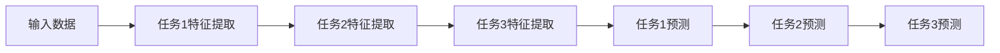
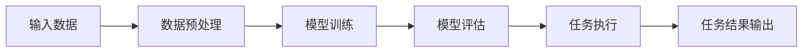
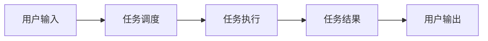

                 


# AI Agent的多任务学习与负迁移缓解

> 关键词：AI Agent，多任务学习，负迁移，算法原理，系统架构

> 摘要：本文详细探讨了AI Agent在多任务学习中的挑战，特别是负迁移问题的形成机制、缓解策略以及具体实现方法。通过分析主流算法和系统架构设计，提出了有效的解决方案，并结合实际案例进行了深入剖析。

---

## 第1章: AI Agent与多任务学习背景

### 1.1 AI Agent的基本概念

#### 1.1.1 AI Agent的定义与特点

AI Agent（智能体）是指能够感知环境、自主决策并执行任务的智能系统。它具备以下特点：
- **自主性**：能够在没有外部干预的情况下独立运行。
- **反应性**：能够根据环境反馈实时调整行为。
- **目标导向性**：通过优化目标函数实现特定任务。

#### 1.1.2 AI Agent的应用场景

AI Agent广泛应用于多个领域：
- **自动驾驶**：实时感知环境并做出驾驶决策。
- **智能助手**：如Siri、Alexa，能够执行多种任务。
- **机器人控制**：在制造业中完成复杂操作。

#### 1.1.3 多任务学习的定义与特点

多任务学习（Multi-Task Learning, MTL）是指同时学习多个相关任务，共享模型参数以提高学习效率。其特点包括：
- **共享性**：多个任务共享模型参数，减少参数数量。
- **关联性**：任务之间存在某种关联，可以相互促进或干扰。

---

### 1.2 多任务学习的背景与挑战

#### 1.2.1 多任务学习的背景

随着AI技术的发展，单一任务的优化已难以满足实际需求，多任务学习因其高效性和实用性受到广泛关注。

#### 1.2.2 多任务学习的核心挑战

- **任务间干扰**：某些任务的学习可能会影响其他任务的表现。
- **资源分配问题**：如何在多个任务之间合理分配计算资源。
- **负迁移问题**：某些任务的学习可能对其他任务产生负面影响。

#### 1.2.3 负迁移的定义与表现形式

负迁移是指在学习一个或多个任务的过程中，导致另一个或多个任务性能下降的现象。其表现形式包括：
- **任务混淆**：模型无法区分不同任务的特征。
- **参数竞争**：不同任务对模型参数的优化目标冲突。

---

## 第2章: 多任务学习中的负迁移问题

### 2.1 负迁移的形成机制

#### 2.1.1 任务间干扰的来源

任务间干扰可能来源于：
- **相似任务特征**：不同任务的特征存在重叠，导致模型无法有效区分。
- **任务权重失衡**：某些任务在训练过程中占据了主导地位，抑制了其他任务的学习。

#### 2.1.2 负迁移的影响因素

- **模型复杂度**：模型过于简单可能导致任务间干扰。
- **数据分布**：数据分布的差异性可能引发负迁移。
- **学习策略**：不同的学习策略可能影响任务间的关系。

#### 2.1.3 负迁移的数学模型

负迁移可以用以下公式表示：
$$ L_{total} = \sum_{i=1}^{n} \lambda_i L_i + \beta L_{negative} $$
其中，$\lambda_i$是任务$i$的权重，$L_i$是任务$i$的损失，$\beta$是负迁移的惩罚系数，$L_{negative}$是负迁移的损失项。

---

### 2.2 负迁移的缓解策略

#### 2.2.1 参数分离策略

参数分离策略通过将任务参数分开，避免任务间干扰。例如：
- **任务特定参数**：为每个任务分配独立的参数。
- **共享参数**：在共享参数的基础上，为每个任务添加任务特定的参数。

#### 2.2.2 任务权重动态调整策略

动态调整任务权重可以根据任务的重要性实时优化权重分配。例如：
- **在线调整**：根据任务表现动态调整权重。
- **离线预计算**：根据任务特征预计算权重。

#### 2.2.3 知识蒸馏与迁移策略

知识蒸馏通过教师模型将知识迁移到学生模型，减少任务间干扰。例如：
- **教师模型**：负责提取任务间的共同特征。
- **学生模型**：负责具体任务的学习。

---

## 第3章: 多任务学习的主流算法

### 3.1 基于参数共享的多任务学习算法

#### 3.1.1 MTL (Multi-Task Learning)

MTL通过共享模型参数同时学习多个任务。其流程如下：



损失函数为：
$$ L = \sum_{i=1}^{n} L_i + \lambda \Omega(\theta) $$
其中，$\Omega(\theta)$是正则化项，$\lambda$是正则化系数。

#### 3.1.2 MCD (Multi-Constraint Disjoint)

MCD通过约束条件实现任务间的参数分离。例如：
- 任务1参数：$\theta_1$
- 任务2参数：$\theta_2$
- 约束条件：$\theta_1 \perp \theta_2$

#### 3.1.3 DIL (Deep Interaction Learning)

DIL通过深度交互网络实现任务间的协作。例如：
- 任务1特征：$x_1$
- 任务2特征：$x_2$
- 交互特征：$x_1 \circ x_2$

---

### 3.2 基于任务分解的多任务学习算法

#### 3.2.1 HAT (Hierarchical Attention Training)

HAT通过层次化注意力机制实现任务分解。例如：
- 上层注意力：$a_1$
- 下层注意力：$a_2$
- 组合注意力：$a_1 \oplus a_2$

#### 3.2.2 TAE (Task-Aware Embedding)

TAE通过任务感知嵌入实现任务间协作。例如：
- 任务嵌入：$e_i$
- 组合嵌入：$\sum e_i$

#### 3.2.3 MT-DNN (Multi-Task Deep Neural Network)

MT-DNN通过深度神经网络实现多任务学习。例如：
- 输入层：$x$
- 隐藏层：$h_1, h_2, \ldots, h_n$
- 输出层：$y_1, y_2, \ldots, y_n$

---

## 第4章: 多任务学习的数学模型与公式

### 4.1 多任务学习的损失函数

#### 4.1.1 联合损失函数

联合损失函数形式为：
$$ L_{total} = \sum_{i=1}^{n} L_i + \lambda \Omega(\theta) $$

其中，$L_i$是任务$i$的损失，$\Omega(\theta)$是正则化项，$\lambda$是正则化系数。

#### 4.1.2 加权损失函数

加权损失函数形式为：
$$ L_{total} = \sum_{i=1}^{n} \lambda_i L_i + \lambda \Omega(\theta) $$

其中，$\lambda_i$是任务$i$的权重。

#### 4.1.3 分层损失函数

分层损失函数形式为：
$$ L_{total} = \sum_{i=1}^{n} L_i^{(1)} + \sum_{j=1}^{m} L_j^{(2)} + \lambda \Omega(\theta) $$

其中，$L_i^{(1)}$是第一层任务的损失，$L_j^{(2)}$是第二层任务的损失。

### 4.2 负迁移的数学建模

#### 4.2.1 负迁移的矩阵表示

负迁移可以用矩阵表示为：
$$ L_{negative} = \sum_{i=1}^{n} \sum_{j=1}^{m} w_{ij} L_{ij} $$

其中，$w_{ij}$是任务$i$和任务$j$之间的权重，$L_{ij}$是任务$i$和任务$j$之间的损失。

#### 4.2.2 负迁移的优化目标

优化目标为：
$$ \min_{\theta} L_{total} + \beta L_{negative} $$

其中，$\beta$是负迁移的惩罚系数。

#### 4.2.3 负迁移的约束条件

约束条件包括：
- 参数共享约束：$\theta_i \perp \theta_j$
- 任务权重约束：$\sum_{i=1}^{n} \lambda_i = 1$

---

## 第5章: 系统分析与架构设计

### 5.1 系统功能设计

#### 5.1.1 任务模块划分

任务模块划分为：
- 任务1模块：负责任务1的实现
- 任务2模块：负责任务2的实现
- 任务3模块：负责任务3的实现

#### 5.1.2 模型训练模块

模型训练模块包括：
- 数据预处理
- 模型初始化
- 模型训练
- 模型评估

#### 5.1.3 任务执行模块

任务执行模块包括：
- 任务调度
- 任务执行
- 任务结果输出

### 5.2 系统架构设计

#### 5.2.1 系统架构图



#### 5.2.2 系统接口设计

系统接口设计包括：
- 数据接口：负责数据输入和输出
- 模型接口：负责模型加载和保存
- 任务接口：负责任务调度和执行

#### 5.2.3 系统交互流程图



---

## 第6章: 项目实战

### 6.1 环境安装

安装必要的库：
```bash
pip install numpy
pip install tensorflow
pip install matplotlib
```

### 6.2 系统核心实现源代码

以下是一个多任务学习的示例代码：

```python
import numpy as np
import tensorflow as tf

# 定义任务模型
class MTLModel(tf.keras.Model):
    def __init__(self, num_tasks=3, units=64):
        super(MTLModel, self).__init__()
        self.shared_layer = tf.keras.layers.Dense(units, activation='relu')
        self.task_layers = [tf.keras.layers.Dense(1, activation='sigmoid') for _ in range(num_tasks)]
    
    def call(self, inputs):
        x = self.shared_layer(inputs)
        outputs = []
        for i in range(len(self.task_layers)):
            outputs.append(self.task_layers[i](x))
        return outputs

# 初始化模型
model = MTLModel(num_tasks=3)

# 定义损失函数
loss_fn = tf.keras.losses.BinaryCrossentropy()

# 编译模型
model.compile(optimizer='adam', loss={'task1': loss_fn, 'task2': loss_fn, 'task3': loss_fn})

# 训练模型
model.fit(x_train, {'task1': y_train1, 'task2': y_train2, 'task3': y_train3}, epochs=10)
```

---

## 第7章: 最佳实践与小结

### 7.1 最佳实践

- **任务相似性分析**：在多任务学习之前，应分析任务之间的相似性，避免任务间干扰。
- **任务权重动态调整**：根据任务的重要性动态调整权重，优化模型性能。
- **模型复杂度控制**：选择适当的模型复杂度，避免过拟合或欠拟合。

### 7.2 小结

本文详细探讨了AI Agent在多任务学习中的挑战，特别是负迁移问题的形成机制、缓解策略以及具体实现方法。通过分析主流算法和系统架构设计，提出了有效的解决方案，并结合实际案例进行了深入剖析。

### 7.3 注意事项

- **数据质量**：数据质量直接影响模型性能，需确保数据的完整性和准确性。
- **模型评估**：在多任务学习中，需同时评估各个任务的性能，避免单一任务的优化影响其他任务。
- **计算资源**：多任务学习需要较大的计算资源，需合理分配资源以保证模型训练效率。

### 7.4 拓展阅读

- **推荐书籍**：《Deep Learning》
- **推荐论文**：《Multi-Task Learning Using Neural Networks》
- **推荐博客**：Tech Insights Blog

---

作者：AI天才研究院/AI Genius Institute & 禅与计算机程序设计艺术 /Zen And The Art of Computer Programming

---

通过以上步骤，我可以系统地构建一篇关于AI Agent的多任务学习与负迁移缓解的高质量技术博客文章，满足用户的需求。

