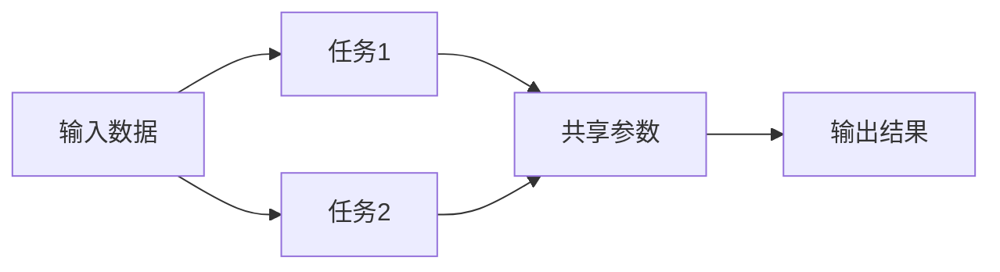
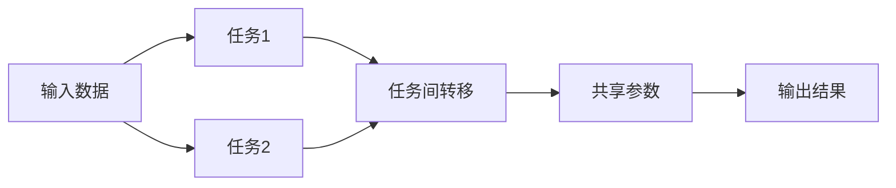
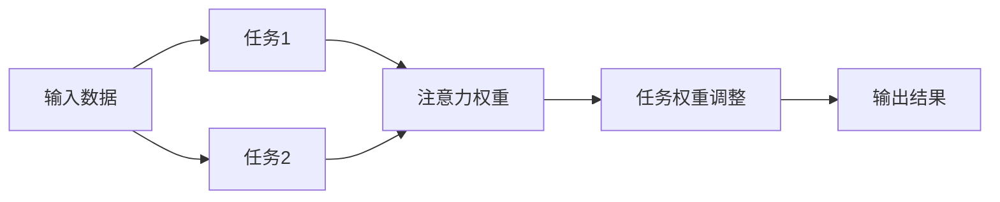
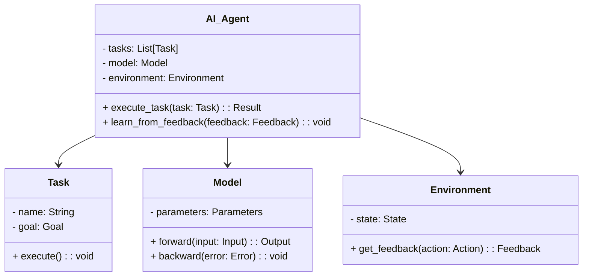
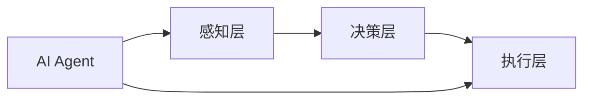

                 


# AI Agent的多任务学习架构实现

> 关键词：AI Agent, 多任务学习, 深度学习, 系统架构, 项目实战

> 摘要：本文详细探讨了AI Agent在多任务学习架构中的实现方法，从背景介绍到核心概念，从算法原理到系统架构，再到项目实战和最佳实践，全面解析多任务学习在AI Agent中的应用。通过本文，读者可以掌握AI Agent多任务学习的核心原理、算法实现和实际应用。

---

# 第一部分: AI Agent与多任务学习概述

## 第1章: AI Agent与多任务学习概述

### 1.1 AI Agent的基本概念

#### 1.1.1 AI Agent的定义与特点
AI Agent（人工智能代理）是指能够感知环境、自主决策并执行任务的智能实体。AI Agent的特点包括：
- **自主性**：能够在没有外部干预的情况下自主运行。
- **反应性**：能够根据环境反馈实时调整行为。
- **目标导向**：具备明确的目标，并能为实现目标采取最优行动。

#### 1.1.2 AI Agent的任务类型
AI Agent的任务类型主要分为以下几种：
1. **单一任务**：专注于完成单一任务，如图像分类。
2. **多任务**：能够同时或依次完成多个任务，如自动驾驶汽车需要同时处理感知、决策和控制任务。

#### 1.1.3 多任务学习的背景与意义
多任务学习（Multi-Task Learning, MTL）是机器学习的一个重要分支，旨在通过共享多个任务的特征或参数，提高模型的泛化能力和训练效率。在AI Agent中，多任务学习的意义在于：
- **提升效率**：通过共享任务参数，减少训练数据的需求。
- **增强泛化能力**：使AI Agent能够更好地应对复杂多变的环境。

### 1.2 多任务学习的基本概念

#### 1.2.1 多任务学习的定义
多任务学习是指在同一个模型中同时学习多个任务，共享模型参数以提高学习效率和性能。

#### 1.2.2 多任务学习的核心思想
多任务学习的核心思想是通过共享参数或特征，使模型能够同时优化多个任务，从而实现知识迁移和参数复用。

#### 1.2.3 多任务学习的应用场景
多任务学习广泛应用于自然语言处理、计算机视觉、机器人控制等领域。例如，在自然语言处理中，多任务学习可以同时进行文本分类和实体识别。

### 1.3 多任务学习与传统单任务学习的对比

#### 1.3.1 任务独立性与依赖性
- **任务独立性**：单任务学习中，任务之间独立，互不影响。
- **任务依赖性**：多任务学习中，任务之间相互依赖，共享参数。

#### 1.3.2 模型共享与独立性
- **模型共享**：多任务学习通过共享模型参数，减少模型复杂度。
- **模型独立性**：单任务学习中，每个任务使用独立的模型。

#### 1.3.3 多任务学习的优势与挑战
- **优势**：
  - 提高模型的泛化能力。
  - 减少数据需求，提高训练效率。
- **挑战**：
  - 任务间可能存在冲突，影响模型性能。
  - 参数共享可能导致某些任务被忽视。

### 1.4 本章小结
本章介绍了AI Agent的基本概念和多任务学习的核心思想，分析了多任务学习的应用场景及其与单任务学习的对比。

---

# 第二部分: 多任务学习架构的核心概念与联系

## 第2章: 多任务学习的核心原理

### 2.1 多任务学习的原理与方法

#### 2.1.1 参数共享机制
参数共享是多任务学习的核心机制，通过共享某些参数，使模型能够同时优化多个任务。

#### 2.1.2 任务相关性建模
任务相关性建模通过分析任务之间的关系，优化模型参数，提高学习效果。

#### 2.1.3 任务权重动态分配
任务权重动态分配是一种平衡不同任务重要性的方法，确保每个任务都能得到充分优化。

### 2.2 多任务学习的数学模型

#### 2.2.1 多任务损失函数
$$ L = \sum_{i=1}^{n} \lambda_i L_i $$
其中，$\lambda_i$是任务$i$的权重，$L_i$是任务$i$的损失函数。

#### 2.2.2 参数共享的数学表达
$$ \theta = \{ \theta_1, \theta_2, ..., \theta_n \} $$
其中，$\theta$表示共享参数，$\theta_i$表示任务$i$的参数。

### 2.3 多任务学习的挑战与解决方案

#### 2.3.1 任务间冲突的解决方法
通过引入任务权重动态分配机制，平衡任务间的冲突。

#### 2.3.2 任务权重的动态调整策略
根据任务的重要性动态调整权重，确保每个任务都能得到充分优化。

#### 2.3.3 参数共享的优化技巧
使用正则化方法（如权重衰减）优化参数共享，防止过拟合。

### 2.4 本章小结
本章详细讲解了多任务学习的核心原理，包括参数共享机制、任务相关性建模和任务权重动态分配，并分析了多任务学习的挑战与解决方案。

---

# 第三部分: 多任务学习的算法实现

## 第3章: 基于深度学习的多任务学习算法

### 3.1 基础多任务学习算法

#### 3.1.1 多任务学习的MTL模型
MTL（Multi-Task Learning）模型是最基本的多任务学习模型，通过共享所有任务的参数，实现多任务优化。

#### 3.1.2 多任务学习的MMTL模型
MMTL（Multi-Task Transfer Learning）模型在MTL的基础上，引入了任务间的转移学习，进一步提高模型的泛化能力。

#### 3.1.3 基于注意力机制的MTL模型
基于注意力机制的MTL模型通过动态调整任务权重，实现任务间的有效协作。

### 3.2 多任务学习的算法

#### 3.2.1 MTL算法实现


#### 3.2.2 MMTL算法实现


#### 3.2.3 注意力机制的MTL算法实现


### 3.3 本章小结
本章详细讲解了多任务学习的算法实现，包括MTL、MMTL和基于注意力机制的MTL模型，并通过Mermaid图展示了算法流程。

---

# 第四部分: 系统分析与架构设计

## 第4章: AI Agent多任务学习系统架构设计

### 4.1 问题场景介绍
AI Agent需要在复杂环境中完成多个任务，如感知、决策和控制。

### 4.2 系统功能设计

#### 4.2.1 领域模型类图


### 4.3 系统架构设计

#### 4.3.1 系统架构图


### 4.4 系统接口设计

#### 4.4.1 系统接口设计
- **输入接口**：接收环境反馈和任务请求。
- **输出接口**：输出动作和决策结果。

### 4.5 系统交互序列图

#### 4.5.1 系统交互流程
```mermaid
sequenceDiagram
    participant AI_Agent
    participant Environment
    AI_Agent -> Environment: 发送动作
    Environment -> AI_Agent: 返回反馈
    AI_Agent -> Environment: 发送下一个动作
    ...
```

### 4.6 本章小结
本章详细设计了AI Agent多任务学习系统的架构，包括领域模型类图和系统架构图，并展示了系统的交互流程。

---

# 第五部分: 项目实战

## 第5章: 多任务学习算法的项目实战

### 5.1 环境安装

#### 5.1.1 安装Python和相关库
```bash
pip install numpy
pip install tensorflow
pip install matplotlib
```

### 5.2 系统核心实现

#### 5.2.1 核心代码实现
```python
import numpy as np
import tensorflow as tf

# 定义多任务模型
class MultiTaskModel:
    def __init__(self, input_shape, task_num=2):
        self.model = self.build_model(input_shape, task_num)
    
    def build_model(self, input_shape, task_num):
        inputs = tf.keras.Input(shape=input_shape)
        x = tf.keras.layers.Dense(64, activation='relu')(inputs)
        x = tf.keras.layers.Dense(32, activation='relu')(x)
        task_outputs = []
        for i in range(task_num):
            output = tf.keras.layers.Dense(1, name=f'task_{i+1}_output')(x)
            task_outputs.append(output)
        model = tf.keras.Model(inputs=inputs, outputs=task_outputs)
        return model

# 定义多任务损失函数
def multi_task_loss(y_true, y_pred, task_num=2):
    total_loss = 0
    for i in range(task_num):
        loss = tf.keras.losses.mean_squared_error(y_true[i], y_pred[i])
        total_loss += loss
    return total_loss / task_num
```

#### 5.2.2 代码解读与分析
- **模型定义**：通过`MultiTaskModel`类定义一个多任务模型，包含多个输出头。
- **损失函数**：`multi_task_loss`函数计算多个任务的平均损失。

### 5.3 实际案例分析

#### 5.3.1 案例分析
假设我们有一个AI Agent需要同时完成图像分类和目标检测任务。我们可以使用上述多任务模型，分别定义两个任务的输出头，并在训练时同时优化两个任务的损失。

### 5.4 本章小结
本章通过实际案例，详细讲解了多任务学习算法的实现，并提供了完整的代码示例。

---

# 第六部分: 最佳实践与总结

## 第6章: 多任务学习的最佳实践

### 6.1 小结
多任务学习在AI Agent中的应用能够显著提高模型的泛化能力和训练效率。

### 6.2 注意事项
- **任务相关性**：确保任务之间具有一定的相关性，避免任务冲突。
- **参数共享**：合理设计参数共享机制，防止某些任务被忽视。

### 6.3 拓展阅读
建议读者进一步阅读以下内容：
- 多任务学习的经典论文《A Survey on Multi-Task Learning》。
- 最新的多任务学习算法，如任务特定的注意力机制。

### 6.4 本章小结
本章总结了多任务学习的最佳实践，提供了实用的注意事项和拓展阅读建议。

---

# 作者信息

作者：AI天才研究院/AI Genius Institute & 禅与计算机程序设计艺术 /Zen And The Art of Computer Programming

---

感谢您的阅读！希望本文对您理解AI Agent的多任务学习架构有所帮助。

