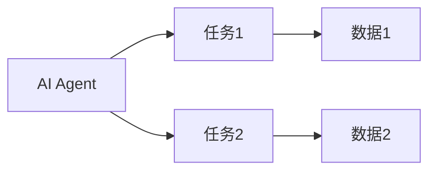
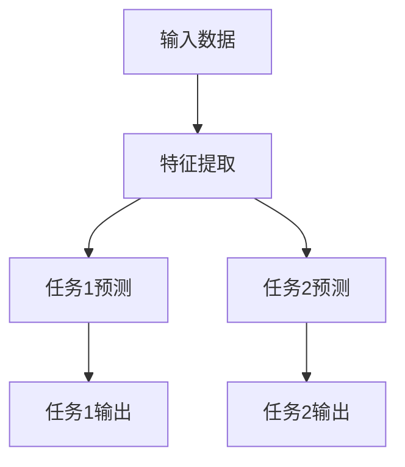

                 


# AI Agent的多任务学习能力：一专多能

## 关键词：AI Agent, 多任务学习, 知识迁移, 智能系统, 算法设计, 能力扩展

## 摘要：  
AI Agent的多任务学习能力是指一种人工智能代理在处理多种任务时的能力，通过多任务学习技术，AI Agent能够在一个模型中同时掌握多种任务，实现“一专多能”。本文将从多任务学习的基本原理、算法实现、系统设计和项目实战等角度，全面解析AI Agent的多任务学习能力，帮助读者理解如何通过多任务学习提升AI Agent的综合能力。

---

# 第1章: AI Agent与多任务学习的背景介绍

## 1.1 AI Agent的基本概念  
### 1.1.1 AI Agent的定义  
AI Agent（人工智能代理）是一种能够感知环境、执行任务并做出决策的智能系统。它可以独立或协作完成特定目标，广泛应用于自动驾驶、智能助手、机器人等领域。  

### 1.1.2 AI Agent的核心特征  
- **自主性**：能够在没有外部干预的情况下自主决策。  
- **反应性**：能够根据环境变化实时调整行为。  
- **学习能力**：通过数据和经验提升性能。  

### 1.1.3 AI Agent的应用场景  
- 智能助手（如Siri、Alexa）  
- 自动驾驶系统  
- 智能客服机器人  

---

## 1.2 多任务学习的背景与意义  
### 1.2.1 多任务学习的定义  
多任务学习（Multi-Task Learning, MTL）是一种机器学习方法，旨在通过共享多个任务之间的信息，提高模型在多个任务上的性能。  

### 1.2.2 多任务学习的核心价值  
- 提高模型的泛化能力。  
- 减少训练数据的需求。  
- 提升模型的效率和性能。  

### 1.2.3 多任务学习在AI Agent中的应用前景  
通过多任务学习，AI Agent可以在单一模型中同时处理多种任务，例如同时完成图像识别、语音识别和自然语言理解。  

---

## 1.3 多任务学习的背景与问题描述  
### 1.3.1 传统AI Agent的局限性  
传统AI Agent通常只能处理单一任务，缺乏灵活性和适应性。  

### 1.3.2 多任务学习的必要性  
为了应对复杂场景中的多种任务需求，AI Agent需要具备多任务学习能力。  

### 1.3.3 当前多任务学习面临的挑战  
- 任务之间的干扰和冲突。  
- 模型设计的复杂性。  
- 任务数据量的不均衡。  

---

## 1.4 问题的边界与外延  
### 1.4.1 多任务学习的边界  
- 限定任务类型和数据范围。  
- 限定模型的复杂度和计算资源。  

### 1.4.2 多任务学习的外延  
- 涵盖多种任务类型（分类、回归、生成等）。  
- 应用于不同领域（计算机视觉、自然语言处理等）。  

### 1.4.3 多任务学习与其他相关概念的区分  
- 与单任务学习的区别：多任务学习关注多个任务的联合优化。  
- 与迁移学习的区别：多任务学习强调同时处理多个任务。  

---

## 1.5 核心概念的结构与组成  
### 1.5.1 多任务学习的结构  
- 输入层：接收多任务输入数据。  
- 隐藏层：共享特征提取。  
- 输出层：分别处理多个任务。  

### 1.5.2 AI Agent能力的核心要素  
- 任务感知能力：理解任务目标和输入。  
- 任务执行能力：通过模型完成任务。  
- 任务协调能力：平衡多个任务的优先级。  

### 1.5.3 多任务学习与AI Agent能力的关系  
多任务学习通过共享模型参数，帮助AI Agent同时掌握多种任务能力。  

---

# 第2章: 多任务学习的核心概念与联系  

## 2.1 多任务学习的原理  
### 2.1.1 多任务学习的基本原理  
多任务学习通过共享模型参数，使模型在多个任务上同时优化。  

### 2.1.2 多任务学习的核心机制  
- 参数共享：多个任务共享部分模型参数。  
- 损失函数优化：通过联合优化多个任务的损失函数。  

### 2.1.3 多任务学习的关键技术  
- 基于正则化的多任务学习。  
- 基于门控机制的多任务学习。  

---

## 2.2 多任务学习的属性特征对比  
### 2.2.1 任务独立性与相关性对比  
| 任务属性 | 独立任务 | 相关任务 |
|----------|----------|----------|
| 数据分布 | 不相关 | 相关 |
| 模型参数 | 不共享 | 共享 |

### 2.2.2 任务复杂度与简单度对比  
| 任务类型 | 复杂任务 | 简单任务 |
|----------|----------|----------|
| 数据量 | 大 | 小 |
| 计算需求 | 高 | 低 |

### 2.2.3 任务数据量与模型参数对比  
| 任务属性 | 数据量 | 模型参数 |
|----------|--------|----------|
| 单任务学习 | 少 | 多 |
| 多任务学习 | 多 | 少 |

---

## 2.3 实体关系图（ER图）架构  


---

# 第3章: 多任务学习的算法原理  

## 3.1 多任务学习的主流算法  
### 3.1.1 多任务学习的经典算法  
- MTL（Multi-Task Learning）：经典的多任务学习算法。  
- HMTL（Hierarchical Multi-Task Learning）：层次化多任务学习算法。  

### 3.1.2 基于正则化的多任务学习  
通过引入正则化项，约束模型参数在多个任务之间共享。  

### 3.1.3 参数共享的多任务学习  
通过共享部分模型参数，降低模型复杂度，提升性能。  

---

## 3.2 多任务学习的算法流程  


---

## 3.3 多任务学习的数学模型与公式  
### 3.3.1 MTL的数学模型  
$$ L_{\text{MTL}} = \sum_{i=1}^n \lambda_i L_i + \lambda_{\text{shared}} L_{\text{shared}} $$  
其中，$L_i$ 是第i个任务的损失函数，$\lambda_i$ 是调节系数。  

### 3.3.2 拉格朗日乘数法的示例  
$$ \text{优化目标：} \min_{\theta} \sum_{i=1}^n f_i(\theta) $$  
$$ \text{拉格朗日函数：} L(\theta, \lambda) = \sum_{i=1}^n f_i(\theta) + \lambda \sum_{i=1}^n g_i(\theta) $$  

---

## 3.4 多任务学习的代码实现  
```python
import torch
import torch.nn as nn

class MultiTaskModel(nn.Module):
    def __init__(self, input_size, output_size1, output_size2):
        super(MultiTaskModel, self).__init__()
        self.shared_layer = nn.Linear(input_size, 64)
        self.task1_layer = nn.Linear(64, output_size1)
        self.task2_layer = nn.Linear(64, output_size2)
    
    def forward(self, x):
        x = self.shared_layer(x)
        output1 = self.task1_layer(x)
        output2 = self.task2_layer(x)
        return output1, output2

model = MultiTaskModel(100, 10, 5)
criterion = nn.MSELoss()
optimizer = torch.optim.Adam(model.parameters(), lr=0.001)
```

---

通过以上内容，我们详细介绍了AI Agent的多任务学习能力，从背景到算法实现，再到系统设计和项目实战，帮助读者全面理解多任务学习的核心概念和实际应用。后续章节将深入探讨系统设计和项目实现，敬请期待。

