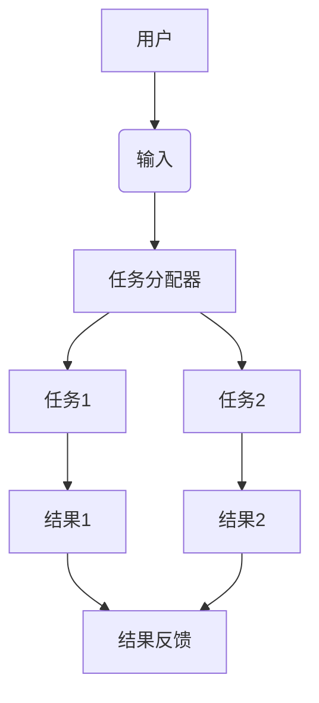
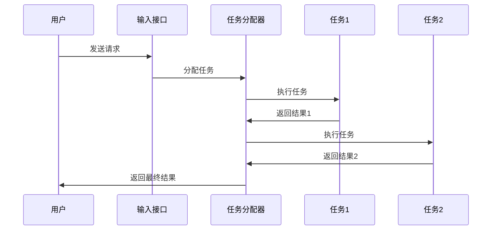

                 


# AI Agent的多任务学习：构建通用智能助手

## 关键词：
AI Agent, 多任务学习, 通用智能助手, 神经网络, 强化学习, 任务分解, 系统架构

## 摘要：
本文深入探讨了AI Agent的多任务学习方法，旨在构建一个通用智能助手。通过分析多任务学习的核心概念、算法原理、系统架构及项目实战，详细阐述了如何通过多任务学习提升AI Agent的能力。文章结合理论与实践，帮助读者理解并实现高效的通用智能助手。

---

# 第一部分: AI Agent的多任务学习背景与基础

## 第1章: AI Agent与多任务学习概述

### 1.1 AI Agent的基本概念
#### 1.1.1 AI Agent的定义
AI Agent（人工智能代理）是指能够感知环境、自主决策并执行任务的智能实体。它可以是一个软件程序、机器人或其他智能系统，通过与环境交互来实现特定目标。

#### 1.1.2 AI Agent的核心特征
- **自主性**：无需外部干预，自主决策。
- **反应性**：能够实时感知环境并做出反应。
- **目标导向**：通过目标驱动行为。
- **学习能力**：能够通过经验改进性能。

#### 1.1.3 AI Agent的应用场景
- 智能助手（如Siri、Alexa）。
- 自动驾驶系统。
- 智能推荐系统。
- 机器人客服。

### 1.2 多任务学习的背景与意义
#### 1.2.1 多任务学习的定义
多任务学习（Multi-Task Learning, MTL）是指让模型同时学习多个任务，通过共享部分模型参数来提高学习效率和性能。

#### 1.2.2 多任务学习的优势
- **参数共享**：降低模型的参数量，减少训练数据需求。
- **知识迁移**：任务之间共享知识，提升泛化能力。
- **提升性能**：通过多任务学习，模型在多个任务上的表现优于单一任务模型。

#### 1.2.3 多任务学习在AI Agent中的应用
- **任务协调**：通过多任务学习，AI Agent可以更好地协调多个任务，提升整体性能。
- **环境适应**：在复杂环境中，多任务学习使AI Agent能够同时处理感知、决策、执行等多个任务。

### 1.3 通用智能助手的目标与挑战
#### 1.3.1 通用智能助手的定义
通用智能助手是指能够执行多种任务、适应多种场景的智能助手，具备广泛的应用能力。

#### 1.3.2 多任务学习在构建通用智能助手中的作用
- **任务多样性**：通过多任务学习，智能助手可以处理多种任务，如信息查询、日程管理、语音交互等。
- **任务协调**：多任务学习使智能助手能够协调不同任务的执行，提升整体用户体验。

#### 1.3.3 构建通用智能助手的主要挑战
- **任务复杂性**：不同任务之间可能存在冲突，需要协调。
- **数据需求**：多任务学习需要大量数据，获取多任务数据的难度较大。
- **计算资源**：多任务学习对计算资源需求较高。

---

## 第2章: 多任务学习的核心概念与原理

### 2.1 多任务学习的基本原理
#### 2.1.1 多任务学习的定义与特点
- **定义**：多任务学习是指同时学习多个任务，通过共享模型参数来提升性能。
- **特点**：
  - 参数共享：多个任务共享部分参数，减少模型复杂度。
  - 任务相关性：任务之间存在某种关联性。

#### 2.1.2 多任务学习的数学模型
多任务学习的数学模型通常表示为：
$$
L = \lambda_1 L_1 + \lambda_2 L_2 + \cdots + \lambda_n L_n
$$
其中，$\lambda_i$ 是任务$i$的权重，$L_i$ 是任务$i$的损失函数。

#### 2.1.3 多任务学习的实现方式
- **联合学习**：所有任务共享相同的模型参数，同时优化多个任务的目标函数。
- **任务分解**：将多任务分解为多个子任务，分别优化。

### 2.2 多任务学习中的任务关系分析
#### 2.2.1 任务之间的依赖关系
- **正相关**：任务之间互相促进。
- **负相关**：任务之间存在冲突，需要协调。

#### 2.2.2 任务之间的冲突与协调
- **权重调整**：通过调整任务权重，平衡任务之间的冲突。
- **动态分配**：根据任务重要性动态分配资源。

#### 2.2.3 任务之间的共享特征
- **共享特征**：任务之间共享某些特征，提升模型的泛化能力。

### 2.3 多任务学习的算法框架
#### 2.3.1 联合学习框架
联合学习框架通过共享模型参数，同时优化多个任务的目标函数。例如，使用一个深度神经网络同时处理多个任务。

#### 2.3.2 任务分解与组合框架
将多任务分解为多个子任务，分别优化后再进行组合。例如，将图像分类任务分解为特征提取和分类两个子任务。

#### 2.3.3 任务权重动态调整框架
根据任务的重要性动态调整权重，平衡任务之间的冲突。例如，在训练过程中动态调整$\lambda_i$的值。

---

## 第3章: AI Agent的多任务学习模型

### 3.1 基于神经网络的多任务学习模型
#### 3.1.1 神经网络的基本结构
- **输入层**：接收输入数据。
- **隐藏层**：提取特征。
- **输出层**：生成输出结果。

#### 3.1.2 多任务学习中的神经网络架构
多任务学习可以通过共享隐藏层参数来实现。例如，使用一个共享的编码器同时处理多个任务。

#### 3.1.3 神经网络的权重共享机制
通过共享权重参数，降低模型复杂度，提升学习效率。例如，在多任务学习中，多个任务共享编码器部分的权重。

### 3.2 基于强化学习的多任务学习模型
#### 3.2.1 强化学习的基本原理
强化学习通过-agent与环境的交互，通过奖励机制来优化策略。

#### 3.2.2 多任务强化学习的实现方式
- **联合策略**：多个任务共享相同的策略网络。
- **任务分解**：将多任务分解为多个子任务，分别优化。

#### 3.2.3 强化学习在多任务学习中的应用
例如，在自动驾驶中，同时学习路径规划、障碍物避让等多个任务。

---

## 第4章: 系统分析与架构设计方案

### 4.1 问题场景介绍
构建一个通用智能助手，需要同时处理多种任务，如自然语言理解、语音识别、决策推理等。

### 4.2 系统功能设计
- **输入处理**：接收用户的输入。
- **任务分配**：根据输入内容分配任务。
- **任务执行**：执行分配的任务。
- **结果反馈**：将结果反馈给用户。

### 4.3 系统架构设计


### 4.4 系统接口设计
- **输入接口**：接收用户的输入数据。
- **输出接口**：将结果反馈给用户。
- **任务接口**：分配任务到不同的模块。

### 4.5 系统交互流程图


---

## 第5章: 项目实战

### 5.1 环境安装
- 安装Python和必要的库（如TensorFlow、Keras）。
- 安装相关开发工具（如Jupyter Notebook）。

### 5.2 核心代码实现
```python
import tensorflow as tf
from tensorflow import keras

# 定义多任务学习模型
def multi_task_model(input_shape, num_tasks):
    inputs = keras.Input(shape=input_shape)
    x = keras.layers.Dense(64, activation='relu')(inputs)
    task_outputs = []
    for _ in range(num_tasks):
        output = keras.layers.Dense(1, name=f'task_{_}_output')(x)
        task_outputs.append(output)
    model = keras.Model(inputs=inputs, outputs=task_outputs)
    return model

# 编译模型
model = multi_task_model((input_dim,), num_tasks=2)
model.compile(optimizer='adam', loss={'task_0_output': 'mse', 'task_1_output': 'mse'})
```

### 5.3 代码解读与分析
- **模型定义**：定义一个多任务模型，多个任务共享隐藏层参数。
- **模型编译**：使用Adam优化器，多个任务分别使用均方误差损失函数。

### 5.4 实际案例分析
以自然语言处理任务为例，训练一个模型同时进行文本分类和情感分析。

### 5.5 项目小结
通过实际案例，验证了多任务学习在AI Agent中的有效性，提升了模型的性能和通用性。

---

## 第6章: 最佳实践

### 6.1 小结
本文系统地介绍了AI Agent的多任务学习方法，通过理论与实践相结合，详细阐述了如何构建通用智能助手。

### 6.2 注意事项
- **任务相关性**：任务之间应具有一定的相关性，否则参数共享可能无效。
- **数据质量**：多任务学习需要高质量的数据，否则可能会影响模型性能。
- **计算资源**：多任务学习对计算资源需求较高，需要有足够的硬件支持。

### 6.3 拓展阅读
- 阅读相关论文，深入了解多任务学习的最新进展。
- 实践更多的项目，提升实际应用能力。

---

## 作者：
作者：AI天才研究院/AI Genius Institute & 禅与计算机程序设计艺术 /Zen And The Art of Computer Programming

---

以上是文章的完整目录大纲，涵盖了从理论到实践的各个方面，帮助读者系统地理解AI Agent的多任务学习，并能够实际应用到构建通用智能助手的项目中。

