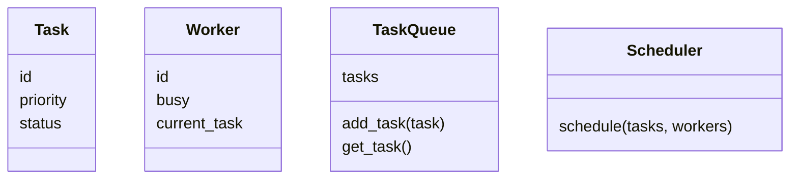

                 


# AI Agent的多任务并行处理技术

## 关键词：
AI Agent, 多任务并行, 任务调度, 资源分配, 并行计算

## 摘要：
本文深入探讨AI Agent在多任务并行处理中的技术细节，涵盖核心概念、算法原理、系统架构及项目实战。通过理论与实践结合，分析多任务并行处理的实现机制，帮助读者掌握AI Agent在复杂场景中的应用技巧。

---

# 引言

AI Agent作为一种智能代理，能够执行多种任务，并在多个任务之间进行高效并行处理。多任务并行处理技术是提升AI Agent性能和效率的关键，本文将从背景、原理、算法、架构、实战等方面详细探讨这一技术。

---

# 核心概念与背景

## 1.1 多任务并行处理的基本概念

### 1.1.1 定义与特点
多任务并行处理指在同一时间段内处理多个任务的能力，特点包括高效率、资源利用率高、响应速度快。

### 1.1.2 与多线程和多进程的关系
- 多线程：任务分解为多个线程，共享资源。
- 多进程：独立的进程，资源独立。

### 1.1.3 任务调度与资源分配
任务调度决定任务执行顺序，资源分配确保任务顺利进行。

## 1.2 并行处理中的同步与通信

### 1.2.1 同步机制
确保任务执行的顺序和依赖关系，避免数据竞争。

### 1.2.2 通信机制
任务之间交换数据，确保信息同步。

## 1.3 并行计算中的锁机制

### 1.3.1 锁的类型
- 互斥锁：防止多个线程同时访问同一资源。
- 读写锁：允许多个读取线程同时访问，但只有一个写入线程。

### 1.3.2 死锁问题
- 死锁原因：资源分配不当，顺序不合理。
- 解决方法：资源分配顺序，避免无限等待。

---

# 算法原理

## 2.1 任务调度算法

### 2.1.1 轮询调度算法

#### 算法原理
按任务优先级顺序执行，确保公平调度。

#### 代码实现
```python
def round_robin_scheduler(tasks):
    while True:
        for task in tasks:
            if task.ready():
                execute(task)
```

### 2.1.2 优先级调度算法

#### 算法原理
根据任务优先级动态调整执行顺序。

#### 代码实现
```python
def priority_scheduler(tasks):
    while True:
        tasks.sort(key=lambda x: x.priority)
        for task in tasks:
            if task.ready():
                execute(task)
                break
```

## 2.2 资源分配与负载均衡

### 2.2.1 负载均衡算法

#### 2.2.1.1 负载均衡算法
使用轮转法和随机法分配资源。

#### 2.2.1.2 算法实现
```python
def load_balancing(tasks, workers):
    while True:
        available_workers = [w for w in workers if not w.busy]
        for w in available_workers:
            if not tasks.empty():
                task = tasks.get()
                assign_task(task, w)
                break
```

---

# 系统架构与设计

## 3.1 系统架构设计

### 3.1.1 模块划分
- 任务管理模块：任务队列、优先级设置。
- 调度模块：任务调度、资源分配。
- 执行模块：任务执行、结果收集。

### 3.1.2 类图设计


## 3.2 接口设计

### 3.2.1 任务提交接口
- 接口定义：submit_task(task)
- 接口实现：将任务加入队列，设置优先级。

### 3.2.2 任务执行接口
- 接口定义：execute_task(task, worker)
- 接口实现：分配资源，执行任务。

---

# 项目实战

## 4.1 项目概述

### 4.1.1 项目背景
开发一个多任务处理系统，提升AI Agent的效率。

### 4.1.2 功能需求
- 多任务提交
- 并行执行
- 结果收集

## 4.2 系统实现

### 4.2.1 环境搭建
- Python 3.8+
- 多线程库：threading

### 4.2.2 核心代码实现

```python
import threading
import queue

class Task:
    def __init__(self, id, priority):
        self.id = id
        self.priority = priority
        self.status = 'pending'

class Worker(threading.Thread):
    def __init__(self, task_queue):
        super().__init__()
        self.task_queue = task_queue
        self.current_task = None
        self.busy = False

    def run(self):
        while True:
            try:
                task = self.task_queue.get_nowait()
                self.busy = True
                self.current_task = task
                print(f"Worker {self.id} executing task {task.id}")
                # 模拟任务执行时间
                threading.sleep(1)
                print(f"Worker {self.id} finished task {task.id}")
                self.task_queue.task_done()
            except queue.Empty:
                pass

def main():
    task_queue = queue.Queue()
    # 提交任务
    for i in range(10):
        task = Task(i, priority=10 - i)
        task_queue.put(task)
    # 初始化工人
    workers = [Worker(task_queue) for _ in range(5)]
    for worker in workers:
        worker.start()
    # 等待所有任务完成
    task_queue.join()
    print("All tasks completed")

if __name__ == "__main__":
    main()
```

### 4.2.3 功能解读
- 多个线程（工人）处理任务队列，每个任务按优先级执行。

### 4.2.4 案例分析
- 提交10个任务，5个工人并行处理，优先级高的任务优先执行。

---

# 总结与展望

## 5.1 总结
本文详细讲解了AI Agent的多任务并行处理技术，从概念、算法、系统架构到项目实战，全面覆盖了相关知识点。

## 5.2 展望
未来，AI Agent将在分布式计算、边缘计算等领域发挥更大作用，任务调度和负载均衡算法将更加智能化。

---

# 作者
作者：AI天才研究院 & 禅与计算机程序设计艺术

---

通过以上内容，读者可以系统地了解AI Agent的多任务并行处理技术，并能够在实际项目中应用这些知识。

