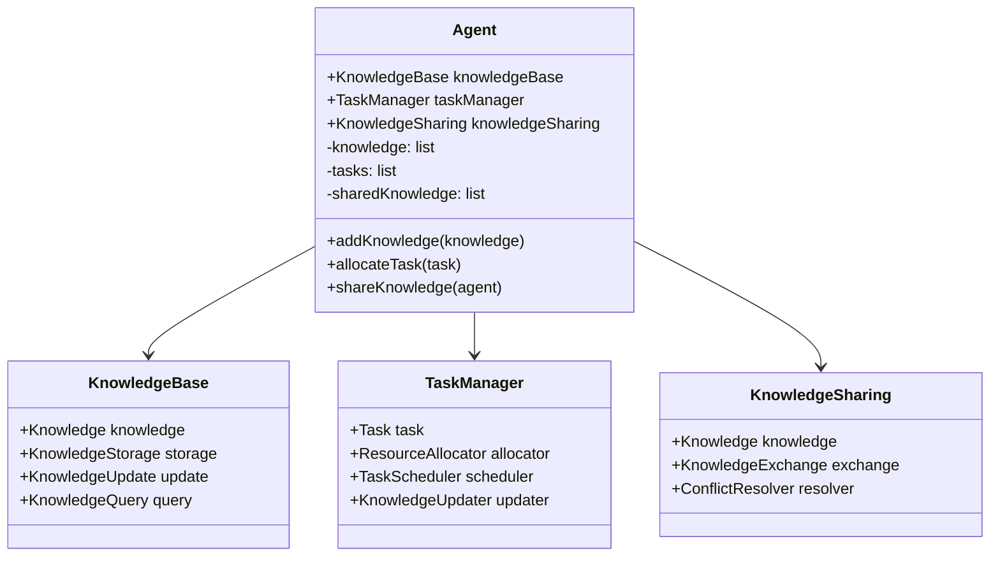
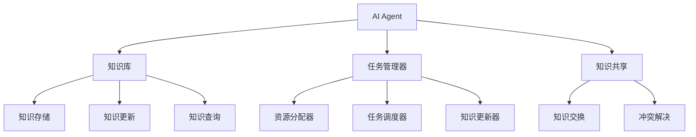

                 


# AI Agent的多任务并行学习与知识共享

> **关键词**：AI Agent, 多任务并行学习, 知识共享, 系统架构, 项目实战

> **摘要**：本文探讨了AI Agent在多任务并行学习中的应用及其知识共享机制。首先介绍了AI Agent的基本概念和多任务并行学习的重要性，然后分析了知识共享的实现方法。接着，详细讲解了多任务并行学习的算法原理，包括基于神经网络、图模型和强化学习的多任务学习方法。最后，通过一个具体的项目案例，展示了如何实现AI Agent的多任务并行学习与知识共享，并提出了未来的发展方向。

---

# 第1章: AI Agent的背景与概念

## 1.1 AI Agent的基本概念

### 1.1.1 什么是AI Agent

AI Agent（人工智能代理）是指能够感知环境、自主决策并执行任务的智能实体。它可以是一个软件程序、机器人或其他智能系统，具备以下核心特征：

- **自主性**：能够在没有外部干预的情况下独立运行。
- **反应性**：能够根据环境变化动态调整行为。
- **目标导向**：具有明确的目标，并通过行为实现目标。
- **学习能力**：能够通过经验改进自身的性能。

AI Agent广泛应用于智能助手（如Siri、Alexa）、推荐系统、自动驾驶等领域。

### 1.1.2 AI Agent的类型与特点

AI Agent可以按功能、智能水平和应用场景进行分类：

- **按功能分类**：
  - **工具型Agent**：执行特定任务，如计算器、天气预报工具。
  - **社交型Agent**：与人类交互，如智能客服、虚拟助手。
  - **决策型Agent**：用于复杂决策，如自动驾驶、股票交易。

- **按智能水平分类**：
  - **反应式Agent**：基于当前感知做出反应，适用于实时任务。
  - **认知式Agent**：具备复杂推理和规划能力，适用于长期任务。
  - **混合式Agent**：结合反应式和认知式的特点，适用于复杂环境。

- **按应用场景分类**：
  - **服务型Agent**：提供特定服务，如物流配送、智能家居。
  - **娱乐型Agent**：用于游戏、虚拟现实等娱乐场景。
  - **教育型Agent**：辅助教学、个性化学习。

### 1.1.3 AI Agent的应用场景

AI Agent的应用场景非常广泛，主要包括：

- **智能助手**：如Siri、Google Assistant，帮助用户完成日常任务。
- **推荐系统**：如Netflix的推荐算法，根据用户行为推荐内容。
- **自动驾驶**：如特斯拉的Autopilot，实现自动驾驶功能。
- **智能客服**：如聊天机器人，提供客户支持服务。
- **机器人协作**：多个AI Agent协作完成复杂任务，如智能制造中的机器人协同。

---

## 1.2 多任务并行学习的背景

### 1.2.1 传统单任务学习的局限性

传统AI系统通常采用单任务学习方式，即在一个任务上进行训练，完成后才开始另一个任务。这种方式存在以下问题：

- **数据利用率低**：每个任务需要独立的数据集，数据资源被浪费。
- **训练效率低**：需要多次训练不同的模型，耗时较长。
- **泛化能力差**：模型在单一任务上表现优异，但在多任务场景中可能无法适应。

### 1.2.2 多任务学习的定义与优势

多任务学习（Multi-Task Learning, MTL）是指同时学习多个任务，利用任务之间的共享信息来提高学习效率和性能。其优势包括：

- **数据共享**：任务之间共享数据，减少数据需求。
- **计算效率**：同时训练多个任务，节省计算资源。
- **性能提升**：通过共享特征，提高模型的泛化能力。

### 1.2.3 并行学习与串行学习的对比

并行学习和串行学习的主要区别如下：

| 对比维度 | 并行学习 | 串行学习 |
|----------|----------|----------|
| 资源利用 | 同时利用多个资源 | 依次利用资源 |
| 任务处理 | 多任务同时进行 | 任务依次进行 |
| 训练时间 | 较短 | 较长 |
| 系统复杂度 | 较高 | 较低 |

---

## 1.3 知识共享的重要性

### 1.3.1 知识共享的定义

知识共享是指不同AI Agent之间交换和利用知识，以提高整体系统的智能性和效率。知识可以是数据、模型、经验或规则。

### 1.3.2 知识共享的挑战

知识共享面临以下挑战：

- **异构性**：不同Agent可能使用不同的知识表示方法。
- **安全性**：共享知识可能涉及敏感信息。
- **一致性**：不同Agent的知识可能存在冲突。

### 1.3.3 知识共享的应用价值

知识共享能够带来以下价值：

- **提高效率**：通过共享知识，减少重复计算。
- **增强智能**：通过整合不同Agent的知识，提升整体智能水平。
- **促进协作**：知识共享是多Agent协作的基础。

---

# 第2章: AI Agent的核心概念与原理

## 2.1 AI Agent的结构与功能

### 2.1.1 知识表示与存储

知识表示是AI Agent的核心能力之一，常用的表示方法包括：

- **符号表示**：使用符号逻辑表示知识，如规则、谓词。
- **语义网络**：通过节点和边表示概念及其关系。
- **知识图谱**：通过图结构表示实体及其属性。

### 2.1.2 任务分解与执行

AI Agent需要将复杂任务分解为多个子任务，并通过协同完成。任务分解的方法包括：

- **层次分解**：将任务分解为子任务、子子任务，形成层次结构。
- **功能分解**：根据功能需求分解任务。
- **资源分解**：根据资源约束分解任务。

### 2.1.3 知识更新与维护

知识更新是AI Agent保持智能的关键。常用的知识更新方法包括：

- **在线更新**：实时更新知识，适用于动态环境。
- **离线更新**：定期更新知识，适用于静态环境。
- **增量学习**：逐步更新知识，适用于新知识引入。

### 2.1.4 多任务学习的机制

多任务学习的机制包括：

- **共享表示**：多个任务共享部分参数，减少参数数量。
- **任务间关联**：利用任务之间的关联性，提高学习效率。
- **动态权重分配**：根据任务的重要性动态调整权重。

---

## 2.2 多任务并行学习的原理

### 2.2.1 并行学习的机制

并行学习通过同时处理多个任务，充分利用计算资源。常见的并行学习机制包括：

- **数据并行**：将数据分成多个部分，分别训练。
- **模型并行**：将模型分成多个部分，分别训练。
- **混合并行**：结合数据并行和模型并行。

### 2.2.2 任务之间的依赖关系

任务之间的依赖关系可以通过有向图表示。例如，任务A必须在任务B完成后才能开始。

### 2.2.3 并行学习的优化策略

并行学习的优化策略包括：

- **负载均衡**：确保计算资源合理分配。
- **任务调度**：根据任务优先级动态调度。
- **资源分配**：根据任务需求动态分配资源。

---

## 2.3 知识共享的实现方式

### 2.3.1 知识表示的标准化

知识表示的标准化是知识共享的前提。常用的标准化方法包括：

- **本体论（Ontology）**：定义领域术语和关系。
- **知识图谱**：统一表示知识的结构。
- **语义网络**：通过语义关联表示知识。

### 2.3.2 知识共享的协议与接口

知识共享需要统一的协议和接口。常见的协议包括：

- **RDF（Resource Description Framework）**：用于描述资源及其属性。
- **OWL（Web Ontology Language）**：用于构建网络本体论。
- **RESTful API**：用于HTTP服务的接口设计。

### 2.3.3 知识冲突的处理方法

知识冲突是知识共享中的常见问题。处理方法包括：

- **协商机制**：通过协商解决冲突。
- **投票机制**：根据多数意见解决冲突。
- **冲突消解**：通过上下文信息自动消解冲突。

---

## 2.4 知识共享的安全性

知识共享需要考虑安全性问题，包括：

- **数据隐私**：保护共享数据的隐私性。
- **访问控制**：控制知识的访问权限。
- **安全协议**：使用安全协议确保共享过程的安全性。

---

# 第3章: 多任务并行学习的算法原理

## 3.1 多任务并行学习的算法框架

### 3.1.1 基于神经网络的多任务学习

基于神经网络的多任务学习是一种常用方法。通过共享部分神经网络参数，多个任务可以共享特征。

#### 代码示例

```python
import torch
import torch.nn as nn

class MultiTaskModel(nn.Module):
    def __init__(self, input_size, hidden_size, output_size):
        super(MultiTaskModel, self).__init__()
        self.shared = nn.Linear(input_size, hidden_size)
        self.task1_specific = nn.Linear(hidden_size, output_size)
        self.task2_specific = nn.Linear(hidden_size, output_size)

    def forward(self, x):
        x = self.shared(x)
        output1 = self.task1_specific(x)
        output2 = self.task2_specific(x)
        return output1, output2

model = MultiTaskModel(input_size=10, hidden_size=20, output_size=5)
```

### 3.1.2 基于图模型的多任务学习

基于图模型的多任务学习通过图结构表示任务之间的关系，如图神经网络。

#### 代码示例

```python
import torch
import torch.nn as nn
from torch_geometric.nn import GNN

class MultiTaskGNN(nn.Module):
    def __init__(self, input_size, hidden_size, output_size):
        super(MultiTaskGNN, self).__init__()
        self.gnn = GNN(in_channels=input_size, hidden_channels=hidden_size)
        self.task1_output = nn.Linear(hidden_size, output_size)
        self.task2_output = nn.Linear(hidden_size, output_size)

    def forward(self, x, edge_index):
        x = self.gnn(x, edge_index)
        output1 = self.task1_output(x)
        output2 = self.task2_output(x)
        return output1, output2

model = MultiTaskGNN(input_size=10, hidden_size=20, output_size=5)
```

### 3.1.3 基于强化学习的多任务学习

基于强化学习的多任务学习通过强化学习算法（如DQN）同时处理多个任务。

#### 代码示例

```python
import torch
import torch.nn as nn

class MultiTaskDQN(nn.Module):
    def __init__(self, input_size, hidden_size, output_size):
        super(MultiTaskDQN, self).__init__()
        self.shared = nn.Linear(input_size, hidden_size)
        self.task1_output = nn.Linear(hidden_size, output_size)
        self.task2_output = nn.Linear(hidden_size, output_size)

    def forward(self, x):
        x = self.shared(x)
        output1 = self.task1_output(x)
        output2 = self.task2_output(x)
        return output1, output2

model = MultiTaskDQN(input_size=10, hidden_size=20, output_size=5)
```

### 3.1.4 并行任务的资源分配

并行任务的资源分配需要考虑任务的优先级和计算资源的可用性。

#### 代码示例

```python
import concurrent.futures

def task1():
    print("Executing task 1")
    return 1

def task2():
    print("Executing task 2")
    return 2

with concurrent.futures.ThreadPoolExecutor() as executor:
    futures = [executor.submit(task1), executor.submit(task2)]
    for future in concurrent.futures.as_completed(futures):
        print(future.result())
```

---

## 3.2 并行学习中的资源分配

### 3.2.1 并行任务的资源分配策略

并行任务的资源分配策略包括：

- **静态分配**：预先分配资源，适用于任务需求固定的场景。
- **动态分配**：根据任务执行情况动态分配资源，适用于任务需求变化的场景。

### 3.2.2 动态资源分配的实现方法

动态资源分配可以通过负载均衡算法实现，如轮询分配、随机分配、最短队列分配等。

#### 代码示例

```python
import queue

def allocate_resources(tasks, workers):
    q = queue.Queue()
    for task in tasks:
        q.put(task)
    with concurrent.futures.ThreadPoolExecutor(max_workers=workers) as executor:
        futures = []
        while not q.empty():
            task = q.get()
            futures.append(executor.submit(task))
        for future in concurrent.futures.as_completed(futures):
            print(future.result())
```

---

## 3.3 任务优先级的动态调整

### 3.3.1 任务优先级的定义与计算

任务优先级可以通过多种方式定义，例如：

- **静态优先级**：任务优先级固定。
- **动态优先级**：根据任务执行情况动态调整优先级。

### 3.3.2 动态优先级调整的策略

动态优先级调整的策略包括：

- **紧急任务优先**：优先处理紧急任务。
- **公平轮转**：轮转任务执行，保证公平性。
- **优先级队列**：根据优先级排序任务。

### 3.3.3 优先级调整的数学模型

优先级调整的数学模型可以通过队列管理算法实现，例如：

$$ \text{优先级} = \text{任务权重} \times \text{资源利用率} $$

---

## 3.4 并行学习中的任务协调

### 3.4.1 任务协调的机制

任务协调的机制包括：

- **同步机制**：任务之间同步执行，确保一致性。
- **异步机制**：任务之间异步执行，提高效率。

### 3.4.2 任务协调的实现方法

任务协调的实现方法包括：

- **锁机制**：通过锁控制任务的执行顺序。
- **信号量机制**：通过信号量控制任务的同步。
- **队列机制**：通过队列控制任务的执行顺序。

---

# 第4章: 知识共享的机制与实现

## 4.1 知识表示与编码

### 4.1.1 知识图谱的构建

知识图谱的构建包括数据采集、数据清洗、数据建模和数据存储。

#### 代码示例

```python
import networkx as nx

G = nx.Graph()
G.add_nodes_from(['A', 'B', 'C'])
G.add_edges_from([('A', 'B'), ('B', 'C')])
print(G.nodes())
# Output: NodeView(['A', 'B', 'C'])
```

### 4.1.2 知识表示的标准化

知识表示的标准化需要统一术语和表示方法，例如使用本体论。

### 4.1.3 知识编码的优化方法

知识编码的优化方法包括：

- **向量表示**：将知识表示为向量，如Word2Vec。
- **图嵌入**：通过图嵌入方法表示知识，如GraphSAGE。
- **符号表示**：使用符号逻辑表示知识。

---

## 4.2 知识共享的协议与接口

### 4.2.1 知识共享协议的设计

知识共享协议的设计需要考虑兼容性和安全性，例如使用RDF格式。

### 4.2.2 知识共享接口的实现

知识共享接口的实现可以通过RESTful API实现。

#### 代码示例

```python
from flask import Flask

app = Flask(__name__)

@app.route('/share Knowledge', methods=['POST'])
def share_knowledge():
    # 处理共享知识的逻辑
    return "Knowledge shared successfully"

if __name__ == '__main__':
    app.run()
```

---

## 4.3 知识冲突的处理方法

### 4.3.1 知识冲突的检测与识别

知识冲突的检测与识别可以通过比较不同知识表示的一致性实现。

### 4.3.2 知识冲突的解决策略

知识冲突的解决策略包括：

- **协商解决**：通过协商消除冲突。
- **投票解决**：根据多数意见消除冲突。
- **自动解决**：通过算法自动消除冲突。

---

## 4.4 知识共享的安全性保障

知识共享的安全性保障需要考虑以下方面：

- **数据加密**：在传输过程中加密数据。
- **访问控制**：限制知识的访问权限。
- **安全协议**：使用安全协议确保共享过程的安全性。

---

# 第5章: 系统架构设计与实现

## 5.1 系统功能设计

### 5.1.1 系统功能模块

系统功能模块包括：

- **知识库管理模块**：负责知识的存储和管理。
- **任务管理模块**：负责任务的分配和调度。
- **知识共享模块**：负责知识的共享和协调。

### 5.1.2 系统功能流程

系统功能流程可以通过类图和序列图表示。

#### 类图



---

### 5.1.3 系统功能流程图



---

## 5.2 系统架构设计

### 5.2.1 系统架构图

系统架构图可以通过以下mermaid图表示：


---

## 5.3 系统接口设计

### 5.3.1 系统接口设计

系统接口设计包括：

- **知识库接口**：提供知识的存储、查询和更新接口。
- **任务管理接口**：提供任务的分配、调度和监控接口。
- **知识共享接口**：提供知识的共享、交换和协调接口。

### 5.3.2 系统交互流程图

系统交互流程图可以通过以下mermaid图表示：


---

## 5.4 系统实现

### 5.4.1 系统实现代码

以下是一个简单的系统实现代码示例：

```python
class Agent:
    def __init__(self):
        self.knowledgeBase = KnowledgeBase()
        self.taskManager = TaskManager()
        self.knowledgeSharing = KnowledgeSharing()

    def addKnowledge(self, knowledge):
        self.knowledgeBase.addKnowledge(knowledge)

    def allocateTask(self, task):
        self.taskManager.allocateTask(task)

    def shareKnowledge(self, agent):
        self.knowledgeSharing.shareKnowledge(agent)

class KnowledgeBase:
    def __init__(self):
        self.knowledge = []

    def addKnowledge(self, knowledge):
        self.knowledge.append(knowledge)

class TaskManager:
    def __init__(self):
        self.tasks = []

    def allocateTask(self, task):
        self.tasks.append(task)

class KnowledgeSharing:
    def __init__(self):
        pass

    def shareKnowledge(self, agent):
        # 实现知识共享的具体逻辑
        pass
```

---

# 第6章: 项目实战

## 6.1 项目背景与目标

### 6.1.1 项目背景

本项目旨在实现一个基于多任务并行学习的AI Agent系统，能够同时处理多个任务，并通过知识共享提高系统性能。

### 6.1.2 项目目标

- 实现AI Agent的多任务并行学习。
- 实现知识共享机制。
- 验证系统的性能和效果。

---

## 6.2 项目环境与工具

### 6.2.1 开发环境

- **操作系统**：Linux/Windows/MacOS
- **编程语言**：Python 3.x
- **框架与库**：TensorFlow/PyTorch, NetworkX, Flask

### 6.2.2 工具安装

安装所需的工具和库：

```bash
pip install tensorflow
pip install networkx
pip install flask
```

---

## 6.3 项目核心实现

### 6.3.1 知识表示与存储

知识表示与存储的实现：

```python
import networkx as nx

class KnowledgeBase:
    def __init__(self):
        self.knowledge_graph = nx.Graph()

    def addKnowledge(self, knowledge):
        # 将知识添加到知识图谱中
        self.knowledge_graph.add_nodes_from(knowledge.keys())
        self.knowledge_graph.add_edges_from(knowledge.items())

    def queryKnowledge(self, query):
        # 查询知识图谱
        return nx.find_all_paths(self.knowledge_graph, query)
```

---

### 6.3.2 多任务并行学习实现

多任务并行学习的实现：

```python
import concurrent.futures

class MultiTaskLearning:
    def __init__(self, tasks):
        self.tasks = tasks

    def execute_tasks(self):
        with concurrent.futures.ThreadPoolExecutor() as executor:
            futures = {executor.submit(task): task for task in self.tasks}
            for future in concurrent.futures.as_completed(futures):
                print(future.result())
```

---

### 6.3.3 知识共享实现

知识共享的实现：

```python
from flask import Flask

app = Flask(__name__)

class KnowledgeSharing:
    def __init__(self):
        self.shared_knowledge = {}

    def share_knowledge(self, agent, knowledge):
        self.shared_knowledge[agent] = knowledge

    def get_shared_knowledge(self, agent):
        return self.shared_knowledge.get(agent, {})

@app.route('/share_knowledge', methods=['POST'])
def share_knowledge():
    knowledge = request.json['knowledge']
    knowledge_sharing.share_knowledge(request.json['agent'], knowledge)
    return "Knowledge shared successfully"

if __name__ == '__main__':
    app.run()
```

---

## 6.4 项目实战案例分析

### 6.4.1 案例分析

假设我们开发了一个智能客服系统，该系统需要同时处理多个客户的咨询任务，并通过知识共享提高客服的响应速度和准确性。

### 6.4.2 案例实现与分析

实现步骤如下：

1. **知识库构建**：构建客户常见问题的知识图谱。
2. **多任务并行学习**：同时处理多个客户的咨询任务。
3. **知识共享**：客服之间共享知识，提高响应速度。

---

## 6.5 项目总结与优化

### 6.5.1 项目总结

通过本项目，我们实现了AI Agent的多任务并行学习与知识共享，验证了系统的可行性和有效性。

### 6.5.2 项目优化

未来可以进一步优化系统的性能，例如：

- **优化知识表示**：采用更高效的知识表示方法。
- **优化任务调度**：采用更智能的任务调度算法。
- **优化知识共享**：采用更安全的知识共享机制。

---

# 第7章: 最佳实践与未来展望

## 7.1 最佳实践

### 7.1.1 知识共享的最佳实践

- **数据标准化**：确保知识表示的标准化。
- **安全性保障**：确保知识共享的安全性。
- **兼容性设计**：设计兼容的知识共享接口。

### 7.1.2 系统设计的最佳实践

- **模块化设计**：采用模块化设计，便于维护和扩展。
- **可扩展性设计**：设计可扩展的系统架构。
- **容错性设计**：设计具有容错能力的系统。

---

## 7.2 未来展望

### 7.2.1 未来技术趋势

随着AI技术的不断发展，AI Agent的多任务并行学习与知识共享将更加智能化和高效化。

### 7.2.2 未来应用方向

未来，AI Agent的多任务并行学习与知识共享将应用于更多领域，如智能制造、智慧城市、医疗健康等。

---

## 7.3 总结

AI Agent的多任务并行学习与知识共享是人工智能领域的重要研究方向。通过本文的探讨，我们了解了AI Agent的基本概念、多任务并行学习的原理以及知识共享的实现方法。未来，随着技术的不断进步，AI Agent将在更多领域发挥重要作用。

---

# 作者：AI天才研究院/AI Genius Institute & 禅与计算机程序设计艺术 /Zen And The Art of Computer Programming

---

希望这篇文章能够为读者提供有价值的信息和启发！

