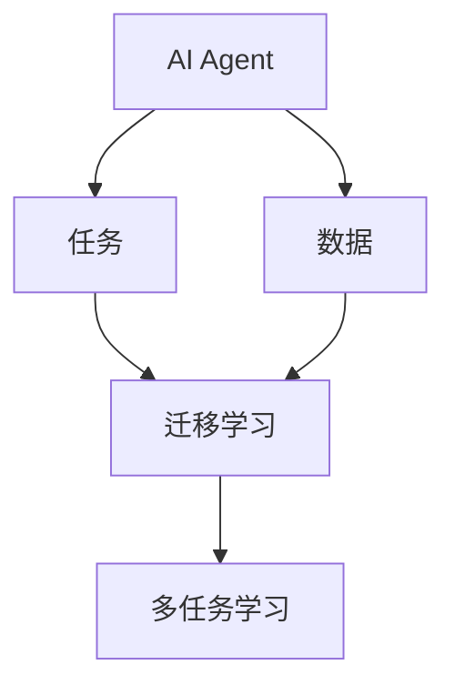
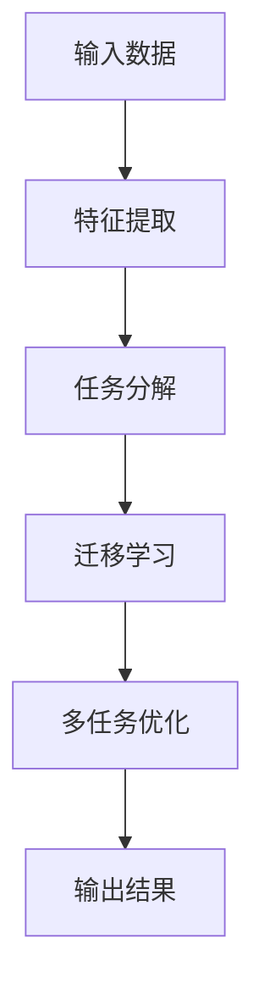
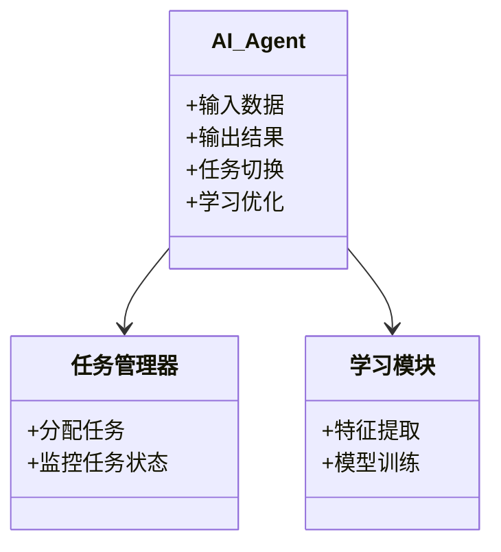
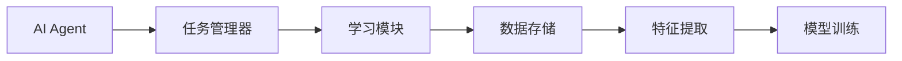
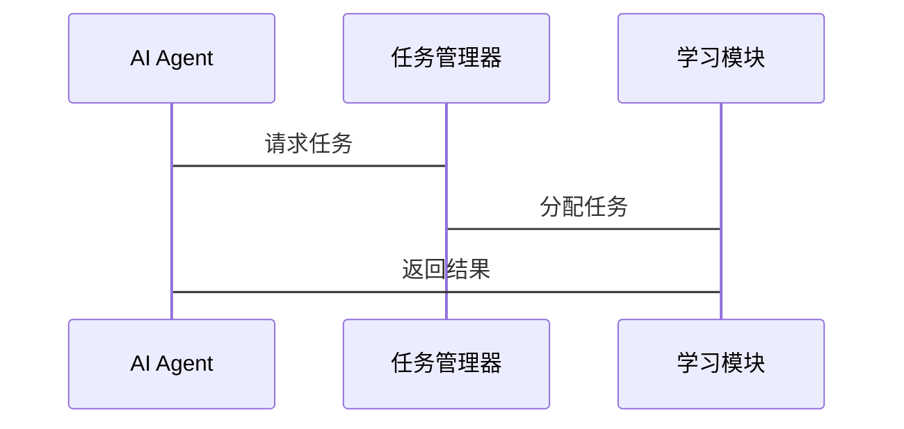

                 


# AI Agent的多任务迁移学习技术

**关键词**：AI Agent、多任务学习、迁移学习、机器学习、深度学习

**摘要**：本文将详细探讨AI Agent在多任务迁移学习中的应用技术。首先介绍AI Agent和多任务迁移学习的基本概念，分析其核心概念和联系。接着，深入讲解多任务迁移学习的算法原理，包括数学模型和公式。然后，通过系统分析与架构设计，展示如何将多任务迁移学习应用于实际场景中。最后，通过项目实战，提供代码实现和案例分析，帮助读者更好地理解和掌握相关技术。

---

## 第1章 AI Agent与多任务迁移学习的背景

### 1.1 AI Agent的基本概念

#### 1.1.1 AI Agent的定义
AI Agent（人工智能代理）是指能够感知环境、自主决策并执行任务的智能实体。它可以是一个软件程序、机器人或其他智能系统，旨在帮助用户完成特定任务或提供决策支持。

#### 1.1.2 AI Agent的核心特点
- **自主性**：能够自主决策，无需外部干预。
- **反应性**：能够实时感知环境并做出反应。
- **学习能力**：能够通过数据和经验不断优化自身性能。
- **社交能力**：能够与其他AI Agent或人类进行交互和协作。

#### 1.1.3 AI Agent的应用场景
- 智能助手（如Siri、Alexa）
- 自动驾驶系统
- 智能客服机器人
- 多智能体协作系统

### 1.2 多任务迁移学习的背景

#### 1.2.1 传统迁移学习的局限性
传统迁移学习主要针对单任务场景，无法有效处理多任务环境下的复杂问题。例如，在自然语言处理中，单一任务的迁移学习难以应对多种任务的复杂需求。

#### 1.2.2 多任务迁移学习的提出
多任务迁移学习旨在通过同时学习多个相关任务，提高模型的泛化能力和适应性。它利用任务之间的共享特征，减少数据需求，提升模型性能。

#### 1.2.3 多任务迁移学习的应用价值
- **减少数据需求**：通过共享特征，减少每个任务所需的数据量。
- **提升模型泛化能力**：多个任务的学习使模型更具鲁棒性和适应性。
- **提高效率**：通过共享计算资源，提高学习效率。

### 1.3 问题背景与问题描述

#### 1.3.1 AI Agent在多任务场景中的挑战
AI Agent需要在多个任务之间切换，同时保持高性能。传统单任务学习方法在多任务场景中表现不佳，难以有效利用跨任务的共享特征。

#### 1.3.2 多任务迁移学习的核心问题
如何设计有效的多任务迁移学习框架，使得AI Agent能够在多个任务之间高效切换，同时保持高性能。

#### 1.3.3 问题解决的思路与方法
通过设计共享表示层，利用任务之间的共享特征，构建多任务迁移学习模型，提升AI Agent的多任务处理能力。

---

## 第2章 多任务迁移学习的核心概念与联系

### 2.1 核心概念原理

#### 2.1.1 多任务学习的基本原理
多任务学习通过共享参数，同时优化多个任务的目标函数，使得模型能够同时学习多个任务。

#### 2.1.2 迁移学习的基本原理
迁移学习通过利用源任务的数据和知识，提升目标任务的性能。核心在于找到源任务和目标任务之间的共享特征。

#### 2.1.3 多任务迁移学习的整合原理
多任务迁移学习将多任务学习和迁移学习结合起来，利用任务之间的共享特征，同时优化多个任务的目标函数。

### 2.2 核心概念属性特征对比

| 比较维度 | 单任务学习 | 多任务学习 | 迁移学习 | 多任务迁移学习 |
|----------|------------|------------|-----------|----------------|
| 数据需求 | 高         | 较高       | 较高      | 较低           |
| 任务数量 | 单任务     | 多任务     | 单任务    | 多任务         |
| 性能提升 | 一般       | 显著       | 显著      | 更显著         |

#### 2.2.3 ER实体关系图架构


---

## 第3章 多任务迁移学习的算法原理

### 3.1 算法原理概述

#### 3.1.1 多任务迁移学习的总体流程
1. 数据预处理：收集和预处理多任务数据。
2. 特征提取：提取数据中的特征表示。
3. 任务分解：将多任务分解为多个子任务。
4. 迁移学习：利用任务之间的共享特征，构建共享表示层。
5. 多任务优化：优化多个任务的目标函数，提升模型性能。

### 3.2 算法实现流程



### 3.3 算法实现代码

```python
def multi_task_model():
    model = Sequential()
    model.add(Dense(64, activation='relu', input_dim=100))
    model.add(Dropout(0.5))
    model.add(Dense(10, activation='softmax'))
    return model
```

### 3.4 数学模型与公式

#### 3.4.1 任务损失函数
$$ L_i(y_i, y_{i}^{\text{pred}}) $$

#### 3.4.2 迁移损失函数
$$ L_{\text{transfer}}(f, D_{\text{source}}, D_{\text{target}}) $$

#### 3.4.3 总体损失函数
$$ L = \sum_{i=1}^{N} \lambda_i L_i + \lambda_{\text{transfer}} L_{\text{transfer}} $$

---

## 第4章 系统分析与架构设计方案

### 4.1 问题场景介绍
设计一个AI Agent系统，能够同时处理多种任务，如自然语言理解、图像识别等。

### 4.2 系统功能设计

#### 4.2.1 领域模型


#### 4.2.2 系统架构


### 4.3 接口设计与交互流程


---

## 第5章 项目实战

### 5.1 环境安装
安装Python、TensorFlow、Keras等必要库。

### 5.2 核心代码实现

```python
import tensorflow as tf
from tensorflow import keras

def multi_task_model():
    inputs = keras.Input(shape=(100,))
    x = keras.layers.Dense(64, activation='relu')(inputs)
    x = keras.layers.Dropout(0.5)(x)
    outputs = keras.layers.Dense(10, activation='softmax')(x)
    return keras.Model(inputs=inputs, outputs=outputs)

model = multi_task_model()
model.compile(optimizer='adam', loss='sparse_categorical_crossentropy', metrics=['accuracy'])
model.fit(x_train, y_train, epochs=10, batch_size=32)
```

### 5.3 案例分析与解读
以自然语言处理任务为例，分析模型在多任务场景下的表现，解读代码实现和结果。

### 5.4 项目小结
总结项目实现的关键点和经验教训，强调多任务迁移学习的优势。

---

## 第6章 最佳实践与总结

### 6.1 最佳实践 tips
- 合理选择任务之间的共享特征。
- 优化模型超参数，提升性能。
- 定期监控模型表现，及时调整。

### 6.2 小结
本文详细介绍了AI Agent的多任务迁移学习技术，从背景到算法实现，再到系统设计和项目实战，全面阐述了相关知识。

### 6.3 注意事项
- 数据质量对模型性能影响重大。
- 任务选择应具有相关性，避免负面影响。
- 模型调优需结合实际应用场景。

### 6.4 拓展阅读
推荐相关书籍和论文，供读者深入学习。

---

**作者：AI天才研究院/AI Genius Institute & 禅与计算机程序设计艺术 /Zen And The Art of Computer Programming**

