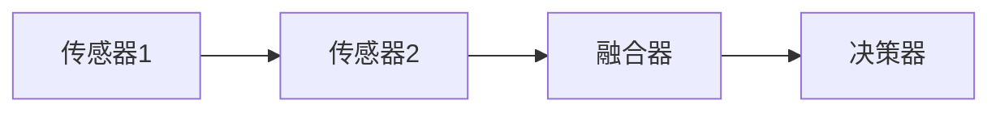
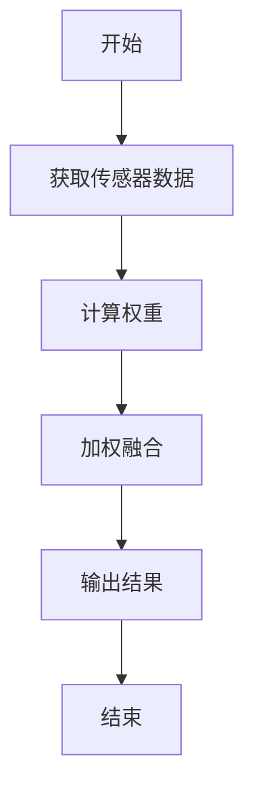
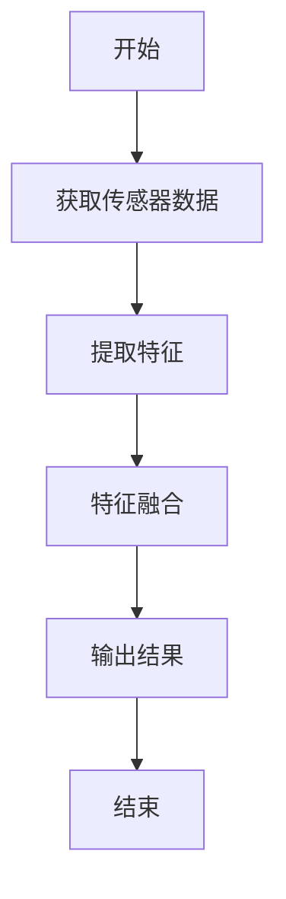
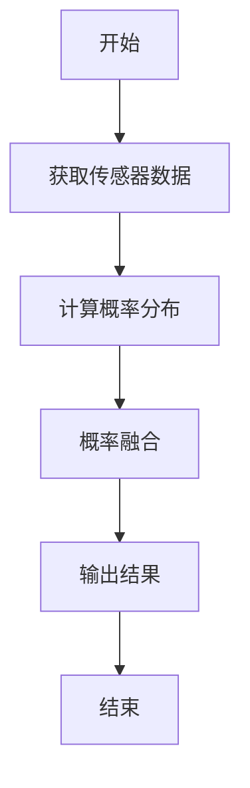
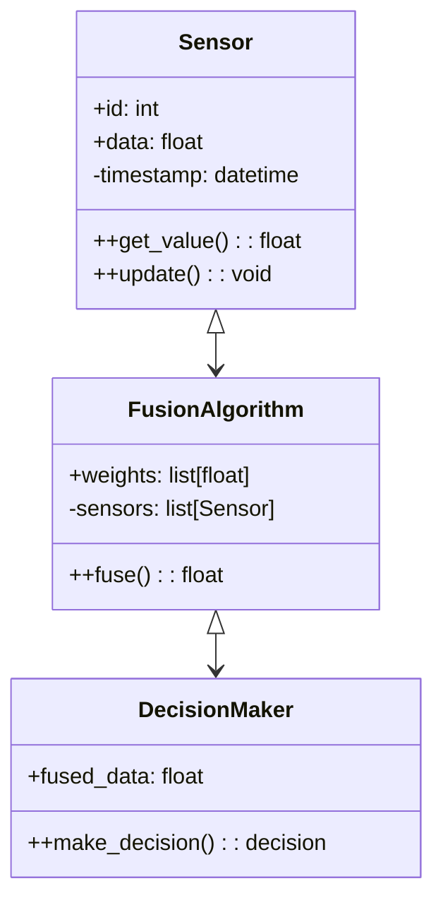
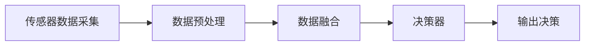

                 


# AI Agent的多传感器数据融合技术

> 关键词：AI Agent, 多传感器数据融合, 数据融合算法, 系统架构设计, 传感器数据处理

> 摘要：本文深入探讨了AI Agent在多传感器数据融合技术中的应用，分析了数据融合的核心概念、算法原理、系统架构设计以及实际项目案例。通过详细的技术分析和实践示例，本文旨在为读者提供全面的技术指导，帮助他们理解和掌握多传感器数据融合的关键技术。

---

## 第1章: 多传感器数据融合技术背景

### 1.1 多传感器数据融合的基本概念

#### 1.1.1 传感器数据融合的定义
多传感器数据融合是指将来自多个传感器的数据进行处理、分析和综合，以获得更准确、完整和可靠的结果。传感器数据融合的核心在于将不同来源、不同形式的数据进行整合，以弥补单一传感器的局限性。

#### 1.1.2 多传感器数据融合的必要性
在AI Agent中，单一传感器的数据往往不足以满足决策的需求。例如，在智能驾驶场景中，仅依靠摄像头可能无法在恶劣天气下准确识别物体，而结合激光雷达和红外传感器的数据可以显著提高准确性。

#### 1.1.3 数据融合的分类与层次
数据融合可以分为低级融合和高级融合。低级融合主要处理原始数据，如位置坐标和角度；高级融合则涉及语义理解和意图推理，如目标识别和路径规划。

### 1.2 多传感器数据融合技术的背景与现状

#### 1.2.1 多传感器数据融合技术的发展历程
数据融合技术起源于20世纪60年代的军事领域，随着传感器技术的进步，逐渐应用于民用领域，如自动驾驶和智能家居。

#### 1.2.2 当前技术的主要特点
当前的数据融合技术注重实时性、准确性和鲁棒性，常用的方法包括加权融合、特征融合和基于概率的融合。

#### 1.2.3 数据融合技术在AI Agent中的应用前景
数据融合技术在AI Agent中的应用前景广阔，特别是在智能驾驶、智能机器人和智慧城市等领域。

### 1.3 AI Agent与多传感器数据融合的关系

#### 1.3.1 AI Agent的基本概念
AI Agent是一种智能体，能够感知环境、做出决策并采取行动。数据融合技术是AI Agent实现智能决策的关键技术之一。

#### 1.3.2 多传感器数据融合在AI Agent中的作用
多传感器数据融合帮助AI Agent更全面地感知环境，提高决策的准确性和可靠性。

#### 1.3.3 数据融合对AI Agent智能性的提升
通过多传感器数据融合，AI Agent能够更好地处理复杂环境中的不确定性，提升整体智能性。

### 1.4 本章小结
本章介绍了多传感器数据融合的基本概念、技术背景及其在AI Agent中的应用，为后续章节奠定了基础。

---

## 第2章: 多传感器数据融合的核心概念与原理

### 2.1 数据融合的基本原理

#### 2.1.1 数据融合的数学模型
数据融合的数学模型是理解其原理的关键。例如，加权融合模型如下：
$$w_1x_1 + w_2x_2 + ... + w_nx_n$$
其中，$w_i$是传感器的权重，$x_i$是传感器的输出。

#### 2.1.2 数据融合的主要方法
数据融合的主要方法包括加权融合、特征融合和基于概率的融合。以下是一个加权融合的示例代码：

```python
def weighted_fusion(sensor_data, weights):
    return sum(w * d for w, d in zip(weights, sensor_data))
```

#### 2.1.3 数据融合的优缺点对比
以下表格对比了三种数据融合方法的优缺点：

| 方法       | 优点                           | 缺点                           |
|------------|--------------------------------|--------------------------------|
| 加权融合    | 计算简单，准确性高              | 权重设置复杂                   |
| 特征融合    | 能够处理高维数据               | 计算复杂性较高                 |
| 概率融合    | 能够处理不确定性               | 计算复杂性极高                 |

### 2.2 多传感器数据融合的关键技术

#### 2.2.1 数据预处理技术
数据预处理是数据融合的关键步骤，包括数据清洗和标准化。例如，使用以下代码进行数据清洗：

```python
def preprocess(data):
    # 删除异常值
    filtered = [d for d in data if d > 0]
    return filtered
```

#### 2.2.2 数据融合算法
数据融合算法是实现数据融合的核心。例如，特征融合算法如下：

```python
def feature_fusion(sensor1, sensor2):
    # 提取特征
    feature1 = sensor1.feature
    feature2 = sensor2.feature
    # 融合特征
    fused_feature = feature1 + feature2
    return fused_feature
```

#### 2.2.3 数据融合的评价指标
数据融合的评价指标包括准确率、召回率和F1分数。例如，计算准确率：

$$Accuracy = \frac{TP}{TP + FP}$$

### 2.3 数据融合的数学模型与公式

#### 2.3.1 加权融合模型
$$w_1x_1 + w_2x_2 + ... + w_nx_n$$

#### 2.3.2 基于概率的融合模型
$$P(x|y) = \frac{P(y|x)P(x)}{P(y)}$$

### 2.4 数据融合的实体关系图
以下是一个简单的数据流图：



### 2.5 本章小结
本章详细讲解了数据融合的核心概念、算法和数学模型，为后续章节的系统设计和项目实战奠定了理论基础。

---

## 第3章: 多传感器数据融合算法原理

### 3.1 加权融合算法

#### 3.1.1 算法原理
加权融合算法通过给每个传感器分配权重，综合多个传感器的输出。例如，以下是加权融合的代码：

```python
def weighted_fusion(sensor_data, weights):
    return sum(w * d for w, d in zip(weights, sensor_data))
```

#### 3.1.2 算法流程图


### 3.2 特征融合算法

#### 3.2.1 算法原理
特征融合算法通过提取传感器的特征，然后将这些特征进行融合。例如，以下是特征融合的代码：

```python
def feature_fusion(sensor1, sensor2):
    feature1 = sensor1.feature
    feature2 = sensor2.feature
    fused_feature = feature1 + feature2
    return fused_feature
```

#### 3.2.2 算法流程图


### 3.3 基于概率的融合算法

#### 3.3.1 算法原理
基于概率的融合算法通过计算每个传感器的条件概率，然后综合这些概率得到最终结果。例如，以下是概率融合的代码：

```python
def probabilistic_fusion(sensor_data):
    # 计算每个传感器的概率分布
    probs = [calculate_probability(d) for d in sensor_data]
    # 综合概率分布
    fused_prob = sum(probs) / len(probs)
    return fused_prob
```

#### 3.3.2 算法流程图


### 3.4 本章小结
本章详细讲解了三种主要的多传感器数据融合算法，包括加权融合、特征融合和基于概率的融合，并提供了相应的代码和流程图。

---

## 第4章: 多传感器数据融合系统架构设计

### 4.1 问题场景介绍

#### 4.1.1 智能驾驶中的多传感器数据融合
在智能驾驶中，多传感器数据融合用于提高车辆的感知能力，例如通过摄像头、激光雷达和红外传感器的数据融合来实现更准确的环境感知。

### 4.2 系统功能设计

#### 4.2.1 领域模型设计
以下是领域模型的类图：



#### 4.2.2 系统架构设计
以下是系统的架构图：



### 4.3 系统接口设计

#### 4.3.1 接口定义
以下是系统的主要接口：

- 数据采集接口：`get_sensor_data()`
- 数据融合接口：`fuse_data(weights)` 
- 决策接口：`make_decision(fused_data)`

#### 4.3.2 接口交互流程图
以下是接口交互的流程图：

```mermaid
graph LR
    A[开始] --> B[调用get_sensor_data()]
    B --> C[调用fuse_data(weights)]
    C --> D[调用make_decision()]
    D --> E[结束]
```

### 4.4 本章小结
本章详细讲解了多传感器数据融合系统的架构设计，包括领域模型、系统架构和接口设计。

---

## 第5章: 多传感器数据融合项目实战

### 5.1 项目环境安装

#### 5.1.1 安装Python和必要的库
需要安装以下Python库：
- NumPy
- Pandas
- Matplotlib
- scikit-learn

安装命令：
```bash
pip install numpy pandas matplotlib scikit-learn
```

### 5.2 系统核心实现源代码

#### 5.2.1 加权融合实现

```python
import numpy as np

def weighted_fusion(sensor_data, weights):
    return np.dot(weights, sensor_data)

# 示例数据
sensor_data = np.array([0.8, 0.9])
weights = np.array([0.5, 0.5])
result = weighted_fusion(sensor_data, weights)
print("加权融合结果:", result)
```

#### 5.2.2 特征融合实现

```python
import numpy as np

def feature_fusion(sensor1, sensor2):
    feature1 = sensor1.feature
    feature2 = sensor2.feature
    fused_feature = np.concatenate((feature1, feature2))
    return fused_feature

# 示例数据
class Sensor:
    def __init__(self, feature):
        self.feature = feature

sensor1 = Sensor(np.array([1, 2]))
sensor2 = Sensor(np.array([3, 4]))
result = feature_fusion(sensor1, sensor2)
print("特征融合结果:", result)
```

### 5.3 项目小结
本章通过实际项目展示了多传感器数据融合技术的实现过程，包括环境安装、代码实现和结果分析。

---

## 第6章: 总结与展望

### 6.1 本章总结
本文详细探讨了多传感器数据融合技术在AI Agent中的应用，分析了数据融合的核心概念、算法原理、系统架构设计以及实际项目案例。

### 6.2 最佳实践 tips

- 数据预处理是数据融合的关键步骤，应优先处理异常值和噪声。
- 在选择融合算法时，需根据实际场景和数据特点进行选择。
- 系统设计应注重模块化和可扩展性，方便后续优化和维护。

### 6.3 未来展望
随着传感器技术的进步和AI算法的优化，多传感器数据融合技术将在更多领域得到广泛应用，尤其是在智能驾驶和机器人领域。

---

## 作者：AI天才研究院/AI Genius Institute & 禅与计算机程序设计艺术 /Zen And The Art of Computer Programming

---

**本文通过详细的技术分析和实践示例，为读者提供了全面的多传感器数据融合技术指导，帮助他们在AI Agent开发中有效应用这一技术。**

