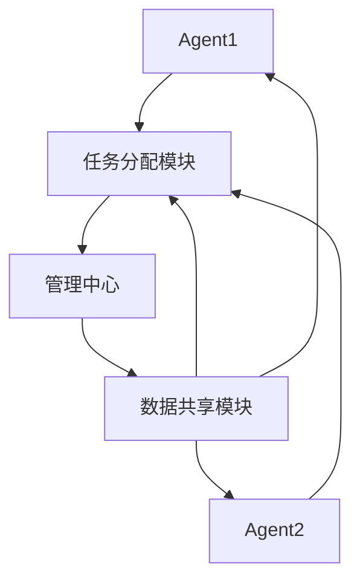

                 


# AI Agent的多智能体协作与竞争机制

> **关键词**: AI Agent, 多智能体系统, 协作机制, 竞争机制, 分布式算法, 机器学习, 竞争与协作

> **摘要**: 本文深入探讨了AI Agent在多智能体环境中的协作与竞争机制。通过分析协作和竞争的核心概念，比较了它们的特征和实现方式，并结合具体算法和系统架构设计，展示了如何在实际项目中实现这些机制。文章内容涵盖理论、算法实现和系统设计，适合技术从业者、研究人员以及对人工智能和多智能体系统感兴趣的读者阅读。

---

# 第1章: 引言

## 1.1 AI Agent的基本概念
AI Agent，即人工智能代理，是指在计算机系统中具有感知环境、自主决策和执行任务能力的实体。AI Agent能够通过传感器获取环境信息，并通过执行器与环境进行交互。

## 1.2 多智能体系统的发展历程
多智能体系统（Multi-Agent System，MAS）是由多个相互作用的智能体组成的系统。随着人工智能技术的发展，多智能体系统在分布式计算、机器人控制、游戏AI等领域得到了广泛应用。

## 1.3 协作与竞争机制的背景
在多智能体系统中，智能体之间的协作与竞争是实现复杂任务的关键。协作能够提高系统的整体效率，而竞争则能够激发个体的创造力和优化系统性能。

---

# 第2章: 多智能体协作机制

## 2.1 协作机制的原理
协作机制通过智能体之间的合作来实现共同目标。常见的协作方式包括任务分配、信息共享和协同决策。

## 2.2 分布式协作算法
分布式协作算法通过在多个智能体之间分配任务，实现协作目标。例如，基于分布式一致性算法（如Raft）的协作机制。

### 2.2.1 分布式协作算法的实现
使用Python实现一个简单的分布式协作算法，展示任务分配和信息共享的过程。

```python
def distributed_collaboration_task_assignment():
    # 初始化任务
    tasks = [1, 2, 3, 4, 5]
    agents = ['Agent1', 'Agent2', 'Agent3']
    
    # 分配任务
    import random
    assigned_tasks = {}
    for task in tasks:
        agent = random.choice(agents)
        if agent not in assigned_tasks:
            assigned_tasks[agent] = []
        assigned_tasks[agent].append(task)
    
    # 展示分配结果
    for agent, tasks in assigned_tasks.items():
        print(f"Agent {agent} assigned tasks: {tasks}")
```

## 2.3 协作机制的数学模型
协作机制的数学模型通常涉及任务分配和资源分配的优化问题。例如，基于线性规划的协作任务分配模型：

$$
\text{Minimize} \quad \sum_{i=1}^{n} c_i x_i \\
\text{Subject to} \quad \sum_{i=1}^{n} x_i = 1 \\
x_i \in \{0, 1\}
$$

其中，\( c_i \) 是任务 \( i \) 的成本，\( x_i \) 是任务分配变量。

---

# 第3章: 多智能体竞争机制

## 3.1 竞争机制的原理
竞争机制通过智能体之间的竞争来优化系统性能。常见的竞争方式包括资源争夺和策略对抗。

## 3.2 非合作博弈论
非合作博弈论通过分析智能体的策略选择，找到最优竞争策略。例如，纳什均衡是博弈论中的一个关键概念。

### 3.2.1 纳什均衡的定义
纳什均衡是指在博弈中，每个参与者的策略都是最优反应的情况下达到的一种稳定状态。

$$
\text{定义：} \quad (s_1^*, s_2^*, \dots, s_n^*) \text{是纳什均衡，当对于每个 } i, \ s_i^* \text{ 是在其他 } s_j^* \text{ 不变时的最优策略。}
$$

## 3.3 竞争机制的实现
基于非合作博弈论的竞争机制可以通过强化学习实现。例如，使用多智能体强化学习框架（如MADE）进行策略优化。

---

# 第4章: 协作与竞争机制的对比与综合

## 4.1 协作与竞争的特征对比
通过对比协作和竞争机制的特征，可以更好地理解它们的应用场景和优化方向。

| 特征                | 协作机制         | 竞争机制         |
|---------------------|------------------|------------------|
| 目标                | 共同完成任务     | 优化个体目标     |
| 信息共享            | 高               | 低               |
| 决策方式            | 协商与合作       | 独立决策与对抗   |
| 竞争策略            | 无               | 竞争策略          |
| 适用场景            | 团队协作任务     | 资源分配与优化   |

## 4.2 协作与竞争的综合分析
在实际应用中，协作与竞争机制可以结合使用，以实现系统的动态平衡。例如，在分布式系统中，智能体可以通过协作完成任务，同时通过竞争优化资源分配。

---

# 第5章: 算法实现

## 5.1 分布式协作算法的实现
通过Python代码实现一个简单的分布式协作算法，展示任务分配和信息共享的过程。

```python
def distributed_collaboration():
    import random
    tasks = [1, 2, 3, 4, 5]
    agents = ['A', 'B', 'C']
    
    assigned_tasks = {}
    for task in tasks:
        agent = random.choice(agents)
        if agent not in assigned_tasks:
            assigned_tasks[agent] = []
        assigned_tasks[agent].append(task)
    
    for agent, tasks in assigned_tasks.items():
        print(f"Agent {agent} has tasks: {tasks}")
```

## 5.2 竞争机制的实现
通过Python代码实现一个基于非合作博弈论的竞争机制，展示策略对抗和纳什均衡的实现。

```python
def nash_equilibrium_example():
    import numpy as np
    payoff_matrix = np.array([[3,1],[2,4]])
    print("纳什均衡分析：")
    print("Player 1的策略选择：行0或行1")
    print("Player 2的策略选择：列0或列1")
    print("纳什均衡在行1和列0，即 payoff_matrix[1][0] = 2")
```

---

# 第6章: 系统架构设计

## 6.1 系统功能设计
系统功能包括任务分配、信息共享、协同决策和竞争优化。

## 6.2 系统架构图
使用Mermaid图展示系统的架构设计。



---

# 第7章: 项目实战

## 7.1 环境安装
需要安装Python、numpy和mermaid相关库。

## 7.2 核心代码实现
实现一个多智能体协作与竞争系统的核心代码，包括任务分配和策略优化。

```python
def main():
    import random
    tasks = [1, 2, 3, 4, 5]
    agents = ['A', 'B', 'C']
    
    # 协作任务分配
    assigned_tasks = {}
    for task in tasks:
        agent = random.choice(agents)
        if agent not in assigned_tasks:
            assigned_tasks[agent] = []
        assigned_tasks[agent].append(task)
    
    # 竞争策略优化
    payoff_matrix = np.array([[3,1],[2,4]])
    nash_equilibrium = (1,0)
    print(f"纳什均衡点：{nash_equilibrium}")
    
    for agent, tasks in assigned_tasks.items():
        print(f"Agent {agent} has tasks: {tasks}")

if __name__ == "__main__":
    main()
```

## 7.3 实际案例分析
分析一个实际案例，展示协作与竞争机制的应用效果。

---

# 第8章: 总结与展望

## 8.1 总结
本文详细探讨了AI Agent在多智能体环境中的协作与竞争机制，结合理论分析和实际案例，展示了如何实现这些机制。

## 8.2 展望
未来的研究可以进一步探索协作与竞争机制的动态平衡，以及在分布式系统中的应用。

---

**作者：AI天才研究院 & 禅与计算机程序设计艺术**

