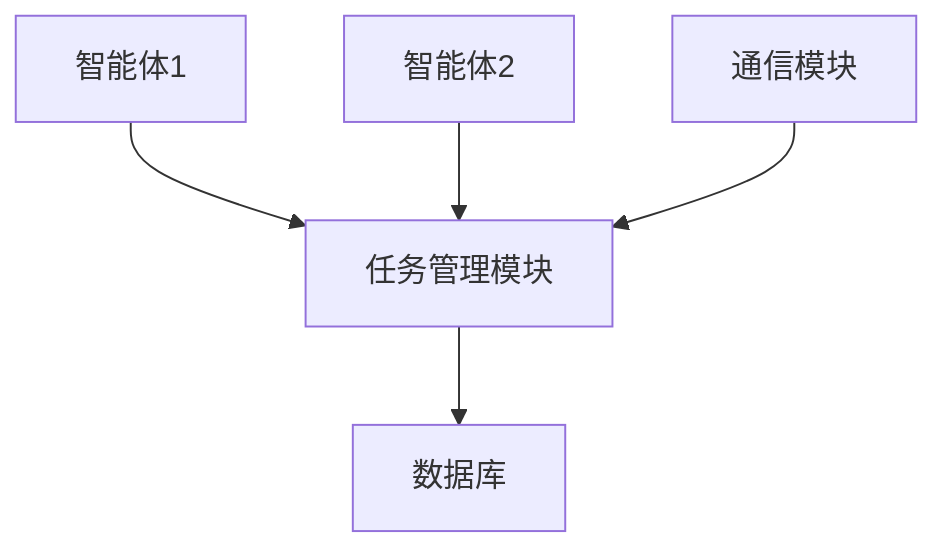

                 


# AI Agent的多智能体协作与通信机制

## 关键词：
AI Agent, 多智能体系统, 协作机制, 通信协议, 分布式算法, 系统架构

## 摘要：
本文深入探讨了AI Agent在多智能体协作与通信机制中的核心原理和实现方法。从基础概念到实际应用，详细分析了多智能体协作模型、通信协议设计、分布式算法实现、系统架构设计以及实际项目案例。通过理论与实践相结合，帮助读者全面理解并掌握AI Agent在多智能体环境中的协作与通信技术。

---

## 第一部分: AI Agent与多智能体系统基础

### 第1章: AI Agent的基本概念

#### 1.1 AI Agent的定义
AI Agent（智能体）是指在环境中能够感知并自主行动以实现目标的实体。它可以是一个软件程序、机器人或其他智能系统，具备以下核心特征：
- **自主性**：无需外部干预，自主决策。
- **反应性**：能够感知环境并实时响应。
- **目标导向**：所有行动基于目标驱动。
- **社交能力**：能够与其他智能体或人类进行交互。

#### 1.2 多智能体系统的发展历程
多智能体系统（MAS, Multi-Agent System）由多个智能体组成，通过协作完成复杂任务。其发展历程如下：
1. **单智能体阶段**：早期研究集中在单个智能体的决策与规划。
2. **多智能体协作阶段**：研究重点转向多个智能体之间的协作与通信。
3. **分布式智能阶段**：智能体在分布式环境中自主协作，实现复杂任务。

#### 1.3 多智能体协作与通信机制的重要性
在多智能体系统中，协作与通信机制是确保智能体高效协作的关键：
- **信息共享**：智能体通过通信机制共享信息，提升整体决策能力。
- **任务分配**：通信机制帮助智能体动态分配任务，提高系统效率。
- **动态适应**：通信机制允许智能体快速响应环境变化，保持系统稳定。

---

### 第2章: 多智能体协作的核心机制

#### 2.1 多智能体协作的基本模型
多智能体协作模型分为三类：
1. **基于规则的协作模型**：通过预定义规则实现协作，适用于简单任务。
2. **基于任务分解的协作模型**：将复杂任务分解为子任务，智能体协作完成。
3. **基于博弈论的协作模型**：通过博弈论优化协作策略，适用于竞争环境。

#### 2.2 多智能体协作的实现方法
实现协作的方法包括：
1. **基于规则的协作**：使用预定义规则，如“当检测到异常时，向主智能体报告”。
2. **基于学习的协作**：利用强化学习或机器学习模型动态调整协作策略。
3. **基于博弈论的协作**：通过纳什均衡等概念优化协作过程。

#### 2.3 多智能体协作中的挑战
协作面临的主要挑战：
1. **信息同步**：如何保证各智能体信息一致。
2. **冲突协调**：解决协作中的冲突与资源竞争。
3. **动态适应**：快速适应环境变化。

---

### 第3章: 多智能体通信机制的实现

#### 3.1 通信协议的设计原则
通信协议设计需考虑：
1. **实时性**：确保信息及时传递。
2. **可靠性**：信息传输必须准确无误。
3. **可扩展性**：适应不同规模的智能体系统。

#### 3.2 常见的通信协议与技术
常用的通信协议包括：
1. **基于消息队列的通信**：如 RabbitMQ，适用于异步通信。
2. **基于事件驱动的通信**：如 WebSocket，适用于实时交互。
3. **基于发布-订阅模式的通信**：如 MQTT，适用于分布式系统。

#### 3.3 通信机制的优化与性能提升
优化策略：
1. **减少延迟**：使用本地缓存和分布式数据库。
2. **提高可靠性**：通过冗余和负载均衡技术。
3. **提升带宽利用率**：采用数据压缩和协议优化。

---

## 第二部分: 分布式算法与实现

### 第4章: 分布式一致性算法

#### 4.1 分布式一致性问题
在分布式系统中，一致性问题至关重要。通过一致性算法确保各节点数据同步。

#### 4.2 常见一致性算法
1. **两阶段提交（2PC）**：用于保证分布式事务的一致性。
2. **三阶段提交（3PC）**：优化后的2PC，减少阻塞时间。
3. ** Paxos算法**：应用于大规模分布式系统。

#### 4.3 一致性算法的实现
以 Paxos 算法为例，其核心流程包括：
1. 提案者提出提案。
2. 参与者投票决定是否接受提案。
3. 提案者确认提案通过。

---

## 第三部分: 系统架构与设计

### 第5章: 系统架构设计

#### 5.1 系统功能设计
设计一个多智能体协作系统，需考虑：
1. **智能体管理**：注册、注销、状态管理。
2. **任务分配**：根据智能体能力和环境需求分配任务。
3. **通信管理**：管理通信协议和数据传输。

#### 5.2 系统架构图
以下是系统架构的 Mermaid 图：


#### 5.3 系统接口设计
主要接口包括：
1. `register_agent()`：注册智能体。
2. `deregister_agent()`：注销智能体。
3. `request_task()`：请求任务分配。
4. `send_message()`：发送消息。

---

## 第四部分: 项目实战

### 第6章: 项目实现

#### 6.1 环境配置
安装所需依赖：
```bash
pip install flask redis
```

#### 6.2 核心代码实现
以下是一个简单的任务分配模块代码：
```python
from flask import Flask
import redis

app = Flask(__name__)
redis_instance = redis.Redis(host='localhost', port=6379)

@app.route('/request_task', methods=['POST'])
def request_task():
    # 获取可用任务
    task = redis_instance.lpop('task_queue')
    if task:
        return f"Assigned task: {task.decode()}"
    else:
        return "No tasks available"

if __name__ == "__main__":
    app.run(debug=True)
```

#### 6.3 案例分析与解读
假设我们有一个物流配送系统，多个配送机器人协作完成订单配送。通过上述代码，每个机器人可以向任务管理模块请求任务，任务管理模块根据当前任务队列分配订单。

---

## 第五部分: 扩展内容

### 第7章: 前沿技术与未来趋势

#### 7.1 前沿技术
1. **联邦学习**：在保护数据隐私的前提下协作学习。
2. **边缘计算**：智能体在边缘设备上协作，减少中心依赖。

#### 7.2 未来趋势
随着AI技术进步，多智能体协作将更加智能化和自适应，应用领域将扩展至更多领域。

---

## 结语

AI Agent的多智能体协作与通信机制是实现分布式智能系统的核心。通过本文的系统介绍，读者可以全面理解相关理论与实现方法，并将其应用于实际项目中。未来，随着技术进步，多智能体协作将发挥更大作用。

---

## 作者

作者：AI天才研究院/AI Genius Institute & 禅与计算机程序设计艺术 /Zen And The Art of Computer Programming

