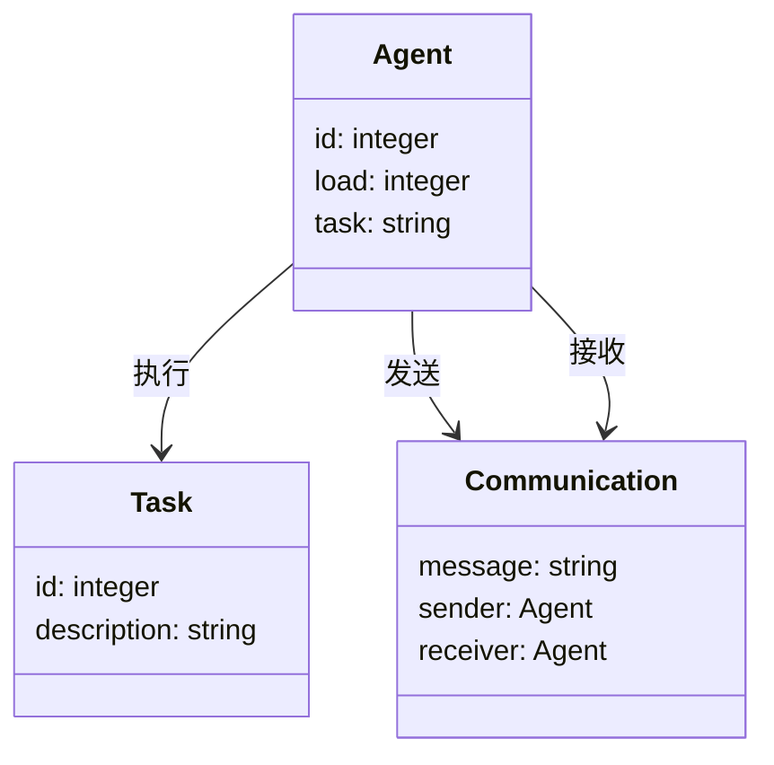
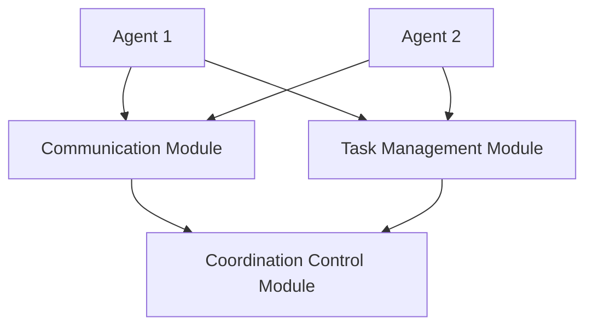
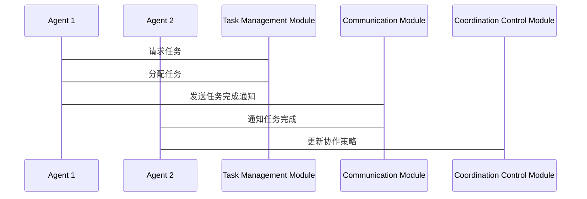

                 


# AI Agent的多智能体协作系统设计

> **关键词**: 多智能体协作系统, AI Agent, 分布式计算, 通信协议, 协作算法

> **摘要**: 本文深入探讨了AI Agent的多智能体协作系统设计，从基本概念到算法实现，再到系统架构，全面分析了多智能体协作系统的核心要素、协作机制和实现方法。文章通过详细的技术分析和案例研究，展示了如何在复杂动态环境中设计高效、可靠的多智能体协作系统。

---

# 第1章: AI Agent与多智能体协作系统概述

## 1.1 AI Agent的基本概念

### 1.1.1 AI Agent的定义与特点

AI Agent（人工智能代理）是指能够感知环境并采取行动以实现目标的智能实体。AI Agent的核心特点包括自主性（Autonomy）、反应性（Reactivity）、主动性（Proactivity）和社会性（Sociability）。自主性意味着AI Agent能够独立决策，而反应性和主动性则使其能够根据环境动态调整行为。社会性使得AI Agent能够与其他智能体或人类进行交互与协作。

### 1.1.2 多智能体协作的背景与意义

随着人工智能技术的快速发展，单个AI Agent的能力已不足以应对复杂的现实场景。多智能体协作系统通过多个智能体的协同工作，能够更好地完成复杂任务，提高系统的整体性能和灵活性。多智能体协作在分布式计算、机器人技术、游戏AI、自动驾驶等领域具有重要应用价值。

### 1.1.3 多智能体协作系统的应用领域

- **分布式计算**: 多智能体协作能够有效分配计算资源，提高系统效率。
- **机器人协作**: 在工业机器人和协作机器人中，多智能体协作能够实现高效的分工与协调。
- **游戏AI**: 多智能体协作技术广泛应用于游戏中的NPC行为控制和团队协作。
- **自动驾驶**: 多辆自动驾驶车辆可以通过协作实现交通优化和安全驾驶。

---

## 1.2 多智能体协作系统的核心要素

### 1.2.1 智能体的自主性与社会性

AI Agent的自主性使其能够在没有外部干预的情况下独立决策，而社会性则使其能够与其他智能体或人类进行有效通信与协作。这两个特性是多智能体协作系统的核心基础。

### 1.2.2 协作任务的定义与分解

协作任务需要明确每个智能体的职责和目标，并将其分解为多个子任务。任务分解的关键在于确保每个子任务能够被单个智能体高效完成，同时整体任务的完成需要多个智能体的协同配合。

### 1.2.3 系统的通信与协调机制

通信与协调机制是多智能体协作系统的核心，它决定了智能体之间如何交换信息、如何达成一致并采取行动。常见的通信机制包括基于消息传递和基于共享知识库的机制。

---

## 1.3 多智能体协作系统的分类

### 1.3.1 基于任务的协作分类

- **任务驱动型**: 系统的协作目标明确，智能体根据任务需求进行协作。
- **任务分解型**: 将复杂任务分解为多个子任务，由不同的智能体分别完成。

### 1.3.2 基于智能体类型的分类

- **同质型多智能体系统**: 系统中的智能体具有相似的功能和能力。
- **异质型多智能体系统**: 系统中的智能体具有不同的功能和能力，协作时需要考虑智能体之间的互补性。

### 1.3.3 基于通信机制的分类

- **集中式通信**: 所有智能体通过一个中心节点进行通信和协调。
- **分布式通信**: 智能体之间直接通信，无需中心节点。

---

## 1.4 本章小结

本章从AI Agent的基本概念出发，介绍了多智能体协作系统的背景、意义和应用领域。同时，详细阐述了多智能体协作系统的核心要素，包括智能体的自主性与社会性、协作任务的定义与分解，以及系统的通信与协调机制。最后，对多智能体协作系统进行了分类，为后续章节的分析奠定了基础。

---

# 第2章: 多智能体协作系统的背景与技术发展

## 2.1 多智能体协作系统的起源

### 2.1.1 多智能体系统的历史演变

多智能体系统起源于分布式人工智能（DAI）领域。早期的研究主要集中在如何通过多个智能体的协作来实现复杂的任务。随着计算能力的提升和AI技术的快速发展，多智能体协作系统逐渐从理论研究走向实际应用。

### 2.1.2 AI技术的快速发展对协作系统的影响

近年来，深度学习、强化学习等技术的快速发展为多智能体协作系统提供了新的可能性。智能体的学习能力和自适应能力的提升，使得多智能体协作系统能够更好地应对复杂动态环境。

---

## 2.2 当前多智能体协作系统的应用现状

### 2.2.1 在分布式系统中的应用

- **分布式计算**: 多智能体协作系统能够有效分配计算资源，提高系统的并行处理能力。
- **分布式数据库**: 多智能体协作系统可以用于分布式数据库的管理与优化。

### 2.2.2 在机器人协作中的应用

- **工业机器人**: 多智能体协作系统可以用于工业生产线上的机器人协作，实现高效的生产流程。
- **服务机器人**: 在服务机器人领域，多智能体协作系统可以用于多个机器人协同完成复杂任务。

### 2.2.3 在游戏AI中的应用

- **游戏AI**: 多智能体协作系统可以用于游戏中的NPC行为控制和团队协作，提高游戏的趣味性和挑战性。

---

## 2.3 多智能体协作系统的技术挑战

### 2.3.1 通信与协调的复杂性

在多智能体协作系统中，智能体之间的通信和协调是最大的挑战之一。如何设计高效的通信机制和协调算法，是实现高效协作的关键。

### 2.3.2 分布式计算的难点

分布式计算的复杂性主要体现在如何保证系统的高效性和一致性。在多智能体协作系统中，需要考虑网络延迟、节点故障等问题，确保系统的稳定运行。

### 2.3.3 动态环境下的适应性问题

多智能体协作系统需要能够适应动态变化的环境，包括任务目标的变化、智能体能力的变化等。如何设计自适应的协作机制，是当前研究的热点问题。

---

## 2.4 本章小结

本章回顾了多智能体协作系统的发展历程，分析了当前的应用现状，同时指出了系统面临的技术挑战。这些挑战包括通信与协调的复杂性、分布式计算的难点以及动态环境下的适应性问题。这些内容为后续章节的系统设计和算法实现提供了重要的参考。

---

# 第3章: 多智能体协作系统的核心概念与联系

## 3.1 多智能体协作系统的概念模型

### 3.1.1 实体关系分析

在多智能体协作系统中，主要涉及以下实体：

- **智能体**: 具有自主性、反应性和社会性的智能实体。
- **任务**: 需要通过多个智能体协作完成的目标。
- **通信协议**: 智能体之间进行信息交换的规则和机制。

### 3.1.2 系统功能模块划分

多智能体协作系统可以划分为以下几个功能模块：

- **任务分配模块**: 负责将整体任务分解为多个子任务，并分配给不同的智能体。
- **通信协议模块**: 负责智能体之间的信息交换和通信。
- **协作策略模块**: 负责制定和调整协作策略，确保系统的高效运行。

---

## 3.2 多智能体协作系统的ER实体关系图

以下是一个简单的ER实体关系图：

```mermaid
er
    actor: 智能体
    task: 任务
    communication: 通信协议
    role: 角色
    actor -[参与]-> task
    actor -[使用]-> communication
    actor -[扮演]-> role
```

---

## 3.3 多智能体协作系统的功能模块

### 3.3.1 任务分配模块

任务分配模块需要根据任务的特性和智能体的能力，将任务分解为多个子任务，并分配给不同的智能体。例如，一个复杂的任务可以被分解为多个子任务，每个子任务由一个或多个智能体完成。

### 3.3.2 通信协议模块

通信协议模块负责智能体之间的信息交换。常见的通信协议包括基于消息队列的通信和基于共享知识库的通信。例如，智能体可以通过消息队列发送任务完成的通知，或者通过共享知识库同步最新状态。

### 3.3.3 协作策略模块

协作策略模块负责制定和调整协作策略。例如，当环境发生变化时，协作策略模块需要调整智能体的分工和协作方式，以确保系统的高效运行。

---

## 3.4 核心概念对比分析

### 3.4.1 不同协作机制的对比

| 协作机制 | 描述 | 优点 | 缺点 |
|----------|------|------|------|
| 集中式协作 | 所有智能体通过中心节点进行协作 | 管理简单，易于协调 | 单点故障，通信延迟 |
| 分布式协作 | 智能体之间直接通信，无需中心节点 | 去中心化，通信延迟低 | 管理复杂，容易出现冲突 |

### 3.4.2 不同通信协议的优缺点

| 通信协议 | 描述 | 优点 | 缺点 |
|----------|------|------|------|
| 基于消息队列 | 通过消息队列进行通信 | 实时性高，易于实现 | 通信可靠性差 |
| 基于共享知识库 | 通过共享知识库进行同步 | 数据一致性好 | 数据同步延迟高 |

### 3.4.3 不同任务分配算法的性能对比

| 任务分配算法 | 描述 | 优点 | 缺点 |
|--------------|------|------|------|
| 基于负载均衡 | 根据智能体的负载分配任务 | 负载均衡，效率高 | 适应性差 |
| 基于能力匹配 | 根据智能体的能力分配任务 | 任务完成质量高 | 实时性差 |

---

## 3.5 本章小结

本章详细分析了多智能体协作系统的核心概念与联系，包括实体关系、功能模块划分以及不同协作机制和通信协议的对比。通过对核心概念的深入分析，为后续章节的系统设计和算法实现奠定了坚实的基础。

---

# 第4章: 多智能体协作系统的算法原理

## 4.1 多智能体协作算法概述

### 4.1.1 基于分布式计算的协作算法

基于分布式计算的协作算法强调智能体之间的分布式协作，通过局部决策实现全局目标。例如，分布式任务分配算法可以通过局部信息实现任务的动态分配。

### 4.1.2 基于集中式计算的协作算法

基于集中式计算的协作算法通过中心节点统一协调智能体的协作。例如，集中式任务分配算法可以通过中心节点将任务分配给不同的智能体。

### 4.1.3 基于混合式计算的协作算法

基于混合式计算的协作算法结合了分布式和集中式计算的优点，通过部分集中化的方式实现高效的协作。例如，混合式协作算法可以通过中心节点进行任务分配，同时通过分布式通信实现智能体之间的实时协作。

---

## 4.2 多智能体协作算法的数学模型

### 4.2.1 分布式协作算法的数学表达

分布式协作算法的数学模型通常涉及多个智能体的局部决策和全局目标的优化。例如，分布式任务分配算法可以通过以下公式表示：

$$f(x) = \sum_{i=1}^{n} f_i(x_i)$$

其中，$f(x)$表示全局目标函数，$f_i(x_i)$表示智能体i的局部目标函数。

### 4.2.2 集中式协作算法的数学表达

集中式协作算法的数学模型通常涉及中心节点对智能体的统一协调。例如，集中式任务分配算法可以通过以下公式表示：

$$y = \arg\min_{y \in Y} \sum_{i=1}^{n} c_i y_i$$

其中，$y$表示最优任务分配方案，$c_i$表示智能体i的协作成本。

---

## 4.3 多智能体协作算法的实现步骤

### 4.3.1 算法实现步骤

1. **任务分解**: 将整体任务分解为多个子任务。
2. **智能体分配**: 根据智能体的能力和负载，将子任务分配给不同的智能体。
3. **通信与协调**: 智能体之间通过通信协议进行信息交换，确保协作的顺利进行。
4. **动态调整**: 根据环境的变化和智能体的反馈，动态调整协作策略。

---

## 4.4 算法实现的Python代码示例

以下是一个简单的多智能体协作算法的Python代码示例：

```python
import random

class Agent:
    def __init__(self, id):
        self.id = id
        self.load = 0
        self.task = None

    def assign_task(self, task):
        self.task = task
        self.load += 1

    def complete_task(self):
        self.task = None
        self.load -= 1

def distributed_collaboration_agents(agents, tasks):
    # 任务分配
    for task in tasks:
        # 随机选择一个智能体分配任务
        agent = random.choice(agents)
        agent.assign_task(task)
    
    # 任务完成
    for agent in agents:
        if agent.task:
            agent.complete_task()

    return

# 示例运行
agents = [Agent(1), Agent(2), Agent(3)]
tasks = ["Task1", "Task2", "Task3"]
distributed_collaboration_agents(agents, tasks)
```

---

## 4.5 本章小结

本章详细介绍了多智能体协作系统的算法原理，包括分布式、集中式和混合式协作算法的数学模型和实现步骤。通过对算法的深入分析，为后续章节的系统设计和实现提供了理论基础。

---

# 第5章: 多智能体协作系统的系统分析与架构设计

## 5.1 问题场景介绍

在多智能体协作系统中，通常需要解决以下问题：

- **任务分配**: 如何将整体任务分解为多个子任务，并分配给不同的智能体。
- **通信与协调**: 如何保证智能体之间的高效通信和协调。
- **动态适应**: 如何应对环境变化和智能体能力变化，动态调整协作策略。

---

## 5.2 系统功能设计

### 5.2.1 领域模型类图

以下是一个简单的领域模型类图：



### 5.2.2 系统功能模块

- **任务管理模块**: 负责任务的分解、分配和跟踪。
- **通信模块**: 负责智能体之间的信息交换。
- **协作控制模块**: 负责协作策略的制定和调整。

---

## 5.3 系统架构设计

### 5.3.1 系统架构图

以下是一个简单的系统架构图：



### 5.3.2 接口设计

- **任务管理接口**: 提供任务分解、分配和跟踪的功能。
- **通信接口**: 提供智能体之间信息交换的功能。
- **协作控制接口**: 提供协作策略制定和调整的功能。

---

## 5.4 系统交互序列图

以下是一个系统的交互序列图：



---

## 5.5 本章小结

本章从问题场景出发，详细分析了多智能体协作系统的功能设计和系统架构。通过对领域模型类图、系统架构图和交互序列图的分析，为后续章节的系统实现提供了具体的指导。

---

# 第6章: 多智能体协作系统的项目实战

## 6.1 环境安装与配置

### 6.1.1 环境需求

- **操作系统**: Linux/Windows/MacOS
- **Python版本**: Python 3.6+
- **依赖库**: Python的asyncio库、numpy库、pandas库等。

### 6.1.2 安装步骤

1. 安装Python和必要的依赖库。
2. 安装多智能体协作系统所需的框架和工具。
3. 配置开发环境，例如PyCharm或Jupyter Notebook。

---

## 6.2 系统核心代码实现

### 6.2.1 任务管理模块代码

```python
import asyncio

class TaskManager:
    def __init__(self):
        self.tasks = []

    def add_task(self, task):
        self.tasks.append(task)

    def assign_task(self, agent, task):
        agent.assign_task(task)

    def complete_task(self, agent):
        agent.complete_task()
```

### 6.2.2 通信模块代码

```python
class CommunicationModule:
    def __init__(self):
        self.messages = []

    def send_message(self, sender, receiver, message):
        self.messages.append((sender, receiver, message))

    def receive_message(self, receiver):
        messages = [msg for msg in self.messages if msg.receiver == receiver]
        self.messages = [msg for msg in self.messages if msg.receiver != receiver]
        return messages
```

### 6.2.3 协作控制模块代码

```python
class CollaborationControlModule:
    def __init__(self):
        self.agents = []
        self.tasks = []

    def add_agent(self, agent):
        self.agents.append(agent)

    def add_task(self, task):
        self.tasks.append(task)

    def assign_tasks(self):
        for agent in self.agents:
            if self.tasks:
                task = self.tasks.pop(0)
                agent.assign_task(task)
```

---

## 6.3 实际案例分析与代码解读

### 6.3.1 案例分析

假设我们有一个包含三个智能体和三个任务的多智能体协作系统。我们需要通过任务管理模块、通信模块和协作控制模块来实现任务的分配与协作。

### 6.3.2 代码实现

```python
# 初始化智能体
agent1 = Agent(1)
agent2 = Agent(2)
agent3 = Agent(3)

# 初始化任务管理模块
task_manager = TaskManager()
task_manager.add_task("Task1")
task_manager.add_task("Task2")
task_manager.add_task("Task3")

# 初始化通信模块
communication = CommunicationModule()

# 初始化协作控制模块
collaboration_control = CollaborationControlModule()
collaboration_control.add_agent(agent1)
collaboration_control.add_agent(agent2)
collaboration_control.add_agent(agent3)

# 分配任务
collaboration_control.add_task("Task1")
collaboration_control.add_task("Task2")
collaboration_control.add_task("Task3")
collaboration_control.assign_tasks()

# 智能体完成任务
agent1.complete_task()
agent2.complete_task()
agent3.complete_task()
```

---

## 6.4 项目小结

本章通过实际案例分析和代码实现，展示了多智能体协作系统的具体实现过程。通过任务管理模块、通信模块和协作控制模块的协作，实现了任务的分配与协作。这些代码和案例为读者提供了实际的参考和指导。

---

# 第7章: 多智能体协作系统的优化与扩展

## 7.1 系统优化策略

### 7.1.1 通信优化

- **减少通信开销**: 通过优化通信协议和减少不必要的信息交换，降低通信开销。
- **提高通信效率**: 通过采用高效的通信机制，如基于事件的通信，提高通信效率。

### 7.1.2 协作策略优化

- **动态调整策略**: 根据环境的变化和智能体的反馈，动态调整协作策略。
- **提高协作效率**: 通过优化协作算法，提高协作效率和系统的整体性能。

---

## 7.2 系统扩展方向

### 7.2.1 多智能体协作系统的可扩展性

- **扩展智能体数量**: 系统需要能够支持更多的智能体。
- **扩展任务规模**: 系统需要能够处理更大的任务规模。

### 7.2.2 多智能体协作系统的智能化

- **增强学习**: 通过强化学习等技术，提高智能体的协作智能。
- **自适应协作**: 系统需要能够自适应地调整协作策略。

---

## 7.3 本章小结

本章分析了多智能体协作系统的优化策略和扩展方向。通过优化通信和协作策略，可以提高系统的效率和性能。同时，系统的扩展性和智能化也是未来研究的重要方向。

---

# 第8章: 总结与展望

## 8.1 本章总结

本文系统地探讨了AI Agent的多智能体协作系统设计，从基本概念到算法实现，再到系统架构，全面分析了多智能体协作系统的核心要素、协作机制和实现方法。通过实际案例分析和代码实现，展示了系统的具体实现过程。

---

## 8.2 未来展望

随着人工智能技术的不断发展，多智能体协作系统将面临更多的挑战和机遇。未来的研究方向包括：

1. **智能体的自适应能力**: 如何使智能体能够更好地适应动态变化的环境。
2. **协作算法的优化**: 如何设计更高效的协作算法，提高系统的整体性能。
3. **多智能体协作系统的智能化**: 如何通过强化学习等技术，提高智能体的协作智能。

---

# 作者

**作者：AI天才研究院/AI Genius Institute & 禅与计算机程序设计艺术 /Zen And The Art of Computer Programming**

