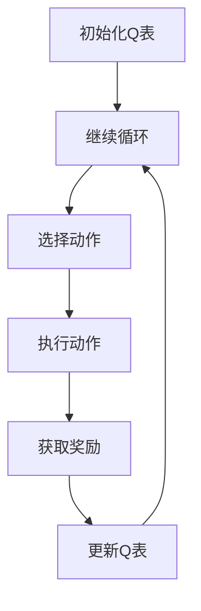
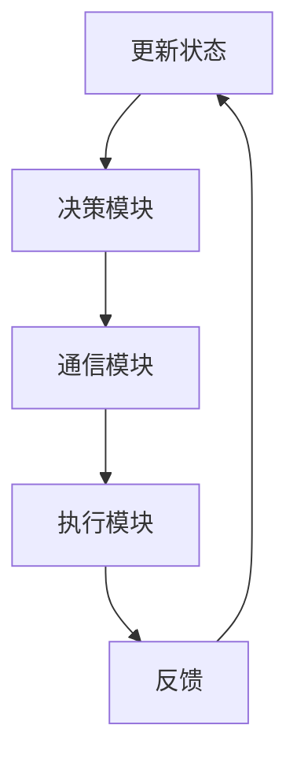
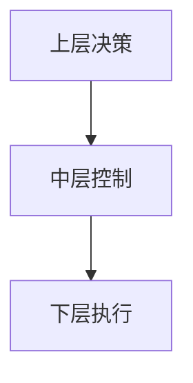
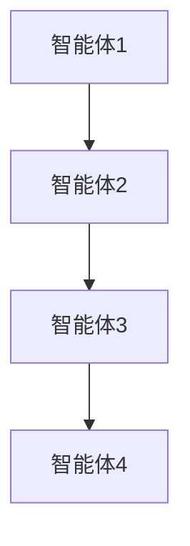

                 


# AI Agent的多智能体协同决策机制

**关键词**：多智能体，协同决策，AI Agent，Q-learning，DQN，算法，系统架构

**摘要**：  
本文深入探讨了AI Agent在多智能体系统中的协同决策机制。从基础概念到高级算法，从系统架构到实际应用，系统性地分析了多智能体协同决策的核心原理、实现方法和应用场景。通过详细讲解基于Q-learning和DQN的多智能体决策算法，结合实际案例和系统设计，为读者提供了全面的技术指导和实践参考。

---

## 第1章: AI Agent与多智能体系统概述

### 1.1 AI Agent的基本概念

#### 1.1.1 什么是AI Agent
AI Agent（智能体）是指能够感知环境并采取行动以实现目标的实体。Agent可以是软件程序、机器人或其他智能系统。AI Agent的核心特征包括自主性、反应性、目标导向性和社会能力。

#### 1.1.2 AI Agent的分类与特点
AI Agent可以根据智能水平分为以下几类：
- **反应式Agent**：基于当前感知做出反应，不依赖内部状态。
- **认知式Agent**：具备复杂推理和规划能力，能够处理不确定性。
- **学习式Agent**：能够通过经验改进性能。
- **协作式Agent**：与其他Agent或人类协同完成任务。

#### 1.1.3 多智能体系统的基本概念
多智能体系统是指由多个智能体组成的分布式系统，这些智能体通过协作与竞争完成共同目标。多智能体系统的关键特征包括分布式性、协作性、动态性和复杂性。

---

### 1.2 多智能体协同决策的背景与意义

#### 1.2.1 多智能体系统的发展历程
多智能体系统的发展经历了从简单协作到复杂协同的演变。早期的多智能体系统主要用于分布式计算和机器人控制，近年来随着AI技术的进步，多智能体系统在自动驾驶、智能城市和游戏AI等领域得到了广泛应用。

#### 1.2.2 协同决策的定义与重要性
协同决策是指多个智能体通过信息共享和策略协作，共同制定最优决策的过程。其重要性体现在以下几点：
- 提高决策效率。
- 实现复杂任务的分解与协同。
- 应对动态环境中的不确定性。

#### 1.2.3 当前研究与应用的热点
当前，多智能体协同决策的研究热点包括：
- 基于强化学习的多智能体协作。
- 多智能体系统中的通信与协调。
- 多智能体系统中的安全与隐私保护。

---

## 第2章: 多智能体协同决策的核心机制

### 2.1 分布式计算与多智能体系统

#### 2.1.1 分布式计算的基本概念
分布式计算是指将任务分解为多个部分，分别在不同的计算节点上执行，最终将结果汇总。多智能体系统与分布式计算密切相关，但其核心在于智能体之间的协作与决策。

#### 2.1.2 多智能体系统与分布式计算的关系
多智能体系统可以看作是一种特殊的分布式系统，其中每个智能体都是一个独立的计算节点，具备自主决策能力。

---

### 2.2 协作与竞争的平衡

#### 2.2.1 协作机制的定义
协作机制是指多个智能体之间通过共享信息和策略，共同完成任务的过程。

#### 2.2.2 竞争机制的定义
竞争机制是指多个智能体在资源受限的环境中，通过竞争获取最优结果的过程。

#### 2.2.3 协作与竞争的动态平衡
在多智能体系统中，协作与竞争是动态平衡的。智能体需要在协作中寻求最优解，同时在竞争中保持个体利益。

---

## 第3章: 基于Q-learning的多智能体决策算法

### 3.1 Q-learning算法的基本原理

#### 3.1.1 Q-learning的定义
Q-learning是一种基于值函数的强化学习算法，通过更新Q值表来学习最优策略。

#### 3.1.2 Q-learning的核心公式
$$ Q(s, a) = Q(s, a) + \alpha \left( r + \gamma \max Q(s', a') - Q(s, a) \right) $$
其中：
- \( Q(s, a) \)：当前状态 \( s \) 下采取动作 \( a \) 的价值。
- \( \alpha \)：学习率。
- \( r \)：奖励。
- \( \gamma \)：折扣因子。
- \( Q(s', a') \)：下一个状态 \( s' \) 下的最大价值。

#### 3.1.3 Q-learning的实现步骤
1. 初始化Q值表。
2. 环境反馈当前状态和奖励。
3. 更新Q值表。
4. 重复步骤，直到收敛。

#### 3.1.4 Q-learning的流程图


---

### 3.2 多智能体Q-learning的扩展

#### 3.2.1 多智能体Q-learning的挑战
- 状态空间的扩展。
- 动作空间的复杂性。
- 智能体之间的信息共享。

#### 3.2.2 多智能体Q-learning的改进方法
- 分层Q-learning。
- 协作Q-learning。
- 联合Q-learning。

#### 3.2.3 多智能体Q-learning的实现案例
以下是一个简单的多智能体Q-learning实现代码：
```python
import numpy as np

class MultiAgentQLearning:
    def __init__(self, num_agents, state_space, action_space):
        self.num_agents = num_agents
        self.Q = np.zeros((state_space, action_space))
        
    def choose_action(self, state):
        if np.random.rand() < 0.5:
            return np.argmax(self.Q[state])
        else:
            return np.random.randint(self.Q.shape[1])
            
    def update_Q(self, state, action, reward):
        self.Q[state, action] += 0.1 * (reward + 0.95 * np.max(self.Q[state]) - self.Q[state, action])
```

---

## 第4章: 基于DQN的多智能体协同决策

### 4.1 DQN算法的基本原理

#### 4.1.1 DQN的定义
DQN（Deep Q-Network）是一种基于深度神经网络的强化学习算法，通过经验回放和目标网络来稳定训练过程。

#### 4.1.2 DQN的核心公式
$$ Q(s, a) = Q(s, a) + \alpha \left( r + \gamma Q(s', a') - Q(s, a) \right) $$

#### 4.1.3 DQN的实现步骤
1. 初始化经验回放池。
2. 选择动作并执行。
3. 记录经验。
4. 更新目标网络。
5. 重复步骤，直到收敛。

---

### 4.2 多智能体DQN的实现

#### 4.2.1 多智能体DQN的挑战
- 状态空间的扩展。
- 动作空间的复杂性。
- 智能体之间的信息共享。

#### 4.2.2 多智能体DQN的改进方法
- 分层DQN。
- 协作DQN。
- 联合DQN。

#### 4.2.3 多智能体DQN的实现案例
以下是一个简单的多智能体DQN实现代码：
```python
import torch
import torch.nn as nn

class DQN(nn.Module):
    def __init__(self, input_dim, output_dim):
        super(DQN, self).__init__()
        self.fc1 = nn.Linear(input_dim, 64)
        self.fc2 = nn.Linear(64, output_dim)
        
    def forward(self, x):
        x = torch.relu(self.fc1(x))
        return self.fc2(x)
```

---

## 第5章: 多智能体协同决策系统的架构设计

### 5.1 系统功能需求分析

#### 5.1.1 系统功能模块划分
- 状态感知模块。
- 决策模块。
- 通信模块。
- 执行模块。

#### 5.1.2 系统功能流程图


---

### 5.2 系统架构设计

#### 5.2.1 分层架构设计


#### 5.2.2 微服务架构设计


---

## 第6章: 项目实战——多智能体协同决策在智能交通系统中的应用

### 6.1 环境安装
- 安装Python和相关库（如numpy、torch）。
- 安装DQN和Q-learning库。

### 6.2 系统核心实现源代码
```python
import numpy as np
import torch
import torch.nn as nn

class DQN(nn.Module):
    def __init__(self, input_dim, output_dim):
        super(DQN, self).__init__()
        self.fc1 = nn.Linear(input_dim, 64)
        self.fc2 = nn.Linear(64, output_dim)
        
    def forward(self, x):
        x = torch.relu(self.fc1(x))
        return self.fc2(x)

class MultiAgentTrafficSystem:
    def __init__(self, num_agents, state_space, action_space):
        self.num_agents = num_agents
        self.Q = [DQN(state_space, action_space) for _ in range(num_agents)]
        
    def choose_action(self, state, agent_id):
        with torch.no_grad():
            return self.Q[agent_id](state).argmax().item()
            
    def update_Q(self, state, action, reward, agent_id):
        optimizer = torch.optim.Adam(self.Q[agent_id].parameters())
        optimizer.zero_grad()
        target = reward + 0.95 * torch.max(self.Q[agent_id](state)).item()
        loss = torch.nn.MSELoss()(self.Q[agent_id](state)[action], torch.tensor(target))
        loss.backward()
        optimizer.step()
```

### 6.3 案例分析与详细解读
通过上述代码实现一个简单的多智能体交通系统，展示如何通过DQN算法实现智能体之间的协同决策。

---

## 第7章: 最佳实践与总结

### 7.1 最佳实践 tips
- 合理选择算法和架构。
- 确保智能体之间的通信效率。
- 定期更新和优化模型。

### 7.2 小结
本文系统性地探讨了AI Agent的多智能体协同决策机制，从理论到实践，为读者提供了全面的技术指导。

### 7.3 注意事项
- 多智能体系统的设计需要综合考虑协作与竞争。
- 确保系统的可扩展性和可维护性。

### 7.4 拓展阅读
- 《Multi-Agent Systems: Complexity and Coordination》
- 《Deep Reinforcement Learning for Multi-Agent Systems》

---

**作者：AI天才研究院/AI Genius Institute & 禅与计算机程序设计艺术 /Zen And The Art of Computer Programming**

---

这篇文章通过详细讲解多智能体协同决策的理论、算法和实践，为读者提供了全面的技术指导。希望对您理解AI Agent的多智能体协同决策机制有所帮助！

