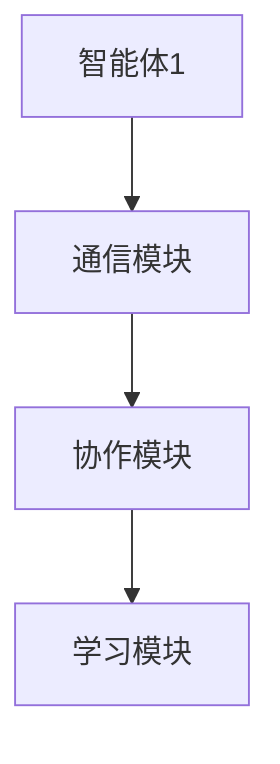

                 


# AI Agent的多智能体协同学习机制

> 关键词：AI Agent，多智能体协同学习，分布式优化，协作机制，强化学习

> 摘要：本文系统地探讨了AI Agent在多智能体协同学习中的核心机制。从基本概念到算法实现，再到系统设计与实战案例，全面分析了多智能体协同学习的理论基础、算法原理及应用场景。通过本文，读者将深入了解如何设计和实现高效的多智能体协同学习系统，并掌握其在实际项目中的应用技巧。

---

# 第一部分: AI Agent的多智能体协同学习机制概述

## 第1章: AI Agent的基本概念与背景

### 1.1 AI Agent的定义与特点

#### 1.1.1 AI Agent的定义
AI Agent（人工智能代理）是指能够感知环境、自主决策并执行任务的智能实体。与传统程序不同，AI Agent具备以下特点：
- **自主性**：能够在没有外部干预的情况下独立运作。
- **反应性**：能够根据环境变化动态调整行为。
- **目标导向性**：基于目标驱动决策和行动。
- **学习能力**：能够通过经验改进性能。

#### 1.1.2 AI Agent的核心特点
AI Agent的核心特点可以总结为：
1. **自主性**：AI Agent能够独立决策，无需外部控制。
2. **社会性**：能够与其他智能体或人类进行交互和协作。
3. **适应性**：能够根据环境变化自适应调整行为。
4. **学习能力**：通过经验改进性能，实现自我优化。

#### 1.1.3 AI Agent与传统智能体的区别
AI Agent与传统智能体的主要区别在于其智能性和自主性：
- **传统智能体**：通常是指简单的程序或自动化系统，缺乏自主决策能力。
- **AI Agent**：具备感知、决策、学习和自适应能力，能够处理复杂任务。

### 1.2 多智能体系统的发展历程

#### 1.2.1 多智能体系统的起源
多智能体系统（Multi-Agent System, MAS）的概念起源于20世纪80年代，最初的研究集中在分布式计算和分布式问题求解。

#### 1.2.2 多智能体系统的主要发展阶段
1. **早期阶段（20世纪80年代-90年代初）**：研究重点是分布式问题求解和多智能体协作。
2. **发展阶段（20世纪90年代末-2010年）**：研究开始关注多智能体系统中的通信、协作和学习机制。
3. **当前阶段（2010年至今）**：随着人工智能技术的进步，多智能体系统的研究进入快速发展阶段，特别是在强化学习和分布式优化领域。

#### 1.2.3 当前多智能体系统的研究热点
- **强化学习**：如何在多智能体环境中实现高效协作。
- **分布式优化**：如何在分布式系统中实现全局最优。
- **人机协作**：如何实现人与智能体之间的高效协作。

### 1.3 协同学习机制的背景与意义

#### 1.3.1 协同学习的基本概念
协同学习是指多个智能体通过协作共同完成任务的过程。其核心在于智能体之间的信息共享和协作策略。

#### 1.3.2 协同学习在多智能体系统中的作用
- **提高效率**：通过协作，多个智能体可以更高效地完成任务。
- **增强智能**：智能体之间的协作可以弥补单个智能体的不足。
- **适应复杂环境**：通过协作，智能体能够更好地适应复杂动态环境。

#### 1.3.3 协同学习机制的应用场景
- **分布式计算**：如分布式优化、分布式任务分配。
- **机器人协作**：如多机器人协作完成任务。
- **自动驾驶**：如自动驾驶汽车之间的协作。

### 1.4 本章小结
本章从AI Agent的基本概念出发，介绍了多智能体系统的发展历程，重点分析了协同学习机制的背景与意义，为后续章节的深入讨论奠定了基础。

---

# 第二部分: 多智能体协同学习的核心机制

## 第2章: 多智能体协同学习的基本原理

### 2.1 多智能体系统中的通信与协作

#### 2.1.1 智能体之间的通信协议
通信协议是智能体之间协作的基础。常见的通信协议包括：
- **基于消息的通信**：通过消息传递信息。
- **基于状态的通信**：通过共享状态实现协作。
- **基于意图的通信**：通过意图传递协作信息。

#### 2.1.2 协作任务的分配策略
任务分配是多智能体协作中的关键问题。常用的任务分配策略包括：
- **基于角色分配**：根据智能体的能力分配任务。
- **基于目标分配**：根据任务目标分配智能体。
- **动态分配**：根据环境变化动态调整任务分配。

#### 2.1.3 信息共享机制
信息共享机制是实现协作的关键。常见的信息共享机制包括：
- **完全共享**：所有智能体共享所有信息。
- **部分共享**：智能体仅共享部分信息。
- **动态共享**：根据需要动态调整共享信息。

### 2.2 协同学习的目标与挑战

#### 2.2.1 协同学习的目标函数
协同学习的目标函数通常包括：
- **全局目标**：整个系统的目标。
- **局部目标**：单个智能体的目标。
- **协调目标**：智能体之间协作的目标。

#### 2.2.2 多智能体协同学习中的主要挑战
- **通信开销**：智能体之间的通信可能带来额外的开销。
- **同步问题**：智能体之间的协作需要同步。
- **博弈冲突**：智能体之间的博弈可能导致冲突。

#### 2.2.3 协同学习与博弈论的关系
博弈论是研究智能体之间协作的重要工具。博弈论中的概念如Nash均衡、囚徒困境等在多智能体协同学习中具有重要应用。

### 2.3 多智能体协同学习的数学模型

#### 2.3.1 协同学习的数学表达式
协同学习的数学模型可以表示为：
$$
J = \sum_{i=1}^N J_i
$$
其中，\( J \) 是全局目标函数，\( J_i \) 是第\( i \)个智能体的目标函数。

#### 2.3.2 协同学习的优化目标
协同学习的优化目标通常包括：
- **全局最优**：整个系统的目标函数最优。
- **局部最优**：每个智能体的目标函数最优。
- **均衡状态**：智能体之间的博弈达到均衡。

#### 2.3.3 协同学习的收敛性分析
协同学习的收敛性分析是研究其数学模型的重要内容。常见的收敛性分析方法包括：
- **Lyapunov函数分析**
- **梯度下降分析**
- **博弈论分析**

### 2.4 本章小结
本章从多智能体系统中的通信与协作出发，分析了协同学习的目标与挑战，介绍了协同学习的数学模型及其收敛性分析。

---

# 第三部分: 多智能体协同学习的算法与实现

## 第3章: 多智能体强化学习算法

### 3.1 多智能体强化学习的基本原理

#### 3.1.1 多智能体强化学习的定义
多智能体强化学习（Multi-Agent Reinforcement Learning, MARL）是指多个智能体通过强化学习协作完成任务的过程。

#### 3.1.2 多智能体强化学习的核心算法
- **Q-learning**：基于Q值的学习算法。
- **DQN（Deep Q-Network）**：深度强化学习算法。
- **Multi-Agent DQN**：多智能体深度强化学习算法。

#### 3.1.3 多智能体强化学习与单智能体强化学习的区别
多智能体强化学习的核心区别在于：
- **多个智能体**：多个智能体协作完成任务。
- **通信机制**：智能体之间可以通信。
- **协作目标**：协作完成全局目标。

### 3.2 基于分布式优化的协同学习算法

#### 3.2.1 分布式优化的基本原理
分布式优化是指在分布式系统中优化全局目标函数。

#### 3.2.2 分布式优化在协同学习中的应用
- **分布式梯度下降**：通过分布式计算实现梯度下降。
- **分布式拉格朗日乘数法**：通过拉格朗日乘数法实现分布式优化。
- **分布式ADMM**：通过交替方向乘子法实现分布式优化。

#### 3.2.3 分布式优化算法的收敛性分析
- **收敛性证明**：证明算法的收敛性。
- **收敛速度分析**：分析算法的收敛速度。
- **鲁棒性分析**：分析算法的鲁棒性。

### 3.3 基于博弈论的协作机制

#### 3.3.1 博弈论在多智能体协同学习中的应用
- **Nash均衡**：博弈论中的核心概念。
- **协调博弈**：智能体之间通过博弈实现协调。

#### 3.3.2 Nash均衡与协作学习的关系
Nash均衡是协作学习中的一个重要概念，表示多个智能体在博弈中达到的一种稳定状态。

#### 3.3.3 基于博弈论的协作算法
- **纳什均衡算法**：通过计算Nash均衡实现协作。
- **协调博弈算法**：通过协调博弈实现协作。

---

# 第四部分: 多智能体协同学习的系统架构设计

## 第4章: 系统架构设计与实现

### 4.1 问题场景介绍
本章以一个多智能体协作任务为背景，介绍系统设计的需求。

### 4.2 系统功能设计

#### 4.2.1 系统功能模块划分
- **通信模块**：实现智能体之间的通信。
- **协作模块**：实现智能体之间的协作。
- **学习模块**：实现强化学习和分布式优化。

#### 4.2.2 系统功能流程图


### 4.3 系统架构设计

#### 4.3.1 系统架构图


### 4.4 系统接口设计

#### 4.4.1 系统接口定义
- **通信接口**：智能体之间的通信接口。
- **协作接口**：智能体之间的协作接口。
- **学习接口**：强化学习和分布式优化接口。

#### 4.4.2 接口交互流程图


### 4.5 系统交互设计

#### 4.5.1 系统交互流程图


---

# 第五部分: 项目实战

## 第5章: 项目实战与应用

### 5.1 环境搭建

#### 5.1.1 环境需求
- **Python**：编程语言。
- **TensorFlow**：深度学习框架。
- **OpenAI Gym**：强化学习环境。

### 5.2 核心代码实现

#### 5.2.1 多智能体强化学习代码
```python
import numpy as np
import gym

class Agent:
    def __init__(self, action_space):
        self.action_space = action_space
        self.q_table = np.zeros([64, action_space.n])
    
    def act(self, observation):
        return self.q_table[observation]
    
    def learn(self, observation, action, reward):
        self.q_table[observation] = reward

def main():
    env = gym.make('CartPole-v0')
    agent = Agent(env.action_space)
    
    for _ in range(1000):
        observation = env.reset()
        done = False
        while not done:
            action = agent.act(observation)
            next_observation, reward, done, info = env.step(action)
            agent.learn(observation, action, reward)
    
if __name__ == "__main__":
    main()
```

#### 5.2.2 分布式优化代码
```python
import numpy as np
from concurrent.futures import ThreadPoolExecutor

def distributed_optimization():
    executor = ThreadPoolExecutor()
    futures = []
    for i in range(8):
        futures.append(executor.submit(optimize, i))
    for future in futures:
        future.result()

def optimize(agent_id):
    model = get_model()
    optimizer = get_optimizer()
    for epoch in range(100):
        data = generate_data(agent_id)
        optimizer.minimize(loss, data)

distributed_optimization()
```

### 5.3 案例分析与代码解读

#### 5.3.1 多智能体强化学习案例
上述代码实现了一个简单的多智能体强化学习算法，通过Q-learning实现CartPole环境中的平衡杆任务。

#### 5.3.2 分布式优化案例
上述代码实现了一个简单的分布式优化算法，通过多线程实现模型优化。

### 5.4 项目总结
本章通过具体案例展示了多智能体协同学习的实现过程，从环境搭建到核心代码实现，再到案例分析，帮助读者更好地理解多智能体协同学习的实现细节。

---

# 第六部分: 总结与展望

## 第6章: 总结与展望

### 6.1 本章总结
本文系统地探讨了AI Agent的多智能体协同学习机制，从基本概念到算法实现，再到系统设计与实战案例，全面分析了多智能体协同学习的理论基础、算法原理及应用场景。

### 6.2 未来研究方向
- **更高效的通信机制**：研究更高效的智能体通信机制。
- **更智能的协作策略**：研究更智能的协作策略。
- **更强大的学习算法**：研究更强大的学习算法。

### 6.3 应用前景
多智能体协同学习机制在多个领域具有广泛的应用前景，如自动驾驶、机器人协作、分布式计算等。

---

# 作者：AI天才研究院/AI Genius Institute & 禅与计算机程序设计艺术 /Zen And The Art of Computer Programming

---

**附录**：更多关于AI Agent的多智能体协同学习机制的资料和代码可以在[此处](#)查阅。

