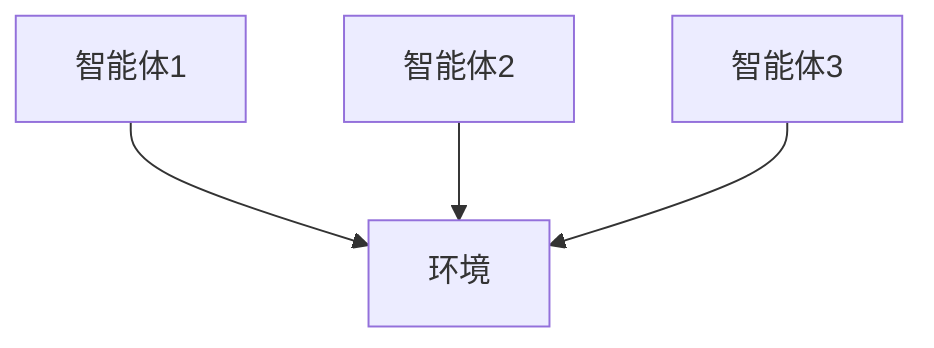
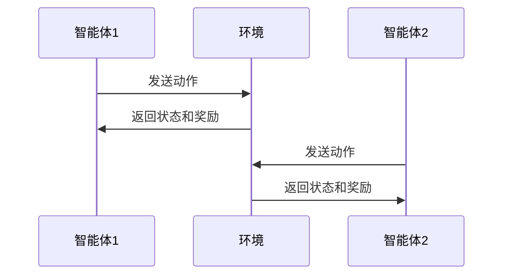

                 

# AI Agent的多智能体博弈与策略学习

> 关键词：AI Agent, 多智能体博弈, 策略学习, 纳什均衡, 多智能体强化学习, 竞争与协作

> 摘要：本文将深入探讨AI Agent在多智能体博弈中的策略学习方法，分析多智能体系统的基本概念、博弈论的核心原理、策略学习的算法实现，以及实际系统设计与项目案例。通过详细讲解和代码示例，帮助读者全面掌握AI Agent的多智能体博弈与策略学习的核心技术。

---

## 第一部分: AI Agent的多智能体博弈与策略学习基础

### 第1章: 多智能体系统概述

#### 1.1 多智能体系统的基本概念
##### 1.1.1 多智能体系统的定义
多智能体系统（Multi-Agent System, MAS）是由多个智能体组成的系统，这些智能体能够自主决策、协作或竞争以实现特定目标。

##### 1.1.2 多智能体系统的特征
- **自主性**：智能体能够独立决策。
- **反应性**：能够感知环境并实时响应。
- **协作性**：智能体之间可以协作完成复杂任务。
- **分布式性**：智能体分布在不同的空间或网络中。

##### 1.1.3 多智能体与单智能体的区别
| 特性 | 单智能体 | 多智能体 |
|------|----------|----------|
| 决策 | 单一决策中心 | 多个决策中心 |
| 交互 | 无 | 智能体之间存在交互 |
| 复杂度 | 较低 | 较高 |

#### 1.2 多智能体系统的应用场景
##### 1.2.1 游戏AI
- 多智能体博弈在游戏中的应用，如MOBA游戏中的团队协作。

##### 1.2.2 自动驾驶
- 多辆自动驾驶汽车之间的协作与竞争。

##### 1.2.3 智能助手协作
- 智能音箱、手机助手等的协作任务。

#### 1.3 多智能体博弈的基本概念
##### 1.3.1 博弈论基础
- **参与者**：智能体。
- **动作**：智能体的行为选择。
- **结果**：智能体行为后的状态变化。

##### 1.3.2 多智能体博弈的定义
多智能体博弈是多个智能体在共同环境中进行决策的过程，每个智能体的目标可能不同，且决策会影响其他智能体。

##### 1.3.3 多智能体博弈的分类
| 类型 | 描述 |
|------|------|
| 合作博弈 | 智能体之间需要协作完成任务 |
| 竞争博弈 | 智能体之间存在利益冲突 |
| 组合博弈 | 智能体之间既有协作又有竞争 |

---

### 第2章: 策略学习的基本原理

#### 2.1 策略学习的定义
策略学习是指智能体通过与环境交互，学习如何选择动作以最大化累积奖励的过程。

##### 2.1.1 策略的表示方法
- **规则表示**：基于预定义规则。
- **模型表示**：基于神经网络或马尔可夫模型。

##### 2.1.2 策略的优化目标
- **最大化累积奖励**：长期目标。
- **最小化损失函数**：短期目标。

#### 2.2 强化学习基础
##### 2.2.1 强化学习的基本概念
- **环境**：智能体所在的环境。
- **动作**：智能体的行为选择。
- **奖励**：环境对智能体行为的反馈。

##### 2.2.2 状态、动作、奖励的定义
- **状态（State）**：环境当前的状况。
- **动作（Action）**：智能体的选择。
- **奖励（Reward）**：智能体行为的反馈。

##### 2.2.3 Q-learning算法简介
Q-learning是一种经典的强化学习算法，通过更新Q值表来学习最优策略。

#### 2.3 多智能体策略学习的挑战
##### 2.3.1 竞争与协作的平衡
智能体需要在竞争中找到协作的平衡点。

##### 2.3.2 知识共享与隐私保护
智能体之间需要共享知识，但也要保护隐私。

##### 2.3.3 动态环境的适应性
环境动态变化，智能体需要快速适应。

---

### 第3章: 多智能体博弈的数学模型

#### 3.1 博弈论基础模型
##### 3.1.1 状态空间的定义
状态空间是智能体所有可能的状态集合。

##### 3.1.2 动作空间的定义
动作空间是智能体所有可能的动作集合。

##### 3.1.3 策略空间的定义
策略空间是智能体所有可能的策略集合。

#### 3.2 纳什均衡的数学推导
##### 3.2.1 纳什均衡的定义
纳什均衡是指在策略空间中，没有任何一个智能体能够单方面改变策略而获得更好的结果。

##### 3.2.2 纳什均衡的条件
$$ \text{对于所有智能体 } i, \text{策略 } s_i \text{ 是最优反应 } $$

##### 3.2.3 纳什均衡的计算方法
通过计算每个智能体的最优策略组合，判断是否满足纳什均衡的条件。

#### 3.3 多智能体策略学习的数学模型
##### 3.3.1 策略评估函数
评估函数用于衡量策略的好坏。

##### 3.3.2 策略更新函数
更新函数用于优化策略。

##### 3.3.3 策略收敛性分析
分析策略在学习过程中的收敛性。

---

### 第4章: 多智能体博弈

#### 4.1 竞争与协作的平衡
##### 4.1.1 竞争策略
智能体之间通过竞争实现目标。

##### 4.1.2 协作策略
智能体之间通过协作实现目标。

##### 4.1.3 竞合策略
智能体之间既有竞争又有协作。

#### 4.2 多智能体博弈的数学模型
##### 4.2.1 多智能体博弈的条件
$$ \text{每个智能体都有独立的目标和策略} $$

##### 4.2.2 多智能体博弈的解
找到所有智能体策略的纳什均衡。

#### 4.3 策略学习的实现
##### 4.3.1 策略学习的方法
- **值函数方法**
- **策略梯度方法**

##### 4.3.2 策略学习的挑战
- **协调问题**
- **冲突问题**
- **信息共享问题**

---

### 第5章: 系统分析与架构设计

#### 5.1 问题场景介绍
描述一个多智能体博弈系统的应用场景，如自动驾驶。

#### 5.2 系统功能设计
##### 5.2.1 功能模块
- **感知模块**
- **决策模块**
- **执行模块**

##### 5.2.2 功能流程
1. 感知环境状态。
2. 制定决策策略。
3. 执行动作。

#### 5.3 系统架构设计
##### 5.3.1 系统架构图
使用Mermaid图展示系统架构。

##### 5.3.2 系统接口设计
定义智能体与环境之间的接口。

#### 5.4 系统交互流程
##### 5.4.1 交互流程图
使用Mermaid图展示系统交互流程。

---

### 第6章: 项目实战

#### 6.1 环境配置
##### 6.1.1 环境安装
安装所需的Python库，如Gym、TensorFlow。

#### 6.2 系统核心实现
##### 6.2.1 核心代码实现
实现多智能体博弈的策略学习算法。

#### 6.3 代码应用解读与分析
##### 6.3.1 代码解读
解释代码的每一部分。

##### 6.3.2 代码分析
分析代码的运行过程和结果。

#### 6.4 实际案例分析
##### 6.4.1 实际案例
分析一个多智能体协作游戏的案例。

##### 6.4.2 案例分析
详细解读案例的实现过程和结果。

---

## 第二部分: 总结与展望

### 6.5 最佳实践 tips
- **模块化设计**：智能体模块化设计，便于扩展。
- **动态适应**：智能体具备动态适应能力，应对变化的环境。
- **隐私保护**：智能体之间共享知识时，保护隐私。

### 6.6 小结
本文详细介绍了AI Agent的多智能体博弈与策略学习的核心技术，从基础概念到实际应用，为读者提供了全面的指导。

### 6.7 注意事项
- **环境设置**：确保环境配置正确。
- **代码调试**：注意代码的调试和优化。
- **系统测试**：进行全面的系统测试，确保功能正常。

### 6.8 拓展阅读
- **参考文献**：推荐相关书籍和论文。
- **在线资源**：推荐相关的在线课程和教程。

---

## 作者：AI天才研究院 & 禅与计算机程序设计艺术

---

通过以上步骤，我们可以系统地撰写一篇关于AI Agent的多智能体博弈与策略学习的技术博客。从基础概念到实际应用，文章内容丰富，结构清晰，能够帮助读者全面掌握相关知识。

