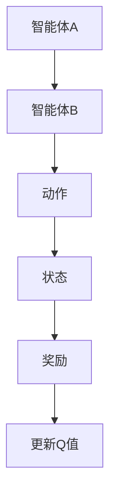
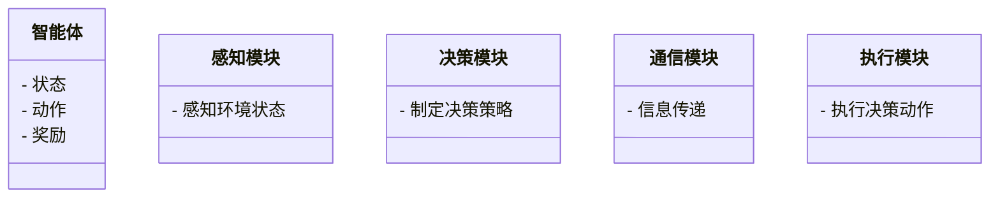
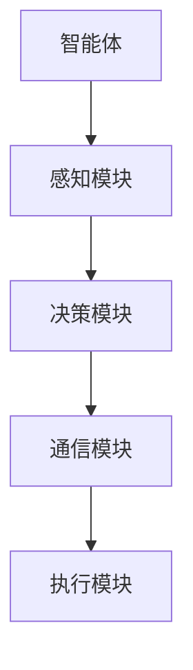

                 


# AI Agent的多智能体强化学习协作机制

> 关键词：AI Agent，多智能体，强化学习，协作机制，通信协议，算法原理，系统架构

> 摘要：本文深入探讨了AI Agent在多智能体强化学习中的协作机制，从背景介绍、核心概念、算法原理、系统架构设计到项目实战，详细分析了多智能体协作的核心问题、解决方案及实际应用场景。通过数学公式、流程图和代码实现，全面解析了多智能体强化学习协作机制的技术细节和实现要点。

---

# 第1章: 多智能体强化学习协作机制的背景与问题

## 1.1 多智能体强化学习的起源与现状

### 1.1.1 强化学习的基本概念
强化学习（Reinforcement Learning, RL）是一种机器学习范式，通过智能体与环境的交互，逐步学习最优策略以最大化累积奖励。与监督学习和无监督学习不同，强化学习强调智能体在动态环境中的自主决策能力。

### 1.1.2 多智能体强化学习的发展历程
多智能体强化学习（Multi-Agent Reinforcement Learning, MARL）起源于分布式人工智能领域，随着深度学习的兴起， MARL在复杂场景中的应用逐渐成为研究热点。近年来，MARL在游戏AI、机器人协作、自动驾驶等领域取得了显著进展。

### 1.1.3 当前研究热点与应用领域
当前，多智能体强化学习的研究主要集中在以下方面：
- **协作机制**：如何设计高效的协作策略，使得多个智能体能够协同完成复杂任务。
- **通信协议**：智能体之间的信息传递方式及其对整体性能的影响。
- **分布式算法**：在分布式计算环境下，如何高效地实现多智能体的协同学习。

### 1.1.4 应用场景
多智能体强化学习的应用场景包括但不限于：
- 游戏AI：如MOBA游戏中的团队协作。
- 机器人协作：如工业自动化中的多机器人协同操作。
- 自动驾驶：如多辆自动驾驶车辆的交通协调。

---

## 1.2 多智能体协作的核心问题

### 1.2.1 协作目标的定义与挑战
协作目标是多智能体强化学习的核心，通常定义为多个智能体通过合作实现全局最优。然而，协作目标的实现面临以下挑战：
- **目标冲突**：不同智能体的目标可能存在冲突，需要协调一致。
- **信息不对称**：智能体之间可能无法完全共享信息，影响协作效率。
- **动态环境**：环境的动态变化要求智能体能够实时调整协作策略。

### 1.2.2 智能体之间的通信与协调
智能体之间的通信是实现协作的关键。通信方式可以分为以下几类：
- **直接通信**：智能体之间直接交换信息，如共享状态或动作。
- **间接通信**：通过中间媒介（如共享内存）进行信息传递。
- **语言通信**：使用自然语言或领域特定语言进行交流。

### 1.2.3 协作机制的边界与外延
协作机制的边界包括：
- **协作范围**：明确智能体之间的协作范围和职责分配。
- **协作协议**：定义智能体之间通信和协作的具体规则。
- **协作终止条件**：确定协作任务完成的条件和终止方式。

---

## 1.3 问题背景与应用场景

### 1.3.1 多智能体协作的典型场景
- **交通控制**：多个自动驾驶车辆协作完成交通任务。
- **机器人协作**：多个机器人协同完成复杂任务，如物流搬运。
- **游戏AI**：多个游戏AI协作完成游戏任务。

### 1.3.2 问题描述与解决方案
多智能体协作的核心问题是如何在动态环境中实现高效协作。解决方案包括：
- **分布式算法**：通过分布式计算实现多智能体的协同学习。
- **通信协议设计**：设计高效的通信协议，确保智能体之间能够高效协作。
- **协作机制优化**：通过优化协作机制，提升整体协作效率。

### 1.3.3 应用场景的对比分析
不同应用场景对协作机制的要求有所不同。例如，游戏AI中的协作机制注重实时性和策略多样性，而机器人协作则更注重安全性和可靠性。

---

## 1.4 本章小结
本章从背景、核心问题和应用场景三个方面，全面介绍了多智能体强化学习协作机制的研究背景和应用价值。下一章将深入探讨协作机制的核心概念与联系。

---

# 第2章: 多智能体协作机制的核心概念与联系

## 2.1 多智能体系统模型

### 2.1.1 智能体的定义与属性
智能体（Agent）是一个能够感知环境并采取行动以实现目标的实体。智能体的核心属性包括：
- **感知能力**：通过传感器感知环境状态。
- **决策能力**：基于感知信息做出决策。
- **执行能力**：通过执行器执行决策动作。

### 2.1.2 智能体之间的关系与交互
智能体之间的关系可以分为以下几种：
- **协作关系**：智能体之间相互协作，共同完成任务。
- **竞争关系**：智能体之间存在竞争，争夺资源或目标。
- **中立关系**：智能体之间无直接关系，各自独立。

### 2.1.3 系统整体架构与功能模块
多智能体系统通常包括以下功能模块：
- **感知模块**：负责感知环境状态。
- **决策模块**：负责制定决策策略。
- **通信模块**：负责智能体之间的信息传递。
- **执行模块**：负责执行决策动作。

---

## 2.2 协作机制的原理与特征

### 2.2.1 协作机制的分类与对比
协作机制的分类：
- **基于状态的协作机制**：根据当前状态决定协作策略。
- **基于动作的协作机制**：根据智能体的动作决定协作策略。
- **基于目标的协作机制**：根据协作目标决定协作策略。

### 2.2.2 不同协作机制的优缺点
| 协作机制 | 优点 | 缺点 |
|----------|------|------|
| 基于状态的 | 精度高 | 计算复杂 |
| 基于动作的 | 实时性强 | 可能存在局部最优 |
| 基于目标的 | 整体性好 | 需要明确目标 |

### 2.2.3 协作机制的核心要素与数学模型
协作机制的核心要素包括：
- **协作目标**：全局最优目标。
- **协作策略**：智能体的决策策略。
- **协作协议**：智能体之间的通信规则。

数学模型：
$$ V(s) = \max_{a} \sum_{i=1}^{n} Q(s_i, a_i) $$

---

## 2.3 智能体通信协议

### 2.3.1 通信方式的分类
- **同步通信**：智能体之间同步交换信息。
- **异步通信**：智能体之间异步交换信息。
- **广播通信**：一个智能体向所有其他智能体发送信息。

### 2.3.2 通信协议的设计原则
- **简洁性**：通信协议应尽可能简洁，减少信息传递的开销。
- **可靠性**：确保信息传递的准确性和可靠性。
- **实时性**：保证信息传递的实时性，以满足协作需求。

### 2.3.3 通信效率与系统性能的关系
通信效率直接影响系统的整体性能。高效的通信协议能够显著提升系统的协作效率。

---

## 2.4 核心概念的ER实体关系图

### 2.4.1 实体关系图
```mermaid
er
actor(智能体) --*-> action(动作)
actor(智能体) --*-> state(状态)
state(状态) --*-> reward(奖励)
```

---

## 2.5 本章小结
本章详细探讨了多智能体协作机制的核心概念与联系，包括智能体模型、协作机制和通信协议等方面。下一章将深入分析多智能体强化学习协作机制的算法原理。

---

# 第3章: 多智能体强化学习协作机制的算法原理

## 3.1 多智能体Q学习算法

### 3.1.1 Q值更新的数学模型
多智能体Q学习算法的核心是通过多个智能体的协作，共同更新Q值。数学模型如下：
$$ Q(s, a) = Q(s, a) + \alpha \left[r + \gamma \max_{a'} Q(s', a') - Q(s, a)\right] $$

### 3.1.2 算法流程图


### 3.1.3 代码实现示例
```python
import numpy as n

# 初始化Q值
Q = np.zeros((state_space, action_space))

# 定义策略函数
def epsilon_greedy_policy(state, epsilon=0.1):
    if n.random.random() < epsilon:
        return n.random.randint(action_space)
    else:
        return n.argmax(Q[state])

# Q学习算法
for episode in range(num_episodes):
    state = env.reset()
    done = False
    while not done:
        action = epsilon_greedy_policy(state)
        next_state, reward, done, _ = env.step(action)
        Q[state, action] += learning_rate * (reward + gamma * n.max(Q[next_state, :]) - Q[state, action])
```

---

## 3.2 基于价值分解的协作机制

### 3.2.1 价值分解的原理
价值分解（Value Decomposition）是一种通过分解全局价值函数来实现多智能体协作的方法。其核心思想是将全局价值函数分解为多个智能体的局部价值函数。

### 3.2.2 分解算法的数学模型
数学模型如下：
$$ V(s) = \sum_{i=1}^{n} V_i(s_i) $$

### 3.2.3 代码实现示例
```python
import numpy as n

# 初始化局部价值函数
V = [np.zeros((state_space, 1)) for _ in range(num_agents)]

# 定义价值分解函数
def value_decomposition(state, agent_id):
    return V[agent_id][state]

# 价值分解算法
for episode in range(num_episodes):
    state = env.reset()
    done = False
    while not done:
        actions = [epsilon_greedy_policy(state, i) for i in range(num_agents)]
        next_state, reward, done, _ = env.step(actions)
        for i in range(num_agents):
            V[i][state] += learning_rate * (reward / num_agents - V[i][state])
```

---

## 3.3 联合策略优化算法

### 3.3.1 联合策略优化的原理
联合策略优化（Joint Policy Optimization）是一种通过优化多个智能体的联合策略来实现协作的方法。其核心思想是将多个智能体的策略联合起来，共同优化。

### 3.3.2 联合优化的数学模型
数学模型如下：
$$ \theta = \arg\max_{\theta} \sum_{i=1}^{n} J_i(\theta) $$

### 3.3.3 代码实现示例
```python
import numpy as n

# 初始化策略参数
theta = np.random.randn(dimension, 1)

# 定义目标函数
def joint_policy_objective(theta):
    return sum([J_i(theta) for i in range(num_agents)])

# 联合优化算法
for episode in range(num_episodes):
    state = env.reset()
    done = False
    while not done:
        actions = [policy(theta, state, i) for i in range(num_agents)]
        next_state, reward, done, _ = env.step(actions)
        theta += learning_rate * gradient(joint_policy_objective(theta))
```

---

## 3.4 本章小结
本章详细探讨了多智能体强化学习协作机制的算法原理，包括Q学习、价值分解和联合策略优化等方法。下一章将深入分析多智能体强化学习协作机制的系统架构设计。

---

# 第4章: 多智能体强化学习协作机制的系统分析与架构设计

## 4.1 系统场景介绍

### 4.1.1 系统功能描述
系统是一个多智能体协作平台，支持多个智能体在复杂环境中的协作学习和任务执行。

### 4.1.2 系统目标与需求
系统目标包括：
- 支持多个智能体的协作学习。
- 提供高效的通信机制。
- 实现高效的协作策略。

### 4.1.3 系统约束与边界条件
系统约束包括：
- 系统必须支持多种协作机制。
- 系统必须具备高效的计算能力。

---

## 4.2 系统功能设计

### 4.2.1 功能模块划分
系统功能模块包括：
- **感知模块**：负责感知环境状态。
- **决策模块**：负责制定决策策略。
- **通信模块**：负责智能体之间的信息传递。
- **执行模块**：负责执行决策动作。

### 4.2.2 功能模块之间的关系
功能模块之间的关系可以用类图表示：


---

## 4.3 系统架构设计

### 4.3.1 系统架构图
系统架构图可以用以下mermaid图表示：


### 4.3.2 接口设计
系统接口设计包括：
- 智能体与感知模块的接口。
- 智能体与决策模块的接口。
- 智能体与通信模块的接口。
- 智能体与执行模块的接口。

---

## 4.4 本章小结
本章详细探讨了多智能体强化学习协作机制的系统分析与架构设计，包括系统场景介绍、功能设计和架构设计等方面。下一章将深入分析多智能体强化学习协作机制的项目实战。

---

# 第5章: 多智能体强化学习协作机制的项目实战

## 5.1 环境搭建

### 5.1.1 环境需求
- 操作系统：Linux或Windows。
- 开发工具：Python、PyTorch、OpenAI Gym等。

### 5.1.2 安装依赖
安装以下依赖：
```bash
pip install numpy matplotlib gym torch
```

---

## 5.2 核心代码实现

### 5.2.1 多智能体Q学习实现
```python
import gym
import numpy as np
import torch
from torch import nn

# 定义智能体类
class Agent:
    def __init__(self, state_space, action_space):
        self.state_space = state_space
        self.action_space = action_space
        self.Q = np.zeros((state_space, action_space))

    def act(self, state, epsilon=0.1):
        if np.random.random() < epsilon:
            return np.random.randint(self.action_space)
        else:
            return np.argmax(self.Q[state])

# 初始化环境
env = gym.make('Multi-agent-Environment-v0')
state_space = env.observation_space
action_space = env.action_space
agents = [Agent(state_space, action_space) for _ in range(num_agents)]

# Q学习算法
for episode in range(num_episodes):
    state = env.reset()
    done = False
    while not done:
        actions = [agent.act(state) for agent in agents]
        next_state, reward, done, _ = env.step(actions)
        for i in range(num_agents):
            agents[i].Q[state, actions[i]] += learning_rate * (reward + gamma * np.max(agents[i].Q[next_state, :]) - agents[i].Q[state, actions[i]])
```

### 5.2.2 价值分解实现
```python
import gym
import numpy as np
import torch
from torch import nn

# 定义价值分解类
class ValueDecomposition:
    def __init__(self, state_space):
        self.state_space = state_space
        self.V = np.zeros((state_space, 1))

    def value_decomposition(self, state):
        return self.V[state]

# 初始化环境
env = gym.make('Multi-agent-Environment-v0')
state_space = env.observation_space
agents = [ValueDecomposition(state_space) for _ in range(num_agents)]

# 价值分解算法
for episode in range(num_episodes):
    state = env.reset()
    done = False
    while not done:
        actions = [agent.value_decomposition(state) for agent in agents]
        next_state, reward, done, _ = env.step(actions)
        for i in range(num_agents):
            agents[i].V[state] += learning_rate * (reward / num_agents - agents[i].V[state])
```

---

## 5.3 案例分析与代码解读

### 5.3.1 案例分析
以一个多智能体协作任务为例，分析协作机制的实现过程。

### 5.3.2 代码解读
- **智能体类**：定义智能体的基本属性和方法。
- **环境初始化**：初始化多智能体协作环境。
- **算法实现**：实现多智能体Q学习和价值分解算法。

---

## 5.4 本章小结
本章通过具体的项目实战，详细介绍了多智能体强化学习协作机制的实现过程，包括环境搭建、核心代码实现和案例分析等内容。

---

# 第6章: 多智能体强化学习协作机制的总结与展望

## 6.1 总结
本文全面探讨了多智能体强化学习协作机制的核心概念、算法原理和系统架构设计。通过具体的项目实战，深入分析了协作机制的实现过程和应用场景。

## 6.2 研究热点与未来趋势
当前，多智能体强化学习的研究热点包括：
- **协作机制优化**：如何设计高效的协作机制。
- **通信协议设计**：如何设计高效的通信协议。
- **分布式算法**：如何在分布式环境下实现高效的协作学习。

## 6.3 最佳实践 tips

### 6.3.1 技术实现
- 确保智能体之间的通信高效可靠。
- 选择合适的协作机制，根据具体场景进行调整。

### 6.3.2 开发注意事项
- 确保系统的可扩展性和可维护性。
- 定期优化算法，提升系统性能。

### 6.3.3 应用建议
- 根据具体应用场景选择合适的协作机制。
- 定期监控系统运行状态，及时调整参数。

---

# 作者：AI天才研究院/AI Genius Institute & 禅与计算机程序设计艺术 /Zen And The Art of Computer Programming

---

本文通过系统化的分析和具体的项目实战，全面探讨了AI Agent的多智能体强化学习协作机制。希望本文能够为相关领域的研究者和开发者提供有价值的参考和启发。

