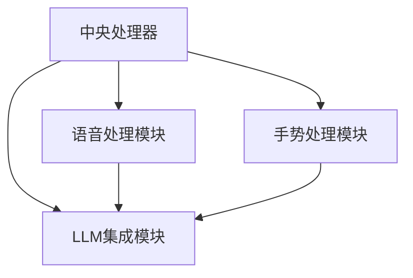

                 


# AI Agent的多模态交互：整合LLM与语音、手势识别

## 关键词：
- AI Agent
- 多模态交互
- 大语言模型（LLM）
- 语音识别
- 手势识别
- 系统架构设计
- 项目实战

## 摘要：
本文详细探讨AI Agent在多模态交互中的应用，重点整合大语言模型（LLM）与语音、手势识别技术。通过分析多模态交互的核心概念、算法原理、系统架构设计及项目实战，为读者提供一个全面的技术指南。

---

# 第1章: AI Agent与多模态交互概述

## 1.1 AI Agent的基本概念

### 1.1.1 什么是AI Agent
AI Agent（人工智能代理）是一种智能系统，能够感知环境、理解用户意图并执行相应操作。它是人机交互的核心，具备自主性、反应性、目标导向和社会能力。

### 1.1.2 AI Agent的核心特征
- **自主性**：无需外部干预，自主决策。
- **反应性**：实时感知并响应环境变化。
- **目标导向**：通过目标驱动行动。
- **社会能力**：能与其他系统或人类进行有效交互。

### 1.1.3 多模态交互的定义与特点
多模态交互指通过多种感官渠道进行交互，如视觉、听觉、触觉等。其特点包括多样性、互补性、自然性和实时性，能提升用户体验。

## 1.2 多模态交互的重要性

### 1.2.1 多模态交互的优势
- 提供更自然的交互方式。
- 增强用户体验的沉浸感。
- 提高交互的准确性和效率。

### 1.2.2 多模态交互的应用场景
- **智能家居**：通过语音和手势控制家电。
- **虚拟助手**：支持多模态输入，提升交互效率。
- **智能客服**：通过多种方式解决问题，提供更优质服务。

### 1.2.3 多模态交互的技术挑战
- **数据融合**：多源数据的同步与处理。
- **算法复杂性**：整合多种模态信息需要复杂的算法设计。
- **实时性要求**：快速响应用户输入。

## 1.3 LLM与语音、手势识别的整合意义

### 1.3.1 LLM的基本原理
大语言模型通过大量数据训练，具备理解上下文、生成自然语言文本的能力，是实现智能对话的核心技术。

### 1.3.2 语音识别与手势识别的技术特点
- **语音识别**：将语音信号转化为文字，支持连续语音输入。
- **手势识别**：识别手势动作，理解用户意图。

### 1.3.3 整合LLM与多模态交互的优势
- 提供更丰富的输入方式。
- 增强系统的智能性，提升交互体验。
- 适用于更多应用场景。

## 1.4 本章小结
本章介绍了AI Agent的基本概念、多模态交互的重要性及其与LLM的整合意义，为后续技术探讨奠定了基础。

---

# 第2章: 语音识别与手势识别的技术原理

## 2.1 语音识别技术

### 2.1.1 语音识别的基本原理
语音识别通过声学特征提取、语言模型构建和解码器解码，将语音转化为文字。

### 2.1.2 常见的语音识别算法
- **CTC（连接时序分类器）**：常用于端到端语音识别。
- **Transformer**：通过自注意力机制提升识别准确率。

### 2.1.3 语音识别的实现流程
1. 预处理：降噪、分帧。
2. 特征提取：梅尔频谱、倒谱系数。
3. 建模：深度神经网络。
4. 解码：转换为文本。

### 2.1.4 语音识别的数学模型
- **CTC模型**：
  $$ P(y|x) = \prod_{i=1}^{n} P(y_i|x) $$
- **Transformer模型**：
  $$ \text{Output} = \text{Self-attention}(x) + \text{FFN}(x) $$

## 2.2 手势识别技术

### 2.2.1 手势识别的基本原理
手势识别通过图像处理和深度学习模型，识别手势动作并理解其含义。

### 2.2.2 常见的手势识别算法
- **基于CNN的手势识别**：利用卷积神经网络提取特征。
- **基于骨架的手势识别**：通过人体关键点检测手势。

### 2.2.3 手势识别的实现流程
1. 图像采集：使用摄像头捕捉手势。
2. 预处理：灰度化、归一化。
3. 特征提取：提取手部关键点。
4. 分类器训练：使用深度学习模型进行分类。

### 2.2.4 手势识别的数学模型
- **CNN模型**：
  $$ f(x) = \text{maxpool}(\text{conv}(x)) $$
- **骨架模型**：
  $$ P(k|x) = \text{softmax}(Wk + b) $$

## 2.3 大语言模型（LLM）的基本原理

### 2.3.1 LLM的定义与特点
- 基于Transformer架构，具备上下文理解能力，支持生成式对话。

### 2.3.2 LLM的训练过程
1. 数据预处理：清洗、分词。
2. 模型训练：使用大量文本数据，优化参数。
3. 微调：针对特定任务调整模型。

### 2.3.3 LLM的数学模型
- **Transformer模型**：
  $$ \text{Output} = \text{Encoder}(x) + \text{Decoder}(x) $$

## 2.4 本章小结
本章详细讲解了语音识别和手势识别的技术原理及其与LLM的结合方式，为后续系统设计打下基础。

---

# 第3章: AI Agent的多模态交互系统架构设计

## 3.1 系统架构概述

### 3.1.1 系统功能模块
- **语音处理模块**：负责语音输入的识别和处理。
- **手势处理模块**：负责手势输入的识别和处理。
- **LLM集成模块**：处理自然语言理解和生成。
- **中央处理器模块**：协调各模块，处理多模态输入。

### 3.1.2 系统功能设计
- **多模态输入融合**：整合语音和手势信息。
- **意图识别**：理解用户的综合意图。
- **自然语言生成**：生成合适的回复。

### 3.1.3 系统架构图


## 3.2 项目实战

### 3.2.1 环境搭建
- **工具选择**：Python 3.8+，TensorFlow 2.0+，OpenCV。
- **框架安装**：pip install tensorflow、pytorch、openCV。

### 3.2.2 核心代码实现

#### 语音识别模块
```python
import tensorflow as tf
import numpy as np

class SpeechRecognizer:
    def __init__(self):
        self.model = self.build_model()

    def build_model(self):
        model = tf.keras.Sequential()
        model.add(tf.keras.layers.Conv2D(32, (3,3), activation='relu', input_shape=(64, 64, 3)))
        model.add(tf.keras.layers.MaxPooling2D((2,2)))
        model.add(tf.keras.layers.Flatten())
        model.add(tf.keras.layers.Dense(128, activation='relu'))
        model.add(tf.keras.layers.Dense(10, activation='softmax'))
        return model

    def recognize(self, audio_data):
        prediction = self.model.predict(audio_data)
        return np.argmax(prediction, axis=1)
```

#### 手势识别模块
```python
import cv2

class HandGestureRecognizer:
    def __init__(self):
        self.detector = cv2.CascadeClassifier('hand.xml')

    def recognize(self, image):
        gray = cv2.cvtColor(image, cv2.COLOR_BGR2GRAY)
        hands = self.detector.detectMultiScale(gray, 1.1, 2)
        if len(hands) > 0:
            return 'hand'
        else:
            return None
```

#### LLM集成模块
```python
from transformers import AutoTokenizer, AutoModelForCausalLM

class LLMIntegrator:
    def __init__(self):
        self.tokenizer = AutoTokenizer.from_pretrained('gpt2')
        self.model = AutoModelForCausalLM.from_pretrained('gpt2')

    def generate_response(self, input_text):
        inputs = self.tokenizer(input_text, return_tensors='np')
        outputs = self.model.generate(**inputs)
        response = self.tokenizer.decode(outputs[0], skip_special_tokens=True)
        return response
```

### 3.2.3 系统集成与测试
1. **环境配置**：确保所有依赖库已安装。
2. **模块测试**：分别测试语音和手势识别模块。
3. **系统联调**：将各模块集成，进行多模态交互测试。
4. **性能优化**：优化模型参数，提高识别准确率。

### 3.2.4 实际案例分析
- **案例1**：用户通过语音和手势组合输入指令，系统识别并生成响应。
- **案例2**：在智能家居场景中，用户挥手关闭灯光，同时说出“开灯”进行确认。

## 3.3 系统优化与扩展

### 3.3.1 性能优化
- **模型压缩**：使用模型剪枝、量化技术减少模型大小。
- **并行计算**：利用多GPU加速训练和推理。

### 3.3.2 功能扩展
- **支持更多模态**：如面部表情识别。
- **跨平台支持**：在不同设备上运行系统。

### 3.3.3 注意事项
- **数据隐私**：确保用户数据的安全性。
- **错误处理**：设计良好的错误处理机制，提升用户体验。

## 3.4 本章小结
本章详细介绍了多模态交互系统的架构设计和实现过程，通过具体案例展示了系统的优势，并提出了优化建议。

---

# 第4章: 总结与展望

## 4.1 本章总结
本文系统地探讨了AI Agent在多模态交互中的应用，详细讲解了语音识别、手势识别和LLM的整合方法，为构建高效的多模态交互系统提供了技术指导。

## 4.2 未来展望
- **技术进步**：随着AI技术的发展，多模态交互将更加智能化。
- **应用拓展**：在教育、医疗、娱乐等领域发挥更大作用。
- **伦理问题**：需关注数据隐私和伦理问题，确保技术的健康发展。

---

# 作者：AI天才研究院 & 禅与计算机程序设计艺术

---

以上为文章的详细目录和内容概述，希望对您有所帮助。

