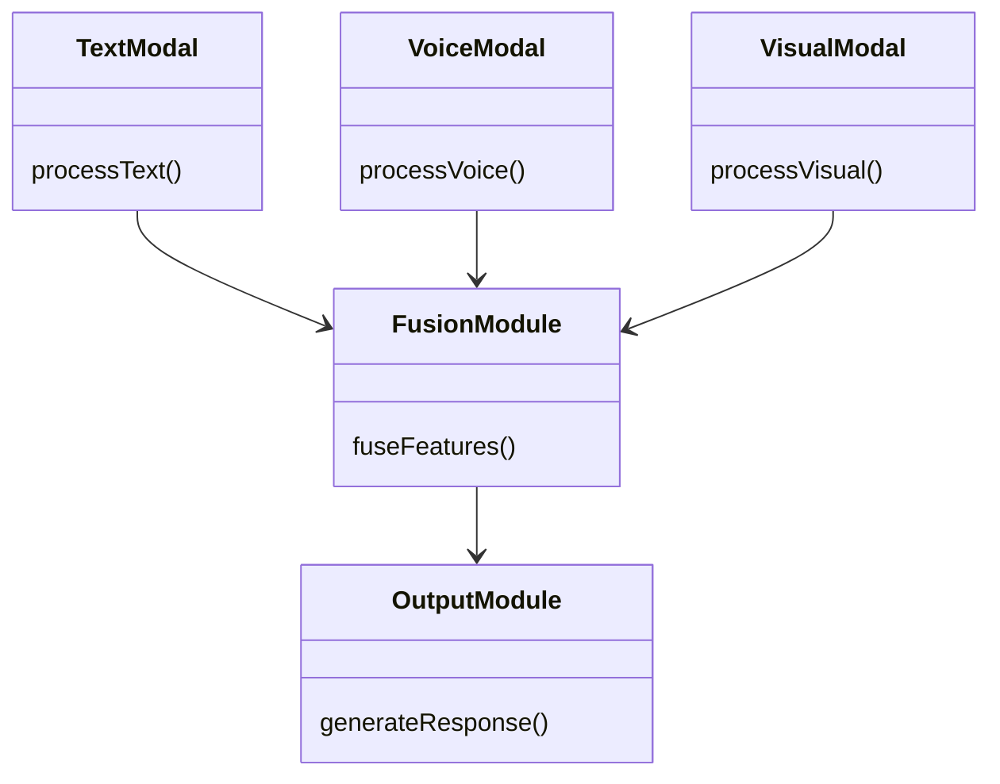

                 


# AI Agent的多模态交互：整合文本、语音和视觉

## 关键词：AI Agent，多模态交互，文本，语音，视觉，深度学习，自然语言处理

## 摘要：AI Agent的多模态交互是整合文本、语音和视觉三种模态的先进技术，能够提升人机交互的自然性和智能化水平。本文深入探讨了多模态交互的核心概念、算法原理、系统架构和项目实战，详细讲解了如何通过深度学习和自然语言处理技术实现多模态数据的融合与协同，为读者提供了一套完整的解决方案和实践指导。

---

## 第一部分：引言

### 第1章：AI Agent与多模态交互的背景

#### 1.1 AI Agent的基本概念

AI Agent（人工智能代理）是一种智能系统，能够感知环境、自主决策并执行任务。它具备以下核心特征：
- **自主性**：能够在没有外部干预的情况下独立运作。
- **反应性**：能够根据环境变化实时调整行为。
- **目标导向性**：以明确的目标为导向，优化决策过程。
- **学习能力**：通过数据和经验不断优化自身的性能。

AI Agent的应用场景广泛，包括智能助手、推荐系统、自动驾驶、智能客服等。在这些场景中，AI Agent需要与用户进行高效的交互，而多模态交互是实现这一目标的关键技术。

#### 1.2 多模态交互的定义与重要性

多模态交互是指通过多种信息载体（如文本、语音、视觉等）进行信息传递和反馈的过程。与单模态交互相比，多模态交互具有以下优势：
- **信息丰富性**：结合多种模态的信息，能够提供更全面的语境支持。
- **交互自然性**：模拟人类的多感官交互方式，使用户体验更自然。
- **容错性**：当某一模态的信息出现误差时，其他模态的信息可以作为补充。

在AI Agent中，整合文本、语音和视觉三种模态，能够显著提升交互的准确性和智能化水平。例如，智能音箱可以通过语音交互理解用户的意图，并结合视觉反馈（如屏幕显示）提供更丰富的信息。

---

## 第二部分：多模态交互的核心概念

### 第2章：文本、语音和视觉的模态分析

#### 2.1 文本模态

文本是AI Agent中最常见的交互方式之一。文本处理技术包括自然语言理解（NLU）和自然语言生成（NLG）。文本模态的特点如下：
- **优点**：
  - 高精度：文本信息可以被精确解析。
  - 易处理：文本数据结构化程度高，便于计算机处理。
- **缺点**：
  - 信息量有限：文本只能传递部分语境信息。

#### 2.2 语音模态

语音是另一种重要的交互方式，尤其在语音助手（如Siri、Alexa）中应用广泛。语音模态的特点如下：
- **优点**：
  - 自然性：语音交互更贴近人类的日常交流方式。
  - 便捷性：解放用户的双手，特别是在开车等场景下。
- **缺点**：
  - 易受环境干扰：噪声会影响语音识别的准确性。

#### 2.3 视觉模态

视觉模态主要通过图像或视频进行信息传递。视觉交互在AR/VR、智能安防等领域具有重要应用。视觉模态的特点如下：
- **优点**：
  - 信息丰富：图像可以传递大量的空间和物体信息。
  - 直观性：视觉信息更易于被人类理解和记忆。
- **缺点**：
  - 数据处理复杂：图像数据量大，处理过程 computationally expensive.

---

### 第3章：多模态交互的核心概念与联系

#### 3.1 多模态数据的表示方法

多模态数据的表示方法需要兼顾不同模态的特点。以下是几种常见的表示方法：
- **向量表示**：将每个模态的信息映射为向量，便于统一处理。
- **分布式表示**：利用词嵌入（如Word2Vec）将文本、语音和视觉信息表示为低维向量。
- **图结构表示**：通过图结构描述模态之间的关系，如文本中的实体可以与视觉中的对象建立关联。

#### 3.2 多模态数据的对齐与融合

多模态数据的对齐是指将不同模态的数据对准到同一个语义空间。以下是常见的对齐方法：
- **基于变换的对齐**：通过线性变换将不同模态的数据映射到同一个空间。
- **基于注意力机制的对齐**：通过注意力机制捕捉模态之间的关联性。

---

## 第三部分：多模态交互的算法原理

### 第3章：多模态融合的算法基础

#### 3.1 注意力机制的实现

注意力机制是一种有效的多模态融合方法。以下是其实现过程的简要步骤：
1. **计算查询（Query）和键（Key）**：将不同模态的数据映射到同一个向量空间。
2. **计算注意力权重**：通过点积和Softmax函数计算注意力权重。
3. **加权求和**：根据注意力权重对不同模态的信息进行加权求和，得到最终的融合结果。

#### 3.2 多模态融合的数学模型

多模态融合的数学模型可以表示为：
$$
f(x_1, x_2, x_3) = \sum_{i=1}^{3} \alpha_i x_i
$$
其中，$\alpha_i$是模态$i$的注意力权重，$x_i$是模态$i$的输入向量。

---

## 第四部分：多模态交互的系统架构设计

### 第4章：系统功能设计

#### 4.1 领域模型设计

以下是领域模型的类图：


---

## 第五部分：项目实战

### 第5章：基于多模态交互的智能助手开发

#### 5.1 环境搭建

- **工具安装**：安装Python、TensorFlow、Keras等开发工具。
- **数据集准备**：收集并整理文本、语音和图像数据。

#### 5.2 核心代码实现

以下是多模态融合的代码示例：
```python
import tensorflow as tf
from tensorflow.keras.layers import Dense, Softmax

# 文本模态的处理
text_input = tf.keras.Input(shape=(max_length,))
text_features = Dense(128, activation='relu')(text_input)

# 语音模态的处理
voice_input = tf.keras.Input(shape=(num_features,))
voice_features = Dense(128, activation='relu')(voice_input)

# 视觉模态的处理
visual_input = tf.keras.Input(shape=(64, 64, 3,))
visual_features = Dense(128, activation='relu')(visual_input)

# 多模态融合
merged = tf.keras.layers.concatenate([text_features, voice_features, visual_features])
attention_weights = Dense(3, activation='softmax')(merged)
merged_with_attention = tf.keras.layers.multiply([merged, attention_weights])

# 输出层
output = Dense(1, activation='sigmoid')(merged_with_attention)

model = tf.keras.Model(inputs=[text_input, voice_input, visual_input], outputs=output)
model.compile(optimizer='adam', loss='binary_crossentropy', metrics=['accuracy'])
```

---

## 第六部分：总结与展望

### 第6章：总结与展望

#### 6.1 总结

通过整合文本、语音和视觉三种模态，AI Agent的多模态交互能够实现更自然和智能的用户体验。本文详细探讨了多模态交互的核心概念、算法原理和系统架构，并通过项目实战展示了其具体实现方法。

#### 6.2 未来展望

未来，多模态交互技术将朝着以下几个方向发展：
- **更复杂的模态融合方法**：如引入图神经网络进行多模态关联分析。
- **更高效的计算框架**：通过轻量化设计提升多模态交互的实时性。
- **更广泛的应用场景**：如医疗、教育、娱乐等领域的深度应用。

---

## 作者：AI天才研究院/AI Genius Institute & 禅与计算机程序设计艺术 /Zen And The Art of Computer Programming

---

**End of Article**

